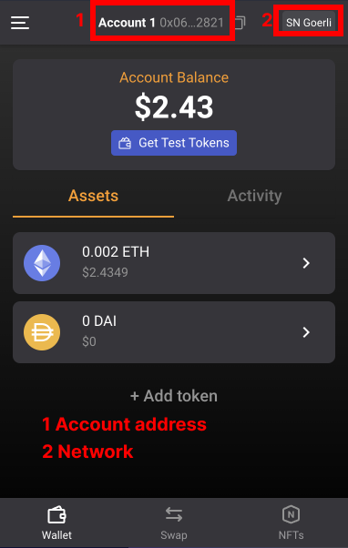
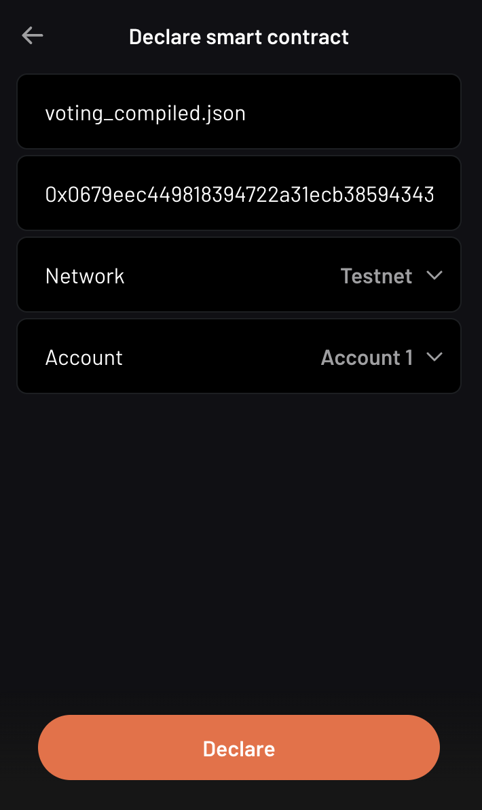
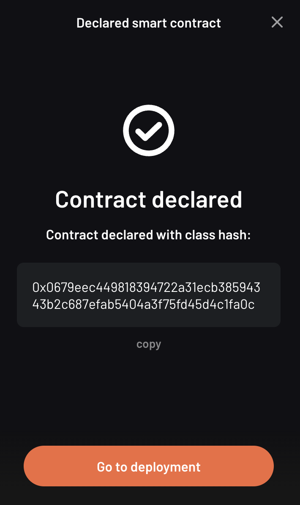
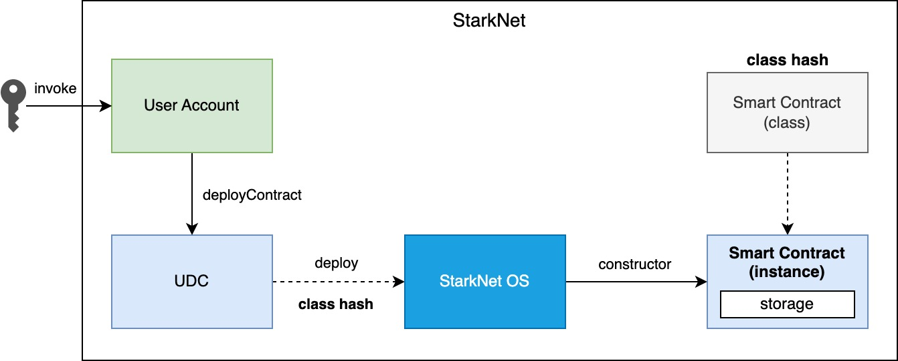
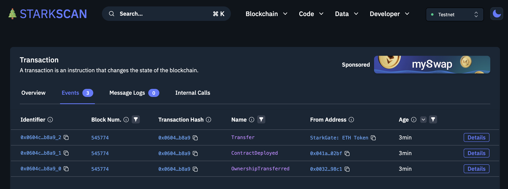
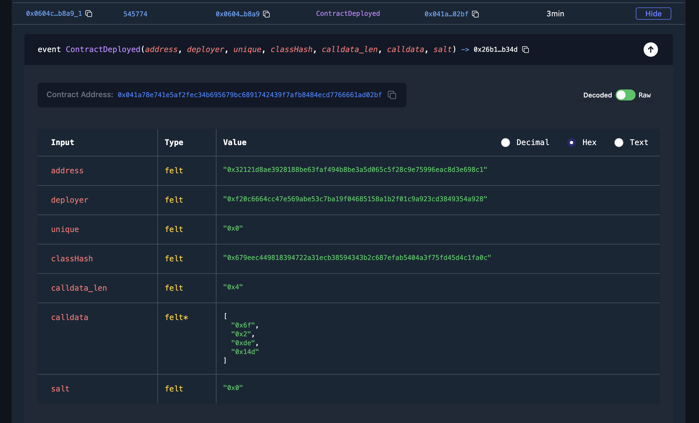
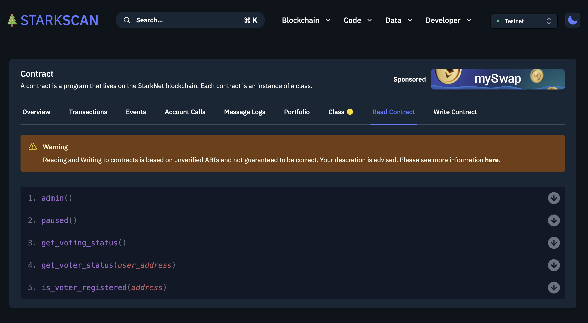

<div align="center">
    <h1>Camp 1: Getting Started</h1>

|Presentation|Video|Try what you learned
|:----:|:----:|:----:|
|[January 2023](https://docs.google.com/presentation/d/1rjV7nFGuXyIWghbKpIJmOVox8EVbEX974xCHzL4XU5o/edit?usp=sharing)|StarkNet Basecamp [p1 (September 2022)](https://drive.google.com/file/d/1w9ysR38Dz4Z9gvHC46xSHbr06B36nUWp/view?usp=sharing), [p2 (September 2022)](https://drive.google.com/file/d/185MMFmItlOE5qER8P2vhtVjKiH6Glj1G/view?usp=sharing)|Finish the gamified [StarkNet-Cairo 101](https://github.com/starknet-edu/starknet-cairo-101) tutorial. Code your own [ERC721 (NFT)](https://github.com/starknet-edu/starknet-erc721), or [ERC20](https://github.com/starknet-edu/starknet-erc20)|

</div>

### Objective

Developers who finish this Camp can build their own Cairo smart contracts and deploy them on the StarkNet network. We will learn everything required to code in Cairo, the language to operate on the Cairo OS (more on this at a later Camp). Then we will create and deploy a not-that-simple contract to allow DAO members to vote entirely on-chain.

After finishing this tutorial, try to hone your skills by earning all the points in the [Cairo 101](https://github.com/starknet-edu/starknet-cairo-101) workshop, code your own [ERC721 (NFT)](https://github.com/starknet-edu/starknet-erc721), or deploy a customized [ERC20](https://github.com/starknet-edu/starknet-erc20). 


### Topics

<ol>
    <li><a href="#setup">Setting up your environment</a></li>
    <li><a href="#cairo">Writing Cairo</a></li>
    <li><a href="#starknet">StarkNet Contracts</a></li>
    <li><a href="#storage">Storage</a></li>
</ol>

<h2 align="center" id="setup">Setting up your environment</h2>

* Basic cairo-lang [setup](https://www.cairo-lang.org/docs/quickstart.html).
* Ultimate development environment [setup](https://medium.com/starknet-edu/the-ultimate-starknet-dev-environment-716724aef4a7).
* Setting up a StarkNet dev environment with [Python](https://medium.com/starknet-edu/setting-up-a-starknet-dev-environment-with-python-e4c61c1e8da6?source=collection_home---5------1-----------------------) or [Docker](https://medium.com/starknet-edu/setting-up-a-starknet-dev-environment-with-docker-19955188bb20?source=collection_home---5------0-----------------------)


<h2 align="center" id="cairo">Writing Cairo</h2>

### Add two numbers

We will begin by creating a function to add two numbers. The code is straightforward but will help us understand many Cairo concepts better.

Don't worry if you don't understand everything that's going on at this point. Cairo is a low-level language, so it could be more complex than learning Python, for example. But it will be worth it—eyes on the goal.

The program to add the two numbers is available in [src/sum.cairo](./contracts/cairo/sum.cairo). There you will find the code correctly commented.

```cairo
%builtins output

from starkware.cairo.common.serialize import serialize_word

// @dev Add two numbers and return the result
// @param num1 (felt): the first number to add
// @param num2 (felt): the second number to add
// @return sum (felt): the value of the sum of the two numbers
func sum_two_nums(num1: felt, num2: felt) -> (sum: felt) {
    alloc_locals;
    local sum = num1+num2;
    return (sum=sum);
}

func main{output_ptr: felt*}(){
    alloc_locals;
    
    const NUM1 = 1;
    const NUM2 = 10;

    let (sum) = sum_two_nums(num1 = NUM1, num2 = NUM2);
    serialize_word(sum);
    return ();
}
```

### The builtins

At the beginning of our program in Cairo, we write `%builtins output`. Here we are telling the Cairo compiler that we will use the `builtin` called `output`. You can learn more about builtins in [camp 5](../camp_5/README.md); however, you can continue writing Cairo without going deep into `builtin`s. We can summon Cairo's special abilities through the builtins.

Let's explore one of the most common builtins.

> The builtin output is what allows the program to communicate with the outside world. You can think of it as the equivalent of `print()` in Python or `std::cout` in C++ ([Cairo documentation](https://www.cairo-lang.org/docs/hello_cairo/intro.html#writing-a-main-function)).
>

The interaction between the `builtin output` and the `serialize_word` function, which we previously imported, will allow us to print to the console. In this case, with `serialize_word(sum)`. Don't worry; we'll take a closer look at it later.

### Importing

Importing functions and variables is the same as in Python. The `from starkware.cairo.common.serialize import serialize_word` line is importing the `serialize_word` function found in `starkware.cairo.common.serialize`. To see the source code of this function, go to the GitHub repository of `cairo-lang` ([link](https://github.com/starkware-libs/cairo-lang)). For example, the serialize function is found [here](https://github.com/starkware-libs/cairo-lang/blob/master/src/starkware/cairo/common/serialize.cairo) within the repository. This will be useful for finding bugs in the code or understanding Cairo more thoroughly.

> Commas can separate multiple functions from the same library. Functions from different libraries are imported on different lines. Cairo looks for each module in a default directory path and any additional paths specified at compile moment (Cairo documentation).

This is how several functions are imported from the same library: `from starkware.cairo.common.math import (assert_not_zero, assert_not_equal)`.

### The field elements (felts) (part 1)

In Cairo, when the type of a variable or argument is not specified, it is automatically assigned the type `felt`. The [Camp 6](../camp_6/README.md) goes into technical detail about what a `felt` is. For the purposes of this section, suffice it to say that a `felt` works as an integer. In the divisions, we can notice the difference between the `felt` and the integers. However, quoting the documentation:

> In most of your code (unless you intend to write very algebraic code), you won't have to deal with the fact that the values in Cairo are felts, and you can treat them as if they were normal integers.

### The structs

In addition to `felt`, we have other structures at our disposal (more details in the [documentation](https://www.cairo-lang.org/docs/reference/syntax.html#type-system)).

We can create our own structure, Python dictionary style:

```cairo
struct MyStruct{
    first_member : felt,
    second_member : felt,
}

```
We define a new data type called `MyStruct` with the properties `first_member` and `second_member`. We set the `type` of both properties to be `felt`, but we may as well have put in other types. When we create a `struct`, it is mandatory to add the `type`.

We can create a variable of type `MyStruct`: `Name = (first_member=1, second_member=4)`. Now the variable `Name` has `type` `MyStruct`.

With `Name.first_member`, we can access the value of this argument; in this case, it is 1.

### Tuples

Tuples in Cairo are pretty much the same as tuples in Python:

> A tuple is a finite, ordered, unalterable list of elements. It is represented as a comma-separated list of elements enclosed in parentheses (for example, (3, x)). Its elements can be of any combination of valid types. A tuple containing only one element must be defined in one of two ways: the element is a named tuple, or it has a trailing comma. When passing a tuple as an argument, the type of each element can be specified per element (for example, my_tuple : (felt, felt, MyStruct)). Tuple values can be accessed with a zero-based index in parentheses [index], including access to nested tuple elements, as shown below (Cairo documentation).

The Cairo documentation is very clear in its definition of tuples. Here is an example:

```cairo
// A tuple with three elements
local tuple0 : (felt, felt, felt) = (7, 9, 13)
local tuple1 : (felt) = (5,)  // (5) is not a valid tuple.

// A named tuple does not require a trailing comma
local tuple2 : (a : felt) = (a=5)

// Tuple that contains another tuple.
local tuple3 : (felt, (felt, felt, felt), felt) = (1, tuple0, 5)
local tuple4 : ((felt, (felt, felt, felt), felt), felt, felt) = (tuple3, 2, 11)

let a = tuple0[2]  // let a = 13.
let b = tuple4[0][1][2]  // let b = 13.
```

### The structure of functions and comments

The definition of a function in Cairo has the following format:

```cairo
func function(arg1: felt, arg2) -> (returned: felt){
  // Function body
  let (sum) = sum_two_nums(num1 = NUM1, num2 = NUM2);
  return(returned=sum);
}

```

- **Define the scope of the function**. We start the function with `func`. The scope of our function is defined with curly braces {}. 
- **Arguments and names**. We define the arguments that the function receives in parentheses next to the name that we define for our function, `function` in this case. The arguments can carry their type defined or not. In this case, `arg1` must be of type `felt`, and `arg2` can be of any type.
- **Return**. We necessarily have to add `return()`. However, the function is not returning something. In this case, we are returning a variable called `returned`, so we put `return(returned=sum)` where the sum is the value that the `returned` variable will take.
- **Comments**. In Cairo, we comment with `//`. This code will not be interpreted when running our program.

As with other programming languages, we will need a `main()` function that orchestrates the use of our program in Cairo. It is defined exactly the same as a normal function, only with the name `main()`. It can come before or after the other functions we create in our program.

### Interacting with pointers: part 1

> A pointer is used to indicate the address of the first felt of an element in memory. The pointer can be used to access the element efficiently. For example, a function can accept a pointer as an argument and then access the element at the pointer's address (Cairo documentation).

Suppose we have a variable named `var`:

- `var*` is a pointer to the memory address of the `var` object.
- `[var]` is the value stored at address `var*`.
- `&var` is the address to the `var` object.
- `&[x]` is `x`. Can you see that `x` is an address?

### Implicit arguments

Before explaining how implicit arguments work, a rule: If a `foo()` function calls a function with an implicit argument, `foo()` must also get and return the same implicit argument (refer to [camp 2](../camp_2/README.md) for more details in implicit arguments).

Let's see what a function with an implicit argument looks like. The function is `serialize_word` which is available in the `starkware.cairo.common.serialize` library, and we use it in our initial function to add two numbers.

```cairo
%builtins output

// Appends a single word to the output pointer and returns the pointer to the next output cell.
func serialize_word{output_ptr: felt*}(word) {
    assert [output_ptr] = word;
    let output_ptr = output_ptr + 1;
    return ();
}
```

This will be a bit confusing, be prepared. In this and many other cases, it receives `output_ptr`, which is a pointer to a felt type. When we declare that a function receives an implicit argument, the function will automatically return the value of the implicit argument on termination of the function. If we didn't move the value of the implicit argument, then it would automatically return the same value it started with. However, if, during the function, the value of the implicit argument is altered, then the new value will be automatically returned. 

In the example with the `serialize_word` function, we define that we are going to receive an implicit argument called `output_ptr`. In addition, we also receive an explicit argument called `value`. At the end of the function, we will return the value that `output_ptr` has at that moment. During the function, we see that `output_ptr`increases by 1: `let output_ptr = output_ptr + 1`. Then the function will implicitly return the new value of `output_ptr`.

Following the rule defined at the beginning, any function that calls `serialize_word` will also have to receive the implicit `output_ptr`. For example, part of our function to add two numbers goes like this:

```cairo
func main{output_ptr: felt*}() {
    alloc_locals

    const NUM1 = 1
    const NUM2 = 10

    let (sum) = sum_two_nums(num1 = NUM1, num2 = NUM2)
    serialize_word(word=sum)
    return ()
}
```

We see that we call `serialize_word`, so we necessarily have to also ask for the implicit argument `output_ptr` in our `main` function. This is where another property of implicit arguments comes into play, and perhaps why they are called that. We see that when calling `serialize_word`, we only pass the explicit `word` argument. The implicit argument `output_ptr` is automatically passed! Be careful; we could also have made the implicit argument explicit like this: `serialize_word{output_ptr=output_ptr}(word=a)`. Do we already know how to program in Cairo?

So the implicit argument is implicit because:

1. Inside the implicit function, the final value of the implicit argument is automatically returned.
2. When the implicit function is called, we do not need to indicate that we are going to pass the implicit argument. The default value is automatically included.

### Locals

We are almost ready to understand 100% what we did in our function that adds two numbers. I know; it's been a rocky road. But there is a rainbow at the end of the tutorial.

Thus we define a local variable: `local a = 3`.

> Any function that uses a local variable must have an `alloc_locals` declaration, usually at the beginning of the function. This statement is responsible for allocating memory cells used by local variables within the scope of the function (Cairo [documentation](https://www.cairo-lang.org/docs/reference/syntax.html#locals)).
>

As an example, look at this part of our function that adds two numbers:

```cairo
func sum_two_nums(num1: felt, num2: felt) -> (sum) {
    alloc_locals
    local sum = num1+num2
    return(sum)
}
```

It's very simple.

Since we don't want it to be so easy, let's talk from memory. Cairo stores the local variables relative to the frame pointer (`fp`) (we'll go into more detail about the `fp` in a later tutorial). So if we needed the address of a local variable, `&sum` would not suffice as it would give us this error: `using the value fp directly requires defining a variable __fp__`. We can get this value by importing `from starkware.cairo.common.registers import get_fp_and_pc`. `get_fp_and_pc` returns a tuple with the current values of `fp` and `pc`. In the most Python style, we will indicate that we are only interested in the value of `fp` and that we will store it in a variable `__fp__`: `let (__fp__, _) = get_fp_and_pc()`. Done now, we could use `&sum`. In another tutorial, we will see an example of this.

### Constants

Very simple. Just remember that they must give an integer (a field) when we compile our code. Create a constant:

```cairo
const NUM1 = 1
```

### References

This is the format to define one:

```cairo
let ref_name : ref_type = ref_expr
```

Where `ref_type` is a type, and `ref_expr` is a Cairo expression. Placing the `ref_type` is optional, but it is recommended to do so.

A reference can be reassigned (Cairo [documentation](https://www.cairo-lang.org/docs/reference/syntax.html#references)):

```cairo
let a = 7  // a is initially bound to expression 7.
let a = 8  // a is now bound to expression 8.
```

In our addition of two numbers we create a reference called `sum`. We see that we assign to `sum` the `felt` that the function `sum_two_nums` returns.


```cairo
let (sum) = sum_two_nums(num1 = NUM1, num2 = NUM2)
```

## Compile and run

You already know how to do functions in Cairo! Now let's run our first program.

The tools that StarkNet offers to interact with the command line are many. We won't go into detail until later. For now, we will only show the commands with which we can run the application that we created in this tutorial. But don't worry; the commands to run other applications will be very similar.

`cairo-compile` allows us to compile our code and export a JSON that we will read in the next command. If ours is called `contracts/cairo/sum.cairo` (because it is located in the `contracts/cairo` directory as in this repository) and we want the JSON to be called `contracts/cairo/sum_compiled.json` (because it's in the `contracts/cairo` directory) then we would use the following code:

```
cairo-compile contracts/cairo/sum.cairo --output contracts/cairo/sum_compiled.json
```

Simple, right?

Ok, now let's run our program with `cairo-run`.

```
cairo-run --program contracts/cairo/sum_compiled.json --print_output --layout=small
```

The result should correctly print an 11 in our terminal.

Here are the details:

We indicate in the `--program` argument that we want to run the `contracts/cairo/sum_compiled.json` that we generated earlier.

With `--print_output`, we indicate that we want to print something from our program to the terminal. For example, in the next tutorial, we will use the builtin (we will study them later) output and the serialize_word function to print to the terminal.

`--layout` allows us to indicate the layout to use. Depending on the builtins we use, it will be the layout to use. Later we will be using the output builtin, and for this, we need the small layout. If we do not use any builtin, then we can leave this argument empty, so we would use the default layout, the plain layout.

### Builtins and their relationship with pointers

In the following program, we are multiplying two numbers. The entire code is available at [src/multiplication.cairo](./contracts/cairo/multiplication.cairo). There you will find the code correctly commented.

```cairo
%builtins output

from starkware.cairo.common.serialize import serialize_word

func mult_two_nums(num1, num2) -> (prod : felt) {
    return(prod = num1 * num2);
}

func main{output_ptr: felt*}() {
    let (prod) = mult_two_nums(2,2);
    serialize_word(prod);
    return ();
}
```

Remember that we introduced the `builtins` in the last session, along with the implicit arguments? 

Each `builtin` gives you the right to use a pointer that will have the name of the `builtin` + “`_ptr`”. For example, the output builtin, which we define as `%builtins output` at the beginning of our contract, gives us the right to use the `output_ptr` pointer. The `range_check` `builtin` allows us to use the `range_check_ptr` pointer. These pointers are often used as implicit arguments that are automatically updated during a function.

In the function to multiply two numbers, we use `%builtins output` and then use its pointer when defining main: `func main{output_ptr: felt*}():`.

### Felts (part 2)

The felt is the only data type that exists in Cairo; you can even omit its explicit declaration. Although it is not necessary to be an expert in the mathematical qualities of felts, it is valuable to know how they work. We have already introduced them; now we will know how they are affected when we compare values. Please refer to [camp 2](../camp_2/README.md) for more details on its definition.

> For the moment, the definition of a felt, in terrestrial terms: is an integer that can become huge (but has limits). For example: {...,-4,-3,-2,-1,0,+1,+2,+3,...}. Yes, it includes 0 and negative numbers.

Any value that is not within this range will cause an “overflow”: an error that occurs when a program receives a number, value, or variable outside the scope of its ability to handle ([Techopedia](https://www.techopedia.com/definition/663/overflow-error#:~:text=In%20computing%2C%20an%20overflow%20error,other%20numerical%20types%20of%20variables.)).

Now we understand the limits of the felt. If the value is 0.5, for example, we have an overflow. Where will we experience overflows frequently? In the divisions. The following contract (full code is in [src/division1.cairo](./contracts/cairo/division1.cairo)) divides 9/3, check with `assert` that the result is 3, and print the result.

```cairo
%builtins output

from starkware.cairo.common.serialize import serialize_word

func main{output_ptr: felt*}() {
    tempvar x = 9/3;
    assert x = 3;
    serialize_word(x);

    return();
}
```

So far, everything makes sense. But what if the result of the division is not an integer like in the following contract (the code is in [src/division2.cairo](./contracts/cairo/division2.cairo))?

```cairo
%builtins output

from starkware.cairo.common.serialize import serialize_word

func main{output_ptr: felt*}() {
    tempvar x = 10/3;
    assert x = 10/3;
    serialize_word(x);

    return();
}
```

To begin with, it prints the beautiful number on the console: `1206167596222043737899107594365023368541035738443865566657697352045290673497`. What is this, and why does it return it to us instead of a sizable decimal point?

In the function above, `x` **not** is a `floating point`, 3.33, **ni** is an integer rounded to the result, 3. It is an integer that, multiplied by 3, will give us 10 back (it looks like this function `3 * x = 10`) or `x` can also be a denominator that returns 3 (`10 / x = 3`). Let's see this with the following contract:

```cairo
%builtins output

from starkware.cairo.common.serialize import serialize_word

func main{output_ptr: felt*}() {
    tempvar x = 10/3;

    tempvar y = 3 * x;
    assert y = 10;
    serialize_word(y);

    tempvar z = 10 / x;
    assert z = 3;
    serialize_word(z);

    return();
}
```

By compiling and running this contract we get exactly what we were looking for:

```
Program output:
  10
  3
```

Cairo accomplishes this by coming back by overflowing again. Let's not go into mathematical details. This is somewhat unintuitive but don't worry, we can leave it here.

Once you're writing contracts with Cairo you don't need to be constantly thinking about this (only when dealing with divisions). But it's good to be aware of how they work.


### Comparing felts

Due to the particularities of felts, comparing between felts is not like in other programming languages (like with `1 < 2`).

In the `starkware.cairo.common.math` library we find functions that will help us compare felts ([link to GitHub repository](https://github.com/starkware-libs/cairo-lang/blob/master/src/starkware/cairo/common/math.cairo)). For now we will use `assert_not_zero`, `assert_not_equal`, `assert_nn` and `assert_le`. There are more features to compare felts in this library, feel free to explore them. The complete code is in [src/asserts.cairo](./contracts/cairo/asserts.cairo).

```cairo
%builtins range_check

from starkware.cairo.common.math import assert_not_zero, assert_not_equal, assert_nn, assert_le

func main{range_check_ptr : felt}() {
    assert_not_zero(1);  // not zero
    assert_not_equal(1, 2);  // not equal
    assert_nn(1); // non-negative
    assert_le(1, 10);  // less or equal
    
    return ();
}
```

Simple, right? They're just different ways of doing asserts.

But what if we want to compare `10/3 < 10`? We know this to be true, but we also know that the result of the division `10/3` is not an integer, so it falls outside the range of possible values that felts can take. There will be an overflow and a value will be generated that will turn out to be out of the possible integers that a felt can take (because of how big it is).

In effect, the following function that compares `10/3 < 10` will return an error: `AssertionError: a = 2412335192444087475798215188730046737082071476887731133315394704090581346994 is out of range.`

```cairo
%builtins range_check

from starkware.cairo.common.math import assert_lt

func main{range_check_ptr : felt}() {
    assert_lt(10/3, 10); // less than

    return ();
}
```

How then do we compare `10/3 < 10`? We have to go back to our high school/college classes. Let's just remove the 3 from the denominator by multiplying everything by 3; we would compare `3*10/3 < 3*10` which is the same as `10 < 30`. This way we are only comparing integers and forget about how eccentric the felt is. The following function runs without a problem.

```cairo
%builtins range_check

from starkware.cairo.common.math import assert_lt

func main{range_check_ptr : felt}() {
    assert_lt(3*10/3, 3*10);

    return ();
}
```

## 4. The dual nature of `assert`

As we have seen, `assert` is key to programming in Cairo. In the examples above we use it to confirm a statement, `assert y = 10`. This is a common usage in other programming languages like Python. But in Cairo when you try to `assert` something that isn't assigned yet, `assert` works to assign. Check out this example adapted from the [StarkNet Bootcamp Amsterdam](https://github.com/lightshiftdev/starknet-bootcamp/blob/main/packages/contracts/samples/04-cairo-math.cairo) which also helps us to consolidate what we learned about structs. The complete code is in [src/vector.cairo](./contracts/cairo/vector.cairo).

```cairo
 %builtins output

from starkware.cairo.common.serialize import serialize_word

struct Vector2d {
    x : felt,
    y : felt,
}

func add_2d(v1 : Vector2d, v2 : Vector2d) -> (r : Vector2d) {
    alloc_locals;

    local res : Vector2d;
    assert res.x = v1.x + v2.x;
    assert res.y = v1.y + v2.y;

    return (r=res);
}

func main{output_ptr: felt*}() {
    
    let v1 = Vector2d(x = 1, y = 2);
    let v2 = Vector2d(x = 3, y = 4);

    let (sum) = add_2d(v1, v2);

    serialize_word(sum.x);
    serialize_word(sum.y);

    return();
}
```

Running `assert res.x = v1.x + v2.x`, Cairo's prover detects that `res.x` does not exist, so it assigns the new value `v1.x + v2.x` to it. If we were to run `assert res.x = v1.x + v2.x` again, the prover would indeed compare what it finds assigned in `res.x` with what we tried to assign.If we were to run `assert res.x = v1.x + v2.x` again, the prover would indeed compare what it finds assigned in `res.x` with what we tried to assign. That is the use that we already knew.

### Arrays

Arrays contain ordered elements. They are very common in programming. How do they work in Cairo? Let's learn by creating an array of matrices. The contract below can be found in [src/matrix.cairo](./contracts/cairo/matrix.cairo).

```cairo
%builtins output

from starkware.cairo.common.serialize import serialize_word
from starkware.cairo.common.alloc import alloc

struct Vector {
    elements : felt*,
}

struct Matrix{
    x : Vector,
    y : Vector,
}

func main{output_ptr: felt*}() {

    // Defining an array, my_array, of felts.
    let (my_array : felt*) = alloc();

    // Assigning values to three elements of my_array.  
    assert my_array[0] = 1;
    assert my_array[1] = 2;
    assert my_array[2] = 3;

    // Creating the vectors Vector, by
    // simplicity we use the same my_array for both.
    let v1 = Vector(elements = my_array);
    let v2 = Vector(elements = my_array);

    // Defining an array of Matrix matrices
    let (matrix_array : Matrix*) = alloc();

    // Filling matrix_array with Matrix instances.
    // Each instance of Matrix contains as members
    // Vector instances.
    assert matrix_array[0] = Matrix(x = v1, y = v2);
    assert matrix_array[1] = Matrix(x = v1, y = v2);

    // We use assert to test some values in
    // our matrix_array.
    assert matrix_array[0].x.elements[0] = 1;
    assert matrix_array[1].x.elements[1] = 2;

    // What value do you think it will print? Answer: 3
    serialize_word(matrix_array[1].x.elements[2]);

    return();
}
```

We create an array of felts called `my_array`. This is how it is defined:

```cairo
let (my_array : felt*) = alloc();
```

It's unintuitive compared to how easy it is in Python and other languages. `my_array : felt*` defines a variable called `my_array` which will contain a pointer (see [past tutorial](2_cairo_basics.md) to a felt (we haven't defined which felt yet). Why? The Cairo documentation helps us:

> “Arrays can be defined as a pointer (felt*) to the first element of the array. As the array fills up, the elements occupy contiguous memory cells. The alloc() function is used to define a memory segment that expands in size each time a new element is written to the array (Cairo documentation)."


So, in the case of `my_array`, by placing the `alloc()` we are indicating that the memory segment pointed to by the `my_array` expression (remember that `my_array` is just the name of a pointer, `felt*`, in memory) will be expanded each time a new element is written to `my_array`.

In fact, if we go [to the repo](https://github.com/starkware-libs/cairo-lang/blob/master/src/starkware/cairo/common/alloc.cairo) where `alloc()` is located we will see that it returns `(ptr : felt*)`. That is, it returns a single-member tuple that is a `felt*` (a pointer to a `felt`). Because it is a tuple, we receive it with a `let` and with `my_array : felt*` in parentheses (see [Cairo basics pt. 2](2_cairo_basics.md)). Everything is making sense, right 🙏?

We see that the definition of our array of matrices is exactly the same except that instead of wanting an array of `felt`, we want one of `Matrix`:

```cairo
let (matrix_array : Matrix*) = alloc();
```

We already passed the complicated 😴. Now let's see how to fill our array with `Matrix` structures. We use `assert`, and we can index with `[]` the position of the array that we want to alter or revise:

```cairo
assert matrix_array[0] = Matrix(x = v1, y = v2);
```

What we did was create a `Matrix(x = v1, y = v2)` and assign it to position 0 of our `matrix_array`. Remember that we start counting from 0. Filling our `felt` array is even more trivial: `assert my_array[0] = 1`. 

Then we simply call elements inside the `matrix_array` in different ways. For example, with `matrix_array[1].x.elements[2]` we indicate these steps:

1. Call the second, `[1]`, element of `matrix_array`. That is, to `Matrix(x = v1, y = v2)`.
2. Call the `member` `x` of `Matrix`. That is, to `v1 = Vector(elements = my_array)`.
3. Call the `member` `elements` of `v1`. That is, to `my_array`.
4. Call the third, `[2]`, element of `my_array`. That is, to `3`.

It's not that complicated but it's satisfying enough.

Congratulations! We already have an intermediate level from Cairo. Cairo is to StarkNet what Solidity is to Ethereum. Let's go and deploy some contracts.


<h2 align="center" id="starknet">StarkNet Contracts</h2>

> “StarkNet is a permissionless decentralized ZK-Rollup operating as an L2 network over Ethereum, where any dApp can achieve unlimited scale for its computation without compromising Ethereum’s composability and security.” - [StarkNet Documentation](https://starknet.io/docs/hello_starknet/index.html#hello-starknet).

Contracts on StarkNet are written in Cairo. You can transpile a Solidity contract to Cairo via [Warp](https://github.com/NethermindEth/warp) or use EVM bytecode using the Kakarot ZKEVM. However, the real power of StarkNet will be harnessed by contracts written in Cairo itself.

We will create an application that allows users to vote with a yes (1) or no (0). The original concept was proposed by [SWMansion](https://github.com/software-mansion-labs/protostar-tutorial) and was extensively modified for this tutorial. For didactic purposes, we are going to show the contract code in parts; the full contract is in [this repository](./contracts/cairo/voting.cairo). You can view and interact with the [contract deployed on Voyager or StarkScan](https://goerli.voyager.online/contract/0x01ab2d43fd8fe66f656aafb740f6a368cecb332b5e4e9bbc1983680a17971711). At the end of this tutorial, you will have your contract deployed.

## Introduction to StarkNet accounts

Before coding our contract, let us create our StarkNet wallets. Install either or both, the [Argent X](https://chrome.google.com/webstore/detail/argent-x/dlcobpjiigpikoobohmabehhmhfoodbb) or [Braavos](https://chrome.google.com/webstore/detail/braavos-wallet/jnlgamecbpmbajjfhmmmlhejkemejdma) wallets, both are great and keep innovating at the threshold of Ethereum. It is worth mentioning that both companies have extensively collaborated and pushed the StarkNet ecosystem and are an example of the developer community. Follow the instructions to deploy your StarkNet account contract.

During these tutorials, we will use the Testnet, also called StarkNet Goerli, SN Goerli, or Alpha-Goerli. We will not need to spend actual funds while we try our contracts. Make sure to set up your wallet to the Testnet; the screenshot below shows how it looks for Braavos.

<div align="center">
    
</div>

You will need to fund your account with Goerli ETH. You can get ETH using the [StarkNet Goerli Faucet](https://faucet.goerli.starknet.io/). Just indicate the address of your account to get your funds. You will likely need to wait about 5 minutes to notice the change in your wallet.

You will notice that these two wallets mention setting up your account and deploying your account, either to the testnet or the Mainnet. StarkNet leverages the Cairo Virtual Machine (CairoVM), which is not limited by the Ethereum Virtual Machine (in a later Camp, we will explore it deeper). This means:
* Lessons learned from the development of the EVM can be applied, e.g., transaction parallelization.
* Key innovations, like Account Abstraction (Camp 3), that still need to be applied to the Layer 1 can be set up in StarkNet.
* A different smart contract language can be leveraged to operate with the CairoVM. This does not mean that EVM bytecode can not be read by StarkNet (see the community-driven [ZKEVM Kakarot](https://twitter.com/KakarotZkEvm) on top of StarkNet).

In particular, due to Account Abstraction, Externally Owned Accounts (EOAs) in Ethereum L1 do not exist in StarkNet. EOAs have long been a discussion topic due to their limiting properties (see [Argent's Account Abstraction](https://www.argent.xyz/blog/wtf-is-account-abstraction/) series). The StarkNet community has decided to move forward with Account Abstraction at a protocol level; there is no differentiation between smart contracts, and even accounts are smart contracts that should be deployed. This is why Argent and Braavos ask you to wait while they deploy your account contract. We will get deeper into everything this allows us in Camp 3.


### Structure of a project on StarkNet

We will create a "standard" Cairo code. That is, following the smart contract programming conventions in Cairo. Everything is still very new, but the conventions have adopted a style similar to Solidity. For example, we will write our entire contract in a file called `voting.cairo`. Therefore the path for our contract is [`src/voting.cairo`](./contracts/cairo/voting.cairo).

Within our contract, we will follow the following structure, inspired by Solidity and suggested by [0xHyoga](https://hackmd.io/@0xHyoga/Skj7GGeyj):

1. Structs
2. Events
3. Storage variables
4. Constructor
5. Storage Getters
6. Constant functions: functions that do not change the state
7. Non-Constant functions: functions that change the state

We still need to find out what these elements are but don't worry, we will learn about them. If you have a background in contract creation, you will see the similarities with Solidity. It is enough to know that we will follow this order in our contract.

### Let's vote!

Let's start with the following code (remember that the full contract is in [this repository](./contracts/cairo/voting.cairo).). We create two `struct`. The first, `VoteCounting`, will keep track of the votes: the number of votes with “yes” and the number of votes with “no”. The second, `VoterInfo`, indicates whether a voter is allowed to vote. Then we will create storage variables (we will see them later).

- `voting_status` keeps and updates the vote count.
- `voter_info` indicates and updates a voter's information (may or may not vote).
- `registered_voter` indicates if an address is allowed to vote.

```cairo
%lang starknet

from starkware.cairo.common.cairo_builtins import HashBuiltin
from starkware.starknet.common.syscalls import get_caller_address
from starkware.cairo.common.math import assert_not_zero

from openzeppelin.access.ownable.library import Ownable
from openzeppelin.security.pausable.library import Pausable

// ------
// Structs
// ------

// struct that carries the status of the vote
struct VoteCounting {
    votes_yes : felt,
    votes_no : felt,
}

// struct indicating whether a voter is allowed to vote
struct VoterInfo {
    allowed : felt,
}

// ------
// Storage
// ------

// storage variable that takes no arguments and returns the current status of the vote
@storage_var
func voting_status() -> (res : VoteCounting) {
}
 
// storage variable that receives an address and returns the information of that voter
@storage_var
func voter_info(user_address: felt) -> (res : VoterInfo) {
}

// storage variable that receives an address and returns if an address is registered as a voter
@storage_var
func registered_voter(address: felt) -> (is_registered: felt) {
}
```

We go step by step noting the differences with the programs in Cairo that we have created before. 

We have to declare that we want to deploy our contract on StarkNet. At the beginning of the contract, write `%lang starknet`. Unlike the Cairo contracts, which are not deployed on StarkNet, we don't have to mention the `builtins` at the beginning of the contract.

We will learn about various StarkNet primitives (marked with an `@`, like Python decorators) that don't exist in pure Cairo. The first is `@storage_var`.

## 3. Contract storage

What is the storage space of a contract? Let's look at the documentation:

> “The storage space of the contract is a persistent storage space where data can be read, written, modified, and preserved. Storage is a map with 2^{251} slots, where each slot is a felt that is initialized to 0.” - StarkNet documentation.

To interact with the contract's storage, we create storage variables. We can think of storage variables as pairs of keys and values. Think of the concept of a dictionary in Python, for example. We are mapping a key with, possibly several, values.

The most common way to interact with the contract's storage and to create storage variables is with the decorator (yes, just like in Python) `@storage_var`. The methods (functions) `.read(key)`, `.write(key, value)`, and `.addr(key)` are automatically created for the storage variable. Let's do an example where we don't have a key, but we do have a value (`res`), above we create the storage variable `voting_status`:

```cairo
@storage_var
func voting_status() -> (res : VoteCounting) {
}
```

We can then get the value stored in `voting_status()`, a `VoteCounting` struct, with `let (status) = voting_status.read()`. Note that we don't have to provide arguments to the read as `voting_status()` doesn't require it. Also, note that `.read()` returns a tuple, so we have to receive it with a `let (variable_name) = …` (we saw this in a previous tutorial). It's the same with `voting_status.addr()`, which returns the address in the storage of the storage variable `voting_status`. We do not indicate any argument because it is not required.

To write a new status to our storage variable, we use `voting_status.write(new_voting_count)`, where `new_voting_count` is a struct of type `VoteCounting`. What we did was store the new struct inside the storage variable. 

Let's look at a storage variable with a key (`user_address`) and a value (`res`).

```cairo
@storage_var
func voter_info(user_address: felt) -> (res : VoterInfo) {
}
```

With `let (caller_address) = get_caller_address()` and before `from starkware.starknet.common.syscalls import get_caller_address`, we can obtain the address of the account interacting with our contract. We ask for caller information: `let (caller_info) = voter_info.read(caller_address)`. If we did not put the caller's address, we would have obtained an error because `voter_info(user_address: felt)` requires a key in felt format, in this case, a contract address. Note the difference with `voting_status()`, which did not require a key.

We can write with `voter_info.write(caller_address, new_voter_info)`, where `new_voter_info` is a struct of type `VoterInfo`. Here we indicate that for the `caller_address`, we have a new `VoterInfo` called `new_voter_info`. We can do the same with the following address. With `voter_info.addr(caller_address)`, we get the address where the first element of the value is stored, in this case, `VoterInfo`. 

We can also use the functions `storage_read(key)` and `storage_write(key, value)` (imported with `from starkware.starknet.common.syscalls import storage_read, storage_write`) to read the value(s) from a key and write a value(s) to a key, respectively. Our `@storage_value` decorator uses the functions below.

### The three most used implicit arguments

Let's move on to the following code snippet of our voting contract (you can find the commented code in the [tutorial repository](./contracts/cairo/voting.cairo)). This section will cover three of the most common implied arguments in StarkNet contracts. All three are widely used because they are required by the storage variables to write to and read from the contract's storage space. 

We create the inner function `_register_voters` (by default, all functions in StarkNet are private, unlike Solidity). With it, we will prepare our list of voters. We assume we have a list of addresses allowed to vote. `_register_voters` uses the storage variable `voter_info` to assign each address its voting status: whether it is allowed to vote.

```cairo
func _register_voters {
    syscall_ptr : felt*,
    pedersen_ptr : HashBuiltin*,
    range_check_ptr,
    }(registered_addresses_len: felt, registered_addresses : felt*){
    
    // No more voters, recursion ends
    if (registered_addresses_len == 0){
        return ();
    }
    
    // Assign the voter at address 'registered_addresses[registered_addresses_len - 1]' a VoterInfo struct
    // indicating that they have not yet voted and can do so
    let votante_info = VoterInfo(
        allowed=1,
    );
    registered_voter.write(registered_addresses[registered_addresses_len - 1], 1);
    voter_info.write(registered_addresses[registered_addresses_len - 1], votante_info);
    
    // Go to next voter, we use recursion
    return _register_voters(registered_addresses_len - 1, registered_addresses);
}
```

We notice the use of three implicit arguments we had not seen before: `syscall_ptr : felt*`, `pedersen_ptr : HashBuiltin*`, and `range_check_ptr`. All three are pointers; note that they end their name with a `_ptr`.

`syscall_ptr` is used when we make system calls. We include it in `_register_voters` because `write` and `read` need this implicit argument. When reading and writing, we are directly consulting the contract's storage, and in StarkNet, this is achieved by making system calls. It is a pointer to a felt value, `felt*`.

`range_check_ptr` permite que se comparen números enteros. In a subsequent Camp, we will take a closer look at pointers and essential builtin functions in StarkNet development. For now, it is enough for us to know that the `write` and `read` arguments of the storage variables need to compare numbers; therefore, we need to indicate the implicit `range_check_ptr` argument in any function that reads and writes to the contract's storage using storage variables.

This is an excellent time to introduce hashes:

> “A hash is a mathematical function that converts an arbitrary length input into an encrypted output of fixed length. So regardless of the original amount of data or the file size involved, your unique hash will always be the same size. Also, hashes cannot be used to "reverse engineer" the input from the hash output since hash functions are "unidirectionals". (like a meat grinder; you can't put ground beef back into a steak).” - Investopedia.


Along with StarkNet Keccak (the first 250 bits of the Keccak256 hash), the Pedersen hash function is one of two hash functions used on StarkNet. `pedersen_ptr` is used when running a Pedersen hash function. We put this pointer in `_register_voters` because storage variables perform a Pedersen hash to calculate their memory address.

The implicit argument `pedersen_ptr` is a pointer to a HashBuiltin struct defined in the [Cairo common library](https://github.com/starkware-libs/cairo-lang/blob/master/src/starkware/cairo/common/cairo_builtins.cairo):

```cairo
struct HashBuiltin {
    x: felt,
    y: felt,
    result: felt,
}
```

### Handling errors in Cairo

Inside a function, we can mark an error in the contract if a condition is false. For example, the error would be raised in the following code because `assert_nn(amount)` is false (`assert_nn` checks if a value is non-negative). If `amount` were ten, then `assert_nn(amount)` would be valid, and the error would not be raised.

```cairo
let amount = -10

with_attr error_message("Quantity should be positive. You have: {amount}.") {
  assert_nn(amount)
}
```

We will create a function, `_assert_allowed`, which will check if a specific voter is allowed to vote, and if not, it will return an error.

```cairo
from starkware.cairo.common.math import assert_not_zero

...

func _assert_allowed {
    syscall_ptr : felt*,
    //pedersen_ptr : HashBuiltin*,
    range_check_ptr
}(info : VoterInfo) {

    with_attr error_message("VoterInfo: Your address is not allowed to vote."){
        assert_not_zero(info.allowed);
    }

    return ();
}
```

We import `assert_not_zero`. The error will return a message if `assert_not_zero(info.allowed)` is false. Remember that if a voter is allowed to vote, then `info.allowed` will be 1.

### External functions

Let's move on to the primary function of our Application. We write a function that takes as an explicit argument a vote (1 or 0) and then updates the total vote count and the state of the voter so that they cannot vote again.

```cairo
%lang starknet
from starkware.cairo.common.cairo_builtins import HashBuiltin
from starkware.starknet.common.syscalls import get_caller_address

...

@external
func vote {
    syscall_ptr : felt*,
    pedersen_ptr : HashBuiltin*,
    range_check_ptr
}(vote : felt) -> () {
    alloc_locals;
    Pausable.assert_not_paused();

    // Know if a voter has already voted and continue if they have not voted
    let (caller) = get_caller_address();
    let (info) = voter_info.read(caller);
    _assert_allowed(info);

    // Mark that the voter has already voted and update the storage
    let updated_info = VoterInfo(
        allowed=0,
    );
    voter_info.write(caller, updated_info);

    // Update the vote count with the new vote
    let (status) = voting_status.read();
    local updated_voting_status : VoteCounting;
    if (vote == 0){
        assert updated_voting_status.votes_no = status.votes_no + 1;
        assert updated_voting_status.votes_yes = status.votes_yes;
    }
    if (vote == 1){
        assert updated_voting_status.votes_no = status.votes_no;
        assert updated_voting_status.votes_yes = status.votes_yes + 1;
    }
    voting_status.write(updated_voting_status);
    return ();
}
```

In the `common.syscalls` library ([link to repo](https://github.com/starkware-libs/cairo-lang/blob/master/src/starkware/starknet/common/syscalls.cairo)) we found useful functions to interact with the system. For example, above, we used `get_caller_address` to get the contract's address interacting with ours. Other interesting functions are `get_block_number` (to get the number of the block) or `get_contract_address` to get the address of our contract. Later we will use more functions of this library.

The following new thing is the `@external` decorator used on the `vote` function. Note that we haven't created any `main` functions as we did with simple Cairo. It's because StarkNet doesn't use the `main` function! Here we use `external` and `view` functions to interact with the contracts. 

**External functions**. Using the `@external` decorator, we define a function as external. Other contracts (including accounts) can interact with external functions, read, and write. For example, our `vote` function can be called by other contracts to cast a vote of 1 or 0; then, `vote` will write to the contract storage. For example, with `voter_info.write(caller, updated_info)` we are writing to the storage variable `voter_info`. That is, we are modifying the state of the contract. Here's the key difference from the `view` functions (we'll get to that later): external functions change the contract's status in writing power.

### Getter functions (view functions)

Let's write functions that allow other contracts (including accounts) to check the status of the current vote. These functions that enable you to check the state are called `getters`. First, we create a getter, `get_voting_status`, which returns the current status of the vote; that is, it returns a struct `VoteCounting` with the total vote count. Next, we create the getter `get_voter_status`, which returns the status of a particular address (voter) (whether they have already voted or not). Review the [final contract](./contracts/cairo/voting.cairo) to see other added getter functions.

```cairo
%lang starknet
from starkware.cairo.common.cairo_builtins import HashBuiltin

...
 
@view
func get_voting_status {
    syscall_ptr : felt*,
    pedersen_ptr : HashBuiltin*,
    range_check_ptr
}() -> (status: VoteCounting) {
    let (status) = voting_status.read();
    return (status = status);
}


@view
func get_voter_status {
    syscall_ptr : felt*,
    pedersen_ptr : HashBuiltin*,
    range_check_ptr
}(user_address: felt) -> (status: VoterInfo) {
    let (status) = voter_info.read(user_address);
    return(status = status);
}
```

**View functions.** Using the `@view` decorator, we define a function as view. Other contracts (including accounts) can read from the contract status; they cannot modify it (note that externals can modify it). Reading from storage does not cost gas!

Note that in Solidity, the compiler creates getters for all state variables declared as public; in Cairo, all storage variables are private. Therefore, if we want to make the storage variables public, we must make a getter function ourselves.

### Constructors

Constructor functions are used to initialize a StarkNet Application. We define them with the `@constructor` decorator. It receives the inputs our contract needs to be deployed and performs the necessary operations to start operating with the contract. For example, our contract needs a voting administrator and a list of addresses that can vote (not everyone can vote for a president). All our Application mechanism is ready; it only needs to be given the inputs required to start working.

Beware, Cairo only supports **1 constructor per contract**.

```cairo
from openzeppelin.access.ownable.library import Ownable

...

@constructor
func constructor{syscall_ptr: felt*, pedersen_ptr: HashBuiltin*, range_check_ptr}(
    admin_address: felt, registered_addresses_len: felt, registered_addresses: felt*
) {
    alloc_locals;
    Ownable.initializer(admin_address);
    _register_voters(registered_addresses_len, registered_addresses);
    return ();
}
```

In the constructor, we are indicating that we require three inputs to initialize the contract:

* `admin_address: felt` - The address of the voting administrator contract. This contract may, for example, pause voting if necessary. You can add it in hex or felt format (and it will be converted to felt anyway).
* `registered_addresses_len: felt` - This value is the length of the array of addresses that can vote. For example, if ten addresses can participate in the vote, it will be 10.
* `registered_addresses: felt*` - An array with the addresses that can vote. Arrays are entered one after the other without a comma, for example, `0x02cdAb749380950e7a7c0deFf5ea8eDD716fEb3a2952aDd4E5659655077B8510 0x02cdAb749380950e7a7c0deFf5ea8eDD716fEb3a2952aDd4E5659655077B8512`.

In your terminal, compile with:

```
cairo-compile contracts/cairo/voting.cairo \
    --output contracts/cairo/voting_compiled.json
```

This command will create the `voting_compiled.json` file, which contains the contract's bytecode. We will use it to declare our contract and then deploy it.

To understand the deployment procedure in StarkNet, we need first to understand the relevance of Sequencers for decentralization and the part the Universal Deployer Contract plays in maintaining StarkNet security.

### Deploying the Easiest Way: Argent's User Interface

StarkWare made the conscious decision to subsidize the usage of StarkNet while the network was being developed. After battle testing the technology stack, the focus is on decentralizing the network. Decentralization means that the subsidy to deploy contracts must stop because who would want to run a Sequencer if they won’t get paid for deploying smart contracts? Sequencers are StarkNet nodes that execute the StarkNet OS program, prove the results, and update the StarkNet state. They’re vital for StarkNet’s security. Notice that if there were no fees, it would mean either one of two things: (1) the network is centralized or (2) the Sequencers run like a loss-making charity ([Darlington, 2022](https://www.argent.xyz/blog/understanding-the-universal-deployer-contract/)). 

Before deploying our contract, we need to `declare` it: calculate the class hash. Unlike Ethereum, StarkNet distinguishes between a contract class and a contract instance. A contract class represents the code of a contract (but with no state), while a contract instance represents a specific instance of the class, with its own state. In other words, two exactly equal contracts will have the same contract class hash but, once deployed, they will be different contract instances.

Argent's User Interface (UI) lets us declare and deploy our contract quickly. What comes next is entirely inspired by [Darlington's post in Argent's blog](https://www.argent.xyz/blog/understanding-the-universal-deployer-contract/) and will quote it heavily. These are the steps:

1. Open your Argent wallet and click on the settings icon at the top right.
2. Select “Developer settings”.
3. Select “Smart contract development”.
4. Declare your contract to get the clash hash: select "Declare smart contract".
5. Select “Click to upload contract JSON” to upload the JSON ABI, `voting_compiled.json`, obtained from compiling our contract. Then select the network the contract will be deployed on and the account used for deployment (who pays for the deployment?). Sign the transaction.

<div align="center">
    
</div>

6. We get redirected to the page with our contract’s class hash. In this case, our class hash is: `0x0679eec449818394722a31ecb38594343b2c687efab5404a3f75fd45d4c1fa0c`.

<div align="center">
    
</div>

7. To deploy our contract, we select the "Deploy smart contract" option in the "Smart contract deployment" section. We need to input our constructor's class hash and call data. 

The value for salt can be any number you want; it’s there only to introduce randomness into the generated address for your soon-to-be-deployed smart contract.

The unique field, combined with salt, can get the same address on different networks. For example, if we deploy to Goerli, passing the value 5 for salt, and do not check the unique address field, the smart contract will be deployed to a specific address; let’s say it’s 0xabc… We can now repeat the deployment process, but this time on Mainnet, and if we pass the same values for salt and the unique field, the smart contract will be deployed to the same address 0xabc… but this time on Mainnet. In this example, we will uncheck the unique field and write 0 in salt for simplicity, not because we want to preserve the address.

Unfortunately, until December 2022, Argent still needs to add the feature to deal with arrays in their UI deployer. This will change soon, but we can not deploy our voting contract using Argent's UI yet. We will deploy it using the `starknet cli` in the section. 

8. Sign the transaction, and you’ll be redirected to a page with your deployed contract address 

Our contract is now on-chain. We can interact with it using block explorers such as [StarkScan](https://testnet.starkscan.co/) or [Voyager](https://goerli.voyager.online/). These explorers have plenty of functionality. Some of the most used sections are the `read` and `write` tabs of a contract; here, you can interact with the `view` and `external` functions in your contract.


### Deploying II: Open Zeppelin's Universal Deployer Contract (optional)

This section will explain what is underneath the Argent's UI. Do this section if you want to get deeper into what deploying a contract in StarkNet means. This will help you later work with more complex contracts, e.g. deploying your customize account contracts. However, for most contracts, using Argent's UI will be enough.

For deploying our contracts, we need the `deploy syscall`. The [deploy syscall is a function](https://github.com/starkware-libs/cairo-lang/blob/master/src/starkware/starknet/common/syscalls.cairo#L157) available to any Cairo smart contract that allows the Sequencer to get paid proportionally to the complexity of the deployment.

Within a contract, we can import this function from the starknet library that comes as part of the `cairo-lang` package.

```
from starkware.starknet.common.syscalls import deploy
```

This new way of deploying a smart contract means we need a “deployer” contract that uses the syscall to deploy any smart contract we create. This creates a new challenge in the form of a tongue twister: How do you deploy a deployer without using the deploy transaction?

The folks at Open Zeppelin have been aware of the need to have a deployer smart contract that is generic enough that can be used by anyone wanting to deploy their smart contracts. They’ve called it the [Universal Deployer Contract (UDC)](https://github.com/OpenZeppelin/cairo-contracts/blob/main/src/openzeppelin/utils/presets/UniversalDeployer.cairo), which has a single function, `deployContract`.

```cairo
from starkware.starknet.common.syscalls import deploy
...

@event
func ContractDeployed(...) {}

@external
func deployContract{...}(
    classHash: felt,
    salt: felt,
    unique: felt,
    calldata_len: felt,
    calldata: felt*
) -> (address: felt) {
    ...
    let (address) = deploy(
        class_hash=classHash,
        contract_address_salt=_salt,
        constructor_calldata_size=calldata_len,
        constructor_calldata=calldata,
        deploy_from_zero=from_zero,
    );

    ContractDeployed.emit(...);

    return (address=address);
}
```

The public function is a wrapper around the deploy syscall that also emits an event when it has finished deploying a contract.

The UDC is already available on Goerli and Mainnet using the [same address](https://testnet.starkscan.co/contract/0x041a78e741e5af2fec34b695679bc6891742439f7afb8484ecd7766661ad02bf#class), so it’s available as a public good for the StarkNet ecosystem.

To deploy your contract using the UDC, you should now perform these steps:

0. Deploy an account if you do not have one already.
1. Compile your contract.
2. Declare your contract class on your target network (Goerli or Mainnet) and take note of the returned class hash. Before this, you need to deploy a new account.
3. Invoke the function `deployContract` of the UDC on either Goerli or Mainnet, passing the class hash of your contract and the constructor arguments, among other parameters.
   
Notice that a "deploy" transaction is never used; instead, the invoke transaction is used. The invoke transaction requires a user account (wallet) with enough wrapped Ether to charge the user for the deployment.

The process looks like this:

<div align="center">
    
</div>

Before deploying our contract, we need to define the account contract that will pay for the deployment. Using the `starknet` CLI, we can define a new wallet with `new_account`. Using the '--account' flag, we can name the wallet with an alias. We can use the alias to refer to the account in later commands; in the example below, we call it `voting-contract`. With the `--wallet` flag, we can indicate the wallet format we will use for our account contract. Since we are using Account Abstraction, account contracts are programable (not just a fixed EOA as with the L1). That is, we can give customized functionality to our account contract. In this case, we are using the standard Open Zeppelin (modified by Starkware) account contract: `starkware.starknet.wallets.open_zeppelin.OpenZeppelinAccount`. Before, when we were using the Argent UI, we implicitly decided that we would use the Argent's account contract with its functionality and features, which differs from Open Zeppelin's. We will learn more about account contracts and how to customize them in Camp 3. This is one of the most powerful features in StarkNet and is the catalyst to get a Web2-level User Experience (UX).

```Bash
starknet new_account \
    --network alpha-goerli \
    --account voting-contract \
    --wallet starkware.starknet.wallets.open_zeppelin.OpenZeppelinAccount
```

The `new_account` command did not deploy the account contract; it simply calculated its address and public key:

```Bash
Account address: 0x00f20c6664cc47e569abe53c7ba19f04685158a1b2f01c9a923cd3849354a928
Public key: 0x01dadfed69928d423a4328ca1a4cd9b375a5911bb810fd2af9f5cd4ec914aec5
Move the appropriate amount of funds to the account and then deploy the account
by invoking the 'starknet deploy_account' command.

Note: This is a modified version of the OpenZeppelin account contract. The signature is computed
differently.
```

Before deploying this account contract, we need to fund it so it can pay for its deployment (this process is called counterfactual deployment and will be studied in Camp 3). We can go back to the [StarkNet Goerli Faucet](https://faucet.goerli.starknet.io/) and feed it with the address we got from `new_account`: `0x00f20c6664cc47e569abe53c7ba19f04685158a1b2f01c9a923cd3849354a928`. We wait a couple of minutes, and then we can deploy our account contract:

```Bash
starknet deploy_account \
    --network alpha-goerli \
    --account voting-contract \
    --wallet starkware.starknet.wallets.open_zeppelin.OpenZeppelinAccount
```

We get:

```Bash
Sending the transaction with max_fee: 0.000030 ETH (29901030096714 WEI).
Sent deploy account contract transaction.

Contract address: 0x00f20c6664cc47e569abe53c7ba19f04685158a1b2f01c9a923cd3849354a928
Transaction hash: 0x60bfafca95e0bb37cfd1b310bdaa4c35790c32ba1e429a30c40fea270ddc86b
```

Great, we now have deployed an account contract. When we create an account using Argent or Braavos, this is what is happening beneath; however, they deploy their customized account contracts. In Camp 3, we will learn how to create customized account contracts.

Let's deploy our voting contract. The following steps will be similar to what we saw in Argent's UI. First, we declare the contract. With the `--account` flag, we indicate that the `voting-contract` account will pay for the deployment of our voting contract. When using Argent's UI, we paid with our Argent account.


```Bash
starknet declare \
    --contract contracts/cairo/voting_compiled.json \
    --network alpha-goerli \
    --account voting-contract \
    --wallet starkware.starknet.wallets.open_zeppelin.OpenZeppelinAccount
```

We get:

```Bash
Sending the transaction with max_fee: 0.000000 ETH (56338158598 WEI).
Declare transaction was sent.
Contract class hash: 0x679eec449818394722a31ecb38594343b2c687efab5404a3f75fd45d4c1fa0c
Transaction hash: 0x393640424903875ff11875e1cd19b0c06bac63be4823c3ad00edd7a79d7ecd
```

Want to see something fun? Compare this contract class hash with the one we got using Argent's UI, and you will see it is the same. In Camp 3, we will get deeper into what defines a class hash.

Let's deploy our contract by invoking the `deployContract` in the UDC. The `invoke` command calls a function from a deployed contract. We need to feed it the address of the contract we will call, its abi in JSON format (you can find it in the block explorers, in the Basecamp you can find it in [basecamp/camp_1/contracts/cairo/UDC_abi.json](basecamp/camp_1/contracts/cairo/UDC_abi.json)), the name of the function we are calling, and any input (calldata) the function needs.

Since the UDC is nothing more than a deployed contract, we can see and interact with in any [block explorer](https://testnet.starkscan.co/contract/0x041a78e741e5af2fec34b695679bc6891742439f7afb8484ecd7766661ad02bf); from there we can download its ABI in JSON format. Its address is `0x041a78e741e5af2fec34b695679bc6891742439f7afb8484ecd7766661ad02bf`. The function we will call is `deployContract` which asks for the following call data:

```cairo
@external
func deployContract{...}(
    classHash: felt,
    salt: felt,
    unique: felt,
    calldata_len: felt,
    calldata: felt*
) -> (address: felt) {...}
```

How would or call data would look?
* classHash = `0x679eec449818394722a31ecb38594343b2c687efab5404a3f75fd45d4c1fa0c`.
* salt = `0`.
* unique = `0`. This is equivalent to not activating the unique address field in Argent's UI.
* calldata_len = `3`. Because our voting contract has three parameters (the call data).
* calldata = `<admin_address> <registered_addresses_len> <registered_addresses>`. With toy data, it could be `111 2 222 333`. Where `111` is the admin address, `2` is the number of registered addresses, and `222 333` are the two registered addresses, the array.

Before sending another transaction to the network, ensure the previous transaction (declare) is at least in the “Pending” state; otherwise, the second transaction will fail due to an incorrect nonce value. This happens because the network tracks the current nonce value of each user account, and using the CLI, this value is updated only after a transaction has entered the Pending state.

Here we are using dummy values. However, you can nicely add your address as the admin of the contract and invite your DAO to vote on-chain with low costs.

```Bash
starknet invoke \
    --address 0x041a78e741e5af2fec34b695679bc6891742439f7afb8484ecd7766661ad02bf \
    --abi contracts/cairo/UDC_abi.json \
    --function deployContract \
    --inputs 0x679eec449818394722a31ecb38594343b2c687efab5404a3f75fd45d4c1fa0c 0 0 4 111 2 222 333 \
    --network alpha-goerli \
    --account voting-contract \
    --wallet starkware.starknet.wallets.open_zeppelin.OpenZeppelinAccount
```    

We get:

```Bash
Sending the transaction with max_fee: 0.000000 ETH (6411036 WEI).
Invoke transaction was sent.
Contract address: 0x041a78e741e5af2fec34b695679bc6891742439f7afb8484ecd7766661ad02bf
Transaction hash: 0x604c27ddd55572175c3da659f1ad773a009a4d30f274275f81be11da644b8a9
```

The contract address returned by the command is **not** the address of the smart contract you are trying to deploy. Transactions are asynchronous, and they communicate to you emitting events captured as part of the transaction logs. If we explore the events of our transaction ([0x604c…](0x604c27ddd55572175c3da659f1ad773a009a4d30f274275f81be11da644b8a9)) we can see the `ContractDeployed` event:

<div align="center">
    
</div>

Click on the `details` button:

<div align="center">
    
</div>

According to the event, the address of our smart contract is [0x0032121d8ae3928188be63faf494b8be3a5d065c5f28c9e75996eac8d3e698c1](https://testnet.starkscan.co/contract/0x0032121d8ae3928188be63faf494b8be3a5d065c5f28c9e75996eac8d3e698c1#overview). We can already play with our contract's `view` and `external` functions by inspecting the “Read Contract” and ”Write Contract” tabs, respectively.

<div align="center">
    
</div>


Congratulations. You already know how to create smart contracts on StarkNet. You can attend any hackathon and create your L2 programs. We are just getting started!


### Transpiling Solitidy code into Cairo

Try transpiling your Solidity code into Cairo! Run the following code snippet in your terminal to [Warp an ERC20](basecamp/camp_3/contracts/solidity/ERC20.sol).

```bash
cd contracts/solidity
warp transpile ERC20.sol WARP
warp deploy ERC20.json
```

<hr>

<h2 align="center" id="storage">Storage</h2>

<hr>

Congratulations on finishing Camp 1! You are closer to the moon.
