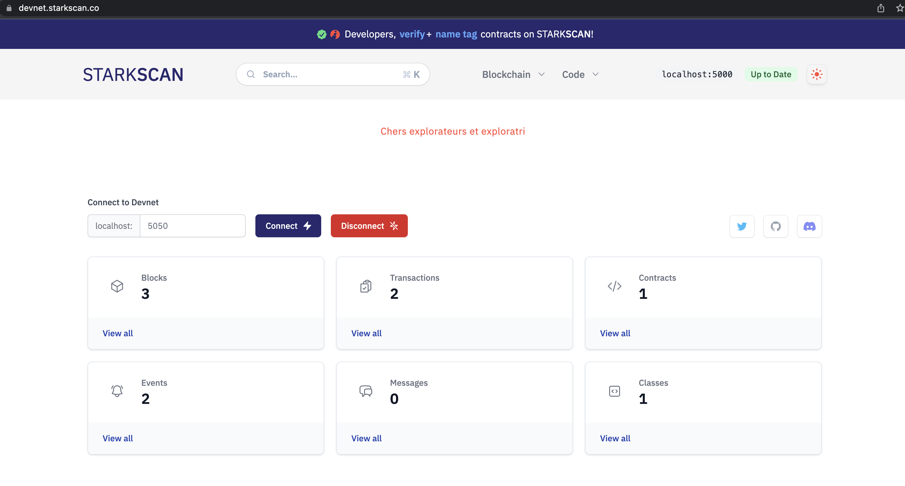
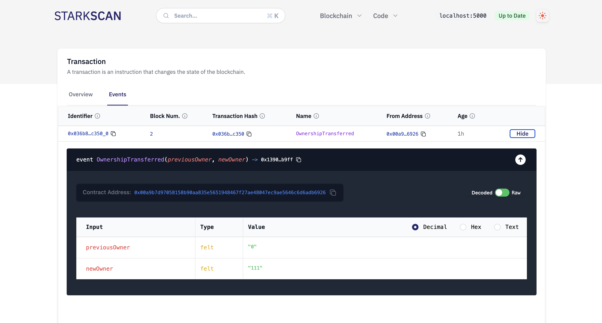
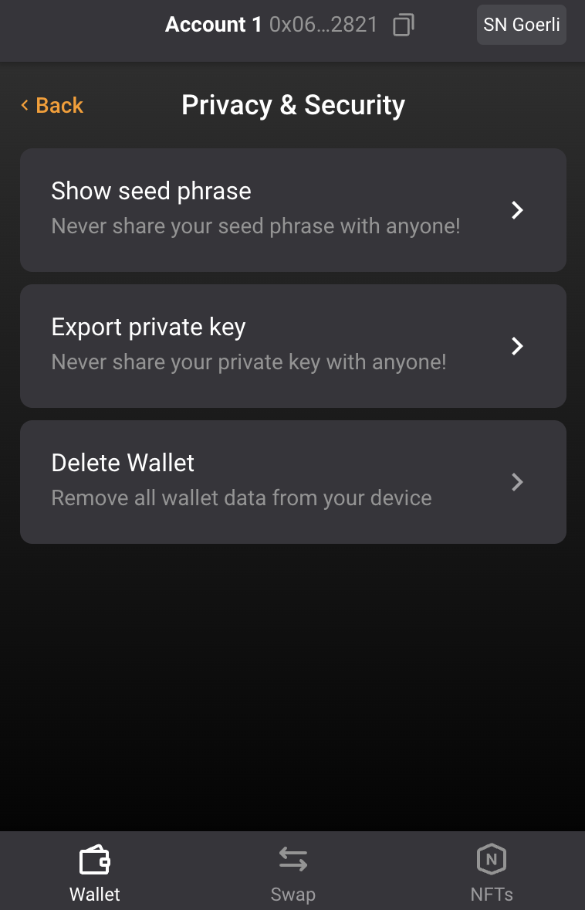

<div align="center">
    <h1>Camp 2: BUIDL and tooling</h1>

|Presentation|Video|Try what you learned
|:----:|:----:|:----:|
|-|-|Test your debugging capabilities with [starknet-debug](https://github.com/starknet-edu/starknet-debug)|

</div>

### Topics

<ol>
    <li><a href="#devnet">Devnet</a></a>
    <li><a href="#protostar">Protostar</a></a>
    <li><a href="#hardhat">Hardhat</a></a>
    <li><a href="#nodes">Nodes</a></a>
    <li><a href="#testing">Testing</a></a>
    <li><a href="#libraries">Libraries</a></a>
</ol>

While this section is being built, we recommend reading the video session for this camp and the [community resources page](https://github.com/gakonst/awesome-starknet).

In this camp, we will learn how to use some of the existing toolings for Cairo and StarkNet. Please notice there is more tooling being developed each month; here, we will cover just a part.

We are currently able to operate with the StarkNet Alpha. The recommended steps for deploying contracts are:

1. Unit tests - You can use Protostar, Nile, or starknet.py.
2. Devnet - Deploy in the [Shard Lab’s](https://github.com/Shard-Labs/starknet-devnet) `starknet-devnet`.
3. Testnet - Deploy to the Goerli, `alpha-goerli`, or Goerli 2. You can use Protostar, Nile, Hardhat, and more.
4. Mainnet - Deploy to Alpha StarkNet, `alpha-mainnnet`. Similar to the testnet.


<hr>


<h2 align="center" id="devnet"><a href="https://shard-labs.github.io/starknet-devnet">Devnet</a></h2>

Transactions on the testnet take time to complete, so it's best to start developing and testing locally. We will use the [devnet developed by Shard Labs](https://github.com/Shard-Labs/starknet-devnet). We can think of this step as an equivalent of Ganache. That is, it emulates the testnet (alpha goerli) of StarkNet. 

Install using:

```Bash
pip install starknet-devnet
```

Restart your terminal and run `starknet-devnet --version` to check that the installation was successful. Check that you have [the most up-to-date version](https://github.com/Shard-Labs/starknet-devnet/releases). If you don't have it, run `pip install --upgrade starknet-devnet`. [Here is the documentation](https://shard-labs.github.io/starknet-devnet/docs/intro).

Initialize the devnet in a separate shell (or tab) with 

```Bash
starknet-devnet \
    --accounts 3 \
    --gas-price 250 \
    --seed 0 \
    --port 5000
```
    
We get:

```Bash
Account #0
Address: 0x7e00d496e324876bbc8531f2d9a82bf154d1a04a50218ee74cdd372f75a551a
Public key: 0x7e52885445756b313ea16849145363ccb73fb4ab0440dbac333cf9d13de82b9
Private key: 0xe3e70682c2094cac629f6fbed82c07cd

Account #1
Address: 0x69b49c2cc8b16e80e86bfc5b0614a59aa8c9b601569c7b80dde04d3f3151b79
Public key: 0x175666e92f540a19eb24fa299ce04c23f3b75cb2d2332e3ff2021bf6d615fa5
Private key: 0xf728b4fa42485e3a0a5d2f346baa9455

Account #2
Address: 0x7447084f620ba316a42c72ca5b8eefb3fe9a05ca5fe6430c65a69ecc4349b3b
Public key: 0x58100ffde2b924de16520921f6bfe13a8bdde9d296a338b9469dd7370ade6cb
Private key: 0xeb1167b367a9c3787c65c1e582e2e662

Initial balance of each account: 1000000000000000000000 WEI
Seed to replicate this account sequence: 0
WARNING: Use these accounts and their keys ONLY for local testing. DO NOT use them on the mainnet or live networks because you will LOSE FUNDS.

 * Listening on http://127.0.0.1:5000/ (Press CTRL+C to quit)
 ```

We can run `curl http://127.0.0.1:5000/is_alive` to check if the devnet is active. You will receive `Alive!!!%` if it is active.

We created three accounts, with transaction costs of 250 wei per gas. The seed number will help us get the same accounts every time we activate our devnet and add that seed number. In other words, we can choose any seed number, but if we want to get the same accounts, we should select the same seed. We indicated we want to use port `5000`, however, feel free to add any convenient port. Our accounts are based on the code and standards developed by [Open Zepellin for Cairo](https://github.com/OpenZeppelin/cairo-contracts).

Please keep track of the address where our devnet is running. The example above is: `http://127.0.0.1:5000`. We will use it later.

The interaction with the devnet and the testnet is very similar. If you want to see all the arguments available in the `starknet-devnet` call, you can call `starknet-devnet --help` or go to the [documentation](https://shard-labs.github.io/starknet-devnet/docs/intro).


<h2 align="center" id="protostar"><a href="https://docs.swmansion.com/protostar">Protostar</a></h2>

[Protostar](https://github.com/software-mansion/protostar) is a tool inspired by [Foundry](https://github.com/foundry-rs/foundry) and key to compile, test and deploy. Its use is recommended by most of the StarkNet community.

### Installing Protostar

At this point, we already have `cairo-lang` installed.

On Ubuntu or macOS (not available for Windows), run the following command:

```Bash
curl -L https://raw.githubusercontent.com/software-mansion/protostar/master/install.sh | bash
```

Restart your terminal and run `protostar -v` to see the version of your `protostar` and `cairo-lang`.

If you later want to upgrade your protostar, use `protostar upgrade`. If you run into installation problems, I recommend reviewing the [Protostar documentation](https://docs.swmansion.com/protostar/docs/tutorials/installation).

### First steps with Protostar

What does it mean to initialize a project with Protostar?

- **`protostar.toml`**. Here we will have the information necessary to configure our project.
- **Three directories will be created**. `src` (where the contracts will be), `lib` (for external dependencies), and `tests` (where we will store the tests).

We can initialize our project with the `protostar init` command, or you can indicate that an existing project will use Protostar with `protostar init --existing`. You must have a `protostar.toml` file with the project settings. We could even create the `protostar.toml` file ourselves; in the next section, we will understand better what this file contains.

Let's run `protostar init` to initialize a Protostar project. It asks us to indicate the following:

- `project directory name`: What is the directory name where your project is located?

This is what the structure of our project looks like:

```
❯ tree -L 2
.
├── protostar.toml
├── src
│   └── voting.cairo
└── tests
    └── test_main.cairo
```


### Installing external dependencies (libraries)

Protostar uses git submodules to install external dependencies (similar to Foundry). Let's install a couple of dependencies.

First, let us install `OpenZeppelin/cairo-contracts`, Open Zeppelin's library for Cairo. We indicate where the repository is, that is, [github.com/OpenZeppelin/cairo-contracts](http://github.com/OpenZeppelin/cairo-contracts), and the version we want to install in this format:

```Bash
protostar install OpenZeppelin/cairo-contracts@v0.5.1
```

Let's install one more dependency, this time using the whole GitHub link and without the version:

```Bash
protostar install https://github.com/CairOpen/cairopen-contracts
```

Our new dependencies are stored in the newly created `lib` directory:

```
❯ tree -L 2
.
├── lib
│   ├── cairo_contracts
│   └── cairopen_contracts
├── protostar.toml
├── src
│   └── voting.cairo
└── tests
    └── test_main.cairo
```

Finally, we update our `protostar.toml` with the new paths and the installed libraries.

```
[project]
protostar-version = "0.9.1"
lib-path = "lib"
cairo-path = ["lib/cairo_contracts/src", "lib/cairopen_contracts/src"]

[contracts]
vote = ["src/voting.cairo"]
```

This allows Protostar to use those paths to find the libraries of interest. When you import, for example, `from openzeppelin.access.ownable.library import Ownable`, Protostar will look for `Ownable` in the path `lib/cairo_contracts/src/openzeppelin/access/ownable/library`. If you change the name of the directory where you store your external dependencies, then you will not use `lib` but the name of that directory.

We can update the libraries you imported with `protostar update cairo_contracts`. Also, we can remove a library. We will remove the cairopen library since we won't use it here.

```Bash
protostar remove cairopen_contracts
```

### Compiling

In the past, we have been compiling our contracts with `cairo-compile`. When we run `cairo-compile sum2Numbers.cairo --output x.json` to compile a Cairo `sum2Numbers.cairo` contract, the result is a new file in our working directory called `x.json`. The JSON file is used by `cairo-run` when we run our program.

We can simultaneously compile all our StarkNet contracts with `protostar build`. But first, we must indicate in the `[contracts]` section of `protostar.toml` the contracts we want to compile (or build). As we saw before, Protostar automatically creates a folder `src` where we can store our contracts. However, we can rename this folder or create our own. We write in `protostar.toml` that we want to compile the contract in `src/voting.cairo` and that we want to call it `vote` once it is compiled:

```Bash
[contracts]
vote = ["src/voting.cairo"]
```

We run `protostar build`. We will see a new `build` directory with a `vote.json` file. If you receive an error, e.g., "`Could not find module 'openzeppelin.access.ownable.library'.`", you can also indicate the path of the `build` call:

```Bash
protostar build \
    --cairo-path ./lib/cairo_contracts/src
```
If the compilation succeeds, we get the following:

```Bash
Building projects contracts                                                                                                                                                
Class hash for contract "vote": 0x02bebbf6d9e8cf11a1d0e04226e68f8d73ddfb025fb058c769fc6b48b27e57cf
```

Moral: if your contract is not in the `[“protostar.contracts“]` section of `protostar.toml`, it will not be compiled.

> Note: You will not be able to compile pure Cairo code using `protostar build`. It is only for StarkNet contracts (they have the `%lang starknet` signal at the beginning). To compile and run pure Cairo applications, you need to use `cairo-compile` and `cairo-run` ([see Cairo tutorial](3_cairo_basics.md). In the following tutorials, we will learn how to create StarkNet contracts.

At this point, we can deploy StarkNet contracts with Protostar. But first, let us introduce the `devnet`.


### Deploying to the devnet

For deploying a contract using Protostar, we will follow the steps we learned in Camp 1, where we used Argent's UI and the `starknet CLI`. However, Protostar and the devnet will make it simpler.

1. Deploy an account. Notice the devnet already deployed accounts for us.
2. Compile the contract.
3. Declare the contract.
4. Invoke the function `deployContract` of the UDC to deploy. Also, at the end of this section we will learn how to simply use Protostar's `deploy`.

Let's use a real example. When we initialize a Protostar project, a `main.cairo` contract is automatically created in the `src` directory. You can use it as an example of a contract to deploy to the devnet and then to the testnet. You must ensure that you define what will be compiled in `protostar.toml`. This tutorial will deploy the voting contract we wrote in Camp 1. We initialize a new Protostar repo called [buidl/protostar-buidl](buidl/protostar-buidl). Our [voting contract is in the `src` directory](buidl/protostar-buidl/src/voting.cairo). The `protostar.toml` looks:

```
[project]
protostar-version = "0.9.1"
lib-path = "lib"

[contracts]
vote = ["src/voting.cairo"]
```

Run `protostar build` to compile and create the `build/vote_abi.json` we will use for deployment.

Following the recommended order for deploying a smart contract, we will first deploy to the devnet and then to the testnet. In the following tutorial, we will learn how to use Protostar to first code unit tests; that is the actual first step. 

To make deployment to the devnet simpler, we create a section `[profile.devnet.protostar.deploy]` in the `protostar.toml` where we add the url where we deploy our devnet locally: `gateway-url = "http://127.0.0.1:5000/"` and the `chain-id = 1536727068981429685321`. `chain-id` is a number that represents the different networks where we can deploy our contracts. The testnet and devnet id is `1536727068981429685321`.

```Bash
[profile.devnet.project]
gateway-url = "http://127.0.0.1:5000/"
chain-id = 1536727068981429685321
```

We declare our voting contract in the devnet. We need to sign our transactions, so we need to provide the account address and the private key of the account paying for the transactions. This information was already provided when we started the devnet. For the `--account-address` flag, we add one of the addresses created by the devnet. We can create a local environmental variable for the private key: `export PROTOSTAR_ACCOUNT_PRIVATE_KEY=[THE PRIVATE KEY CREATED BY THE DEVNET]`. We set it up for this case with: `export PROTOSTAR_ACCOUNT_PRIVATE_KEY=0xe3e70682c2094cac629f6fbed82c07cd`. Now let's declare:

```Bash
protostar -p devnet declare build/vote.json \
    --account-address 0x7e00d496e324876bbc8531f2d9a82bf154d1a04a50218ee74cdd372f75a551a \
    --max-fee auto
```

We get: 

```Bash
Declare transaction was sent.                                                                                                             
Class hash: 0x02bebbf6d9e8cf11a1d0e04226e68f8d73ddfb025fb058c769fc6b48b27e57cf
Transaction hash: 0x0750ee15d7bf16252d94c08d61bf2c1bac3d15029c06e62314849e39fe1aec76
```

We invoke the `deployContract` of the UDC. In a following section we will get deeper into what `invoke` does. Luckily, the devnet comes with a UDC deployed at the same address as the testnet and mainnet. We use the same account address as with the `declare` command. The `inputs` are the same as we sent in Camp 1; revisit it for more details on how to interact with the UDC. We will use dummy values for the voting contract's constructor.

```Bash
protostar -p devnet invoke \
    --contract-address 0x41a78e741e5af2fec34b695679bc6891742439f7afb8484ecd7766661ad02bf \
    --function deployContract \
    --account-address 0x7e00d496e324876bbc8531f2d9a82bf154d1a04a50218ee74cdd372f75a551a \
    --max-fee auto \
    --inputs 0x02bebbf6d9e8cf11a1d0e04226e68f8d73ddfb025fb058c769fc6b48b27e57cf 0 0 4 111 2 222 333
``` 

We get:

```Bash
Sending invoke transaction...                                                                                                             
Invoke transaction was sent.
Transaction hash: 0x036b82edb246b65e657ec7119ba32711cea86ff17abce961ac52faa7a294c350
```

Our voting contract is now live on the devnet. Let's get its address. The [StarkScan block explorer](https://devnet.starkscan.co/) allows us to interact with our local devnet (only using Chrome). In the field `localhost`, add the port where the devnet is running; in our case, it is `5000`.

<div align="center">
    
</div>

We can search for our transaction hash (0x036b...). Then go to the `Events` tab, go to the `OwnershipTransferred` transaction, and expand its details. The contract address that appears will be the address of our deployed voting contract; in this case, 0x00a9b...

<div align="center">
    
</div>

Now we can play with our voting contract directly in StarkScan or using Protostar. For example, we can invoke the admin `view` function:

```Bash
protostar -p devnet invoke \
    --contract-address 0x00a9b7d97058158b90aa835e5651948467f27ae48047ec9ae5646c6d6adb6926 \
    --function admin \
    --account-address 0x7e00d496e324876bbc8531f2d9a82bf154d1a04a50218ee74cdd372f75a551a \
    --max-fee auto
``` 

This was the long way to deploy the voting contract, similar to what we did with Argent's UI and the `starknet` CLI. However, Protostar is a fantastic tool; we can use the `deploy` command to deploy our contract without invoking the UDC; Protostar does it in the background. This time let's use the accounts that the devnet previously created for us.

```Bash
protostar -p devnet deploy 0x02bebbf6d9e8cf11a1d0e04226e68f8d73ddfb025fb058c769fc6b48b27e57cf \
    --account-address 0x7e00d496e324876bbc8531f2d9a82bf154d1a04a50218ee74cdd372f75a551a \
    --max-fee auto \
    --inputs \
        0x7e00d496e324876bbc8531f2d9a82bf154d1a04a50218ee74cdd372f75a551a \
        2 \
        0x7e00d496e324876bbc8531f2d9a82bf154d1a04a50218ee74cdd372f75a551a \
        0x69b49c2cc8b16e80e86bfc5b0614a59aa8c9b601569c7b80dde04d3f3151b79
```

We get:

```Bash
Invoke transaction was sent to the Universal Deployer Contract.                                                                           
Contract address: 0x059d4835be27f1f273cce189234dc5dfe5a41252bf56110404720492c161e864
Transaction hash: 157069287311788325670531840403210154180024581021364400153925384422983716375
```

We simply needed the class hash obtained after declaring our contract. Note that the inputs do not include some of the UDC's `deployContract` inputs; including the class hash, salt, and unique address. We now only provide the voting contract constructor inputs (our admin, `0x7e0...`, the number of accounts allowed to vote, `2`, and the accounts allowed, `0x7e0...` and `0x69b.. .`), which is much simpler and cleaner.

We have successfully deployed a contract to the devnet. The advantage of deploying to the devnet first is that we can interact more quickly with our contracts. For the testnet, we will have to wait about a few minutes.

### Deploying to the testnet

For the devnet, we used the help of Protostar's profiles, so we do not have to write the whole chain Id and gateway URL; at the beginning of each command, we added `-p devnet`, e.g. `protostar -p devnet deploy`. We could write a profile in our Protostar configuration for the testnet too. However, for didactic purposes and because it is more straightforward, we will not create a profile for the testnet.

In order to sign our transactions (remember we need an account contract) on the testnet we can proceed in different ways:
1. Use an account linked to a Braavos or Argent wallet.
2. Deploy and use an account contract using starknet's CLI. It will be really similar to Open Zeppelin's standard. We would need to employ counterfactul deployment as we saw in Camp 1.
3. Deploy and use a customized account contract. We will review this in Camp 3.

Let us use here option 1. We can use the UI of either our Argent or Braavos wallet; I will show how to do it with Braavos here. Go to the "Privacy & Security" option.

<div align="center">
    
</div>

We export the private key and add it to the environmental variables with `export PROTOSTAR_ACCOUNT_PRIVATE_KEY=[THE EXPORTED PRIVATE KEY]`. 

Then we `declare` our contract adding to the `--account-address` flag the address of our wallet.


```Bash
protostar declare build/vote.json \
    --account-address 0x06dcb489c1a93069f469746ef35312d6a3b9e56ccad7f21f0b69eb799d6d2821 \
    --max-fee auto \
    --network testnet
```

We get:

```Bash
Declare transaction was sent.
Class hash: 0x02bebbf6d9e8cf11a1d0e04226e68f8d73ddfb025fb058c769fc6b48b27e57cf
StarkScan https://testnet.starkscan.co/class/0x02bebbf6d9e8cf11a1d0e04226e68f8d73ddfb025fb058c769fc6b48b27e57cf

Transaction hash: 0x05b6fa2f6019ee0f2053091b3d1965fb7de6422e85ca9db33b317caf5d7f626e
StarkScan https://testnet.starkscan.co/tx/0x05b6fa2f6019ee0f2053091b3d1965fb7de6422e85ca9db33b317caf5d7f626e
```

Before sending another transaction to the network, ensure the previous transaction (declare) is at least in the “Pending” state; otherwise, the second transaction will fail due to an incorrect nonce value. This happens because the network tracks the current nonce value of each user account, and this value is updated only after a transaction has entered the Pending state. 

Now that we have the class hash, we can deploy. Similar to the devnet, let us use real values. As account addresses we could use (1) accounts generated by the Argent or Braavos wallets, or (2) addresses we create using the starknet CLI or Protostar. We will use both options. 

In Camp 1 we deployed an account with the Alias `voting-contract`. It has the address `0x00f20c6664cc47e569abe53c7ba19f04685158a1b2f01c9a923cd3849354a928`; the private key is automatically stored in `~/.starknet_accounts/starknet_open_zeppelin_accounts.json`. We will add this account as one of the contracts allowed to vote and deploy from a Braavos account (however, feel free to use any account you want). Remember to export the private keys of the account to your environmental variables, e.g., `export PROTOSTAR_ACCOUNT_PRIVATE_KEY=0x03a...`.


```Bash
protostar deploy 0x02bebbf6d9e8cf11a1d0e04226e68f8d73ddfb025fb058c769fc6b48b27e57cf \
    --account-address 0x06dcb489c1a93069f469746ef35312d6a3b9e56ccad7f21f0b69eb799d6d2821 \
    --max-fee auto \
    --network testnet \
    --inputs \
        0x06dcb489c1a93069f469746ef35312d6a3b9e56ccad7f21f0b69eb799d6d2821 \
        2 \
        0x00f20c6664cc47e569abe53c7ba19f04685158a1b2f01c9a923cd3849354a928 \
        0x02cdAb749380950e7a7c0deFf5ea8eDD716fEb3a2952aDd4E5659655077B8510
```

We get:

```Bash
Invoke transaction was sent to the Universal Deployer Contract.                                                                           
Contract address: 0x03f1d3126c08ca82021abf265205c4c00ea80cde386781c1df8e190990962ebc
StarkScan https://testnet.starkscan.co/contract/0x03f1d3126c08ca82021abf265205c4c00ea80cde386781c1df8e190990962ebc

Transaction hash: 3486627275562620503680140120664986229453108046815711293106888485118594079697
StarkScan https://testnet.starkscan.co/tx/0x07b55c715b519ba20479e1bb94d48d00cd6d402f474b7cc3ccc2a45d658d5bd1
```

Again, Protostar deployed using the UDC in the background. Remember, since we are deploying to the testnet, it might take some minutes for the transaction to pass.

Great. We deployed our voting contract to both the devnet and the tesnet. This allows us to interact with our contract in a block explorer, with the CLI, or other tools.

### Calling and Invoking contracts

Let's interact with our deployed voting contract. 

* Calling contracts refer to interacting with contract functions with the `@view` entry point (decorator). Since we are not altering the state of the network, and hence we do not need to pay fees, we do not need to sign the operation.
* Invoking contracts is interacting with contract functions with the `@external` entry point. We need to sign the transaction and pay the operation fee.

Let's call our deployed voting contract in the devnet to check if the address `0x69b49c2cc8b16e80e86bfc5b0614a59aa8c9b601569c7b80dde04d3f3151b79` has voting permissions. We need to inform the network of:
1. The address of the contract we call; 
2. The specific function to call; and
3. The inputs (if any).

```Bash
protostar -p devnet call \
    --contract-address 0x059d4835be27f1f273cce189234dc5dfe5a41252bf56110404720492c161e864 \
    --function "is_voter_registered" \
    --inputs 0x69b49c2cc8b16e80e86bfc5b0614a59aa8c9b601569c7b80dde04d3f3151b79
```

We get:

```Bash
[RAW RESULT]                                                                                                                              
[1]

[TRANSFORMED RESULT]
{
    "is_voter_registered": 1
}
```

When we deployed our voting contract to the devnet, we indicated we wanted the `0x69b49c2cc8b16e80e86bfc5b0614a59aa8c9b601569c7b80dde04d3f3151b79` address to be allowed to vote, and that is precisely what we received as the output of our `call`.

Now we will alter the state of our contract by voting with the address `0x69b49c2cc8b16e80e86bfc5b0614a59aa8c9b601569c7b80dde04d3f3151b79`. Since we need to sign the transaction, as we did when we deployed the contract, we need to provide the private key of the account contract invoking the voting contract: in this case, we can use `export PROTOSTAR_ACCOUNT_PRIVATE_KEY=0xf728b4fa42485e3a0a5d2f346baa9455`.

```Bash
protostar -p devnet invoke \
    --contract-address 0x059d4835be27f1f273cce189234dc5dfe5a41252bf56110404720492c161e864    \
    --function "vote" \
    --inputs 1 \
    --account-address 0x69b49c2cc8b16e80e86bfc5b0614a59aa8c9b601569c7b80dde04d3f3151b79 \
    --max-fee auto
```

We get:

```Bash
Sending invoke transaction...                                                                                                             
Invoke transaction was sent.
Transaction hash: 0x023f884091e877cc4c72ccdb31f6a2b31ddfda647629af5834899d8176e1ad1b
```

Remember, the option to interact with the contract through the [StarkScan block explorer](https://devnet.starkscan.co/) is always available, even with a local network such as the devnet; this feature only works with the Chrome browser. Now, let's call the `get_voting_status` function from the voting contract to see if the vote was indeed applied.

```Bash
protostar -p devnet call \
    --contract-address 0x059d4835be27f1f273cce189234dc5dfe5a41252bf56110404720492c161e864 \
    --function "get_voting_status"
```

We get:

```Bash
[RAW RESULT]                                                                                                                              
[1, 0]

[TRANSFORMED RESULT]
{
    "status": {
        "votes_yes": 1,
        "votes_no": 0
    }
}
```
Our vote was successful! If we try to vote with an incorrect private key for a specific account (this is an error you might frequently encounter when developing), we would get an error 500: `"StarknetErrorCode.TRANSACTION_FAILED"` with a message: `Signature []...] is invalid, with respect to the public key`. We need to keep track of our accounts' private keys carefully.

Now let's see what happens when we vote with an account without voting permissions. We will vote with the third account the devnet created for us. We set up the private key: `export PROTOSTAR_ACCOUNT_PRIVATE_KEY=0xeb1167b367a9c3787c65c1e582e2e662`

```Bash
protostar -p devnet invoke \
    --contract-address 0x059d4835be27f1f273cce189234dc5dfe5a41252bf56110404720492c161e864    \
    --function "vote" \
    --inputs 0 \
    --account-address 0x7447084f620ba316a42c72ca5b8eefb3fe9a05ca5fe6430c65a69ecc4349b3b \
    --max-fee auto
```

Protostar will return us a long message. Among the feedback, we get: `Error message: VoterInfo: Your address is not allowed to vote.`, precisely the message we set in our contract whenever we face an error of this type.

The same process could be followed with contracts deployed in the testnet. Try it!

### Testing contracts with Protostar

We left testing our contract for last; however, remember that testing is the first step in our sanity process for building smart contracts:
1. Unit tests;
2. Dev/local network;
3. Test network:
4. Main network.

Testing ensures that your code remains reliable even when we change it. The Rust community thinks about tests in terms of two main categories: **unit tests** and **integration tests**. 
* **Unit tests** are small and more focused, testing one module in isolation at a time, and can test private interfaces.
* **Integration tests** are entirely external to the library and use its code in the same way any other external code would. ([The Rust Programming Language](https://doc.rust-lang.org/book/ch11-03-test-organization.html)).

> Protostar provides an environment to write unit tests for StarkNet smart contracts in **Cairo language itself**. With the help of cheat codes like `deploy_contract`, it is also easy to write integration tests, deploy single or multiple contracts and examine the internal behavior of such small systems ([Protostar documentation](https://docs.swmansion.com/protostar/docs/tutorials/testing/e2e)).

In other words, thanks to Protostar cheat codes (a term adopted from Foundry), we can create both unit and integration tests. For integration tests, we would need more than assertions; we would need to manipulate the state of the blockchain, check for reversals and events, change our identity, and more. For this reason, Protostar provides cheat codes ([Protostar documentation](https://docs.swmansion.com/protostar/docs/tutorials/testing/cheatcodes), [Foundry documentation](https://book.getfoundry.sh/forge/cheatcodes)). The cheat codes are implemented using python hints within our tests.

Ideally, we would like to test all possible flows in our smart contract. Thus, our contract would have *100% code coverage*. However, we could lag behind this number; Code coverage of 80% is considered a good number.

Protostar divides our tests into test suites, each with test cases. A suite is a Cairo file (remember, Protostar allows you to code tests using Cairo) with external functions (the test cases) that use assertions and cheat codes to test our contract. If we are testing two different contracts, we can create two separate test suites. If we are trying two different flows in our contract, we can create two test cases for each flow.

To run all the test suites in the `tests` directory of a project, with the Open Zeppelin cairo-contracts dependency installed, we can run the following:

```Bash
protostar test ./tests \
    --cairo-path lib/cairo_contracts/src/
```

### Testing the voting contract

This section will code the unit and integration tests for the voting contract. The goal is to introduce some of the most critical testing tools that Protostar provides. The [Protostar documentation](https://docs.swmansion.com/protostar/docs/tutorials/testing) contains additional tools for testing.

We will learn the following:
1. How to deploy a contract inside our test.
2. How to interact with the deployed contracts.
3. How to use cheat codes to simulate behaviors.

We can find the complete set of tests for our voting contract at [tests/test_vote.cairo](./tests/test_vote.cairo). Here we will dissect the most important parts of it.

Due to the large number of `view` and `external` functions, our voting contract depends on interaction with the state of the blockchain; Therefore, we need to interact with the deployed contract and rely on integration tests. 

The first thing we need to do for our integration tests is deploy the contract. We want to do this at the beginning of our test suite, so we don't have to deploy it in every test case. Protostar allows us to do this with configuration hooks. Setting up our configuration hooks is the first thing we do in our [test suite](./tests/test_vote.cairo). We deploy our contract by:
* declaring what contract we want to deploy;
* preparing it by defining the call data for the constructor; and
* deploying it.

Additionally, we want to store the address of our deployed contract in a variable that we can call through the test suite. We can use the context variable to pass data from the config hook to the test cases (functions); in this case, we are transmitting the address or the deployed contract.

```Cairo
@external
func __setup__() {
    %{ 
        declared = declare("src/voting.cairo")
        prepared = prepare(declared, [ids.ADMIN, ids.NUMBER_VOTERS, ids.VOTER_1, ids.VOTER_2, ids.VOTER_3])
        context.context_vote_address = deploy(prepared).contract_address
    %}
    return ();
}
```

To interact with our contract, it is helpful to represent its functionality through an Interface. Interfaces on StarkNet are `namespaces` preceded by the `@contract_interface` entry point (decorator) that can:
* ... not have any function with implementation.
* ... not have a constructor.
* ... not have state variables.
* ... can have `struct`s

We add all the `view` and `external` functions from our contract to the Interface at [IVote.cairo](/src/interfaces/IVote.cairo). We can call our entire contract functionality through the Interface. For example, here we call the function `is_voter_registered`:

```Cairo
IVote.is_voter_registered(contract_address=vote_address, address=VOTER_1)
```

Note that an Interface automatically adds a new parameter, `contract_address`, where we need to add the address of the deployed contract that contains the actual functionality we want to emulate. Then we write the other required argument of the function we call, in this case, `address`. We will use the `IVote` Interface when testing our contract.

Once the contract is deployed, testing the initial state of view functions is easy and requires no cheat codes. In the following snippet, we test that our contract deployment was correct, i.e., that the call data added to the constructor is reflected via the `view` functions.

```Cairo
@external
func test_vote_contract_deploy{syscall_ptr: felt*, range_check_ptr}() {

    tempvar vote_address: felt;

    %{  
        ids.vote_address = context.context_vote_address
    %}

    //test the admin view function
    let (admin) = IVote.admin(contract_address=vote_address);
    assert ADMIN = admin;
    
    // Test the is_voter_registered view function; where the voters registered?
    let (voter_1) = IVote.is_voter_registered(contract_address=vote_address, address=VOTER_1);
    assert 1 = voter_1;
    let (voter_2) = IVote.is_voter_registered(contract_address=vote_address, address=VOTER_2);
    assert 1 = voter_2;
    let (voter_3) = IVote.is_voter_registered(contract_address=vote_address, address=VOTER_3);
    assert 1 = voter_2;

    %{  
        print("🐺 Successful deployment of the contract; constructor successfully implemented")
    %}

    return ();
}
```

When we deployed our contract, we stored the contract's address in the `context.context_vote_address` variable. We retrieve the address and store it in the Cairo `tempvar` `vote_address`.

```Cairo
tempvar vote_address: felt;

    %{  
        ids.vote_address = context.context_vote_address
    %}
```

With the address, we can call the Interface `IVote` to test the contract's functions.

We make much use of `assert` to review that the values are correct.

> (As we reviewed in Camp 1) The `assert` statement in Cairo can assert that the value at a given memory location equals something. However, it can also set the value if the given memory location is still unset. When you’re writing tests, you want the test to fail in the second case. To do so, a simple tip is to write Yoda-style assertions ([Only Dust](https://mirror.xyz/onlydust.eth/uhKk_3p34mE0oFUxkIYlCsjkE7ZvUfSFWU83UM9_w-w)).

That is why we write:
```Cairo
assert 1 = voter_1;
```
We did not write it: 

```Cairo
assert voter_1 = 1;
```

If we would like to execute our tests frequently, we want to make them fast. The most efficient way to do so is to execute only the test we are interested in ([Only Dust](https://mirror.xyz/onlydust.eth/uhKk_3p34mE0oFUxkIYlCsjkE7ZvUfSFWU83UM9_w-w)). To run this specific test case, we can call in the terminal:

```Bash
protostar test tests/test_vote.cairo::test_vote_contract_deploy --cairo-path lib/cairo_contracts/src
```


### Pranking and testing errors

So far, we only manipulated the state of the blockchain when we deployed the contract. We must trick the blockchain by interacting with it from different accounts (identities) and altering the state.

The `start_prank` cheat code allows us to "prank" the blockchain with our identity. We can trick it into thinking that we are calling it from one or another account. In the `test_vote_contract_vote` test case, we simulate votes from the registered addresses. `start_prank` takes two arguments (review the [Protostar documentation](https://docs.swmansion.com/protostar/docs/tutorials/testing/cheatcodes/start-prank)): the address of the account that would be making the call/invocation, and the address of the contract we are calling.

For example, here we are invoking the `vote` function of the `IVote` Interface from the `VOTER_1` account. In other words, we are simulating a vote, 0 (no), from `VOTER_1`.  

```Cairo
%{ stop_prank_voter = start_prank(ids.VOTER_1, ids.vote_address) %}
IVote.vote(contract_address=vote_address, vote=0);
%{ stop_prank_voter() %}
```

We can then test if our vote indeed altered the blockchain state (review the full [test suite](/src/interfaces/IVote.cairo)).

In the `test_vote_contract_pause_vote` test case, we use `start_prank` to pause voting; we pretended that our identity was that of the voting administrator:

```Cairo
%{ stop_prank_admin = start_prank(ids.ADMIN, ids.vote_address) %}
IVote.pause(contract_address=vote_address);
%{ stop_prank_admin() %}
```

We also want to test that our error messages and exceptions are triggered at the right time. When we built our voting smart contract in Camp 1, we defined that an error, `"VoterInfo: Your address does not have permission to vote"`, would appear when an address does not have permission to vote. In the `test_vote_contract_vote` case, we simulate a vote by VOTER_1, so they are no longer allowed to vote. We want to test if this error appears at the right time; for this, we use the `expect_revert` cheat code. A test will pass if a code below `expect_revert` raises a specific exception. Otherwise, the test will fail ([Protostar documentation](https://docs.swmansion.com/protostar/docs/tutorials/testing/cheatcodes/expect-revert)). 

```Cairo
%{ expect_revert(error_message="not allowed to vote") %}
%{ stop_prank_voter = start_prank(ids.VOTER_1, ids.vote_address) %}
IVote.vote(contract_address=vote_address, vote=0);
%{ stop_prank_voter() %}
```

There are many [other cheat codes in Protostar](https://docs.swmansion.com/protostar/docs/tutorials/testing/cheatcodes), and some of them may be useful for your particular case; don stop exploring

The testing process allowed us to move more confidently to the development network or test network for further testing or interacting with the first users; we would like to make sure that the interactions with the network are correct, for example, we would like to use private keys for our accounts, make sure that the nonces are correct, that the front-end can connect correctly with the contract, etc.

We would need additional tools to continue testing the integration of our contracts with the ourside world. [These tools](https://docs.swmansion.com/protostar/docs/tutorials/testing/e2e) are recommended by the Protostar documentation:

1. The Devnet for running a local StarkNet network,
2. StarkNet SDKs like [starknet.js](https://www.starknetjs.com/), [starknet.py](https://starknetpy.rtfd.io/), or [starknet-rs](https://github.com/xJonathanLEI/starknet-rs) for interacting with StarkNet from tests' code,
3. Protostar CLI for building contracts and deploying in tests' setup phases and CI.

<h2 align="center" id="hardhat"><a href="https://github.com/Shard-Labs/starknet-hardhat-plugin">Hardhat</a></h2>

<h2 align="center" id="nodes">Nodes</h2>

### [Pathfinder](https://github.com/eqlabs/pathfinder)

### [Juno](https://github.com/NethermindEth/juno)


#### Sources

[<https://github.com/gakonst/awesome-starknet>]
