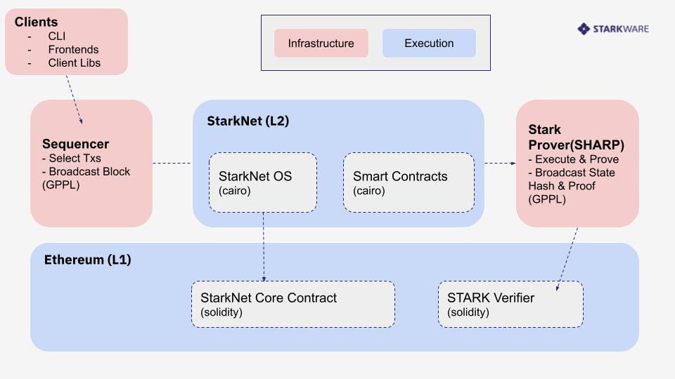

<h1 align="center">Camp 3: StarkNet</h1>

### Topics

<ol>
    <li><a>Smart Contracts</a></a>
    <li><a>Transactions</a></a>
    <li><a>Blocks</a></a>
    <li><a>Fees</a></a>
    <li><a>Sequencer</a></a>
    <li><a>StarkNet OS</a></a>
    <li><a>SHARP</a></a>
    <li><a>Verifier</a></a>
    <li><a>Events</a></a>
    <li><a>State</a></a>
    <li><a>L1<>L2</a></a>
    <li><a>Curve/ECDSA</a></a>
    <li><a>Accounts</a></a>
    <li><a>Environments</a></a>
</ol>

<div align="center">
    <h2>Overview</h2>
    <a href="https://docs.google.com/presentation/d/1Rrh8c4TC8g18PcADQ6YaXNogC7NM1j33RXF-b8Bwn-E/edit?usp=sharing">(slides)</a>
    <br>
    
</div>

[StarkNet](https://docs.starknet.io/docs/Intro) is a permissionless Layer 2 ZK-Rollup that supports smart contracts based on [Cairo](../camp_2).

<h2 align="center" id="smart_contracts">Smart Contracts</h2>

Contracts on StarkNet are written in Cairo or can be transpiled to Cairo from Solidity code via [Warp](https://github.com/NethermindEth/warp). We will be building more sophisticated smart contracts in the next camps, for now let's compile and deploy our simple examples:

***Cairo***

```bash
cd contracts/cairo
starknet-compile ../counter.cairo --output counter_compiled.json --abi counter_abi.json
starknet deploy --contract counter_compiled.json
```

***Solidity***

```bash
cd contracts/solidity
warp transpile ERC20.sol WARP
warp deploy ERC20.json
```

<h2 align="center" id="starknet_os">StarkNet OS</h2>

The StarkNet OS is the Cairo program that runs StarkNet. The OS handles everything which is done on the network — contract deployment, transaction execution, L1<>L2 messages and more.

<h2 align="center" id="transactions">Transactions</h2>

On StarkNet Alpha the two types of transactions are DEPLOY or INVOKEand they go through the following lifecycle as they are submitted from the clients to the sequencer:

<div align="center">
    NOT_RECEIVED -> RECEIVED -> PENDING -> REJECTED || ACCEPTED_ON_L2 -> ACCEPTED_ON_L1
</div>

#### Sources

- <https://github.com/eqlabs/pathfinder/blob/2fe6f549a0b8b9923ed7a21cd1a588bc571657d6/crates/pathfinder/resources/fact_retrieval.py>

---
upper_tags: [protocol, peer_to_peer, network, virtual_machine, rollup, layer_two]

lower_tags: [merkle_patricia_trie, transaction, account, client, block, hash, timestamp, cairo, smart_contract, prover, verifier, zero_knolwedge_proofs, scalable_transparent_arguments_of_knowledge]
