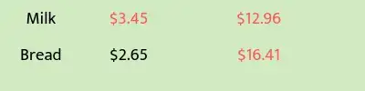
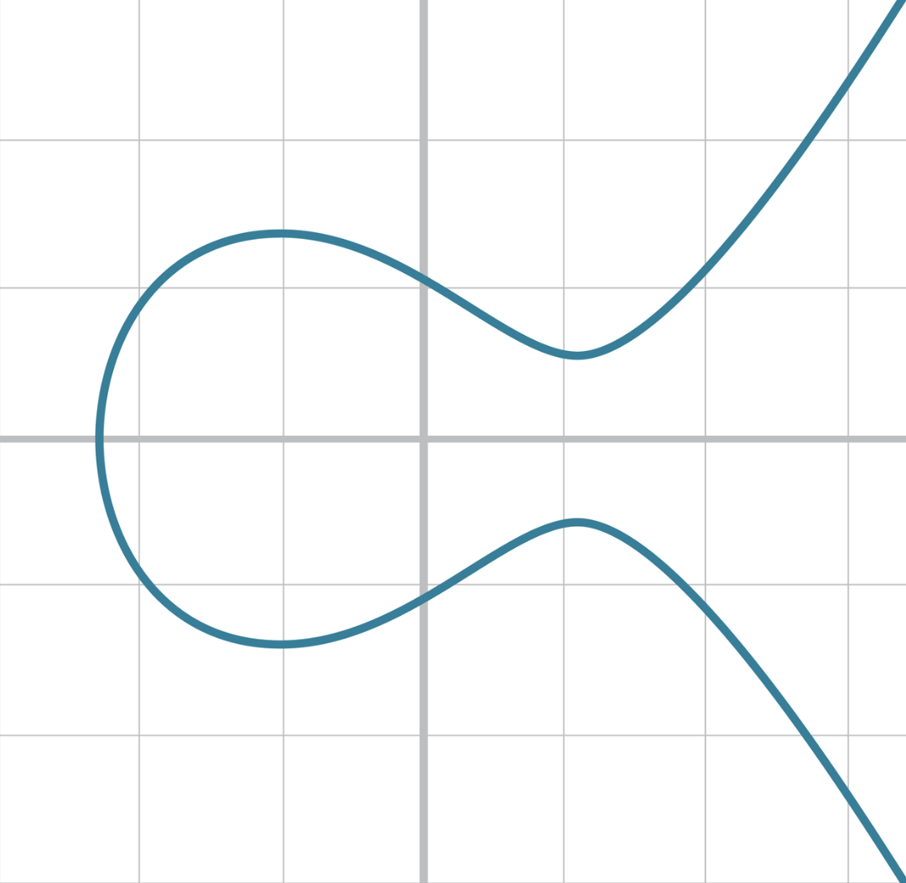
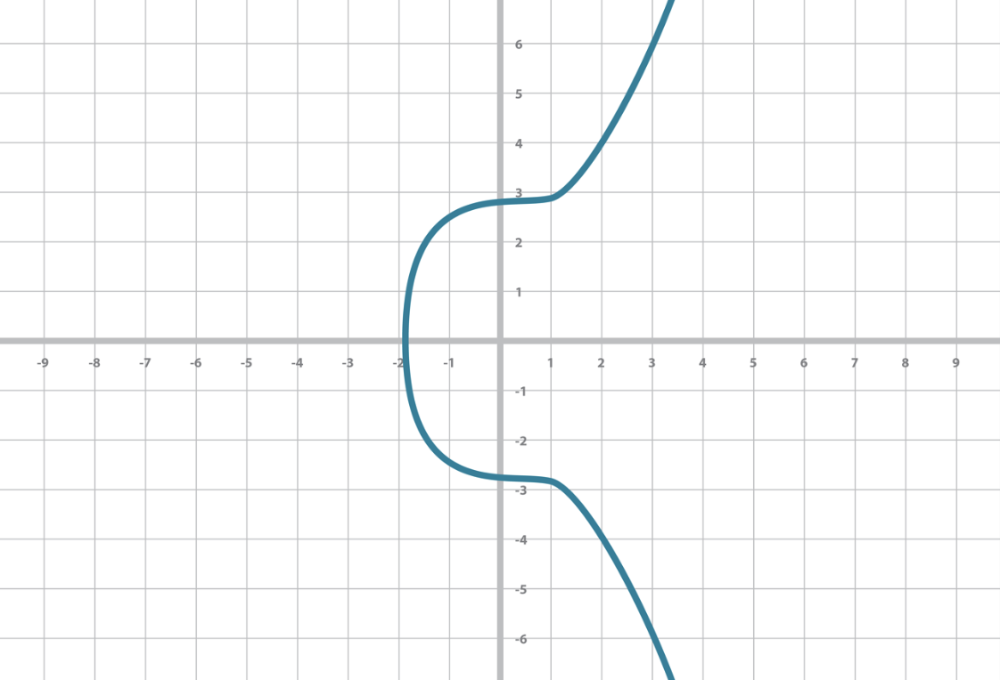

<div align="center">
    <h1>Camp 6: STARKs</h1>

|Presentation|Video|Try what you learned
|:----:|:----:|:----:|
|[September 2022](https://drive.google.com/file/d/1asONnOcSnRJwMXF-Zx1uJBdpbMrLYnmE/view?usp=sharing)|[Camp 1 (September 2022)](https://www.youtube.com/watch?v=7p60e7RzuMs)|Go hardcore with StarkWare's [STARK 101](https://starkware.co/stark-101)|

</div>

### Topics

<ol>
    <li><a href="#trust">Trust vs. Verification</a></li>
    <li><a href="#first_look">First Look at the STARKs</a></li>
    <li><a href="#zk_terminology">ZK Terminology</a></li>
    <li><a href="#zk">Zero Knowledge</a></li>
    <li><a href="#modular_arithmetic">Modular Arithmetic</a></li>
    <li><a href="#finite_fields">Finite Field Arithmetic</a></li>
    <li><a href="#polynomials">Polynomials</a></li>
    <li><a href="#computational_integrity">Computational Integrity</a></li>
    <li><a href="#starks">STARKs</a></li>
</ol>


Computational Integrity (CI) is a fundamental property that underlies commerce. In simple terms, it means that the output of a certain computation is correct. CI is what allows us to trust an account balance presented to us, or the bill at a store. This Camp delves into how permissionless blockchains achieve CI without requiring trust, the dramatic price they pay for this in terms of scalability and privacy, and how STARKs can save the day.

<h2 align="center" id="trust">Trust vs. Verification</h2>

### “Old World”: Trust, or Delegated Accountability

Financial systems (banks, brokers, exchanges, etc.) need to operate with integrity to serve their societal functions. What mechanisms incentivize them to operate with integrity? The “old world” assumes trust as a proxy for integrity. We trust banks, pension funds, etc., to operate honestly. Let’s go down the rabbit hole and examine the basis for this trust, ignoring the “integrity theater” — the tall buildings and fancy suits — set to impress us. From a purely rational and utilitarian perspective, the thing that prevents the financial system from seizing all our funds is the threat of social disgrace, jail, and fines. There’s also a carrot — reputation, which attracts future customers and generates future profits. By signing on financial statements with their names, people in the “old world” stake their personal freedom, existing and future finances as a collateral for integrity, and we, the public, base our trust on this arrangement. The verification of this integrity is delegated to experts like accountants, auditors, and regulators. We will call this Delegated Accountability. It’s not a bad system: it’s been serving modern economies faithfully for quite some time.

A new variant of the “old world” approach is the Trusted Execution Environment (TEE). A trusted hardware manufacturer (like Intel) produces a physical machine (like the SGX chip) that cannot deviate from the specified computation and signs correct states using a secret key known only to that physical machine. Integrity is now based on trust in the hardware and its manufacturer and on the assumption that it is impossible to extract secret keys from such physical devices.

“New World”: Verify, or Inclusive Accountability
Blockchains offer a more direct way to reach integrity, captured by the motto “Don’t Trust, Verify”. This “new world” does not require an integrity theater, it doesn’t rely on accountants, nor do its developers and network maintainers stake their personal freedom to gain public trust. Integrity is guaranteed by Inclusive Accountability: a node with a standard computational setup (a web-connected laptop) should be able to verify the integrity of all transactions in the system.

The prevalent method to verify CI in permissionless blockchains is via naive replay: all nodes are asked to re-execute (replay) the computations that verify each and every transaction. Inclusive Accountability, in this naive form, leads to two immediate challenges:

* **Privacy**: If everyone gets to inspect all transactions then privacy might be compromised. The absence of privacy deters businesses, as it means sensitive information may not remain proprietary. It also deters individuals, as it erodes [human dignity](https://en.wikipedia.org/wiki/The_Right_to_Privacy_(article)).

* **Scalability**: Demanding that the system be accountable to a standard laptop means it cannot scale up by simply moving to bigger computers and larger bandwidth. This leads to a severe bound on the throughput of the system.

Proofs systems (discussed next) are an excellent solution to both challenges. Zero Knowledge (ZK) proof systems are by now an established tool to address privacy in blockchains and explained excellently in several posts of Zcash (see [this](https://z.cash/blog/shielded-ecosystem/), [this](https://z.cash/technology/) and [this](https://z.cash/technology/zksnarks/)). 

Let's review an example for a CI statement (the claim that the output of a certain computation is correct): the total sum we should pay at the supermarket was computed correctly. The conventional proof for this particular statement is the receipt. Typically, the items in the receipt are listed with their prices, and the total sum is indicated at the bottom, like so:

<div align="center">
    
</div>

For simplicity — we only consider this to be a statement that the summation is correct. To see whether this CI statement holds, one can go over the list — not skipping any item — to compute the total sum, and check it against the number at the bottom of the receipt. This is a very naive example, but we’ll use it further down this article to demonstrate the idea of *succinct testability*.


### Proof Systems
Proof Systems started with the introduction of the [Interactive Proof](https://en.wikipedia.org/wiki/Interactive_proof_system) (IP) model by Goldwasser, Micali, and Rackoff in 1985. Interactive proofs are protocols that involve two kinds of entities: a prover and a verifier, who interact over a number of rounds by sending messages. The prover and verifier have conflicting objectives: the prover wants to convince the verifier of the integrity of a certain computation, and the verifier is a suspicious gatekeeper entrusted by the public with the task of distinguishing between truisms and falsities. The prover and verifier communicate interactively, taking turns in sending messages to one another. These messages depend on the statement being proved, on prior messages, and may also use some randomness. On the prover side, randomness is used to achieve zero knowledge and on the verifier side randomness is needed to generate queries to the prover. At the end of the interactive process the verifier outputs a decision, to either accept the new state or reject it.

A good analogy is the examination process practiced in a court of law when one party submits a claim and its counterparty questions its validity. For the claim to be accepted as true, the answers provided by the claimant (prover) to the examiner’s (verifier’s) queries must be consistent and valid. The examination process is expected to expose any mismatch between a statement and reality, and thus expose it as false.

We say that a proof system *solves* CI if when updating the system from state A to state B, the following properties hold:

* **Completeness**: If the prover indeed knows how to change the state from A to B in a valid way then the prover will manage to convince the verifier to accept the change.
* * **Soundness**: If the prover doesn’t know how to change the state from A to B, then the verifier will notice an inconsistency in the interaction and reject the suggested state transition. There remains a tiny false-positive probability, i.e., a probability of the verifier accepting an invalid proof. This probability is a system security parameter which can be set to an acceptable level like 1/(2¹²⁸), similar odds to winning the powerball five times in a row.
  
This pair of properties has a crucial implication to the principle of Inclusive Accountability discussed earlier. The verifier can accept the state transition suggested by the prover without making any assumptions about the integrity of the prover. In fact, the prover can run on faulty hardware, it can be closed source and it can be executed on a computer controlled by a malicious entity. The only thing that matters¹ is that the messages sent by the prover lead the verifier to accept the statement. If that is the case, we know that computational integrity holds.


<h2 align="center" id="first_look">First Look at the STARKs</h2>

By now there are quite a few theoretical constructions of proof systems, along with implementations. Some are deployed in cryptocurrencies, like the [SNARKs](https://z.cash/technology/zksnarks/) used by [Zerocash](http://zerocash-project.org/paper)/[Zcash](https://z.cash/), and [Bulletproofs](https://eprint.iacr.org/2017/1066) (BP) deployed in [Monero](https://ww.getmonero.org/). (For general information on proof systems go [here](https://zkp.science/).) What distinguishes [STARKs](https://eprint.iacr.org/2018/046) is the combination of the following three properties: scalability (the S in STARK), transparency (the T in STARK), and lean cryptography.

### Scalability: Exponential Speedup of Verification**

Scalability means that two efficiency properties hold simultaneously:

* **Scalable Prover**: The prover’s running time is “nearly-linear” in the time it would take a trusted computer to check CI by just re-executing the computation themselves and checking that the result matches what someone is claiming. The ratio of “overhead” (time needed to generate a proof / time needed to just run the computation) remains reasonably low.
* **Scalable Verifier**: The verifier’s running time is polynomial in the logarithm of naive replay time. In other words, the verifier’s runtime is exponentially smaller than simply replaying the computation (recall that ‘replay’ is the current blockchain method to achieve Inclusive Accountability).

<div align="center">
    
</div>

Apply this notion of scalability to a blockchain. Instead of the current mode of verification by naive replay, imagine how things will look when a blockchain moves to verification by using proof systems. Instead of simply sending the transactions to be added to the blockchain, a prover node will need to generate a proof but thanks to the Scalable Prover its running time is nearly-linear in the running time of the naive replay solution. And the Scalable Verifier will benefit from an exponential decrease in its verification time. Furthermore, as blockchain throughput scales up, most of the effect will be shouldered by the prover nodes (which could run on dedicated hardware, like miners), whereas the verifiers, which would constitute most of the nodes in the network, would hardly be affected.

Let’s consider a concrete hypothetical example, assuming verifier time (in milliseconds) scales like the square of the logarithm of the number of transactions (tx). Suppose we start with 10,000 tx/block. Then the verifier’s running time is

$VTime = (log₂ 10,000)² ~ (13.2)² ~ 177 ms$.

Now increase the blocksize a hundredfold (to 1,000,000 tx/block). The new running time of the verifier is

$VTime = (log₂ 1,000,000)² ~ 20² ~ 400 ms$.

In words, a 100x increase in transaction throughput led only to a 2.25x increase in the verifier’s running time!

In some cases, the verifier will still need to download and verify *availability of data*, which is a linear-time process, but downloading data is generally much cheaper and faster than checking its validity.

### Transparency: With Trust Toward None, with Integrity for All

Transparency means there is no trusted setup (formally, a transparent proof system is one in which all verifier messages are public random strings. Such systems are also known as [Arthur-Merlin protocols](https://en.wikipedia.org/wiki/Arthur%E2%80%93Merlin_protocol)) — there is no use of secrets in the setting up of the system. Transparency offers many benefits. It eliminates the parameter setup generation procedure which constitutes a single point of failure. The lack of a trusted setup allows even powerful entities — big corporations, monopolies and governments, which control the “old world” financial system — to prove CI and gain public acceptance of their claims because there’s no known way to forge STARK proofs of falsities, even by the most powerful of entities. On a more tactical level, it makes it much easier to deploy new tools and infrastructure and change existing ones without a need for elaborate parameter-generation ceremonies. Most importantly, transparency aligns well with the “new world” that demands Inclusive Accountability under no trust assumptions. [To paraphrase Abraham Lincoln](https://en.wikipedia.org/wiki/Abraham_Lincoln%27s_second_inaugural_address), transparent systems allow to operate with trust toward none, with integrity for all.


### Lean Cryptography: Secure & Fast
STARK has minimal cryptographic assumptions underlying its security: the existence of secure cryptographic and [collision-resistant hash functions](https://en.wikipedia.org/wiki/Collision_resistance) (this minimality of cryptographic assumptions holds for interactive STARKs (iSTARKs). Noninteractive STARKs (nSTARKs) require the Fiat-Shamir heuristic which is a different beast). Many of these primitives exist today as hardware instructions, and the lean cryptography leads to two more benefits:

* **Post-Quantum Security**: STARKs are plausibly secure against efficient quantum computers.
* **Concrete Efficiency**: For a given computation, the STARK prover is at least 10x faster than both the SNARK and Bulletproofs prover. The STARK verifier is at least 2x faster than the SNARK verifier and more than 10x faster than the Bulletproof verifier. As StarkWare continues to optimize STARKs these ratios will likely improve. However, a STARK proof length is ~100x larger than the corresponding SNARK and ~20x larger than BulletProofs.

<h2 align="center" id="trust">Arithmetization</h2>

The goal of the STARK protocol is to verify computations succinctly and transparently. It follows three steps:

1. The first step in a STARK is called *arithmetization*, and it is the translation (often referred to as ‘reduction’) of the problem of verifying a computation to the problem of checking that a certain polynomial, which can be evaluated efficiently on the verifier’s side (this is the ‘succinctly’ part), is of low degree. Arithmetization is useful since it enables the use of tools from the realm of Error Correction Codes that efficiently test low degree-ness. 

2. However, arithmetization itself only translates a Computational Integrity statement into a polynomial, setting the scene for the next phase in STARK, which is another interactive protocol that involves a prover that attempts to convince a verifier that the polynomial is indeed of low degree. The verifier is convinced that the polynomial is of low degree if and only if the original computation is correct (except for an infinitesimally small probability). 

3. In the last step of STARK, the interactive protocol is transformed into a single non-interactive proof, that can be posted to a blockchain and publicly verified by anyone.

Arithmetization itself is composed of two steps. The first is generating an execution trace and polynomial constraints, the second is transforming these two objects into a single low-degree polynomial. In terms of prover-verifier interaction, what really goes on is that the prover and the verifier agree on what the polynomial constraints are in advance. The prover then generates an execution trace, and in the subsequent interaction, the prover tries to convince the verifier that the polynomial constraints are satisfied over this execution trace, unseen by the verifier. Let's review each step.

### Step 1: Generating an execution trace and a set of polynomial constraints

The first step takes some CI statement (such as “the fifth transaction in block 7218290 is correct”), and translate it into formal algebraic language. This serves two purposes: 1) it defines the claim succinctly in an unambiguous way, and 2) it embeds the claim in an algebraic domain. This embedding is what allows the second step of arithmetization, which reduces the CI statement to a claim about the degree of a specific polynomial.

The algebraic representation that we use has two main components: 1) an execution trace, and 2) a set of polynomial constraints. The execution trace is a table that represents the steps of the underlying computation, where each row represents a single step. The set of polynomial constraints is constructed such that all of them are satisfied if and only if the trace represents a valid computation. While the execution trace may be very long, we will work with a succinct set of polynomial constraints.

The type of execution trace that we’re looking to generate must have the special trait of being succinctly testable — each row can be verified relying only on rows that are close to it in the trace, and the same verification procedure is applied to each pair of rows. This trait directly affects the size of the proof. To exemplify what we mean by being succinctly testable, let’s go back to the supermarket receipt, and add another column for the running total:

<div align="center">
    
</div>

This simple addition allows us to verify each row individually, given its previous row.

We can, for example, examine these two rows:

<div align="center">
    
</div>

We would be convinced that this particular step of the computation (i.e. the number 16.41) is correct since 12.96+3.45=16.41. Notice that the same constraint is applied to each pair of rows. This is what we mean by succinct constraints.

Let's proceed with the polynomial constraints. We rewrite the supermarket receipt (with the running total) in the form of a table:

<div align="center">
    
</div>

Denote the value of the cell in the $i$-th row and $j$-th column by $A_{i,j}$. We can now rephrase the correctness conditions as this set of polynomial constraints:

<div align="center">
    
</div>

These are linear polynomial constraints in Ai,j. If the set of polynomial constraints we use are of high degree, this has an adverse effect on the proof length and the time it takes to generate it. Consequently, linear constraints are the best we can hope for. Notice that (2) is really a single constraint applied multiple times, and the whole size of the set is independent of the length of the receipt.

In sum, we took a CI problem of verifying a supermarket receipt, and transformed it into a succinctly testable execution trace, and a corresponding set of polynomial constraints that hold if and only if the total sum in the original receipt is correct.

Let’s see a more complex example: the Collatz Conjecture.

In 1937, a German mathematician named Lothar Collatz presented a conjecture in the field of number theory. At first glance this conjecture might seem merely a cute math puzzle, but in fact it is a hard open problem in number theory. It caught the attention of many mathematicians over the years, and acquired a lot of synonyms (e.g., the $3n + 1$ conjecture, the Ulam conjecture, Kakutani’s problem and many more). Paul Erdős once said about this conjecture: “Mathematics may not be ready for such problems”.

A Collatz sequence starts with any positive integer, where each subsequent element in the sequence is obtained from the previous one as follows:

If the previous element is even: divide it by 2.
If the previous element is odd and greater than 1: multiply it by 3 and add 1.
If the previous element is 1, stop.
Let’s consider a simple example where the initial term is 52:

$52 -> 26 -> 13 -> 40 -> 20 -> 10 -> 5 -> 16 -> 8 -> 4 -> 2 -> 1$.

**Collatz Conjecture**: for any positive integer we start with, the sequence always reaches 1.

Unfortunately, resolving the Collatz Conjecture is beyond the scope of this tutorial. Instead, we will consider the problem of verifying a computation that checks the conjecture for a particular starting integer.

The Collatz Sequence Execution Trace
The CI statement is: “A Collatz sequence that starts with 52, ends with 1 after 11 iterations”.

Let A be the execution trace of the sequence’s computation. The i-th row, denoted by Ai, represents the i-th number in the sequence. All numbers are represented as binary strings, to make it easier to express the odd/even condition with polynomials. Ai,j equals to the j-th least significant bit of the i-th number of the sequence. For example, A0=001011: the first term is 52, its binary representation is 110100 and then we reverse the bits’ order (bit reversal order simplifies indexing in the polynomial constraints notation).

Here is the execution trace of the above Collatz sequence that starts with 52:

<div align="center">
    
</div>

Note that here the trace has 6 columns because 6 bits are enough to represent even the largest number in the sequence. Had we started the sequence with 51, the next number would have been 154, so the trace of such a sequence would have required at least 8 columns.

Recall that the polynomial constraints we are looking for are such that all of them are satisfied if and only if the trace A describes the given Collatz sequence (starting with 52, ending with 1, and the transition from any two consecutive rows is done correctly). In our example, the trace A is of size 6x12, i.e., it represents a Collatz sequence of 12 6-bit numbers. The set of polynomial constraints are the following ($n=12$, $m=6$):

<div align="center">
    
</div>

Let’s go over each of the constraints. The first three are straightforward:

1. holds if and only if the first row is a binary representation of 52.
2. holds if and only if the last row is a binary representation of 1.
3. holds if and only if the trace contains only bits (a number is equal to its square if and only if it is either 0 or 1).

The fourth set of constraints defines the heart of the succinct computation of the sequence, i.e., the connection between every two consecutive rows. The ability to express computational constraints as a recurring pattern of local constraints (i.e. succinctness), is fundamental to the verifier being exponentially faster than a naive replay of the computation.

Let’s examine the constraints themselves carefully.

For any $i<n-1$, denote:

<div align="center">
    
</div>

Hence, for each $i<n-1$, we get the following constraint:

<div align="center">
    
</div>

$A_{i,0}$ is the least significant bit of the $i$-th number, which determines its parity as an integer, so this constraint describes the Collatz sequence rule.

To sum up, all constraints are satisfied if and only if the trace represents a valid computation of a Collatz sequence.

Note that any Collatz sequence of length n, can be represented using a trace of size n*m where m is the maximum number of bits in the representation of a number in the sequence, and the corresponding polynomial constraints are modified accordingly. Note that the polynomial constraints do not grow with n and m, but remain simple and concise.

Given a specific first term for a Collatz sequence, a simple computer program can output the execution trace and the polynomial constraints. We have seen how a CI statement about a Collatz sequence can be transformed into an execution trace and a succinctly-described set of polynomial constraints. Similar methods can be used to transform any computation, and in general, any CI statement can be translated into this form.

The details, however, matter a great deal. While there are many ways in which an execution trace (and a set of polynomial constraints) may describe a specific computation, only a handful of them result in a small STARK proof which can be constructed efficiently. Much of the effort in StarkWare is devoted to designing reductions that lead to good polynomial constraints, which we call AIR (Algebraic Intermediate Representation), as much of the performance of our systems depends on it.


<h2 align="center" id="finite_fields">ZK Terminology</h2>

**Zero Knowledge Proof System**: A proof system in which there is secret information known to the prover and not known to the verifier, and the verifier is still convinced of the computational claim without learning any information about the inputs or secrets.

**Interactive Proof System**: An abstract machine that models computation between two parties; a prover and a verifier. Messages are sent BIDIRECTIONALLY until the verifier is convinced. In other words, the prover is trying to convince the verifier, while it queries back to the prover. They have multiple rounds of communication in the proof system until the verifier is finally convinced of the claim.

**Non-Interactive Proof System**: An abstract machine that models computation between two parties: a prover and a verifier. Messages are sent UNIDIRECTIONALLY until the verifier is convinced. In other words, there is a one-way communication from the prover to the verifier. Both SNARKs and STARKs fall in this category.

**Succinct**: A proof system in which the verifier can run an order of magnitude faster than a naive re-execution of the program. This is key. It enables scalability in validity rollups. 

**SNARKs**: Succinct Non-Interactive Arguments of Knowledge.

**STARKs**: Scalable Transparent Arguments of Knowledge.

<h2 align="center" id="zk">Zero Knowledge</h2>

A party (P) executing a computation (C) on a dataset (D) may have incentive to misreport the correct output (C(D)), raising the problem of computational integrity (CI) (also known as delegation of computation, certified computation, and verifiable computation). That is, ensuring that P indeed reports C(D) rather than an output more favorable to P. 

When the dataset D is public, any party (V) interested in verifying CI can re-execute C on D and compare its output to that reported by P, as a customer might inspect a restaurant bill, or as a new Ethereum node will verify its blockchain.  This solution does not scale because the time spent by the verifier (TV) is as large as the time required to execute the program (TC) and V must read the full dataset D. Thus, the computational integrity solution we seek should have scalable verification.

Additionally, when the dataset D contains confidential data, the previous solution can no longer be implemented and the
party P in charge of D may conceal violations of computational integrity under the veil of secrecy.

Zero knowledge (ZK) proof and argument systems are automated protocols that guarantee computational integrity over confidential data for any efficient computation, eliminating corruptibility (possibly of auditors) and reducing costs. A ZK system S for a computation C is a pair of randomized algorithms, S = (P, V); the prover P is the algorithm used to prove computational integrity and the verifier V checks such proofs. Ideally we want the proof to be succint: the proof should be quicker to verify than than computing it.

The completeness and soundness of S imply that P can efficiently prove all truisms but will fail to convince V of any falsities (with all but negligible probability). 

<h2 align="center" id="starks">SNARKs</h2>

SNARK means Succinct Non-interactive Argument of Knowledge. They were pushed by a 2012 paper from [Alessandro Chiesa et. al.](https://dl.acm.org/doi/10.1145/2090236.2090263). Alessandro is Co-Founder and Scientific Advisor at StarkWare.  SNARKs use elliptic curves to secure the randomness required for a proof. Elliptic curves are collision resistant, which means that it is very hard to find two separate inputs that produce the same output ([pseudotheos, 2022](https://pseudotheos.mirror.xyz/_LAi4cCFz2gaC-3WgNmri1eTvckA32L7v31A8saJvqg)). 

The main limitations of SNARKs are:
1. No post-quantum resistance.
2. Initial trust requirements.

<h2 align="center" id="starks">STARKS: The newer and shinier cousin of SNARKs</h2>

> [Vitalik (2017)](https://vitalik.ca/general/2017/11/09/starks_part_1.html) - "What you might not know is that ZK-SNARKs have a newer, shinier cousin: ZK-STARKs."

STARKs were introduced in 2018 in a [paper by Eli Ben-Sasson et. al.](https://eprint.iacr.org/2018/046.pdf). Eli is Co-Founder of StarkWare. That is right, StarkWare was founded by the some of the creators of both SNARKs and STARKs.

The main difference between SNARKs and STARKs is that a STARK uses collision resistant hash functions instead of elliptic curves. These are much simpler cryptographic assumptions. STARKs rely purely on hashes and information theory; meaning that they are secure against attackers with quantum computers ([Vitalik, 2017](https://vitalik.ca/general/2017/11/09/starks_part_1.html)). 

What is the downside? Mainly that proof sizes go uo from 288 bytes, in SNARKs case, to a few hundred kilobytes. The tradeoff could be worth it or not. Authors suggest it could be worth it because it  This tradeoff is worth STARKs allow us to have a much higher effective TPS and throughput than a SNARK ([pseudotheos, 2022](https://pseudotheos.mirror.xyz/_LAi4cCFz2gaC-3WgNmri1eTvckA32L7v31A8saJvqg)), and if elliptic curves break or when quantum computers come around ([Vitalik, 2017](https://vitalik.ca/general/2017/11/09/starks_part_1.html)).

"With the T standing for "transparent", ZK-STARKs resolve one of the primary weaknesses of ZK-SNARKs, its reliance on a 'trusted setup´." [(Vitalik 2017)](https://vitalik.ca/general/2017/11/09/starks_part_1.html). 

Probabistically Checkable Proofs.

When polling an election, the margin of error is independent from the sample size. That is, the sample size is what determines the margin of error and not the population size. The image below exemplifies this fact. 

<div align="center">
    <h2 id="modular_arithmetic">Margin of error</h2>
    <p>The margin of error does not depend on the size of the population.</p>
    
</div>

The same principle holds for mathematical proofs and for validating the integrity of a computation. If you want to sample a computation of a proof and know to a high degree of certainty (and a small margin of error) whether this computation was done with integrity (i.e. the proof is correct), the margin of error only depends on the sample size and not on how long or complicated the computation of proof is. This is huge: you can cjheck the validity of any proof (the integrity of any computation) by reading only a small number of bits of it. In other words, the computation size does not matter, what matter is the number of bits you sample. 

This has implications for scalability. A single reliable smart contract in Ethereum monitors the operation of a very large computer, the prover, the processor of StarkNet transactions. We do not care at all if that super computer is on top of unreliable sofware or untested hardware. All we have to do is trust the smart contract! 

This was already discovered since the 1990s, however, it was not implemented because the computation to create a proof that could be verified efficiently was too hard. However, Eli Ben-Sasson and other scientists worked on the problem to create smaller and smaller proofs


<h2 align="center" id="starks">STARK Proofs</h2>


<div align="center">
    <h2 id="modular_arithmetic">Modular Arithmetic</h2>
    <p>A system of arithmetic for integers where numbers "wrap around" when reaching a certain value (aka 'modulus')</p>
    
</div>

A real-world example of modular arithmetic is time-keeping via a clock. When the hour of the day exceed the modulus(12) we "wrap" around and begin at zero.

Example:

```bash
python3 finite_fields/python/modular_arithmetic.py
```

In other words, of an division we sometimes are more interested in the **remainder**. Here is where we use the operator named as **modulo operator** or simply **mod**. For example,  $13\bmod5 = 3$ because $\frac{13}{5}=2$ remainder $3$.

Let's go trough a couple examples:

- $-29\bmod3 = 1$

If we divide $-29$ by $3$ we get a quotient of $9$ with a remainder of $-2$; we substract $-2$ from $3$ (our modulus) to get $1$.

- $-9\bmod6 = 3$

Divide $-9$ by $6$ to get $-1$ as quotient with a remainder of $-3$. We then substract $-3$ from $6$ to get $3$ as our result.

- $7\bmod6 = 1$

Divide $7$ by $6$ to get a quotient of $1$ with a remainder of $1$, our result.

Note that the mod operator only gives positive numbers.

Modular arithmetic is the stepping stone for Fine Field Arithmetic which will take us to understand elliptic curve cryptography, which in turn, gives us the signing and verification algorithms in Ethereum. Signing and verification are key for transactions in a blockchain.


<h2 align="center" id="finite_fields">Finite Fields</h2>

Much of today's practical cryptography is based on finite fields: a finite set of numbers with two operations (addition and multiplication from which we can define subtraction and division too). 

The order or size of the field is usually called $p$ and is a prime number. We will later review why this is important. This is a finite field of order $p$: $F_p =  \{0, 1, 2, ..., p–1 \}$. A finite field of order 3 would be: $F_3 =  \{0, 1, 2\}$.

A key property of the finite field is that if `a` and `b` are in the set, `a + b` and `a ⋅ b` should be in the set too. This is the **closed** property. Thus, if we have $F_3$ then the sum $1 + 2 = 3$ violates the closed property because $3$ is not in the set $F_3$. Something similar happens with the multiplication. 

We need to make our finite field closed under arithmetic operations as addition, substraction, multiplication and division. Here is where modular arithmetic comes in handy. Most operations with finite fields will be using modular arithmetic. We represent a finite field addition as $+_f$ to distinguish it from a simple addition. We will do the same for the symbols of other arithmetic operators.

Now, for our finite field $F_3$, $1$ $+_f$ $2$ $=$ $(1+2) \bmod 3$ $=$ $0$. Also $2$ $⋅_f$ $2$ $=$ $(2⋅2) \bmod 3$ $=$ $1$. Now we have close operations for our finite field.

What about substraction? It is the same. For a finite field $F_3$, $1$ $-_f$ $2$ $=$ $(1-2) \bmod 3$ $=$ $2$. We are basically performing modular arithmetic where the the modulo is the finite field's order. For multiplication the case is similar.

Addition, Multiplication, Exponentiation, and Substraction of fields are intuitive. However, Division of fields can be a bit challenging at the beginning. Let's begin with easy operations:
* For the finite field $F_3$, $2$ $/_f$ $2$ $=$ $(2/2) \bmod 3$ $=$ $1$. It makes sense since $2/2=1$.
* For the finite field $F_3$, $6$ $/_f$ $2$ $=$ $(0/2) \bmod 3$ $=$ $0$. It makes sense since $0/2=0$.
* For the finite field $F_3$, the operation $1$ $/_f$ $0$ $=$ $(1/0) \bmod 3$ can not be performed since we can not divide by 0.
* For the finite field $F_3$, $8$ $/_f$ $5$ $=$ $(2/2) \bmod 3$ $=$ $1$. It makes sense since $2/2=1$.

Until now eveything seems ok. However, what happens when, for the finite field $F_5$, we divide $8$ $/_f$ $4$ $=$ $(3/4) \bmod 5$? The result is not trivial.


A finite field cannot contain sub-fields and therefore typically implements the principles of modular arithmetic over a large, irreducible prime number. The number of elements in the field is also known as its `order`.

Example:

```bash
python3 finite_fields/python/finite_field_arithmetic.py
```

<h2 align="center" id="curves">Low degree extension</h2>

The computation is going to be the actial fibonacci sequence. That is, the naive computation. We are going to take it into the domain of arithmetic constraints, which are themselves in the world of polynomials. Polynomials are just numbers. When we use polynomails in conjunction to finite fields, we can use the finite field arithmetic on the polynomials. This conjunction enables this cryptography.

How do we get into polynomials? It is thanks to the low degree extension concept. We generate an input (called the trace); in this case, if we were to write every single value in the fibonacci sequence.


<h2 align="center" id="curves">Elliptic curves (optional)</h2>

Elliptic curve cryptography is key for blockchains. We can use what we learned from finite fields and what we are going to learn with elliptic curves to understand elliptic curve cryptography.

An elliptic cirve is nothing more than equation. The simplest one is $y^{2} = x^{3} + ax + b$ (image obtained from the book Programming Bitcoin, 2019):

<div align="center">
    
</div>

The elliptic curve used in Bitcoin and Ethereum L1 is called secp256k1: $y^{2} = x^{3} + 7$. That means that $a = 0$. It looks like this:

<div align="center">
    
</div>


<h2 align="center" id="polynomials">Polynomials</h2>

`Polynomials` have properties that are very useful in [ZK proofs](https://www.youtube.com/watch?v=iAaSQfZ-2AM). A polynomial is an expression of more than two algebraic terms. The degree of a polynomial is the highest degree of any specific term.

For an example of how Polynomials can be built and expressed in code run:

```bash
python3 finite_fields/python/polynomial.py
```

<h2 align="center" id="zk_terminology">ZK Terminology</h2>

Zero Knowledge Proof Systems are proof systems in which there is secret information known to the `prover` that is not known to the `verifier`, and the verifier is still convinced of the computational claim.

A `non-interactive` proof system is an abstract machine that models computation between the two parties(prover and verifier). Messages are sent in [one direction](https://www.youtube.com/watch?v=QJO3ROT-A4E) until the verifier is convinced of the computational claim.

A `succinct` proof system is one in which the verifier can run an order of magnitute faster than a naive re-execution of the program

`SNARKS`: Succint Non-Interactive Arguments of Knowledge

`STARKs`: Scalable Transparent Arguments of Knowled


<h2 align="center" id="computational_integrity">Computational Integrity</h2>

The goal of these proof systems is to prove `computational integrity` to a verifier. Computational Integrity can be formalized as follow:

***Statement of Computational Integrity = (S0, P, T, S1)***

`S0`: Initial State
`P`: Program that changes state
`T`: Number of steps
`S1`: Final State

<h2 align="center" id="starks">STARKs</h2>

`UNDER CONSTRUCTION`:

While this section is being built we recommend reading this blog post series([1](https://medium.com/starkware/stark-math-the-journey-begins-51bd2b063c71), [2](https://medium.com/starkware/arithmetization-i-15c046390862), [3](https://medium.com/starkware/arithmetization-ii-403c3b3f4355)) on the math behind STARKs.

<hr>

<h3>Arithmetization</h3>

<h4>Low Degree Extension</h4>

<h4>Polynomial Constraints</h4>

<h4>Commitment</h4>

<h3>FRI</h3>

<h4>Commitment</h4>

<h4>Queries</h4>

<h3>Proof</h3>

<hr>

#### Sources

[<https://eprint.iacr.org/2018/046.pdf>
, <https://vitalik.ca/general/2017/11/09/starks_part_1.html>
, <https://github.com/starkware-libs/ethSTARK>
, <https://consensys.net/blog/blockchain-explained/zero-knowledge-proofs-starks-vs-snarks/>
, <https://aszepieniec.github.io/stark-anatomy/>
, <https://github.com/elibensasson/libSTARK>
, <https://eprint.iacr.org/2021/582.pdf>]
