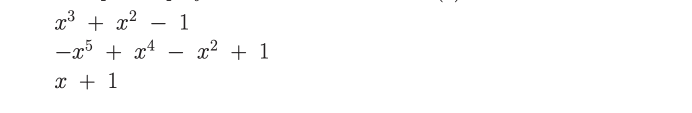
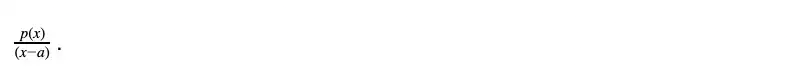

<div align="center">
    <h1>Camp 6: STARKs</h1>

|Presentation|Video|Try what you learned
|:----:|:----:|:----:|
|[September 2022](https://drive.google.com/file/d/1asONnOcSnRJwMXF-Zx1uJBdpbMrLYnmE/view?usp=sharing)|[Camp 1 (September 2022)](https://www.youtube.com/watch?v=7p60e7RzuMs)|Go hardcore with StarkWare's [STARK 101](https://starkware.co/stark-101)|

</div>

### Topics

<ol>
    <li><a href="#trust">Trust vs. Verification</a></li>
    <li><a href="#first_look">First Look at the STARKs</a></li>
    <li><a href="#zk_terminology">ZK Terminology</a></li>
    <li><a href="#zk">Zero Knowledge</a></li>
    <li><a href="#modular_arithmetic">Modular Arithmetic</a></li>
    <li><a href="#finite_fields">Finite Field Arithmetic</a></li>
    <li><a href="#polynomials">Polynomials</a></li>
    <li><a href="#computational_integrity">Computational Integrity</a></li>
    <li><a href="#starks">STARKs</a></li>
</ol>


Computational Integrity (CI) is a fundamental property that underlies commerce. In simple terms, it means that the output of a certain computation is correct. CI is what allows us to trust an account balance presented to us, or the bill at a store. This Camp delves into how permissionless blockchains achieve CI without requiring trust, the dramatic price they pay for this in terms of scalability and privacy, and how STARKs can save the day.

<h2 align="center" id="trust">Trust vs. Verification</h2>

### “Old World”: Trust, or Delegated Accountability

Financial systems (banks, brokers, exchanges, etc.) need to operate with integrity to serve their societal functions. What mechanisms incentivize them to operate with integrity? The “old world” assumes trust as a proxy for integrity. We trust banks, pension funds, etc., to operate honestly. Let’s go down the rabbit hole and examine the basis for this trust, ignoring the “integrity theater” — the tall buildings and fancy suits — set to impress us. From a purely rational and utilitarian perspective, the thing that prevents the financial system from seizing all our funds is the threat of social disgrace, jail, and fines. There’s also a carrot — reputation, which attracts future customers and generates future profits. By signing on financial statements with their names, people in the “old world” stake their personal freedom, existing and future finances as a collateral for integrity, and we, the public, base our trust on this arrangement. The verification of this integrity is delegated to experts like accountants, auditors, and regulators. We will call this Delegated Accountability. It’s not a bad system: it’s been serving modern economies faithfully for quite some time.

A new variant of the “old world” approach is the Trusted Execution Environment (TEE). A trusted hardware manufacturer (like Intel) produces a physical machine (like the SGX chip) that cannot deviate from the specified computation and signs correct states using a secret key known only to that physical machine. Integrity is now based on trust in the hardware and its manufacturer and on the assumption that it is impossible to extract secret keys from such physical devices.

“New World”: Verify, or Inclusive Accountability
Blockchains offer a more direct way to reach integrity, captured by the motto “Don’t Trust, Verify”. This “new world” does not require an integrity theater, it doesn’t rely on accountants, nor do its developers and network maintainers stake their personal freedom to gain public trust. Integrity is guaranteed by Inclusive Accountability: a node with a standard computational setup (a web-connected laptop) should be able to verify the integrity of all transactions in the system.

The prevalent method to verify CI in permissionless blockchains is via naive replay: all nodes are asked to re-execute (replay) the computations that verify each and every transaction. Inclusive Accountability, in this naive form, leads to two immediate challenges:

* **Privacy**: If everyone gets to inspect all transactions then privacy might be compromised. The absence of privacy deters businesses, as it means sensitive information may not remain proprietary. It also deters individuals, as it erodes [human dignity](https://en.wikipedia.org/wiki/The_Right_to_Privacy_(article)).

* **Scalability**: Demanding that the system be accountable to a standard laptop means it cannot scale up by simply moving to bigger computers and larger bandwidth. This leads to a severe bound on the throughput of the system.

Proofs systems (discussed next) are an excellent solution to both challenges. Zero Knowledge (ZK) proof systems are by now an established tool to address privacy in blockchains and explained excellently in several posts of Zcash (see [this](https://z.cash/blog/shielded-ecosystem/), [this](https://z.cash/technology/) and [this](https://z.cash/technology/zksnarks/)). 

Let's review an example for a CI statement (the claim that the output of a certain computation is correct): the total sum we should pay at the supermarket was computed correctly. The conventional proof for this particular statement is the receipt. Typically, the items in the receipt are listed with their prices, and the total sum is indicated at the bottom, like so:

<div align="center">
    
</div>

For simplicity — we only consider this to be a statement that the summation is correct. To see whether this CI statement holds, one can go over the list — not skipping any item — to compute the total sum, and check it against the number at the bottom of the receipt. This is a very naive example, but we’ll use it further down this article to demonstrate the idea of *succinct testability*.


### Proof Systems
Proof Systems started with the introduction of the [Interactive Proof](https://en.wikipedia.org/wiki/Interactive_proof_system) (IP) model by Goldwasser, Micali, and Rackoff in 1985. Interactive proofs are protocols that involve two kinds of entities: a prover and a verifier, who interact over a number of rounds by sending messages. The prover and verifier have conflicting objectives: the prover wants to convince the verifier of the integrity of a certain computation, and the verifier is a suspicious gatekeeper entrusted by the public with the task of distinguishing between truisms and falsities. The prover and verifier communicate interactively, taking turns in sending messages to one another. These messages depend on the statement being proved, on prior messages, and may also use some randomness. On the prover side, randomness is used to achieve zero knowledge and on the verifier side randomness is needed to generate queries to the prover. At the end of the interactive process the verifier outputs a decision, to either accept the new state or reject it.

A good analogy is the examination process practiced in a court of law when one party submits a claim and its counterparty questions its validity. For the claim to be accepted as true, the answers provided by the claimant (prover) to the examiner’s (verifier’s) queries must be consistent and valid. The examination process is expected to expose any mismatch between a statement and reality, and thus expose it as false.

We say that a proof system *solves* CI if when updating the system from state A to state B, the following properties hold:

* **Completeness**: If the prover indeed knows how to change the state from A to B in a valid way then the prover will manage to convince the verifier to accept the change.
* * **Soundness**: If the prover doesn’t know how to change the state from A to B, then the verifier will notice an inconsistency in the interaction and reject the suggested state transition. There remains a tiny false-positive probability, i.e., a probability of the verifier accepting an invalid proof. This probability is a system security parameter which can be set to an acceptable level like 1/(2¹²⁸), similar odds to winning the powerball five times in a row.
  
This pair of properties has a crucial implication to the principle of Inclusive Accountability discussed earlier. The verifier can accept the state transition suggested by the prover without making any assumptions about the integrity of the prover. In fact, the prover can run on faulty hardware, it can be closed source and it can be executed on a computer controlled by a malicious entity. The only thing that matters¹ is that the messages sent by the prover lead the verifier to accept the statement. If that is the case, we know that computational integrity holds.


<h2 align="center" id="first_look">First Look at the STARKs</h2>

By now there are quite a few theoretical constructions of proof systems, along with implementations. Some are deployed in cryptocurrencies, like the [SNARKs](https://z.cash/technology/zksnarks/) used by [Zerocash](http://zerocash-project.org/paper)/[Zcash](https://z.cash/), and [Bulletproofs](https://eprint.iacr.org/2017/1066) (BP) deployed in [Monero](https://ww.getmonero.org/). (For general information on proof systems go [here](https://zkp.science/).) What distinguishes [STARKs](https://eprint.iacr.org/2018/046) is the combination of the following three properties: scalability (the S in STARK), transparency (the T in STARK), and lean cryptography.

### Scalability: Exponential Speedup of Verification**

Scalability means that two efficiency properties hold simultaneously:

* **Scalable Prover**: The prover’s running time is “nearly-linear” in the time it would take a trusted computer to check CI by just re-executing the computation themselves and checking that the result matches what someone is claiming. The ratio of “overhead” (time needed to generate a proof / time needed to just run the computation) remains reasonably low.
* **Scalable Verifier**: The verifier’s running time is polynomial in the logarithm of naive replay time. In other words, the verifier’s runtime is exponentially smaller than simply replaying the computation (recall that ‘replay’ is the current blockchain method to achieve Inclusive Accountability).

<div align="center">
    
</div>

Apply this notion of scalability to a blockchain. Instead of the current mode of verification by naive replay, imagine how things will look when a blockchain moves to verification by using proof systems. Instead of simply sending the transactions to be added to the blockchain, a prover node will need to generate a proof but thanks to the Scalable Prover its running time is nearly-linear in the running time of the naive replay solution. And the Scalable Verifier will benefit from an exponential decrease in its verification time. Furthermore, as blockchain throughput scales up, most of the effect will be shouldered by the prover nodes (which could run on dedicated hardware, like miners), whereas the verifiers, which would constitute most of the nodes in the network, would hardly be affected.

Let’s consider a concrete hypothetical example, assuming verifier time (in milliseconds) scales like the square of the logarithm of the number of transactions (tx). Suppose we start with 10,000 tx/block. Then the verifier’s running time is

$VTime = (log₂ 10,000)² ~ (13.2)² ~ 177 ms$.

Now increase the blocksize a hundredfold (to 1,000,000 tx/block). The new running time of the verifier is

$VTime = (log₂ 1,000,000)² ~ 20² ~ 400 ms$.

In words, a 100x increase in transaction throughput led only to a 2.25x increase in the verifier’s running time!

In some cases, the verifier will still need to download and verify *availability of data*, which is a linear-time process, but downloading data is generally much cheaper and faster than checking its validity.

### Transparency: With Trust Toward None, with Integrity for All

Transparency means there is no trusted setup (formally, a transparent proof system is one in which all verifier messages are public random strings. Such systems are also known as [Arthur-Merlin protocols](https://en.wikipedia.org/wiki/Arthur%E2%80%93Merlin_protocol)) — there is no use of secrets in the setting up of the system. Transparency offers many benefits. It eliminates the parameter setup generation procedure which constitutes a single point of failure. The lack of a trusted setup allows even powerful entities — big corporations, monopolies and governments, which control the “old world” financial system — to prove CI and gain public acceptance of their claims because there’s no known way to forge STARK proofs of falsities, even by the most powerful of entities. On a more tactical level, it makes it much easier to deploy new tools and infrastructure and change existing ones without a need for elaborate parameter-generation ceremonies. Most importantly, transparency aligns well with the “new world” that demands Inclusive Accountability under no trust assumptions. [To paraphrase Abraham Lincoln](https://en.wikipedia.org/wiki/Abraham_Lincoln%27s_second_inaugural_address), transparent systems allow to operate with trust toward none, with integrity for all.


### Lean Cryptography: Secure & Fast
STARK has minimal cryptographic assumptions underlying its security: the existence of secure cryptographic and [collision-resistant hash functions](https://en.wikipedia.org/wiki/Collision_resistance) (this minimality of cryptographic assumptions holds for interactive STARKs (iSTARKs). Noninteractive STARKs (nSTARKs) require the Fiat-Shamir heuristic which is a different beast). Many of these primitives exist today as hardware instructions, and the lean cryptography leads to two more benefits:

* **Post-Quantum Security**: STARKs are plausibly secure against efficient quantum computers.
* **Concrete Efficiency**: For a given computation, the STARK prover is at least 10x faster than both the SNARK and Bulletproofs prover. The STARK verifier is at least 2x faster than the SNARK verifier and more than 10x faster than the Bulletproof verifier. As StarkWare continues to optimize STARKs these ratios will likely improve. However, a STARK proof length is ~100x larger than the corresponding SNARK and ~20x larger than BulletProofs.

To understand how STARKs are computed, we need to delve into the arithmetic of modular operations, finite fields, and polynomials. For this we will need to touch mathematical concepts that at first glance might seem complicated, however, you will see that it is easier than you thought.

<div align="center">
    <h2 id="modular_arithmetic">Modular Arithmetic</h2>
    <p>A system of arithmetic for integers where numbers "wrap around" when reaching a certain value (aka 'modulus')</p>
    
</div>

A real-world example of modular arithmetic is time-keeping via a clock. When the hour of the day exceed the modulus(12) we "wrap" around and begin at zero.

Example:

```bash
python3 finite_fields/python/modular_arithmetic.py
```

In other words, of an division we sometimes are more interested in the **remainder**. Here is where we use the operator named as **modulo operator** or simply **mod**. For example,  $13\bmod5 = 3$ because $\frac{13}{5}=2$ remainder $3$.

Let's go trough a couple examples:

- $-29\bmod3 = 1$

If we divide $-29$ by $3$ we get a quotient of $9$ with a remainder of $-2$; we substract $-2$ from $3$ (our modulus) to get $1$.

- $-9\bmod6 = 3$

Divide $-9$ by $6$ to get $-1$ as quotient with a remainder of $-3$. We then substract $-3$ from $6$ to get $3$ as our result.

- $7\bmod6 = 1$

Divide $7$ by $6$ to get a quotient of $1$ with a remainder of $1$, our result.

Note that the mod operator only gives positive numbers.

Modular arithmetic is the stepping stone for Fine Field Arithmetic which will take us to understand elliptic curve cryptography, which in turn, gives us the signing and verification algorithms in Ethereum. Signing and verification are key for transactions in a blockchain.


<h2 align="center" id="finite_fields">Finite Fields</h2>

Much of today's practical cryptography is based on finite fields: a finite set of numbers with two operations (addition and multiplication from which we can define subtraction and division too). 

The order or size of the field is usually called $p$ and is a prime number. This is a finite field of order $p$: $F_p =  \{0, 1, 2, ..., p–1 \}$. A finite field of order 3 would be: $F_3 =  \{0, 1, 2\}$.

A finite field cannot contain sub-fields since their order is prime. Therefore, the fine field implements the principles of modular arithmetic over a large, irreducible prime number.

Example:

```bash
python3 finite_fields/python/finite_field_arithmetic.py
```

A key property of the finite field is that if `a` and `b` are in the set, `a + b` and `a ⋅ b` should be in the set too. This is the **closed** property. Thus, if we have $F_3$ then the sum $1 + 2 = 3$ violates the closed property because $3$ is not in the set $F_3$. Something similar happens with the multiplication. 

We need to make our finite field closed under arithmetic operations as addition, substraction, multiplication and division. Here is where modular arithmetic comes in handy. Most operations with finite fields will be using modular arithmetic. We represent a finite field addition as $+_f$ to distinguish it from a simple addition. We will do the same for the symbols of other arithmetic operators.

Now, for our finite field $F_3$, $1$ $+_f$ $2$ $=$ $(1+2) \bmod 3$ $=$ $0$. Also $2$ $⋅_f$ $2$ $=$ $(2⋅2) \bmod 3$ $=$ $1$. Now we have close operations for our finite field.

What about substraction? It is the same. For a finite field $F_3$, $1$ $-_f$ $2$ $=$ $(1-2) \bmod 3$ $=$ $2$. We are basically performing modular arithmetic where the the modulo is the finite field's order. For multiplication the case is similar.

Addition, Multiplication, Exponentiation, and Substraction of fields are intuitive. However, Division of fields can be a bit challenging at the beginning. Let's begin with easy operations:
* For the finite field $F_3$, $2$ $/_f$ $2$ $=$ $(2/2) \bmod 3$ $=$ $1$. It makes sense since $2/2=1$.
* For the finite field $F_3$, $6$ $/_f$ $2$ $=$ $(0/2) \bmod 3$ $=$ $0$. It makes sense since $0/2=0$.
* For the finite field $F_3$, the operation $1$ $/_f$ $0$ $=$ $(1/0) \bmod 3$ can not be performed since we can not divide by 0.
* For the finite field $F_3$, $8$ $/_f$ $5$ $=$ $(2/2) \bmod 3$ $=$ $1$. It makes sense since $2/2=1$.

Until now eveything seems ok. However, what happens when, for the finite field $F_5$, we divide $8$ $/_f$ $4$ $=$ $(3/4) \bmod 5$? The result is not trivial.


<h2 align="center" id="finite_fields">Polynomial arithmetic</h2>

Polynomial arithmetic deals with the addition, subtraction, multiplication, and division of polynomials.

We can represent a bit pattern by a polynomial in, say, the variable $x$. Each power of $x$ in the polynomial can stand for a bit position in a bit pattern. For example, we can represent:
* the bit pattern $111$ by the polynomial $x^{2} + x + 1$;
* the bit pattern $101$ by the polynomial $x^{2} + 1$; and 
* the pattern $011$ by the polynomial $x + 1$. 
  
Since all the bits in $111$ are set, we have all powers of $x$ up to 2 in the corresponding polynomial. On the other hand, in the bit pattern $101$, the second bit is not set, so the coefficient of $x$ in the polynomial is zero, which results in the polynomial $x^{2} + 1$. Finally, in the bit pattern $011$, since only the two least significant bits are set, the polynomial becomes $x + 1$.

Representing bit patterns with polynomials will allow us to create a finite field with bit patterns.

In general, a polynomial is an expression of the form:

<div align="center">
    
</div>

for some non-negative integer $n$ and where the coefficients $a_{0}$, $a_{1}$, $...$, $a_{n}$ are drawn from some designated set $S$. $S$ is called the coefficient set. $n$ marks de degree of the polynomial. A $0$-degree polynomial is called a constant polynomial.

In reality, we do not have intentions of evaluating the value of a polynomial for a certain value of $x$. We will be dealing with finding the point at which these polynomials equal 0. 

Polynomial arithmetic is quite simple. The more complex operation is the division which is not in the scope of this tutorial for now.

<div align="center">
    
</div>

We can define several polynomials belonging to the same field. For example, for the $F_2$ field, which only contains $0$ and $1$ as members, we can generate an infinite number of polynomials without caring for the their degree. That is, the members of the field only populate the coefficients of the polynomial without caring for the exponents.


<div align="center">
    
</div>

We can follow the same logic for polynomial arithmetic operations when the coefficients belong to finite field. We just need to remember the modular nature of finite fields. As an example, let's operate with polynomals whose coefficients belong to the $F_7$ field. You will notice that we are simply using field arithmetic within the coefficients.

Addition:

<div align="center">
    
</div>

Substraction:

<div align="center">
    
</div>

Multiplication:

<div align="center">
    
</div>

Again the division case is out of the scope of this tutorial for now.

A polynomial $f(x)$ over a field $F$ is called prime or irreducible if $f(x)$ cannot be expressed as a product of two polynomials. Both polynomials have to be part of $F$ and of a lower degree than $f(x)$. That is, an irreducible polynomial as a polynomial that cannot be factorized into lower-degree polynomials.


The concept of generator, $g$, frequently appears in cryptography. A generator is an element in the subgroup whose powers span the entire subgroup. In easier words, it is a number that is capable of of generating the entire set or the entire field by exponentiating the generator. For example, for the field $Z_{13}$, a generator $g$ is $g=2$. Why? Because if we exponentiate $2$ we can get all the 13 elements in the field $Z_{13} = \{0,1,...,12\}$ (except for the 0). Notice $2^{0}\bmod13 = 1$, $2^{1}\bmod13 = 2$, $2^{2}\bmod13 = 4$, $2^{3}\bmod13 = 8$, $2^{4}\bmod13 = 3$, $2^{5}\bmod13 = 6$, and so on. Not all elements in a set can be generators, make the exercise and you will notice 3 is not a generator of the field $Z_{13}$.

More generally, note that if $g$ is the generator of a field $Z_{n}$, then $Z_{n} = \{0, g^{0}, g^{1}, ..., g^{n-2}\}$ (because by exponentiating generator $g$ we can get each element in the field).


<h2 align="center" id="trust">Arithmetization</h2>

The goal of the STARK protocol is to verify computations succinctly and transparently. It follows three steps:

1. The first step in a STARK is called *arithmetization*, and it is the translation (often referred to as ‘reduction’) of the problem of verifying a computation to the problem of checking that a certain polynomial, which can be evaluated efficiently on the verifier’s side (this is the ‘succinctly’ part), is of low degree. Arithmetization is useful since it enables the use of tools from the realm of Error Correction Codes that efficiently test low degree-ness. 

2. However, arithmetization itself only translates a Computational Integrity statement into a polynomial, setting the scene for the next phase in STARK, which is another interactive protocol that involves a prover that attempts to convince a verifier that the polynomial is indeed of low degree. The verifier is convinced that the polynomial is of low degree if and only if the original computation is correct (except for an infinitesimally small probability). 

3. In the last step of STARK, the interactive protocol is transformed into a single non-interactive proof, that can be posted to a blockchain and publicly verified by anyone.

Arithmetization itself is composed of two steps. The first is generating an execution trace and polynomial constraints, the second is transforming these two objects into a single low-degree polynomial. In terms of prover-verifier interaction, what really goes on is that the prover and the verifier agree on what the polynomial constraints are in advance. The prover then generates an execution trace, and in the subsequent interaction, the prover tries to convince the verifier that the polynomial constraints are satisfied over this execution trace, unseen by the verifier. Let's review each step.

### Step 1: Generating an execution trace and a set of polynomial constraints

The first step takes some CI statement (such as “the fifth transaction in block 7218290 is correct”), and translate it into formal algebraic language. This serves two purposes: 1) it defines the claim succinctly in an unambiguous way, and 2) it embeds the claim in an algebraic domain. This embedding is what allows the second step of arithmetization, which reduces the CI statement to a claim about the degree of a specific polynomial.

The algebraic representation that we use has two main components: 1) an execution trace, and 2) a set of polynomial constraints. The execution trace is a table that represents the steps of the underlying computation, where each row represents a single step. The set of polynomial constraints is constructed such that all of them are satisfied if and only if the trace represents a valid computation. While the execution trace may be very long, we will work with a succinct set of polynomial constraints.

The type of execution trace that we’re looking to generate must have the special trait of being succinctly testable — each row can be verified relying only on rows that are close to it in the trace, and the same verification procedure is applied to each pair of rows. This trait directly affects the size of the proof. To exemplify what we mean by being succinctly testable, let’s go back to the supermarket receipt, and add another column for the running total:

<div align="center">
    
</div>

This simple addition allows us to verify each row individually, given its previous row.

We can, for example, examine these two rows:

<div align="center">
    
</div>

We would be convinced that this particular step of the computation (i.e. the number 16.41) is correct since 12.96+3.45=16.41. Notice that the same constraint is applied to each pair of rows. This is what we mean by succinct constraints.

Let's proceed with the polynomial constraints. We rewrite the supermarket receipt (with the running total) in the form of a table:

<div align="center">
    
</div>

Denote the value of the cell in the $i$-th row and $j$-th column by $A_{i,j}$. We can now rephrase the correctness conditions as this set of polynomial constraints:

<div align="center">
    
</div>

These are linear polynomial constraints in Ai,j. If the set of polynomial constraints we use are of high degree, this has an adverse effect on the proof length and the time it takes to generate it. Consequently, linear constraints are the best we can hope for. Notice that (2) is really a single constraint applied multiple times, and the whole size of the set is independent of the length of the receipt.

In sum, we took a CI problem of verifying a supermarket receipt, and transformed it into a succinctly testable execution trace, and a corresponding set of polynomial constraints that hold if and only if the total sum in the original receipt is correct.

Let’s see a more complex example: the Collatz Conjecture.

In 1937, a German mathematician named Lothar Collatz presented a conjecture in the field of number theory. At first glance this conjecture might seem merely a cute math puzzle, but in fact it is a hard open problem in number theory. It caught the attention of many mathematicians over the years, and acquired a lot of synonyms (e.g., the $3n + 1$ conjecture, the Ulam conjecture, Kakutani’s problem and many more). Paul Erdős once said about this conjecture: “Mathematics may not be ready for such problems”.

A Collatz sequence starts with any positive integer, where each subsequent element in the sequence is obtained from the previous one as follows:

If the previous element is even: divide it by 2.
If the previous element is odd and greater than 1: multiply it by 3 and add 1.
If the previous element is 1, stop.
Let’s consider a simple example where the initial term is 52:

$52 -> 26 -> 13 -> 40 -> 20 -> 10 -> 5 -> 16 -> 8 -> 4 -> 2 -> 1$.

**Collatz Conjecture**: for any positive integer we start with, the sequence always reaches 1.

Unfortunately, resolving the Collatz Conjecture is beyond the scope of this tutorial. Instead, we will consider the problem of verifying a computation that checks the conjecture for a particular starting integer.

The Collatz Sequence Execution Trace
The CI statement is: “A Collatz sequence that starts with 52, ends with 1 after 11 iterations”.

Let A be the execution trace of the sequence’s computation. The i-th row, denoted by Ai, represents the i-th number in the sequence. All numbers are represented as binary strings, to make it easier to express the odd/even condition with polynomials. Ai,j equals to the j-th least significant bit of the i-th number of the sequence. For example, A0=001011: the first term is 52, its binary representation is 110100 and then we reverse the bits’ order (bit reversal order simplifies indexing in the polynomial constraints notation).

Here is the execution trace of the above Collatz sequence that starts with 52:

<div align="center">
    
</div>

Note that here the trace has 6 columns because 6 bits are enough to represent even the largest number in the sequence. Had we started the sequence with 51, the next number would have been 154, so the trace of such a sequence would have required at least 8 columns.

Recall that the polynomial constraints we are looking for are such that all of them are satisfied if and only if the trace A describes the given Collatz sequence (starting with 52, ending with 1, and the transition from any two consecutive rows is done correctly). In our example, the trace A is of size 6x12, i.e., it represents a Collatz sequence of 12 6-bit numbers. The set of polynomial constraints are the following ($n=12$, $m=6$):

<div align="center">
    
</div>

Let’s go over each of the constraints. The first three are straightforward:

1. holds if and only if the first row is a binary representation of 52.
2. holds if and only if the last row is a binary representation of 1.
3. holds if and only if the trace contains only bits (a number is equal to its square if and only if it is either 0 or 1).

The fourth set of constraints defines the heart of the succinct computation of the sequence, i.e., the connection between every two consecutive rows. The ability to express computational constraints as a recurring pattern of local constraints (i.e. succinctness), is fundamental to the verifier being exponentially faster than a naive replay of the computation.

Let’s examine the constraints themselves carefully.

For any $i<n-1$, denote:

<div align="center">
    
</div>

Hence, for each $i<n-1$, we get the following constraint:

<div align="center">
    
</div>

$A_{i,0}$ is the least significant bit of the $i$-th number, which determines its parity as an integer, so this constraint describes the Collatz sequence rule.

To sum up, all constraints are satisfied if and only if the trace represents a valid computation of a Collatz sequence.

Note that any Collatz sequence of length n, can be represented using a trace of size n*m where m is the maximum number of bits in the representation of a number in the sequence, and the corresponding polynomial constraints are modified accordingly. Note that the polynomial constraints do not grow with n and m, but remain simple and concise.

Given a specific first term for a Collatz sequence, a simple computer program can output the execution trace and the polynomial constraints. We have seen how a CI statement about a Collatz sequence can be transformed into an execution trace and a succinctly-described set of polynomial constraints. Similar methods can be used to transform any computation, and in general, any CI statement can be translated into this form.

The details, however, matter a great deal. While there are many ways in which an execution trace (and a set of polynomial constraints) may describe a specific computation, only a handful of them result in a small STARK proof which can be constructed efficiently. Much of the effort in StarkWare is devoted to designing reductions that lead to good polynomial constraints, which we call AIR (Algebraic Intermediate Representation), as much of the performance of our systems depends on it.

### Step 2: Transform the execution trace and the set of polynomial constraints into a single low-degree polynomial

Using a Fibonacci sequence, we will show how the prover can combine the execution trace and the polynomial constraints to obtain a polynomial that is guaranteed to be of low degree if and only if the execution trace satisfies the polynomial constraints that we started with. Moreover, we will show how the domain over which the polynomial is considered allows the verifier to evaluate it succinctly. We also briefly discuss how error correction codes play a role in STARKs.

[XXX Should we add fine fields here? We will assume familiarity with finite groups, polynomials over finite fields, and the previous posts in this series.]

Recall that our goal is to make it possible for a verifier to ask a prover a very small number of questions, and decide whether to accept or reject the proof with a guaranteed high level of accuracy. Ideally, the verifier would like to ask the prover to provide the values in a few (random) places in the execution trace, and check that the polynomial constraints hold for these places. A correct execution trace will naturally pass this test. However, it is not hard to construct a completely wrong execution trace, that violates the constraints only at a single place, and, doing so, reach a completely far and different outcome. Identifying this fault via a small number of random queries is highly improbable.

Common techniques that address similar problems are [**Error Correction Codes**](https://en.wikipedia.org/wiki/Error_detection_and_correction).

Error Correction Codes transform a set of strings, some of which may be very similar to one another, into a set of strings that are pairwise very different, by replacing the original strings with longer strings.

Interestingly, polynomials can be used to construct good error correction codes, since two polynomials of degree d, evaluated on a domain that is considerably larger than $d$, are different almost everywhere (to see this, notice that the difference between distinct degree-$d$ polynomials is a non-zero polynomial of degree $d$, hence has at most $d$ zeros). Such codes are called **Reed-Solomon** codes.

Observing that, we can extend the execution trace by thinking of it as an evaluation of a polynomial on some domain, and evaluating this same polynomial on a much larger domain. Extending in a similar fashion an incorrect execution trace, results in a vastly different string, which in turn makes it possible for the verifier to distinguish between these cases using a small number of queries.

Our plan is therefore to 1) rephrase the execution trace as a polynomial, 2) extend it to a large domain, and 3) transform that, using the polynomial constraints, into yet another polynomial that is guaranteed to be of low degree if and only if the execution trace is valid.

**Toy Example: Boolean Execution Trace**

Suppose that the CI statement in question is “The prover has a sequence of 512 numbers, all of which are either 0 or 1”, which we would like to verify by reading substantially less than 512 numbers. Let’s see what kind of execution trace and polynomial constraints express this toy example:

1. The execution trace has $512$ rows, each row containing a single cell with either zero or one in it.
2. The polynomial constraint we use here is simply $A_{ᵢ}⋅A_{ᵢ}-A_{ᵢ}=0$, where $A_{ᵢ}$ denotes the $i$-th cell in this single-column execution trace (a number is equal to its square if and only if it is either 0 or 1).

In order to rephrase this execution trace in terms of polynomials, we specify the field we will be working in — we go with $Z_{₉₆₇₆₉}$, obtained from the set of integers ${0,1,…,96768}$ with addition and multiplication modulo $96769$. Next we pick a subgroup $G$ of $Z_{₉₆₇₆₉}^{*}$ (we use $F*$ to denote the multiplicative group of $F$; the multiplicative group is obtained by omitting the zero element from the field) such that $|G|=512$, and some generator $g$ of $G$. The existence of such a subgroup is guaranteed since $512$ divides the size of this group (which is $96768$).

We now think of the elements in the execution trace as evaluations of some polynomial f(x) of degree less than 512 in the following way: the i-th cell contains the evaluation of f on the generator’s i-th power.

Formally:

<div align="center">
    
</div>

Such a polynomial of degree at most 512 can be computed by interpolation, and we then proceed to evaluate it on a much larger domain (choosing this domain’s size directly translates into the soundness error, the bigger it is — the smaller the soundness error), forming a special case of Reed-Solomon codeword.

Lastly, we use this polynomial to create another one, whose low degreeness depends on the constraint being satisfied over the execution trace.

To do so, we must go on a tangent and discuss roots of polynomials.

A basic fact about polynomials and their roots is that if $p(x)$ is a polynomial, then $p(a)=0$ for some specific value $a$, if and only if there exists a polynomial $q(x)$ such that $(x-a)q(x)=p(x)$, and $deg(p)=deg(q)+1$.

Moreover, for all $x≠a$, we can evaluate $q(x)$ by computing:

<div align="center">
    
</div>

By induction, a similar fact is true for $k$ roots. Namely, if $a_{ᵢ}$ is a root of p for all $i=0..k-1$, then there exists a polynomial $q$ of degree $deg(p)-k$, and in all but these $k$ values, it is exactly equal to:

<div align="center">
    
</div>

Rephrasing the polynomial constraint in terms of f yields the following polynomial:

<div align="center">
    
</div>

We have defined $f$ such that the roots of this expression are $1$, $g$, $g²$, $…$, $g⁵¹¹$ if and only if the cells in the execution trace are $0$ or $1$. We can define:

<div align="center">
    
</div>

And we know from the previous paragraph that there exists a polynomial of degree at most $2·deg(f)-512$ that agrees with $p$ on all $x ∉{1, g, g^{2}, …, g^{511}}$ if and only if the execution trace is indeed a list of 512 bits (i.e., 0 or 1). Note that earlier on, the prover has extended the execution trace to a larger domain, so querying for the polynomial values in that domain is well defined.

If there exists a protocol by which the prover can convince (such that the verifier is convinced if and only if the prover is not cheating) the verifier that this polynomial is of low degree, such that in it the verifier only asks for values outside the execution trace, then indeed the verifier will be convinced about the truthfulness of the CI statement only when it is true. In fact, in the next post, we will show a protocol that does exactly that, with some very small probability of error. For the time being — let’s take a look at another example, that is still simple, but not completely trivial, and see how the reduction works in that case.


**Not so trivial example: Fibonacci**

The example that we use next is that of correctly computing a Fibonacci sequence in $Z_{₉₆₇₆₉}$ to the $512$-th place. The sequence is defined formally by:

<div align="center">
    
</div>

And our claim (i.e., the CI statement) is that $a_{₅₁₁}=62215$.

We can create an execution trace for this CI statement by simply writing down all 512 numbers:

<div align="center">
    
</div>

The polynomial constraints that we use are

<div align="center">
    
</div>

Now we translate into Polynomials.

Here, too, we define a polynomial $f(x)$ of degree at most $512$, such that the elements in the execution trace are evaluations of $f$ in powers of some generator $g$.

Formally:

<div align="center">
    
</div>

Expressing the polynomial constraints in terms of $f$ instead of $A$, we get:


<div align="center">
    
</div>


Since a composition of polynomials is still a polynomial — substituting the $Aᵢ$ in the constraints with $f(gⁱ)$ still means these are polynomial constraints.

Note that 1, 2, and 4 are constraints that refer to a single value of $f$, we refer to them as boundary constraints.

The Fibonacci recurrence relation, in contrast, embodies a set of constraints over the entire execution trace, and it may be alternatively rephrased as:

<div align="center">
    
</div>

The use of a generator to index the rows of the execution trace allows us to encode the notion of “next row” as a simple algebraic relation. If x is some row in the execution trace, then $gx$ is the next row, $g²x$ is the row after that, $g⁻¹x$ is the previous row and so on.

The recurrence relation polynomial: $f(g²x)-f(gx)-f(x)$ is zero for every $x$ that indexes a row in the execution trace, except for the last two. It means that 1, $g$, $g²$, $…$, $g⁵⁰⁹$ are all roots of this recurrence relation polynomial (and it is of degree at most 510), so we can construct $q(x)$ as follows:

<div align="center">
    
</div>

In STARK lore, this is often referred to as the composition polynomial. Indeed, when the original execution trace obeys the Fibonacci recurrence relation, this expression agrees with some polynomial whose degree is at most 2 (recall that the degree of f is at most 512) on all but these 510 values: 1, $g$, $g²$, $…$, $g⁵⁰⁹$. However, the term composition polynomial is somewhat misleading, as when the execution trace does not satisfy the polynomial constraint — the evaluations of this expression differ from any low degree polynomial in many places. In other words — it is close to a low-degree polynomial if and only if the original CI is correct, which indeed was our goal.

This concludes the promised reduction, that translates the problem of checking whether certain polynomial constraints are satisfied over some execution trace, to the problem of checking whether some polynomial (known to the prover) is of low degree.

Succinctness

Having a very efficient verification technique is key to STARKs, and it can be seen as comprised of two parts — using a small number of queries, and having the verifier perform a small computation on each query. The former is achieved by error correction codes, which allow querying in very few places, and the latter we have sort of sweeped under the rug throughout this post, until now. The verifier’s work can be summed up as 1) querying the composition polynomial in random places, and 2) checking low-degreeness based on these queries. Low degreeness succinct checking will be handled in the next post, but what exactly do we mean by “querying the composition polynomial”? The avid reader may have been suspicious of this expression, and rightfully so. The prover, after all, may be malicious. When the verifier asks for the evaluation of the composition polynomial at some x, the prover may reply with the evaluation of some truly low-degree polynomial, that will pass any low-degree testing, but is not the composition polynomial.

To prevent this, the verifier explicitly queries the Fibonacci execution trace at some row w by asking for the values of $f$ in three places: $f(w)$, $f(gw)$, $f(g²w)$.

The verifier can now compute the value of the composition polynomial at w by:

<div align="center">
    
</div>

Where the numerator can be computed using the values obtained from the prover, and the denominator… well, there’s the rub (that was sweeped under the rug).

On the one hand the denominator is completely independent of the execution trace, so the verifier can compute it before ever communicating with the prover.

On the other hand, in practicality — the trace may be comprised of hundreds of thousands of rows, and computing the denominator would cost the verifier dearly in running time.

Here’s where the arithmetization is crucial to succinctness — since calculating this expression for the special case where the powers of g form a subgroup can be done very efficiently if one notices that:

<div align="center">
    
</div>

This equality is true because both sides are polynomials of degree $|G|$ whose roots are exactly the elements of $G$.

Computing the right hand side of this equation seems to require a number of operations that is linear in $|G|$. However, if we resort to [exponentiation by squaring](https://en.wikipedia.org/wiki/Exponentiation_by_squaring), the left hand side of this equation can be computed in running time that is logarithmic in $|G|$.

And the actual denominator of the Fibonacci composition polynomial in question can be obtained by rewriting it as:

<div align="center">
    
</div>

This seeming technicality stands at the core of the verifier being able to run in polylogarithmic time, and it is enabled only because we view the execution trace as evaluations of a polynomial over some subgroup of the field, and that the polynomial constraints in question hold over a subgroup.

Similar tricks can be applied for more sophisticated execution traces, but it is crucial that the repeating pattern of the constraint coincides with some subgroup of the field.

More Constraints, More Columns!

The examples in this post were deliberately simple, to highlight key aspects of arithmetization. A natural question that arises will be: how is the case of multiple columns and multiple constraints handled. The answer is straightforward: multiple columns simply mean that there’s more than one polynomial to work with, and multiple composition polynomials — resulting from the multiple constraints — are combined into a single polynomial, a random linear combination of all of them, for the sake of the last phase in STARK, which is a low degree test. With high probability, the linear combination is of low degree if and only if so are all of its components.

We have shown how, given an execution trace and constraint polynomials, the prover can construct a polynomial which is of low degree if and only if the original CI statement holds. Furthermore, we have shown how the verifier can query the values of this polynomial efficiently, making sure that the prover did not replace the true polynomial with some false low-degree one.

Next we will go into the details of low-degree testing, showing how this magic, of querying a small number of values and determining whether some polynomial is of low degree, is done.


<h2 align="center" id="finite_fields">Low Degree Testing: The Secret Sauce of Succinctness</h2>

The process of Arithmetization enabled us to reduce the CI problem to a low degree testing problem. Low degree testing refers to the problem of deciding whether a given function is a polynomial of some bounded degree, by making only a small number of queries to the function. Low degree testing has been studied for more than two decades, and is a central tool in the theory of probabilistic proofs. The goal of this blog post is to explain low degree testing in more detail, and to describe FRI, the protocol that we use for low degree testing in STARK. This post assumes familiarity with polynomials over finite fields.

Before we discuss low-degree testing, we first present a slightly simpler problem as a warm-up: We are given a function and are asked to decide whether this function is equal to some polynomial of degree less than some constant d, by querying the function at a “small” number of locations. Formally, given a subset L of a field F and a degree bound d, we wish to determine if $f:L➝F$ is equal to a polynomial of degree less than $d$, namely, if there exists a polynomial

<div align="center">
    
</div>

over $F$ for which $p(a) = f(a)$ for every $a$ in $L$. For concrete values, you may think of a field of size which is very large, say $2¹²⁸$, and $L$ which is of size approximately 10,000,000.

Solving this problem requires querying $f$ at the entire domain $L$, as f might agree with a polynomial everywhere in $L$ except for a single location. Even if we allow a constant probability of error, the number of queries will still be linear in the size of $L$.

For this reason, the problem of low degree testing actually refers to an approximate relaxation of the above problem, which suffices for constructing probabilistic proofs and also can be solved with a number of queries which is logarithmic in $|L|$ (note that if $L≈10,000,000$, then $log₂(L)≈23)$. In more detail, we wish to distinguish between the following two cases.

* **The function $f$ is equal to a low degree polynomial**. Namely, there exists a polynomial $p(x)$ over $F$, of degree less than $d$, that agrees with $f$ everywhere on $L$.
* **The function $f$ is far from ALL low degree polynomials**. For example, we need to modify at least 10% of the values of $f$ before we obtain a function that agrees with a polynomial of degree less than $d$.

Note that there is another possibility — the function $f$ may be mildly close to a low degree polynomial, yet not equal to one. For example, a function in which $5%$ of the values differ from a low-degree polynomial does not fall in either of the two cases described above. However, the prior arithmetization step (discussed in our previous posts) ensures the third case never arises. In more detail, arithmetization shows that an honest prover dealing with a true statement will land in the first case, whereas a (possibly malicious) prover attempting to “prove” a false claim will land, with high probability, in the second case.

In order to distinguish the two cases, we will use a probabilistic polynomial-time test that queries f at a small number of locations (we discuss what “small” means later).

This paragraph is optional for understanding the big picture. If $f$ is indeed low degree, then the test should accept with probability 1. If instead f is far from low degree, then the test should reject with high probability. More generally, we seek the guarantee that if f is $δ-far$ from any function of degree less than d (i.e., one must modify at least $δ|L|$ locations to obtain a polynomial of degree less than d), then the test rejects with probability at least $Ω(δ)$ (or some other “nice” function of $δ$). Intuitively, the closer $δ$ is to zero, the more difficult it is to distinguish between the two cases.

In the next few sections we describe a simple test, then explain why it does not suffice in our setting, and finally we describe a more complex test that is exponentially more efficient. This latter test is the one that we use in STARK.

### The Direct Test

The first test we consider is a simple one: it tests whether a function is (close to) a polynomial of degree less than $d$, using $d+1$ queries. The test relies on a basic fact about polynomials: any polynomial of degree less than d is fully determined by its values at any d distinct locations of $F$. This fact is a direct consequence of the fact that a polynomial of degree $k$ can have at most $k$ roots in $F$. Importantly, the number of queries, which is $d+1$, can be significantly less than the size of the domain of $f$, which is $|L|$.

We first discuss two simple special cases, to build intuition for how the test will work in the general case.

* **The case of a constant function $(d=1)$.** This corresponds to the problem of distinguishing between the case where $f$ is a constant function ($f(x)=c$ for some $c$ in $F$), and the case where $f$ is far from any constant function. In this special case there is a natural 2-query test that might work: query $f$ at a fixed location $z1$ and also at a random location $w$, and then check that $f(z1)=f(w)$. Intuitively, $f(z1)$ determines the (alleged) constant value of $f$, and $f(w)$ tests whether all of $f$ is close to this constant value or not.
* **The case of a linear function $(d=2)$.** This corresponds to the problem of distinguishing between the case where $f$ is a linear function ($f(x)=ax+b$ for some $a$,$b$ in $F$), and the case where $f$ is far from any linear function. In this special case there is a natural 3-query test that might work: query f at two fixed locations z1,z2 and also at a random location $w$, and then check that ($z1$,$f(z1)$), ($z2$,$f(z2)$), ($w$,$f(w)$) are collinear, namely, we can draw a line through these points. Intuitively, the values of $f(z1)$ and $f(z2)$ determine the (alleged) line, and $f(w)$ tests whether all of $f$ is close to this line or not.

The above special cases suggest a test for the general case of a degree bound $d$. Query $f$ at $d$ fixed locations $z1$,$z2$,$…$,$zd$ and also at a random location $w$. The values of $f$ at $z0$,$z1$,$…$,$zd$ define a unique polynomial $h(x)$ of degree less than $d$ over $F$ that agrees with $f$ at these points. The test then checks that $h(w)=f(w)$. We call this the direct test.

By definition, if $f(x)$ is equal to a polynomial $p(x)$ of degree less than $d$, then $h(x)$ will be identical to $p(x)$ and thus the direct test passes with probability 1. This property is called “perfect completeness”, and it means that this test has only 1-sided error.

We are left to argue what happens if $f$ is $δ$-far from any function of degree less than $d$. (For example, think of $δ=10%$.) We now argue that, in this case, the direct test rejects with probability at least δ. Indeed, let 𝞵 be the probability, over a random choice of w, that $h(w)≠f(w)$. Observe that $𝞵$ must be at least δ. Optional: This is because if we assume towards contradiction that 𝞵 is smaller than δ, then we deduce that f is δ-close to h, which contradicts our assumption that f is δ-far from any function of degree less than d.

### The Direct Test Does Not Suffice For Us

In our setting we are interested in testing functions f:L➝F that encode computation traces, and hence whose degree d (and domain L) are quite large. Merely running the direct test, which makes d+1 queries, would be too expensive. In order to gain the exponential savings of STARK (in verification time compared to the size of the computation trace), we need to solve this problem with only O(log d) queries, which is exponentially less than the degree bound d.

This, unfortunately, is impossible because if we query f at less than d+1 locations then we cannot conclude anything.

Optional: One way to see this is to consider two different distributions of functions f:L➝F. In one distribution we uniformly pick a polynomial of degree exactly d and evaluate it on L. In the other distribution we uniformly pick a polynomial of degree less than d and evaluate it on L. In both cases, for any d locations z1,z2,…,zd, the values f(z1),f(z2),…,f(zd) are uniformly and independently distributed. (We leave this fact as an exercise for the reader.) This implies that information-theoretically we cannot tell these two cases apart, even though a test would be required to (since polynomials from the first distribution should be accepted by the test while those of degree exactly d are very far from all polynomials of degree less than d, and thus should be rejected).

We seem to have a difficult challenge to overcome.

### A Prover Comes to the Rescue

We have seen that we need d+1 queries to test that a function f:L➝F is close to a polynomial of degree less than d, but we cannot afford this many queries. We avoid this limitation by considering a slightly different setting, which suffices for us. Namely, we consider the problem of low degree testing when a prover is available to supply useful auxiliary information about the function f. We will see that in this “prover-aided” setting of low-degree testing we can achieve an exponential improvement in the number of queries, to O(log d).

In more detail, we consider a protocol conducted between a prover and a verifier, wherein the (untrusted) prover tries to convince the verifier that the function is of low degree. On the one hand, the prover knows the entire function f being tested. On the other hand, the verifier can query the function f at a small number of locations, and is willing to receive help from the prover, but does NOT trust the prover to be honest. This means that the prover may cheat and not follow the protocol. However, if the prover does cheat, the verifier has the liberty to “reject”, regardless of whether the function f is of low degree or not. The important point here is that the verifier will not be convinced that f is of low degree unless this is true.

Note that the direct test described above is simply the special case of a protocol in which the prover does nothing, and the verifier tests the function unassisted. To do better than the direct test we will need to leverage the help of the prover in some meaningful way.

Throughout the protocol the prover will want to enable the verifier to query auxiliary functions on locations of the verifier’s choice. This can be achieved via commitments, a mechanism that we will discuss in a future blog post. For now it suffices to say that the prover can commit to a function of its choice via a Merkle tree, and subsequently the verifier can request the prover to reveal any set of locations of the committed function. The main property of this commitment mechanism is that once the prover commits to a function, it must reveal the correct values and cannot cheat (for example, it cannot decide what the values of the function are after seeing the requests from the verifier).

### Halving the number of queries for the case of two polynomials

Let’s start with a simple example that illustrates how a prover can help to reduce the number of queries by a factor of 2. We will later build on this example. Suppose that we have two polynomials f and g and we want to test that they are both of degree less than d. If we simply run the direct test individually on f and g then we would need to make 2 * (d + 1) queries. Below we describe how with the help of a prover we can reduce the number of queries to (d + 1) plus a smaller-order term.

First, the verifier samples a random value 𝛼 from the field and sends it to the prover. Next, the prover replies by committing to the evaluation on the domain L (recall that L is the domain of the function f) of the polynomial h(x) = f(x) + 𝛼 g(x) (in other words, the prover will compute and send the root of a Merkle tree whose leaves are the values of h on L). The verifier now tests that h has degree less than d, via the direct test, which requires d+1 queries.

Intuitively, if f or g has degree at least d, then with high probability so does h. For example, consider the case where the coefficient of xⁿ in f is not zero for some n≥d. Then, there is at most one choice of 𝛼 (sent by the verifier) for which the coefficient of xⁿ in h is zero, which means that the probability that h has degree less than d is roughly 1/|F|. If the field is large enough (say, |F|>2¹²⁸), the probability of error is negligible.

The situation, however, is not this simple. The reason is that, as we explained, we cannot literally check that h is a polynomial of degree less than d. Instead we only can check that h is close to such a polynomial. This means that the analysis above is not accurate. Is it possible that f will be far from a low degree polynomial and the linear combination h will be close to one with a non-negligible probability over 𝛼? Under mild conditions the answer is no (which is what we want), but it is outside the scope for this post; we refer the interested reader to [this paper](https://acmccs.github.io/papers/p2087-amesA.pdf) and [this paper](https://eccc.weizmann.ac.il/report/2017/134/).

Moreover, how does the verifier know that the polynomial h sent by the prover has the form f(x)+𝛼 g(x)? A malicious prover may cheat by sending a polynomial which is indeed of low degree, but is different from the linear combination that the verifier asked for. If we already know that h is close to a low degree polynomial, then testing that this low degree polynomial has the correct form is straightforward: the verifier samples a location z in L at random, queries f, g, h at z, and checks that the equation h(z)=f(z)+𝛼 g(z) holds. This test should be repeated multiple times to increase accuracy of the test, but the error shrinks exponentially with the number of samples we make. Hence this step increases the number of queries (which so far was d+1) only by a smaller-order term.

### Splitting a polynomial into two smaller-degree polynomials

We saw that, with the prover’s help, we can test that two polynomials are of degree less than d with less than 2*(d+1) queries. We now describe how we can turn one polynomial of degree less than d into two polynomials of degree less than d/2.

Let f(x) be a polynomial of degree less than d and assume that d is even (in our setting this comes without loss of generality). We can write f(x)=g(x²)+xh(x²) for two polynomials g(x) and h(x) of degree less than d/2. Indeed, we can let g(x) be the polynomial obtained from the even coefficients of f(x), and h(x) be the polynomial obtained from the odd coefficients of f(x). For example, if d=6 we can write

<div align="center">
    
</div>

which means that

<div align="center">
    
</div>

and

<div align="center">
    
</div>


which is an n*log(n) algorithm for polynomial evaluation (improving over the naive n2 algorithm).


<h2 align="center" id="finite_fields">The FRI Protocol</h2>

We now combine the two above ideas (testing two polynomials with half the queries, and splitting a polynomial into two smaller ones) into a protocol that only uses O(log d) queries to test that a function f has (more precisely, is close to a function of) degree less than d. This protocol is known as FRI (which stands for Fast Reed — Solomon Interactive Oracle Proof of Proximity), and the interested reader can read more about it [here](https://eccc.weizmann.ac.il/report/2017/134/). For simplicity, below we assume that d is a power of 2. The protocol consists of two phases: a commit phase and a query phase.

### Commit phase
The prover splits the original polynomial f₀(x)=f(x) into two polynomials of degree less than d/2, g₀(x) and h₀(x), satisfying f₀(x)=g₀(x²)+xh₀(x²). The verifier samples a random value 𝛼₀, sends it to the prover, and asks the prover to commit to the polynomial f₁(x)=g₀(x) + 𝛼₀h₀(x). Note that f₁(x) is of degree less than d/2.

We can continue recursively by splitting f₁(x) into g₁(x) and h₁(x), then choosing a value 𝛼₁, constructing f₂(x) and so on. Each time, the degree of the polynomial is halved. Hence, after log(d) steps we are left with a constant polynomial, and the prover can simply send the constant value to the verifier.

A note about the domains: for the above protocol to work, we need the property that for every z in the domain L, it holds that -z is also in L. Moreover, the commitment on f₁(x) will not be over L but over L²={x²: x ∊ L}. Since we iteratively apply the FRI step, L² will also have to satisfy the {z, -z} property, and so on. These natural algebraic requirements are easily satisfied via natural choices of domains L (say, a multiplicative subgroup whose size is a power of 2), and in fact coincide with those that we anyways need in order to benefit from efficient FFT algorithms (which are used elsewhere in STARK, e.g., to encode execution traces).

### Query phase
We now have to check that the prover did not cheat. The verifier samples a random z in L and queries f₀(z) and f₀(-z). These two values suffice to determine the values of g₀(z²) and h₀(z²), as can be seen by the following two linear equations in the two “variables” g₀(z²) and h₀(z²):

<div align="center">
    
</div>

The verifier can solve this system of equations and deduce the values of g₀(z²) and h₀(z²). It follows that it can compute the value of f₁(z²) which is a linear combination of the two. Now the verifier queries f₁(z²) and makes sure that it is equal to the value computed above. This serves as an indication that the commitment to f₁(x), which was sent by the prover in the commit phase, is indeed the correct one. The verifier may continue, by querying f₁(-z²) (recall that (-z²)∊ L² and that the commitment on f₁(x) was given on L²) and deduce from it f₂(z⁴).

The verifier continues in this way until it uses all these queries to finally deduce the value of f_{log d}(z) (denoting f with a subscript log d, that we can’t write due to Medium’s lack of support for fully fledged mathematical notation). But, recall that f_{log d}(z) is a constant polynomial whose constant value was sent by the prover in the commit phase, prior to choosing z. The verifier should check that the value sent by the prover is indeed equal to the value that the verifier computed from the queries to the previous functions.

Overall, the number of queries is only logarithmic in the degree bound d.

Optional: To get a feeling why the prover cannot cheat, consider the toy problem where f₀ is zero on 90% of the pairs of the form {z,-z}, i.e., f₀(z) = f₀(-z) = 0 (call these the “good” pairs), and non-zero on the remaining 10% (the “bad” pairs). With probability 10% the randomly selected z falls in a bad pair. Note that only one 𝛼 will lead to f₁(z²)=0, and the rest will lead to f₁(z²)≠0. If the prover cheats on the value of f₁(z²), it will be caught, so we assume otherwise. Thus, with a high probability (f₁(z²), f₁(-z²)) will also be a bad pair in the next layer (the value of f₁(-z²) is not important as f₁(z²)≠0). This continues until the last layer where the value will be non-zero with high probability.

On the other hand, since we started with a function with 90% zeros, it is unlikely that the prover will be able to get close to a low degree polynomial other than the zero polynomial (we will not prove this fact here). In particular, this implies that the prover must send 0 as the value of the last layer. But then, the verifier has a probability of roughly 10% to catch the prover. This was only an informal argument, the interested reader may find a rigorous proof [here](https://eccc.weizmann.ac.il/report/2017/134/).

In the test described so far (and the above analysis) the probability that the verifier catches a malicious prover is only 10%. In other words the error probability is 90%. This can be exponentially improved by repeating the above query phase for a few independently sampled z’s. For example, by choosing 850 z’s, we get an error probability of 2^{-128} which is practically zero.

In summary, the direct solution (test) requires too many queries to achieve the succinctness required by STARK. To attain logarithmic query complexity, we use an interactive protocol called FRI, in which the prover adds more information in order to convince the verifier that the function is indeed of low degree. Crucially, FRI enables the verifier to solve the low-degree testing problem with a number of queries (and rounds of interaction) that is logarithmic in the prescribed degree.


<h2 align="center" id="finite_fields">ZK Terminology</h2>

**Zero Knowledge Proof System**: A proof system in which there is secret information known to the prover and not known to the verifier, and the verifier is still convinced of the computational claim without learning any information about the inputs or secrets.

**Interactive Proof System**: An abstract machine that models computation between two parties; a prover and a verifier. Messages are sent BIDIRECTIONALLY until the verifier is convinced. In other words, the prover is trying to convince the verifier, while it queries back to the prover. They have multiple rounds of communication in the proof system until the verifier is finally convinced of the claim.

**Non-Interactive Proof System**: An abstract machine that models computation between two parties: a prover and a verifier. Messages are sent UNIDIRECTIONALLY until the verifier is convinced. In other words, there is a one-way communication from the prover to the verifier. Both SNARKs and STARKs fall in this category.

**Succinct**: A proof system in which the verifier can run an order of magnitude faster than a naive re-execution of the program. This is key. It enables scalability in validity rollups. 

**SNARKs**: Succinct Non-Interactive Arguments of Knowledge.

**STARKs**: Scalable Transparent Arguments of Knowledge.

<h2 align="center" id="zk">Zero Knowledge</h2>

A party (P) executing a computation (C) on a dataset (D) may have incentive to misreport the correct output (C(D)), raising the problem of computational integrity (CI) (also known as delegation of computation, certified computation, and verifiable computation). That is, ensuring that P indeed reports C(D) rather than an output more favorable to P. 

When the dataset D is public, any party (V) interested in verifying CI can re-execute C on D and compare its output to that reported by P, as a customer might inspect a restaurant bill, or as a new Ethereum node will verify its blockchain.  This solution does not scale because the time spent by the verifier (TV) is as large as the time required to execute the program (TC) and V must read the full dataset D. Thus, the computational integrity solution we seek should have scalable verification.

Additionally, when the dataset D contains confidential data, the previous solution can no longer be implemented and the
party P in charge of D may conceal violations of computational integrity under the veil of secrecy.

Zero knowledge (ZK) proof and argument systems are automated protocols that guarantee computational integrity over confidential data for any efficient computation, eliminating corruptibility (possibly of auditors) and reducing costs. A ZK system S for a computation C is a pair of randomized algorithms, S = (P, V); the prover P is the algorithm used to prove computational integrity and the verifier V checks such proofs. Ideally we want the proof to be succint: the proof should be quicker to verify than than computing it.

The completeness and soundness of S imply that P can efficiently prove all truisms but will fail to convince V of any falsities (with all but negligible probability). 

<h2 align="center" id="starks">SNARKs</h2>

SNARK means Succinct Non-interactive Argument of Knowledge. They were pushed by a 2012 paper from [Alessandro Chiesa et. al.](https://dl.acm.org/doi/10.1145/2090236.2090263). Alessandro is Co-Founder and Scientific Advisor at StarkWare.  SNARKs use elliptic curves to secure the randomness required for a proof. Elliptic curves are collision resistant, which means that it is very hard to find two separate inputs that produce the same output ([pseudotheos, 2022](https://pseudotheos.mirror.xyz/_LAi4cCFz2gaC-3WgNmri1eTvckA32L7v31A8saJvqg)). 

The main limitations of SNARKs are:
1. No post-quantum resistance.
2. Initial trust requirements.

<h2 align="center" id="starks">STARKS: The newer and shinier cousin of SNARKs</h2>

> [Vitalik (2017)](https://vitalik.ca/general/2017/11/09/starks_part_1.html) - "What you might not know is that ZK-SNARKs have a newer, shinier cousin: ZK-STARKs."

STARKs were introduced in 2018 in a [paper by Eli Ben-Sasson et. al.](https://eprint.iacr.org/2018/046.pdf). Eli is Co-Founder of StarkWare. That is right, StarkWare was founded by the some of the creators of both SNARKs and STARKs.

The main difference between SNARKs and STARKs is that a STARK uses collision resistant hash functions instead of elliptic curves. These are much simpler cryptographic assumptions. STARKs rely purely on hashes and information theory; meaning that they are secure against attackers with quantum computers ([Vitalik, 2017](https://vitalik.ca/general/2017/11/09/starks_part_1.html)). 

What is the downside? Mainly that proof sizes go uo from 288 bytes, in SNARKs case, to a few hundred kilobytes. The tradeoff could be worth it or not. Authors suggest it could be worth it because it  This tradeoff is worth STARKs allow us to have a much higher effective TPS and throughput than a SNARK ([pseudotheos, 2022](https://pseudotheos.mirror.xyz/_LAi4cCFz2gaC-3WgNmri1eTvckA32L7v31A8saJvqg)), and if elliptic curves break or when quantum computers come around ([Vitalik, 2017](https://vitalik.ca/general/2017/11/09/starks_part_1.html)).

"With the T standing for "transparent", ZK-STARKs resolve one of the primary weaknesses of ZK-SNARKs, its reliance on a 'trusted setup´." [(Vitalik 2017)](https://vitalik.ca/general/2017/11/09/starks_part_1.html). 

Probabistically Checkable Proofs.

When polling an election, the margin of error is independent from the sample size. That is, the sample size is what determines the margin of error and not the population size. The image below exemplifies this fact. 

<div align="center">
    <h2 id="modular_arithmetic">Margin of error</h2>
    <p>The margin of error does not depend on the size of the population.</p>
    
</div>

The same principle holds for mathematical proofs and for validating the integrity of a computation. If you want to sample a computation of a proof and know to a high degree of certainty (and a small margin of error) whether this computation was done with integrity (i.e. the proof is correct), the margin of error only depends on the sample size and not on how long or complicated the computation of proof is. This is huge: you can cjheck the validity of any proof (the integrity of any computation) by reading only a small number of bits of it. In other words, the computation size does not matter, what matter is the number of bits you sample. 

This has implications for scalability. A single reliable smart contract in Ethereum monitors the operation of a very large computer, the prover, the processor of StarkNet transactions. We do not care at all if that super computer is on top of unreliable sofware or untested hardware. All we have to do is trust the smart contract! 

This was already discovered since the 1990s, however, it was not implemented because the computation to create a proof that could be verified efficiently was too hard. However, Eli Ben-Sasson and other scientists worked on the problem to create smaller and smaller proofs


<h2 align="center" id="starks">STARK Proofs</h2>


<h2 align="center" id="curves">Low degree extension</h2>

The computation is going to be the actial fibonacci sequence. That is, the naive computation. We are going to take it into the domain of arithmetic constraints, which are themselves in the world of polynomials. Polynomials are just numbers. When we use polynomails in conjunction to finite fields, we can use the finite field arithmetic on the polynomials. This conjunction enables this cryptography.

How do we get into polynomials? It is thanks to the low degree extension concept. We generate an input (called the trace); in this case, if we were to write every single value in the fibonacci sequence.


<h2 align="center" id="curves">Elliptic curves (optional)</h2>

Elliptic curve cryptography is key for blockchains. We can use what we learned from finite fields and what we are going to learn with elliptic curves to understand elliptic curve cryptography.

An elliptic cirve is nothing more than equation. The simplest one is $y^{2} = x^{3} + ax + b$ (image obtained from the book Programming Bitcoin, 2019):

<div align="center">
    
</div>

The elliptic curve used in Bitcoin and Ethereum L1 is called secp256k1: $y^{2} = x^{3} + 7$. That means that $a = 0$. It looks like this:

<div align="center">
    
</div>


<h2 align="center" id="polynomials">Polynomials</h2>

`Polynomials` have properties that are very useful in [ZK proofs](https://www.youtube.com/watch?v=iAaSQfZ-2AM). A polynomial is an expression of more than two algebraic terms. The degree of a polynomial is the highest degree of any specific term.

For an example of how Polynomials can be built and expressed in code run:

```bash
python3 finite_fields/python/polynomial.py
```

<h2 align="center" id="zk_terminology">ZK Terminology</h2>

Zero Knowledge Proof Systems are proof systems in which there is secret information known to the `prover` that is not known to the `verifier`, and the verifier is still convinced of the computational claim.

A `non-interactive` proof system is an abstract machine that models computation between the two parties(prover and verifier). Messages are sent in [one direction](https://www.youtube.com/watch?v=QJO3ROT-A4E) until the verifier is convinced of the computational claim.

A `succinct` proof system is one in which the verifier can run an order of magnitute faster than a naive re-execution of the program

`SNARKS`: Succint Non-Interactive Arguments of Knowledge

`STARKs`: Scalable Transparent Arguments of Knowled


<h2 align="center" id="computational_integrity">Computational Integrity</h2>

The goal of these proof systems is to prove `computational integrity` to a verifier. Computational Integrity can be formalized as follow:

***Statement of Computational Integrity = (S0, P, T, S1)***

`S0`: Initial State
`P`: Program that changes state
`T`: Number of steps
`S1`: Final State

<h2 align="center" id="starks">STARKs</h2>

`UNDER CONSTRUCTION`:

While this section is being built we recommend reading this blog post series([1](https://medium.com/starkware/stark-math-the-journey-begins-51bd2b063c71), [2](https://medium.com/starkware/arithmetization-i-15c046390862), [3](https://medium.com/starkware/arithmetization-ii-403c3b3f4355)) on the math behind STARKs.

<hr>

<h3>Arithmetization</h3>

<h4>Low Degree Extension</h4>

<h4>Polynomial Constraints</h4>

<h4>Commitment</h4>

<h3>FRI</h3>

<h4>Commitment</h4>

<h4>Queries</h4>

<h3>Proof</h3>

<hr>

#### Sources

[<https://eprint.iacr.org/2018/046.pdf>
, <https://vitalik.ca/general/2017/11/09/starks_part_1.html>
, <https://github.com/starkware-libs/ethSTARK>
, <https://consensys.net/blog/blockchain-explained/zero-knowledge-proofs-starks-vs-snarks/>
, <https://aszepieniec.github.io/stark-anatomy/>
, <https://github.com/elibensasson/libSTARK>
, <https://eprint.iacr.org/2021/582.pdf>]
