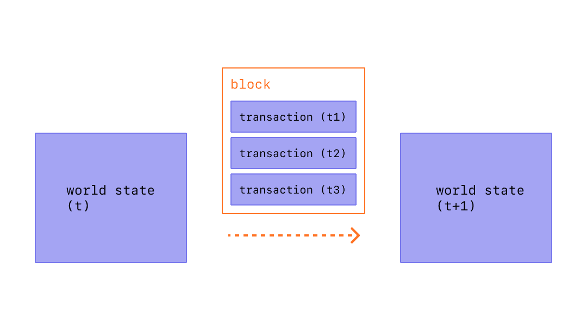

[id="blocks"]

= Blocks

In Starknet, a block consists of a list of transactions and a block header. Blocks in Starknet represent batches of transactions linked together by the hash of the preceding block in the chain. This connection of blocks forms a chain, as hashes are cryptographically generated from the block data. This structure prevents fraud, since any alteration in a historical block would invalidate all subsequent blocks, as their hashes would change. Consequently, everyone participating in the blockchain would become aware of the discrepancy.

== Block header

The following fields define the block header:

[cols="1,1,4,1",options="header"]
|===
| Name                | Type         | Description                                      | Implemented
| parent_block_hash   | FieldElement | The hash of this block’s parent                 | ✓
| block_number        | Integer      | The number (height) of this block               | ✓
| global_state_root   | FieldElement | The state commitment after this block           | ✓
| sequencer_address   | FieldElement | The Starknet address of the sequencer who created this block | ✓
| block_timestamp     | Timestamp    | The time the sequencer created this block before executing transactions | ✓
| transaction_count   | Integer      | The number of transactions in a block           | ✓
| transaction_commitment | FieldElement | A commitment to the transactions included in the block | ✓
| event_count         | Integer      | The number of events                             | ✓
| event_commitment    | FieldElement | A commitment to the events produced in this block | ✓
| protocol_version    | Integer      | The version of the Starknet protocol used when creating this block | 
| extra_data          | FieldElement | Extraneous data that might be useful for running transactions | 
|===

[NOTE]
====
The commitment fields *event_commitment* and *transaction_commitment* are the roots of a height 64 binary Merkle Patricia tree.

The leaf at index i
 corresponds to the hash of the *_i′th_*
 event for *event_commitment* and *_h(transaction hash,signature)_*
 for *invoke transaction_commitment*.

For other types of transactions, we use *h(0,0)*
.
====

== Block hash

The block hash is defined as the Pedersen hash over the header’s elements. 

Poseidon is a family of hash functions designed for being very efficient as algebraic circuits. As such, they may be very useful in ZK proving systems such as STARKs and others. 

[.formula, frame="single", options="header", background_color="#e6f3ff"]
|===
| latexmath:[h(B) = h(block\_number, global\_state\_root, sequencer\_address, block\_timestamp, transaction\_count, transaction\_commitment, event\_count, event\_commitment, 0, 0, parent\_block\_hash)]
|===

Where *_h_* is the Pedersen hash.

[NOTE]
====
Zeros inside the hash computation of an object are used as placeholders, to be replaced in the future by meaningful fields.
====
