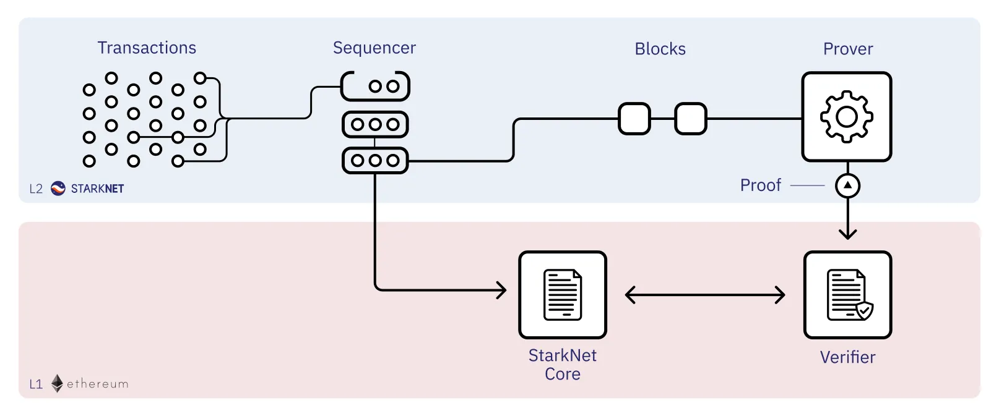

[id="sequencers"]

= Sequencers

== What does the sequencer do?
On StarkNet, after users send transactions, the first stop in the transaction’s journey to STARK scaling is the sequencers. In the StarkNet protocol, the sequencers are responsible for ordering the transactions and producing blocks. After the block is created by a sequencer, and approved by the consensus protocol, the provers take over and generate a proof for L1.

== Open-Sourcing
StarkNet Alpha launched on Mainnet in November 2021. From the outset, it was committed to share the power of STARK scaling with the world.

Today, we are releasing the first in a line of modules of the new open-source sequencer. It will take several months for all modules and sub-modules to be deployed. Open sourcing everything will enable community members to contribute to the development, and to audit the codebase.

This will edge StarkNet closer to a point of decentralized permissionless sequencing. We are now designing StarkNet’s decentralized protocol and we are encouraging the community to take part in the 
link:https://community.starknet.io/t/starknet-decentralized-protocol-iii-consensus/5386[research and the discussion].

== Performance

StarkNet’s original sequencer is largely an adaptation of StarkEx infrastructure. Now, there is a need for infrastructure that is built especially for the requirements of a decentralized highly-performant network.

Built in Rust, the new sequencer is designed and developed with performance in mind. 
link:https://medium.com/starkware/papyrus-an-open-source-starknet-full-node-396f7cd90202[The new sequencer] also builds on solid foundations: Papyrus, the new StarkNet full node, will handle state management, and cairo-rs, the new Cairo-VM by LambdaClass, will speed up the Cairo execution. We expect the new sequencer to improve upon the existing sequencer in every aspect. The throughput and latency of the network is expected to improve dramatically with the integration of this sequencer in StarkNet.

We also expect other infrastructure and development tools to be able to use the new sequencer to improve the development experience. Full node performance is expected to improve as well as all the testing frameworks.

== Summary

We are excited to announce today the new open-source sequencer. Its first module is already available for the community to review, and will be followed with more modules in the following months to come. We are also happy to take another step in our roadmap for enhancing StarkNet’s performance. We aim to make the network more efficient and accessible, and we appreciate the support of everyone who has joined us on this journey.
