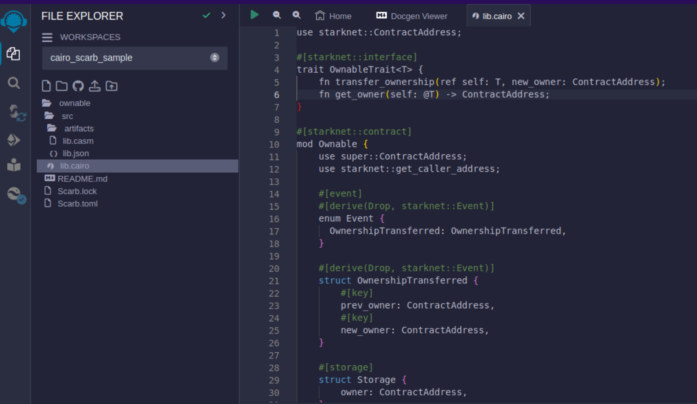

# Getting Started

Starknet is a scalable Layer-2 solution on Ethereum. This guide will walk you through the process of deploying and interacting with your first Starknet smart contract using the Cairo programming language, a language tailored for creating validity proofs that Starknet uses. For seasoned developers looking to understand the core concepts and get hands-on experience, this guide offers step-by-step instructions and essential details.

We will use the Starknet Remix Plugin to compile, deploy and interact with our smart contract. It is a great tool to get started with Starknet development.

1. Visit the [Remix IDE](https://remix.ethereum.org/) website.
2. Navigate to the `Plugin Manager` section in the bottom left corner.


3. Activate the `Starknet` plugin.


4. Accept the permissions. Click "Remember my choice" to avoid this step in the future.


5. After enabling, the Starknet logo appears on the left sidebar.


6. Then go to **settings** option and choose your cairo version. You can see, for now, the latest version that Remix supports is v2.4.0.


7. Now click on the `file explorer` tab to check the sample project details. On the `Scarb.toml` file you can find the version of this sample project.


8. Since Remix supports cairo v2.4.0, we have to update our `Scarb.toml` file to the same version.


## Clean your sample project

By default we got a sample project, however on this tutorial, we plan to show the `Ownable contract` example. To acomplish this we have to edit and delete some files and directories.

1. Rename the root directory to `ownable`. Go to your `Scarb.toml`, on [package] section, set `name` to `ownable`.
2. Delete `balance.cairo` and `forty_two.cairo` files.
3. Go to `lib.cairo` and remove all the content there. It should be empty.

At the end, your new project should look something like this.


## Introduction to Starknet Smart Contracts

The script below is a simple `Ownable` contract pattern written in Cairo for Starknet. It features:

- An ownership system.
- A method to transfer ownership.
- A method to check the current owner.
- An event notification for ownership changes.

### Cairo Example Contract

```rust
use starknet::ContractAddress;

#[starknet::interface]
trait OwnableTrait<T> {
    fn transfer_ownership(ref self: T, new_owner: ContractAddress);
    fn get_owner(self: @T) -> ContractAddress;
}

#[starknet::contract]
mod Ownable {
    use super::ContractAddress;
    use starknet::get_caller_address;

    #[event]
    #[derive(Drop, starknet::Event)]
    enum Event {
      OwnershipTransferred: OwnershipTransferred,
    }

    #[derive(Drop, starknet::Event)]
    struct OwnershipTransferred {
        #[key]
        prev_owner: ContractAddress,
        #[key]
        new_owner: ContractAddress,
    }

    #[storage]
    struct Storage {
        owner: ContractAddress,
    }

    #[constructor]
    fn constructor(ref self: ContractState, init_owner: ContractAddress) {
        self.owner.write(init_owner);
    }

    #[abi(embed_v0)]
    impl OwnableImpl of super::OwnableTrait<ContractState> {
        fn transfer_ownership(ref self: ContractState, new_owner: ContractAddress) {
            self.only_owner();
            let prev_owner = self.owner.read();
            self.owner.write(new_owner);
            self.emit(Event::OwnershipTransferred(OwnershipTransferred {
                prev_owner: prev_owner,
                new_owner: new_owner,
            }));
        }

        fn get_owner(self: @ContractState) -> ContractAddress {
            self.owner.read()
        }
    }

    #[generate_trait]
    impl PrivateMethods of PrivateMethodsTrait {
        fn only_owner(self: @ContractState) {
            let caller = get_caller_address();
            assert(caller == self.owner.read(), 'Caller is not the owner');
        }
    }
}
```

### Components Breakdown

The following is a brief description of the components in the contract. We will get into more details when we get deeper into Cairo so feel free to skip this section for now if you are not familiar with smart contract development.

1. **Dependencies and Interface**:
   - **`starknet::ContractAddress`**: Represents a Starknet contract address.
   - **`OwnableTrait`**: Specifies functions for transferring and getting ownership.
2. **Events**:
   - **`OwnershipTransferred`**: Indicates ownership change with previous and new owner details.
3. **Storage**:
   - **`Storage`**: Holds the contract's state with the current owner's address.
4. **Constructor**:
   - Initializes the contract with a starting owner.
5. **External Functions**:
   - Functions for transferring ownership and retrieving the current owner's details.
6. **Private Methods**:
   - **`only_owner`**: Validates if the caller is the current owner.

## Compilation Process

To compile using Remix:

1. **File Creation**

   - Navigate to the "File Explorer" tab in Remix.
   - Go to file named `lib.cairo` and paste the previous [code](#cairo-example-contract) into it.

2. **Compilation**

   - Navigate to the "Starknet" tab in Remix and click on `Home`.
   - In the `1 Compile` section choose `compile a single file`.
   - Click on `Compile lib.cairo`.


- Post-compilation, an "artifacts" folder emerges containing the compiled contract in two distinct formats: Sierra (JSON file) and CASM. For Starknet deployment, Remix will use the Sierra file. Do not worry about this process for now; we will cover it in detail in a later chapter. For now, Remix will handle the compilation and deployment for us.



<span class="caption">Artifacts folder after compilation</span>

## Deployment on the Development Network

To set your smart contract in motion, an initial owner must be defined. The Constructor function needs this information.

Here's a step-by-step guide to deploying your smart contract on the development network:

1. **Select the Appropriate Network**

   - In the Starknet tab, click on the top button `Remote Devnet`.

   

2. **Choose a Devnet Account**

   - Under "Devnet account selection", a list of accounts specific to the chosen devnet is presented.

   

   - Pick any account and copy its address.

3. **Declare**

   - Click on "Declare"

    

   - Post-declared, Remix's terminal will send various logs. These logs provide crucial details, including:
   - `transaction_hash`: The unique hash of the transaction. This hash can be used to track the transaction's status.
   - `class_hash`: The class hash is like the id of the definition of the smart contract.

```bash
------------------------ Declaring contract: ownable_Ownable ------------------------
{
  "transaction_hash": "0x36dabf43f4962c97cf67ba132fb520091f268e7e33477d77d01747eeb0d7b43",
  "class_hash": "0x540779cd109ad20f46cb36d8de1ce30c75469862b4dc75f2f29d1b4d1454f60"
}
---------------------- End Declaring contract: ownable_Ownable ----------------------
...
```

4. **Initiating Deployment**

   - Input the copied address into the `init_owner` variable.

   

   - Click on **"Deploy"**.

Post-deployment, Remix's terminal will send various logs. These logs provide crucial details, including:

- `transaction_hash`: The unique hash of the transaction. This hash can be used to track the transaction's status.
- `contract_address`: The address of the deployed contract. Use this address to interact with your contract.
- `data`: Contains the `init_owner` address fed to the constructor.

```bash
{
  "transaction_hash": "0x624f5b9f57e53f6b5b62e588f0f949442172b3ad5d04f0827928b4d12c2fa58",
  "contract_address": [
    "0x699952dc736661d0ed573cd2b0956c80a1602169e034fdaa3515bfbc36d6410"
  ]
    ...
  "data": [
        "0x6b0ee6f418e47408cf56c6f98261c1c5693276943be12db9597b933d363df",
         ...
      ]
    ...
}
```

By following the above process, you will successfully deploy your smart contract on the development network.

## Interaction with the Contract

With the contract now active on the development network, interaction becomes possible. Here's a guide to effectively interact with your contract on Starknet:

1. **Initiating Interaction**

   - Navigate to the "Starknet" plugin tab.
   - Select the "Interact" option.

2. **Calling the `get_owner` Function**

   - Choose the `get_owner` function. Since this function doesn't require arguments, the calldata field remains blank. (This is a read function, hence calling it is termed as a "call".)

   

   - Press the **"Call"** button. Your terminal will display the result, revealing the owner's address provided during the contract's deployment as calldata for the constructor:

```json
{
  "resp": {
    "result": [
      "0x6b0ee6f418e47408cf56c6f98261c1c5693276943be12db9597b933d363df"
    ]
  },
  "contract": "lib.cairo",
  "function": "get_owner"
}
```

This call currently doesn't spend gas because the function does not change the state of the contract.

3. **Invoking the `transfer_ownership` Function**

- Choose the **"Write"** in the interaction area. Here you can see the functions that alter the contract's state.


- In this case **`transfer_ownership`** function, which requires the new owner's address as input.
- Enter this address into the calldata field. (For this, use any address from the "Devnet account selection" listed in the Environment tab.)
- Click the **"Call"** button. The terminal then showcases the transaction hash indicating the contract's state alteration. Since we are altering the contract's state this type of interaction is called an "invoke" and needs to be signed by the account that is calling the function.

For these transactions, the terminal logs will exhibit a "status" variable, indicating the transaction's fate. If the status reads "ACCEPTED_ON_L2", the Sequencer has accepted the transaction, pending block inclusion. However, a "REJECTED" status signifies the Sequencer's disapproval, and the transaction won't feature in the upcoming block. More often than not, this transaction gains acceptance, leading to a contract state modification. On calling the **`get_owner`** function again we get this:

```json
{
  "resp": {
    "result": [
      "0x5495d56633745aa3b97bdb89c255d522e98fd2cb481974efe898560839aa472"
    ]
  },
  "contract": "lib.cairo",
  "function": "get_owner"
}
```

You've now adeptly compiled, deployed, and interacted with your inaugural Starknet smart contract. Well done!

## Deploying on Starknet Testnet

After testing your smart contract on a development network, it's time to deploy it to the Starknet Testnet. Starknet Testnet is a public platform available for everyone, ideal for testing smart contracts and collaborating with fellow developers.

First, you need to create a Starknet account.

### Smart Wallet Setup

Before deploying your smart contract to Starknet, you must handle the transaction cost. While deploying to the Starknet Goerli Testnet is free, a smart wallet account is essential. You can set up a smart wallet using either:

- [Argent](https://www.argent.xyz/argent-x/)
- [Braavos](https://braavos.app/)

Both are reliable Starknet wallets offering enhanced security and accessibility features thanks to the possibilities that the Cairo VM brings, such as Account Abstraction (keep reading the Book for more on this).

1. Install the recommended chrome/brave extension for your chosen wallet.
2. Follow your wallet provider's instructions to deploy your account.
3. Use the [Starknet Faucet](https://faucet.goerli.starknet.io/) to fund your account.
4. Deploy the account to the network. This usually takes around 10 seconds.

Once set up, you're ready to deploy your smart contracts to the Starknet Testnet.

### Deployment and Interaction

1. Follow the previous deployment steps.
2. In the 'Environment selection' tab, choose 'Wallet'.
3. Select your Starknet account and continue with deploying and interacting with your contract.


You can monitor transaction hashes and addresses using any Starknet block explorers like:

- [Starkscan](https://testnet.starkscan.co/)
- [Voyager](https://goerli.voyager.online/)
- [ViewBlock](https://viewblock.io/starknet)
- [oklink](https://www.oklink.com/starknet)

These tools provide a visual representation of transactions and contract state alterations. Notably, when you alter the contract ownership using the `transfer_ownership` function, the event emitted by the contract appears in the block explorer. It's an effective method to track contract events.

## Your Next Steps

Decide your direction from the following choices:

1. **Deepen Your Starknet Knowledge**: For an extensive grasp of Starknet's inner workings and potential use cases, delve into Chapter 3 of the Starknet Book. This chapter details Starknet’s architectural nuances. Then go ahead from there.

2. **Dive into Cairo**: If you're more attuned to coding and wish to craft Starknet contracts, then Cairo is essential. It stands as Starknet's core contract language. Begin with Chapters 1-6 of the [Cairo Book](https://book.cairo-lang.org/title-page.html), ranging from basics in _Getting Started_ to more advanced aspects such as _Enums and Pattern Matching_. Conclude by navigating to the [Starknet Smart Contracts chapter](https://book.cairo-lang.org/ch12-00-introduction-to-starknet-smart-contracts.html), ensuring you have a well-rounded understanding.
