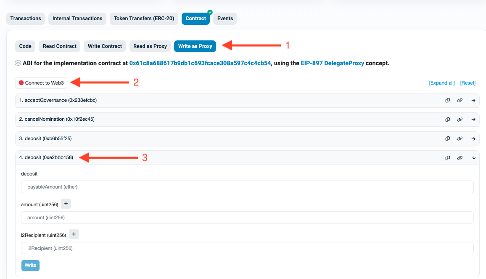
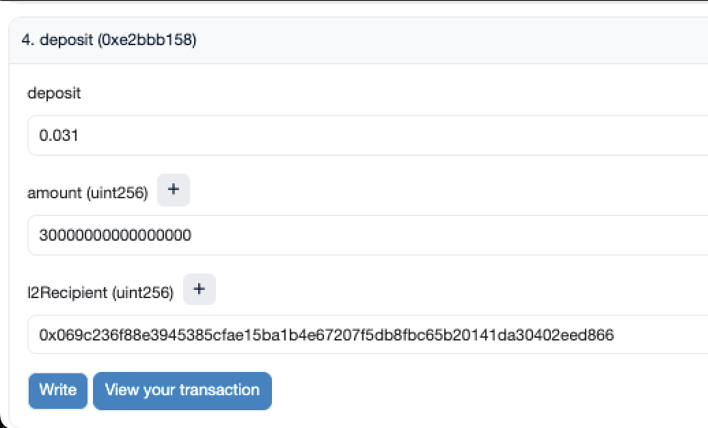

# Get started with Sepolia - Get ETH and deploy your wallet

## Overview

Currently, there are no active Sepolia faucets in Starknet. Therefore, the process of acquiring SEPOLIA tokens involves obtaining them on the **Ethereum** Sepolia testnet and then transferring them to the Starknet Sepolia testnet.

## Step 1: Obtain SEPOLIA Tokens on the Ethereum Sepolia Testnet

To acquire $ETH on the Ethereum Sepolia testnet, you can use:

1. [Alchemy's Sepolia Faucet](https://sepoliafaucet.com/).
2. [Infura's Sepolia Faucet](https://www.infura.io/faucet/sepolia).
3. [LearnWeb3's Sepolia Faucet](https://learnweb3.io/faucets/sepolia).

The process is simple: log in, paste your Ethereum Sepolia testnet address, and click the "Send me $ETH" button.

## Step 2: Transfer Your $ETH to the Starknet Sepolia Testnet

This step is slightly more complex. You will need to navigate to the [Bridge Contract](https://sepolia.etherscan.io/address/0x8453FC6Cd1bCfE8D4dFC069C400B433054d47bDc#writeProxyContract).



Connect the wallet containing your $ETH and then open function number 4 `deposit (0xe2bbb158)`.

### Parameter Specification

For the fields, specify:

- `deposit`: The amount of ETH to deposit **plus** a small amount for gas. For example, `x + 0.001 ETH`. (Ex: 0.031)
- `amount`: The amount of $ETH you want to transfer to Starknet in **uint256** format. In this case, `0.03 ETH` would be `30000000000000000` (16 decimals).

```bash
1 ETH = 1000000000000000000 (18 decimals)
```

- `l2Recipient`: The address of your Starknet Sepolia testnet account.



Click the "Write" button and confirm the transaction in your wallet.

## [Optional] Wallet Deployment

If this is your first time using your wallet on the Starknet Sepolia testnet, go to your ArgentX or Braavos wallet and send some of the ETH you transferred to **another starknet wallet**. This will automatically deploy your wallet.
