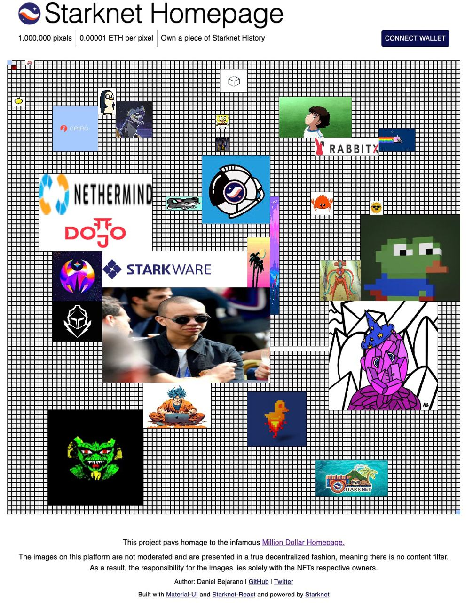
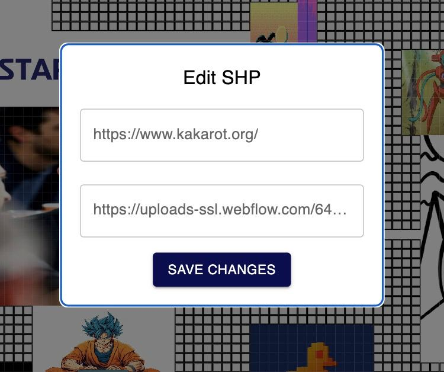

# Million Dollar Homepage

[Starknet Homepage](https://github.com/dbejarano820/starknet_homepage) is a decentralized application on the Starknet blockchain. It provides a virtual space where users can claim and personalize sections of a 100x100 grid, known as "Starknet Homepage". Each section is a 10x10 pixel area. Users can acquire these sections by minting non-fungible tokens (NFTs) and then personalizing them with images and other content.

View the live app on testnet [here](https://starknet-homepage-kappa.vercel.app/).



This initiative is an adaptation of the renowned Million Dollar Homepage and was conceived at the Starknet Summit 2023 Hacker House in Palo Alto, California. The following is a guide to understanding how this project was developed using the available tools in the ecosystem.

### Tools Utilized:

- [Starknet-react](https://github.com/apibara/starknet-react)
- [Starknet.js](https://github.com/0xs34n/starknet.js)
- [OpenZeppelin Cairo Contracts](https://github.com/OpenZeppelin/cairo-contracts)
- [MaterialUI](https://mui.com/material-ui/)

## Initial Setup

The `Starknet-react` app offers a command to initialize a Starknet app. This command sets up the foundational structure needed for a NextJS application.

```shell
npx create-starknet
```

The `StarknetConfig` component accepts a `connectors` prop, which defines wallet connection options for the user. Additionally, it can take a `defaultProvider` to set the network the application should connect to by default.

```javascript
const connectors = [
  new InjectedConnector({ options: { id: "braavos" } }),
  new InjectedConnector({ options: { id: "argentX" } }),
];
const provider = new Provider({
  sequencer: { network: constants.NetworkName.SN_GOERLI },
});
return (
  <StarknetConfig
    autoConnect
    defaultProvider={provider}
    connectors={connectors}
  >
    <CacheProvider value={emotionCache}>
      <ThemeProvider theme={theme}>
        <Component {...pageProps} />
      </ThemeProvider>
    </CacheProvider>
  </StarknetConfig>
);
```

Both `CacheProvider` and `ThemeProvider` are components that facilitate the seamless integration of MaterialUI with NextJS. For a comprehensive setup guide on these components, please refer to [this link](https://blog.logrocket.com/getting-started-with-mui-and-next-js/).

## Main Functionality

The core functionality of the Starknet Homepage centers around selecting a 4-sided region on a matrix, representing the desired 10x10 cells, and minting a token based on those cells. The responsibility of the smart contract is to validate whether the selected cells are available for minting. If a user owns Starknet Homepage tokens, they can access a dropdown to modify the token's content, including the associated image and link on the grid.

The app's primary requirements are:

- Wallet connectivity
- Grid for displaying existing tokens
- Cell selection capability
- Multicall function for token approval and minting
- Dropdown to view owned tokens
- On-chain representation of the entire 1 million pixel grid

A significant aspect to consider is the string limitation in Cairo contracts. To store links of varying sizes, they are stored as arrays of `felt252`s. The contract uses the following logic for this purpose:

```rust
impl StoreFelt252Array of Store<Array<felt252>> {
    fn read(address_domain: u32, base: StorageBaseAddress) -> SyscallResult<Array<felt252>> {
        StoreFelt252Array::read_at_offset(address_domain, base, 0)
    }
    fn write(
        address_domain: u32, base: StorageBaseAddress, value: Array<felt252>
    ) -> SyscallResult<()> {
        StoreFelt252Array::write_at_offset(address_domain, base, 0, value)
    }
    fn read_at_offset(
        address_domain: u32, base: StorageBaseAddress, mut offset: u8
    ) -> SyscallResult<Array<felt252>> {
        let mut arr: Array<felt252> = ArrayTrait::new();
        // Read the stored array's length. If the length is superior to 255, the read will fail.
        let len: u8 = Store::<u8>::read_at_offset(address_domain, base, offset)
            .expect('Storage Span too large');

        offset += 1;

        // Sequentially read all stored elements and append them to the array.
        let exit = len + offset;
        loop {
            if offset >= exit {
                break;
            }
            let value = Store::<felt252>::read_at_offset(address_domain, base, offset).unwrap();
            arr.append(value);
            offset += Store::<felt252>::size();
        };
        Result::Ok(arr)
    }
    fn write_at_offset(
        address_domain: u32, base: StorageBaseAddress, mut offset: u8, mut value: Array<felt252>
    ) -> SyscallResult<()> {
        // // Store the length of the array in the first storage slot. 255 of elements is max
        let len: u8 = value.len().try_into().expect('Storage - Span too large');
        Store::<u8>::write_at_offset(address_domain, base, offset, len);
        offset += 1;
        // Store the array elements sequentially
        loop {
            match value.pop_front() {
                Option::Some(element) => {
                    Store::<felt252>::write_at_offset(address_domain, base, offset, element);
                    offset += Store::<felt252>::size();
                },
                Option::None => {
                    break Result::Ok(());
                }
            };
        }
    }
    fn size() -> u8 {
        255 / Store::<felt252>::size()
    }
}
```

The storage method for links in the contract state is structured as:

```rust
struct Cell {
    token_id: u256,
    xpos: u8,
    ypos: u8,
    width: u8,
    height: u8,
    img: Array<felt252>,
    link: Array<felt252>,
}
```

The OpenZeppelin Cairo Contracts library played a crucial role in speeding up the development of the ERC721 contract for Starknet Homepage. You can find the contract for review [here](https://github.com/dbejarano820/starknet_homepage/blob/main/cairo_contracts/src/ERC721.cairo). Once you have installed the library, you can refer to the following example for typical usage:

```rust
#[starknet::contract]
mod MyToken {
    use starknet::ContractAddress;
    use openzeppelin::token::erc20::ERC20;
    #[storage]
    struct Storage {}
    #[constructor]
    fn constructor(
        ref self: ContractState,
        initial_supply: u256,
        recipient: ContractAddress
    ) {
        let name = 'MyToken';
        let symbol = 'MTK';
        let mut unsafe_state = ERC20::unsafe_new_contract_state();
        ERC20::InternalImpl::initializer(ref unsafe_state, name, symbol);
        ERC20::InternalImpl::_mint(ref unsafe_state, recipient, initial_supply);
    }
    #[external(v0)]
    fn name(self: @ContractState) -> felt252 {
        let unsafe_state = ERC20::unsafe_new_contract_state();
        ERC20::ERC20Impl::name(@unsafe_state)
    }
    ...
}
```

### Component Logic

#### Grid

The Grid component represents a 100x100 matrix, with each cell being 100 pixels. This layout corresponds to the data structure found in the smart contract. To showcase the tokens already minted on the Homepage, the app employs a React Hook from `starknet-react` to invoke the `getAllTokens` function from the contract.

```typescript
const [allNfts, setAllNfts] = useState<any[]>([]);
const { data, isLoading } = useContractRead({
  address: STARKNET_HOMEPAGE_ERC721_ADDRESS,
  functionName: "getAllTokens",
  abi: starknetHomepageABI,
  args: [],
});
useEffect(() => {
  if (!isLoading) {
    const arr = data?.map((nft) => {
      return deserializeTokenObject(nft);
    });
    setAllNfts(arr || []);
  }
}, [data, isLoading]);
```

Deserialization ensures the data from the Starknet contract is aptly transformed for frontend use. This process involves decoding the array of `felt252`s into extensive strings.

```typescript
import { shortString, num } from "starknet";
const deserializeFeltArray = (arr: any) => {
    return arr
        .map((img: bigint) => {
            return shortString.decodeShortString(num.toHex(img));
        })
        .join("");
};
...
img: deserializeFeltArray(tokenObject.img),
link: deserializeFeltArray(tokenObject.link),
...
```

Furthermore, the Grid component manages the cell selection process, leading to the minting of a corresponding token. Once an area is chosen, a modal appears displaying the mint details and other necessary inputs for the call data. The intricacies of the multicall will be addressed subsequently.


#### Modals

Modals offer a convenient means to present varied functionalities within the app, such as wallet connection, token minting, and token editing.


A recognized best practice is to invoke the React hook for shared information at a top-level, ensuring components like the `WalletBar` remain streamlined and focused.

```typescript
const { address } = useAccount();

return (
    ...
    <WalletBar account={address} />
    ...
)
```

Below, the `WalletConnected` function displays the connected wallet's address, while the `ConnectWallet` function allows users to select and connect their wallet. The `WalletBar` function renders the appropriate modal based on the connection status.

```typescript
function WalletConnected({ address }: { address: string }) {
  const { disconnect } = useConnectors();
  const { chain } = useNetwork();
  const shortenedAddress = useMemo(() => {
    if (!address) return "";
    return `${address.slice(0, 6)}...${address.slice(-4)}`;
  }, [address]);

  return (
    <StyledBox>
      <StyledButton color="inherit" onClick={disconnect}>
        {shortenedAddress}
      </StyledButton>
      <span>&nbsp;Connected to {chain && chain.name}</span>
    </StyledBox>
  );
}

function ConnectWallet() {
  const { connectors, connect } = useConnectors();
  const [open, setOpen] = useState(false);
  const theme = useTheme();

  const handleClickOpen = () => {
    setOpen(true);
  };

  const handleClose = () => {
    setOpen(false);
  };

  return (
    <StyledBox>
      <StyledButton color="inherit" onClick={handleClickOpen}>
        Connect Wallet
      </StyledButton>
      <Dialog open={open} onClose={handleClose}>
        <DialogTitle>Connect to a wallet</DialogTitle>
        <DialogContent>
          <DialogContentText>
            <Grid container direction="column" alignItems="flex-start" gap={1}>
              {connectors.map((connector) => (
                <ConnectWalletButton
                  key={connector.id}
                  onClick={() => {
                    connect(connector);
                    handleClose();
                  }}
                  sx={{ margin: theme.spacing(1) }}
                >
                  {connector.id}
                  <Image
                    src={`/${connector.id}-icon.png`}
                    alt={connector.id}
                    width={30}
                    height={30}
                  />
                </ConnectWalletButton>
              ))}
            </Grid>
          </DialogContentText>
        </DialogContent>
        <DialogActions>
          <Button onClick={handleClose} color="inherit">
            Cancel
          </Button>
        </DialogActions>
      </Dialog>
    </StyledBox>
  );
}

export default function WalletBar({
  account,
}: {
  account: string | undefined;
}) {
  return account ? <WalletConnected address={account} /> : <ConnectWallet />;
}
```

#### Token Dropdown

The dropdown component is dedicated to showcasing the tokens associated with the currently connected wallet. To retrieve these tokens, a transaction like the one shown below can be executed. The sole argument for this function is the contract address of the intended owner.

```typescript
const readTx = useMemo(() => {
  const tx = {
    address: STARKNET_HOMEPAGE_ERC721_ADDRESS,
    functionName: "getTokensByOwner",
    abi: starknetHomepageABI,
    args: [account || "0x0000000"],
  };
  return tx;
}, [account]);

const { data, isLoading } = useContractRead(readTx);
```

### Multicall Contract Interaction

The provided code offers an illustration of a multicall, specifically to approve a transaction for the mint price transfer followed by the actual minting action. Notably, the `shortString` module from `starknet.js` plays a pivotal role; it encodes and segments a lengthy string into an array of `felt252`s, the expected argument type for the contract on Starknet.

The `useContractWrite` is a Hook dedicated to executing a Starknet multicall, which can be employed for a singular transaction or multiple ones.

```typescript
const calls = useMemo(() => {
  const splitNewImage: string[] = shortString.splitLongString(newImage);
  const splitNewLink: string[] = shortString.splitLongString(newLink);

  const tx2 = {
    contractAddress: STARKNET_HOMEPAGE_ERC721_ADDRESS,
    entrypoint: "mint",
    calldata: [
      startCell.col,
      startCell.row,
      width,
      height,
      splitNewImage,
      splitNewLink,
    ],
  };

  const price = selectedCells.length * 1000000000000000;

  const tx1 = {
    contractAddress: ERC_20_ADDRESS,
    entrypoint: "approve",
    calldata: [STARKNET_HOMEPAGE_ERC721_ADDRESS, `${price}`, "0"],
  };
  return [tx1, tx2];
}, [startCell, newImage, newLink, width, height, selectedCells.length]);

const { writeAsync: writeMulti } = useContractWrite({ calls });
```

Another crucial aspect to point out is the `calldata` of the approve function for the ether transfer: calldata: `[STARKNET_HOMEPAGE_ERC721_ADDRESS, '${price}', "0"],`. The amount argument is split into two parts because it's a `u256`, which is composed of two separate `felt252` values.

Once the multicall is prepared, the next step is to initiate the function and sign the transaction using the connected wallet.

```typescript
const handleMintClick = async (): Promise<void> => {
  setIsMintLoading(true);
  try {
    await writeMulti();
    setIsMintLoading(false);
    setState((prevState) => ({
      ...prevState,
      showPopup: false,
      selectedCells: [],
      mintPrice: undefined,
    }));
  } catch (error) {
    console.error("Error approving transaction:", error);
  }
};
```

### Conditional Multicall for Token Editing

Another instructive illustration of a conditional multicall setup is the modal used to modify the data associated with a token.



There are scenarios where the user may wish to alter just one attribute of the token, rather than both. Consequently, a conditional multicall configuration becomes necessary. It's essential to recall that the token id in the Cairo contract is defined as a `u256`, implying it comprises two `felt252` values.

```typescript
const calls = useMemo(() => {
  const txs = [];
  const splitNewImage: string[] = shortString.splitLongString(newImage);
  const splitNewLink: string[] = shortString.splitLongString(newLink);

  if (newImage !== "" && nft) {
    const tx1 = {
      contractAddress: STARKNET_HOMEPAGE_ERC721_ADDRESS,
      entrypoint: "setTokenImg",
      calldata: [nft.token_id, 0, splitNewImage],
    };
    txs.push(tx1);
  }

  if (newLink !== "" && nft) {
    const tx2 = {
      contractAddress: STARKNET_HOMEPAGE_ERC721_ADDRESS,
      entrypoint: "setTokenLink",
      calldata: [nft.token_id, 0, splitNewLink],
    };
    txs.push(tx2);
  }

  return txs;
}, [nft, newImage, newLink]);
```

## Starknet Homepage Overview

- **Grid Component**: Represents a 100x100 matrix, allowing users to select cells and mint corresponding tokens. It fetches existing tokens using the `getAllTokens` function from the contract and displays them.
- **Modals**: Serve as the user interface for actions like wallet connection, token minting, and token editing.
- **Token Dropdown**: Displays tokens associated with a connected wallet. It retrieves these tokens using the `getTokensByOwner` function.
- **Multicall Contract Interaction**: Enables token minting and editing. This process utilizes conditional multicalls based on user preferences, especially for editing token attributes.

Throughout the platform, string limitations in Cairo contracts require encoding lengthy strings into arrays of `felt252`s. The OpenZeppelin Cairo Contracts library significantly expedites the development of the ERC721 contract for the Starknet Homepage.
