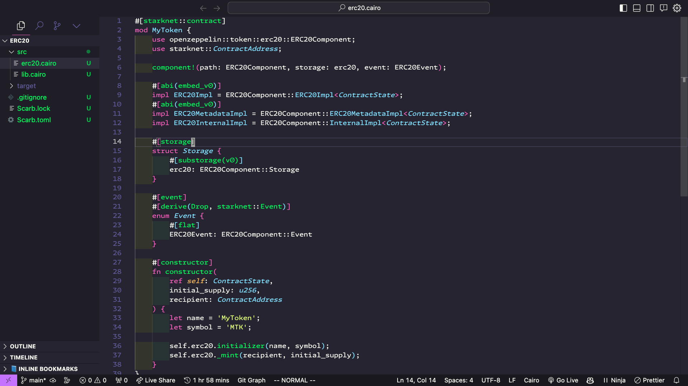
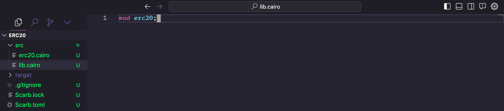
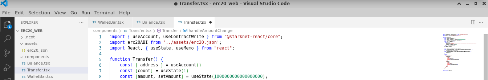
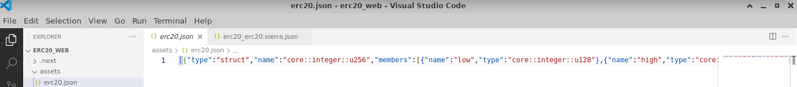
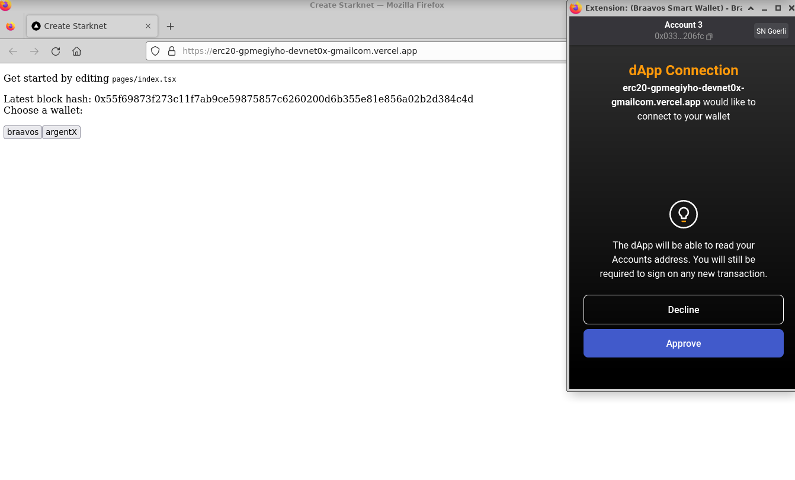
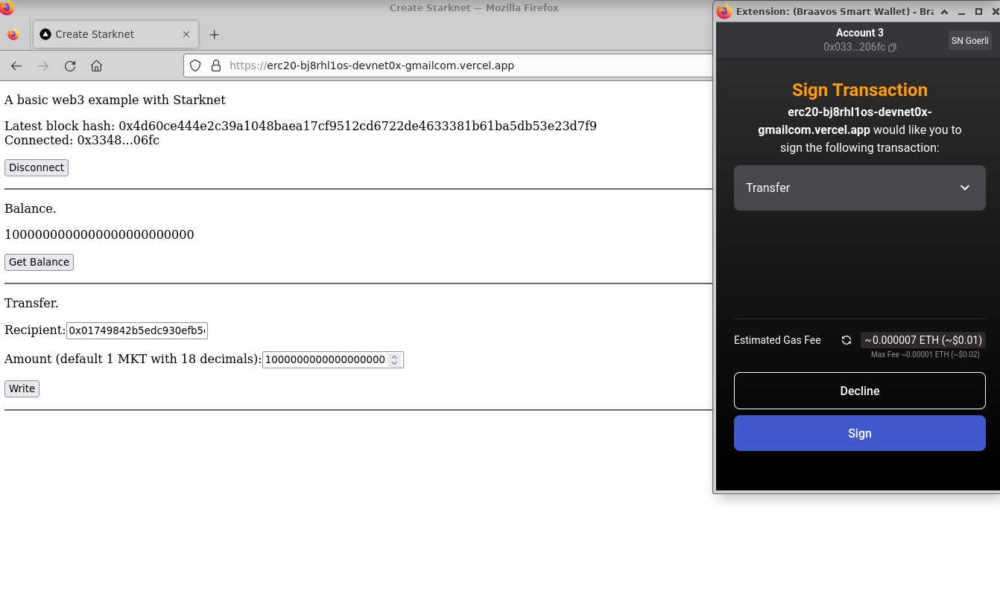

# ERC-20 UI

This guide offers steps to build an ERC20 smart contract using Cairo and to incorporate it within a React web application with Starknet React. Readers will:

- Understand how to implement the ERC20 interface
- Learn how to deploy contracts on the Starknet network
- Discover ways to engage with contracts within a React application
- Design their own ERC20 token and initiate it on Starknet

A prerequisite for this guide is a foundational understanding of both the Cairo programming language and ReactJS. Additionally, ensure Node.js and NPM are installed on the system.

The example will walk through creating an ERC20 token named MKT and crafting a web3 interface for functionalities such as balance verification and token transfer.


Throughout this guide, the following tools and libraries will be utilized:

- Scarb 0.7.0 with Cairo 2.2.0
- Starkli 0.1.9
- Oppenzeppelin libraries v0.7.0
- Starknet React v1.0.4
- NodeJS v19.6.1
- Next.js 13.1.6
- Visual Studio Code
- Vercel

## Initiating a New Starknet Project

Begin by establishing a new Starknet project named "erc20" using Scarb:

```bash
mkdir erc20
cd erc20
scarb init --name erc20
```

Subsequently, update the Scarb.toml to include the essential OpenZeppelin libraries. Post edits, the Scarb.toml should appear as:

```toml
[package]
name = "erc20"
version = "0.1.0"

# For more keys and definitions, visit https://docs.swmansion.com/scarb/docs/reference/manifest.html

[dependencies]
starknet = ">=2.2.0"
openzeppelin = { git = "https://github.com/OpenZeppelin/cairo-contracts.git", tag = "v0.7.0" }

[[target.starknet-contract]]
```

## Implementing the ERC20 Token

Begin by creating a new file named `src/erc20.cairo`. In this file, the ERC20 token named MKT, along with its associated functions, will be defined:

```rust
#[starknet::contract]
mod erc20 {
    use starknet::ContractAddress;
    use openzeppelin::token::erc20::ERC20;

    #[storage]
    struct Storage {}

    #[constructor]
    fn constructor(
        ref self: ContractState,
        initial_supply: u256,
        recipient: ContractAddress
    ) {
        let name = 'MyToken';
        let symbol = 'MTK';

        let mut unsafe_state = ERC20::unsafe_new_contract_state();
        ERC20::InternalImpl::initializer(ref unsafe_state, name, symbol);
        ERC20::InternalImpl::_mint(ref unsafe_state, recipient, initial_supply);
    }

    #[external(v0)]
    #[generate_trait]
    impl Ierc20Impl of Ierc20 {
        fn balance_of(self: @ContractState, account: ContractAddress) -> u256 {
            let unsafe_state = ERC20::unsafe_new_contract_state();
            ERC20::ERC20Impl::balance_of(@unsafe_state, account)
        }

        fn transfer(ref self: ContractState, recipient: ContractAddress, amount: u256) -> bool {
            let mut unsafe_state = ERC20::unsafe_new_contract_state();
            ERC20::ERC20Impl::transfer(ref unsafe_state, recipient, amount)
        }
    }
}
```



Now edit `src/lib.cairo` and replace the content with:

```rust
mod erc20;
```



Upon completing your contract, proceed to compile it using Scarb:

```bash
scarb build
```

Subsequent to the compilation, declare the smart contract on the Starknet testnet:

```bash
starkli declare target/dev/erc20_erc20.sierra.json --account ../../demo-account.json --keystore ../../demo-key.json --compiler-version 2.1.0 --network goerli-1 --watch
```

The output should appear similar to:

```bash
Enter keystore password:
Declaring Cairo 1 class: 0x04940154eae35788e899ceb0ef2794eaa5ea6818af5c1c726d6d278fd4979713
... [shortened for brevity]
Class hash declared: 0x04940154eae35788e899ceb0ef2794eaa5ea6818af5c1c726d6d278fd4979713
```

In cases where no modifications have been made to the provided contract, a notification will indicate that the contract has previously been declared on Starknet:

```bash
Enter keystore password:
Not declaring class as it's already declared. Class hash: 0x04940154eae35788e899ceb0ef2794eaa5ea6818af5c1c726d6d278fd4979713
```

## Deploying the ERC20 Contract

Proceed to deploy the MKT Token using Starkli. Provide these arguments for successful deployment:

- `Initial mint`: Mint 1,000,000 tokens. Given that the MKT token comprises 18 decimals (a standard of OpenZeppelin), the input required is 1,000,000 \* 10^18 or 0xd3c21bcecceda1000000. Due to the contract's expectation of a u256 mint value, provide both low and high values: 0xd3c21bcecceda1000000 and 0 respectively.
- `Receiver address`: Use a preferred address. In this example: 0x0334863e3e851de87fb4b6b6113aa2a6b40ea20f22dbec55536e4eac912206fc

```bash
starkli deploy 0x04940154eae35788e899ceb0ef2794eaa5ea6818af5c1c726d6d278fd4979713 --account ../../demo-account.json --keystore ../../demo-key.json --network goerli-1 --watch 0xd3c21bcecceda1000000 0 0x0334863e3e851de87fb4b6b6113aa2a6b40ea20f22dbec55536e4eac912206fc
```

The output should appear similar to:

```bash
Enter keystore password:
... [shortened for brevity]
Contract deployed: 0x001892d81e09cb2c2005f0112891dacb92a6f8ce571edd03ed1f3e549abcf37f
```

NOTE: The deployed address received will differ for every user. Retain this address, as it will replace instances in subsequent TypeScript files to match the specific contract address.

Well done! The Cairo ERC20 smart contract has been deployed successfully on Starknet.

## Installing the Starknet React Library

With the contract in place, initiate the development of the web application. Begin by incorporating the Starknet React library:

```bash
npm add @starknet-react/core
```

Post-installation, confirm the version of the Starknet React library:

```bash
npm list @starknet-react/core
```

The output should display the installed version, such as `@starknet-react/core@1.0.4`.

## Setting Up a New React Project

Starknet React library provides the `create-starknet` script that streamlines the setup of a Starknet application using TypeScript:

```bash
npx create-starknet erc20_web --use-npm
```

Once set up, make modifications to `erc20_web/index.tsx` by replacing its content with the following code:

```typescript
import Head from 'next/head'
import { useBlock } from '@starknet-react/core'
import WalletBar from '../components/WalletBar'
import { BlockTag } from 'starknet';

export default function Home() {
  const { data, isLoading, isError } = useBlock({
    refetchInterval: 3000,
    blockIdentifier: BlockTag.latest,
  })
  return (
    <>
      <Head>
        <title>Create Starknet</title>
        <meta name="description" content="Generated by create-starknet" />
        <meta name="viewport" content="width=device-width, initial-scale=1" />
        <link rel="icon" href="/favicon.ico" />
      </Head>
      <main>
        <p>
          A basic web3 example with Starknet&nbsp;
        </p>
        <div>
          {isLoading
            ? 'Loading...'
            : isError
            ? 'Error while fetching the latest block hash'
            : `Latest block hash: ${data?.block_hash}`}
        </div>
        <WalletBar />
      </main>
    </>
  )
}
```

To launch the web3 application:

```bash
cd erc20_web/
npm run dev
```

NOTE: Observe the server port that appears during launch. This will be useful for subsequent testing.

## Enhancing Your React Application with Additional Features

To enhance the app's functionality, create two components for balance and transfer. Subsequently, update the `Wallet.tsx` file to incorporate the new features:



### Balance Component

Design a balance component inside `components/Balance.tsx` and integrate the following code:

```typescript
import { useAccount, useContractRead } from "@starknet-react/core";
import erc20ABI from '../assets/erc20.json';

function Balance() {
  const { address } = useAccount();
  const { data, isLoading, error, refetch } = useContractRead({
    address: '0x001892d81e09cb2c2005f0112891dacb92a6f8ce571edd03ed1f3e549abcf37f',
    abi: erc20ABI,
    functionName: 'balance_of',
    args: [address],
    watch: false
  });

  if (isLoading) return <span>Loading...</span>;
  if (error) return <span>Error: {JSON.stringify(error)}</span>;

  return (
    <div>
      <p>Balance:</p>
      <p>{data?data.toString(): 0}</p>
      <p><button onClick={refetch}>Refresh Balance</button></p>
      <hr/>
    </div>
  );
}

export default Balance;
```

NOTE: Replace the address with the address of your deployed contract.

### Transfer Component

Craft a transfer component in `components/Transfer.tsx` and embed the subsequent code:

```typescript
import { useAccount, useContractWrite } from "@starknet-react/core";
import React, { useState, useMemo } from "react";

function Transfer() {
    const { address } = useAccount();
    const [count] = useState(1);
    const [recipient, setRecipient] = useState('0x');
    const [amount, setAmount] = useState('1000000000000000000');

    const calls = useMemo(() => {
      const tx = {
        contractAddress: '0x001892d81e09cb2c2005f0112891dacb92a6f8ce571edd03ed1f3e549abcf37f',
        entrypoint: 'transfer',
        calldata: [recipient, amount, 0]
      };
      return Array(count).fill(tx);
    }, [address, count, recipient, amount]);

    const { write } = useContractWrite({ calls });

    return (
      <>
        <p>Transfer:</p>
        <p>
          Recipient:
          <input type="text" value={recipient} onChange={(e) => setRecipient(e.target.value)} />
        </p>
        <p>
          Amount (default: 1 MKT with 18 decimals):
          <input type="number" value={amount} onChange={(e) => setAmount(e.target.value)} />
        </p>
        <p><button onClick={() => write()}>Execute Transfer</button></p>
        <hr/>
      </>
    );
}

export default Transfer;
```

NOTE: Replace contractAddress with the address of your deployed contract.

### Updating the Wallet Component

Proceed to modify the `components/Wallet.tsx` file. Replace any existing content with the following enhanced code:

```typescript
import { useAccount, useConnectors } from '@starknet-react/core'
import { useMemo } from 'react'
import Balance from '../components/Balance'
import Transfer from '../components/Transfer'

function WalletConnected() {
  const { address } = useAccount();
  const { disconnect } = useConnectors();

  const shortenedAddress = useMemo(() => {
    if (!address) return '';
    return `${address.slice(0, 6)}...${address.slice(-4)}`;
  }, [address]);

  return (
    <div>
      <span>Connected: {shortenedAddress}</span>
      <p><button onClick={disconnect}>Disconnect</button></p>
      <hr/>
      <Balance />
      <Transfer />
    </div>
  );
}

function ConnectWallet() {
  const { connectors, connect } = useConnectors();

  return (
    <div>
      <span>Select a wallet:</span>
      <p>
      {connectors.map((connector) => (
        <button key={connector.id} onClick={() => connect(connector)}>
          {connector.id}
        </button>
      ))}
      </p>
    </div>
  );
}

export default function WalletBar() {
  const { address } = useAccount();

  return address ? <WalletConnected /> : <ConnectWallet />;
}
```

This updated code refines the Wallet component to offer a more interactive experience for users intending to connect or manage their wallets.

## Finalizing the MKT Token Application

To finalize the application setup, we need the ABI file for the MKT token. Follow the steps below to generate and integrate it:

1. At the root of your project, create a new directory named `assets/`.
2. Inside the `assets/` directory, create an empty JSON file named `erc20.json`.
3. Go back to your ERC20 Cairo project folder and locate the `erc20/target/erc20_erc20_sierra.json` file.


4. Extract the ABI definition (ensuring you include the square brackets) and integrate it into the previously created `assets/erc20.json` file.



Well done! The basic MKT token application is now operational locally. Access it via `http://localhost:3000` or the port noted from earlier server setup. The app allows users to connect their wallets, review their balances, and perform token transfers.


## Deploying Your Project Online

To share your application with friends and allow them to check their balances and transfer tokens, publish your app online. Vercel offers a straightforward way to do this:

### Set Up Vercel

1. Register for an account at [Vercel Signup](https://vercel.com/signup).
2. Install Vercel in your web application folder (`erc20_web`):

```bash
cd erc20_web/
npm i -g vercel
vercel init
```

3. Authenticate your Vercel account:

```bash
vercel login
```

After entering your email, check your inbox and click on the "Verify" button.


On successful verification, you'll receive a confirmation in the console.

4. Link your project to Vercel:

```bash
vercel link
```

5. Upload it:

```bash
vercel
```

6. Publish your project:

```bash
vercel --prod
```

Congratulations! Your MKT token web3 application is now accessible to everyone.


Engage with your app by:

- Connecting your wallet:



- Checking your balance:


- Transferring tokens:



## Wrapping Up

Throughout this tutorial, you've walked through the steps to craft a web3 application using React and Starknet Cairo. This application, complete with an ERC20 smart contract, offers a modern web interface for user interaction. Here's a snapshot of your achievements:

- **Project Initialization**: Set up a Starknet project with Scarb and incorporated OpenZeppelin libraries.
- **Crafting the ERC20 Contract**: Developed an ERC20 token using Cairo, enriched with functionalities like balance checks and token transfers. This was then compiled and launched on the Starknet network.

- **React Application**: Built a React application powered by Starknet React, featuring components dedicated to balance inquiries and token transactions.

- **ABI Creation**: Produced the ABI for the MKT token, a critical component to liaise with the contract.

- **Online Deployment**: Brought your application to a wider audience by deploying it on Vercel. This empowered users to connect their wallets, scrutinize their balances, and execute token transactions.

The insights you've gathered from this tutorial lay a solid groundwork for creating intricate web3 applications. You're now equipped with the prowess to craft more intricate decentralized applications and smart contracts. The vast expanse of decentralized finance and blockchain is ripe for your innovative inputs. Dive in and happy coding!
