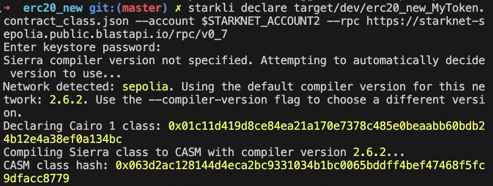
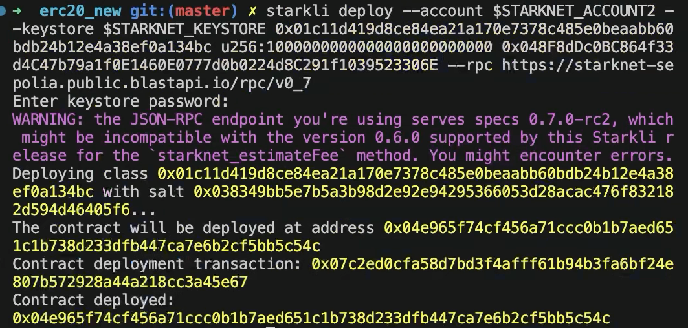
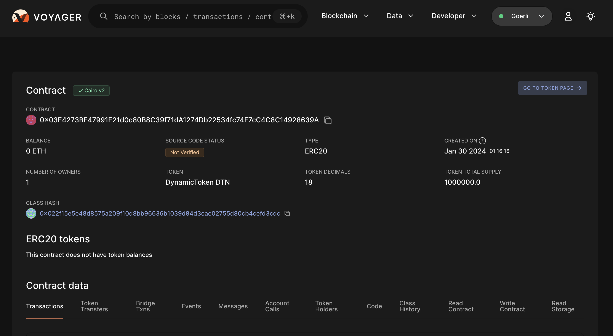
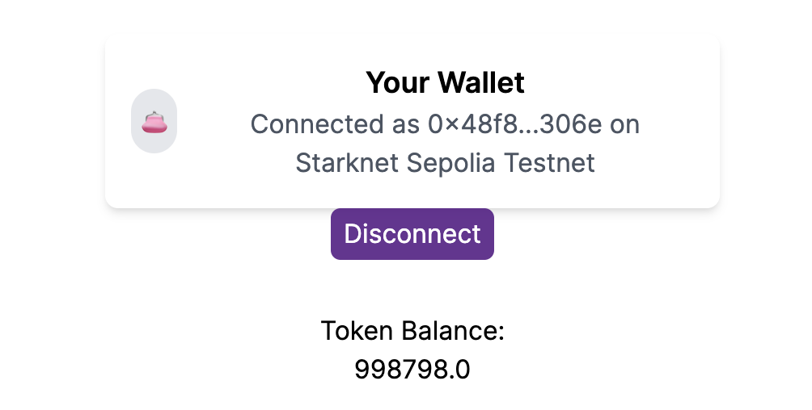
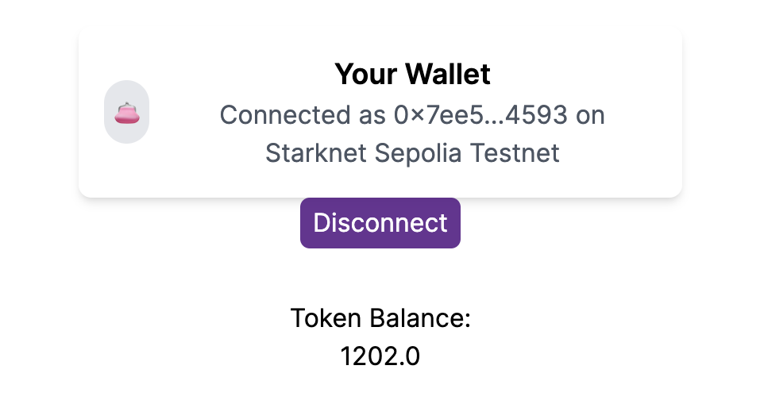
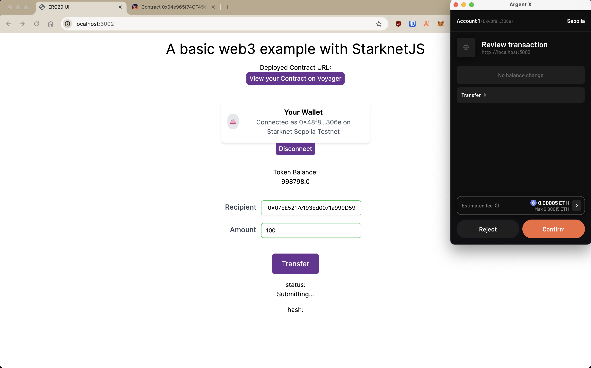
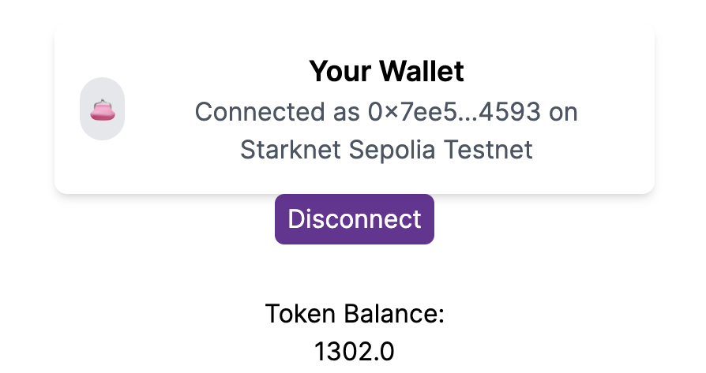

# ERC-20 UI with Starknet-react and StarknetKit

In this section, we will be exploring how to build a web3 application with [Starknet-react](https://github.com/Apibara/starknet-react) react library, [StarknetKit](https://www.starknetkit.com/docs/getting-started), and an ERC-20 smart contract written in the [Cairo](https://book.cairo-lang.org/title-page.html) language. This tutorial is similar to [ERC-20 UI](ch02-10-01-erc20-ui.md) tutorial but with the addition of utilizing Starknet-react, StarknetKit and up to date versions of the tools and libraries.

## Prerequisites

These are the main tools we will be using in this section

- Scarb v2.6.4 with Cairo v2.6.3
- Starkli v0.2.8
- Openzeppelin library v0.10.0
- @starknet-react/chains v0.1.0
- @starknet-react/core v2.3.0
- get-starknet-core v3.2.0
- starknet v5.29.0
- starknetkit v1.1.4
- NodeJS v18.19.1
- NextJS v14.0.2
- Visual Studio Code (or your favorite IDE!)

Before we start, this guide assumes the reader is familiar in the following:

1. Cairo
2. ReactJS/NextJS
3. Declaring/deploying Starknet contracts
4. Usage of blockchain explorers like [Voyager](https://voyager.online/)
5. Usage of Starknet wallets like **Argent** or any blockchain wallets

We will first start with building the contract.

**[IMPORTANT]** _Before we start building the contract, make sure that you have your environment setup by clicking [here](https://docs.starknet.io/documentation/quick_start/environment_setup/) and navigate to this github [**repo**](https://github.com/FriendlyLifeguard/starknet_erc20_example), clone it and follow the instruction on the README to setup the project. You also can find this repo on our local [examples](https://github.com/starknet-edu/starknetbook/tree/main/examples/apibara-starknetkit)._

## Building/Deploying the Contract

_All the content will be under `/erc20_new` directory in the repo._

We will be using Openzeppelin's ERC20 contract

```rust
#[starknet::contract]
mod MyToken {
    use openzeppelin::token::erc20::ERC20Component;
    use starknet::ContractAddress;

    component!(path: ERC20Component, storage: erc20, event: ERC20Event);

    #[abi(embed_v0)]
    impl ERC20Impl = ERC20Component::ERC20Impl<ContractState>;
    #[abi(embed_v0)]
    impl ERC20MetadataImpl = ERC20Component::ERC20MetadataImpl<ContractState>;

    impl ERC20InternalImpl = ERC20Component::InternalImpl<ContractState>;

    #[storage]
    struct Storage {
        #[substorage(v0)]
        erc20: ERC20Component::Storage
    }

    #[event]
    #[derive(Drop, starknet::Event)]
    enum Event {
        #[flat]
        ERC20Event: ERC20Component::Event
    }

    #[constructor]
    fn constructor(ref self: ContractState, initial_supply: u256, recipient: ContractAddress) {
        let name = "ExampleToken";
        let symbol = "ETK";

        self.erc20.initializer(name, symbol);
        self.erc20._mint(recipient, initial_supply);
    }
}
```

Under the constructor attribute, define your own token name and symbol.

```rust
    #[constructor]
    fn constructor(ref self: ContractState, initial_supply: u256, recipient: ContractAddress) {
        let name = "ExampleToken";
        let symbol = "ETK";

        self.erc20.initializer(name, symbol);
        self.erc20._mint(recipient, initial_supply);
    }
    }
```

Make sure to build your contract by typing `scarb build` to make sure that it compiles without any errors

We will first declare our contract.

```shell
starkli declare PATH_TO_YOUR_CONTRACT_JSON --account YOUR_ACCOUNT --rpc YOUR_RPC_URL
```

ex.



After, we will be deploying the contract. (First constructor argument is the initial supply of the token and the second constructor argument is the recipient of the token supply)

```shell
starkli deploy --account $STARKNET_ACCCOUNT --keystore $STARKNET_KEYSTORE
CONTRACT_CLASS_HASH constructor argument #1 constructor argument #2 --rpc YOUR_RPC_URL
```

ex.



If everything goes well, you will be able to search your contract on explorers like [Voyager](https://sepolia.voyager.online/)

_Make sure you select sepolia test network when searching your contract_



Next, we will be constructing our frontend so that users can interact with the contract that we just deployed.

# Building the Frontend

For our frontend, we will be using NextJ, [Starknet-react](https://starknet-react.com/docs/getting-started), and [StarknetKit](https://www.starknetkit.com/docs/getting-started).

## Configuring the repo for your contract

_All the content will be under `/erc20_cairo_react/src` directory in the repo._

The following steps are mandatory to connect your deployed contract to the repo:

1. To utilize your deployed contract, you need to extract the **ABI** of your contract which can be found in the voyager explorer, [example](https://sepolia.voyager.online/contract/0x04e965f74CF456a71cCC0b1b7aED651c1B738D233dFB447ca7e6b2cf5BB5c54C#code) and replace your **ABI** in `abi.ts` which is under `components/lib/`

2. Add your contract address in `src/app/page.tsx` on line 22

3. Add your `contractAddress` and `DECIMALS` in `components/readBalance.tsx` and `components/transfer.tsx` on lines 4-5 and 7-8 respectively

4. Make sure you have two wallets with enough eth/strk to pay for tx fees and to test the transfer functionality. (Faucet [LINK](https://starknet-faucet.vercel.app/))

## Gentle Introduction to the Repo

###

**starknet-provider.tsx**

```typescript
"use client";
import React from "react";
import { InjectedConnector } from "starknetkit/injected";
import { publicProvider, StarknetConfig } from "@starknet-react/core";
import { sepolia, mainnet } from "@starknet-react/chains";
import { voyager } from "@starknet-react/core";

export function StarknetProvider({children}: { children: React.ReactNode }) {

const chains = [mainnet, sepolia]
const provider = publicProvider()

  return (
    <StarknetConfig
      chains={chains}
      provider={provider}
      explorer={voyager}
    >
      {children}
    </StarknetConfig>
  );
}

```

**layout.tsx**

```typescript

import type { Metadata } from "next";
import { Inter } from "next/font/google";
import { StarknetProvider } from "@/components/starknet-provider";
import "./globals.css";
import { Theme } from '@radix-ui/themes';

const inter = Inter({ subsets: ["latin"] });

export const metadata: Metadata = {
  title: "ERC20 UI",
  description: "Basic ERC20 UI on Sepolia",
};

export default function RootLayout({
  children,
}: {
  children: React.ReactNode;
}) {
  return (
    <html lang="en">
      <body className={inter.className}>
        <Theme>
        <StarknetProvider>
          {children}
        </StarknetProvider>
        </Theme>
      </body>
    </html>
  );
}


```

In `starknet-provider.tsx`, we are providing the StarknetConfig with the necessary fields such as `chains`, `provider`, and `explorer`.

By providing our StarknetConfig component in our `layout.tsx`, our web-app can reference the fields in our application.

Supported networks are `sepolia` and `mainnet`.

RPC provider is set to `publicProvider` by default provided by **Lava network** but you can use other providers shown on this [page](https://starknet-react.com/docs/providers)

Explorer is set to `voyager` by default but you can use other explorers shown on this [page](https://starknet-react.com/docs/explorers)

---

**connect-modal.tsx**

```typescript
"use client";
import { Button } from "./ui/Button"
import ReadBalance from "@/components/readBalance";
import Transfer from "@/components/transfer";
import { useStarknetkitConnectModal, connect, disconnect } from "starknetkit";
import { useConnect, useDisconnect, useAccount, useNetwork} from "@starknet-react/core";
import { Card } from '@radix-ui/themes';
import { InjectedConnector } from "starknetkit/injected"


function Connect() {

  const { connect } = useConnect();
  const { disconnect } = useDisconnect();
  const { account, address } = useAccount()
  const { chain } = useNetwork();
  const addressShort = address
    ? `${address.slice(0, 6)}...${address.slice(-4)}`
    : null;


  const connectWallet = async() => {

    const connectors = [
      new InjectedConnector({ options: {id: "argentX", name: "Argent X" }}),
      new InjectedConnector({ options: {id: "braavos", name: "Braavos" }})
    ]

    const { starknetkitConnectModal } = useStarknetkitConnectModal({
      connectors: connectors,
      dappName: "ERC20 UI",
      modalTheme: "system"

    })

    const { connector } = await starknetkitConnectModal()
    await connect({ connector })
  }


  return (
    <div>
      <Card className="max-w-[380px] mx-auto">
      <div className="max-w-[400px] mx-auto p-4 bg-white shadow-md rounded-lg">
        <div className="flex items-center gap-3">
          <div className="w-10 h-10 bg-gray-200 rounded-full flex justify-center items-center">
            <span>👛</span>
          </div>
          <div>
            <p className="text-lg font-semibold">Your Wallet</p>
            <p className="text-gray-600">
              {address
                ? `Connected as ${addressShort} on ${chain.name}`
                : "Connect wallet to get started"}
            </p>
          </div>
        </div>
      </div>
      </Card>
    <div className="relative h-screen">
        { !account ?
              <div>
                <Button onClick={connectWallet}>
                  Connect
                </Button>
              </div>
          :
        <div>
          <Button onClick={() => disconnect()}>Disconnect</Button>
          <div className="mt-8">Token Balance: <ReadBalance /> </div>
          <div className="mt-8">
            <Transfer/>
          </div>
        </div>
     }
    </div>
  </div>
  );
}

export default Connect

```

This component is responsible for managing the state of connecting and disconnecting the wallet as well as the UI for wallet pop-up and its current wallet connection status.

This component makes use of both `starknet-react` and `starknetkit` libraries.

`Starknet-react` is in charge of managing the wallet connection.

`Starknetkit` is in charge of the wallet-pop UI by utilizing its custom modal from `useStarknetkitConnectModal` hook. It also establishes the wallet connection by providing`connector` field for the `connect` function from `useConnect` hook.

The connectors are provided by `starknetkit` and we imported to support two wallets: ArgentX and Braavos.

The `Card` from `radix-ui` displays the wallet connection status and the balance of the connected wallet is provied by `readBalance` component.

---

**readBalance.tsx**

```typescript
"use client"
import { useAccount, useContractRead} from "@starknet-react/core";

const ContractAddress = "0x04e965f74CF456a71cCC0b1b7aED651c1B738D233dFB447ca7e6b2cf5BB5c54C";
const DECIMALS = 18;

// Credits to @PhilippeR26 for this function
function formatBalance(qty: bigint, decimals: number): string {
  const balance = String("0").repeat(decimals) + qty.toString();
  const rightCleaned = balance.slice(-decimals).replace(/(\d)0+$/gm, "$1");
  const leftCleaned = BigInt(balance.slice(0, balance.length - decimals)).toString();
  return leftCleaned + "." + rightCleaned;
}

export default function ReadBalance() {
  const { address } = useAccount();
  const { data, isError, isLoading, error } = useContractRead({
    abi: [
      {
        "name": "balance_of",
        "type": "function",
        "inputs": [
          {
            "name": "account",
            "type": "core::starknet::contract_address::ContractAddress"
          }
        ],
        "outputs": [
          {
            "type": "core::integer::u256"
          }
        ],
        "state_mutability": "view"
      }
    ],
    functionName: "balance_of",
    args: [address as string],
    address: ContractAddress,
    watch: true,
  });

  if (isLoading) return <div>Loading ...</div>;
  if (isError || !data ) return <div>{error?.message}</div>;
  //@ts-ignore
  return <div>{formatBalance(data, DECIMALS)}</div>

}

```

In this component, we are utilizing the `useContractRead` hook by `starknet-react` to read the balance of the user's wallet. The hook is used for read-only functions and this case, it is able to read the balance of the user's wallet by calling the `balanceOf` function from the contract through the provided **ABI**, **contract address**, and **connected wallet address** (through `useAccount` hook).

The final data is formatted by `formatBalance` function and displayed on the frontend.

---

**transfer.tsx**

```typescript
import { useState, useMemo } from "react"
import contractABI from "@/components/lib/abi"
import { useAccount, useContract, useContractWrite } from "@starknet-react/core"
import { Uint256, cairo } from "starknet"
import { Button } from "./ui/Button"


const ContractAddress = "0x04e965f74cf456a71ccc0b1b7aed651c1b738d233dfb447ca7e6b2cf5bb5c54c";
const DECIMALS = 18;

export default function Transfer() {

  const { address } = useAccount();
  const [ recipient, setRecipient ] = useState('');
  const [ amount, setAmount ] = useState('')

  const { contract } = useContract({
    abi: contractABI,
    address: ContractAddress
});

  const newAmount: Uint256 = cairo.uint256((amount as any) * (10 ** DECIMALS))

  const calls = useMemo(() => {
    if ( !contract || !recipient || !address) return [];
    return contract.populateTransaction["transfer"]!(recipient, newAmount);
  }, [contract, address, recipient, newAmount])

  const {
    writeAsync,
    data,
    isPending,
  } = useContractWrite({
    calls,
  });

  return (
    <>
<div className="flex flex-col gap-4 items-center">
  <div className="flex items-center space-x-3 mr-3">
    <label className="text-lg font-medium text-gray-700">Recipient</label>
    <input
      type="text"
      value={recipient}
      onChange={e => setRecipient(e.target.value)}
      className="mt-1 px-4 py-2 w-64 bg-white border border-green-500 rounded-md shadow-sm focus:outline-none focus:ring-indigo-500 focus:border-indigo-500 sm:text-sm"
    />
  </div>
  <div className="flex items-center space-x-3">
    <label className="text-lg font-medium text-gray-700">Amount</label>
    <input
      type="number"
      value={amount}
      onChange={e => setAmount(e.target.value)}
      className="mt-1 px-3 py-2 w-64 bg-white border border-green-500 rounded-md shadow-sm focus:outline-none focus:ring-indigo-500 focus:border-indigo-500 sm:text-sm"
    />
  </div>
  <Button className="mt-6 px-6 py-3 text-lg w-full sm:w-auto" onClick={() => writeAsync()}>Transfer</Button>
  <p>status: {isPending && <div>Submitting...</div>}</p>
  <p>hash: {data?.transaction_hash}</p>
</div>
    </>
  );
}

```

This component deals with the transfer of tokens from one wallet to another. The user can input the recipient's wallet address and the amount of tokens to transfer. The `useContractWrite` hook by `starknet-react` is used to use functions in the contract that makes any state changes.

We package the `call` const that includes the following: `contract`,`address`, `recipient`, `newAmount` and we pass it to the `useContractWrite` hook.

The `recipient` and `amount` variables are updated upon user input in each text box.

The `amount` is converted to `newAmount`, a `uint256` type adjusted to the number of decimals

## Interacting with the Frontend

### Read Balance

You first need to connect your wallet, it currently supports argent and braavos wallets.

If you have successfully deployed your contract, able to connected your wallet and received your tokens from your ERC20 contract, it will display the token balance of the token that you deployed.

<div style="display: flex; justify-content: space-between; align-items: center;">
  <div style="flex: 1; padding: 10px;">
    
    <p style="text-align: center;">Wallet 1</p>
  </div>
  <div style="flex: 1; padding: 10px;">
    
    <p style="text-align: center;">Wallet 2</p>
  </div>
</div>

### Transfer

Enter the recipient of your token and the amount.

Click the transfer button and you will be able to see the transaction hash and the status of the transaction if the tx was executed successfully.

In our example, we will be sending 100 tokens to wallet 2.



Since we sent 100 token to wallet 2, the result will be as follows:

<div style="display: flex; justify-content: space-between; align-items: center;">
  <div style="flex: 1; padding: 10px;">
    
    <p style="text-align: center;">Wallet 1</p>
  </div>
  <div style="flex: 1; padding: 10px;">
    
    <p style="text-align: center;">Wallet 2</p>
  </div>
</div>

### Result

As the picture shows, we have successfully sent 100 tokens from wallet 1 to wallet 2 on starknet sepolia testnet!

## ERC20 UI Overview

In this tutorial, we were able to accomplish the following tasks!

- **Initializing environment**: Setting up an environment for starknet and cairo development
- **Declaring and deploying the contract**: Declaring and deploying our ERC20 cairo contract on the sepolia testnet
- **Initializing the frontend**: Setting up the frontend with NextJS, Starknet-react, and Starknetkit to connect your Cairo contract with your wallet
- **Interacting with the frontend**: Connecting/disconnecting your wallet, viewing your deployed token balance, and transferring tokens to another wallet by sending transactions on the sepolia network
