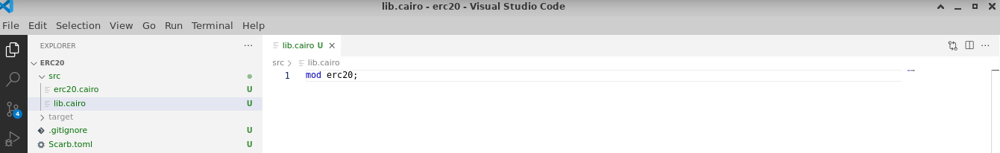

# ERC-20 UI

This guide offers steps to build an ERC20 smart contract using Cairo and to incorporate it within a React web application with StarknetJS. Readers will:

- Understand how to implement the ERC20 interface
- Learn how to deploy contracts on the Starknet network
- Discover ways to engage with contracts within a React application
- Design their own ERC20 token and initiate it on Starknet

A prerequisite for this guide is a foundational understanding of both the Cairo programming language and StarknetJS. Additionally, ensure Node.js and NPM are installed on the system.

The example will walk through creating an ERC20 token named MKT and crafting a web3 interface for functionalities such as balance verification and token transfer.


Throughout this guide, the following tools and libraries will be utilized:

- Scarb 0.7.0 with Cairo 2.2.0
- Starkli 0.1.9
- Oppenzeppelin libraries v0.7.0
- StarknetJS v5.19.5
- get-starknet v3.0.1
- NodeJS v19.6.1
- Next.js 13.5.5
- Visual Studio Code
- Vercel

## Initiating a New Starknet Project

Begin by establishing a new Starknet project named "erc20" using Scarb:

```bash
mkdir erc20
cd erc20
scarb init --name erc20
```

Subsequently, update the Scarb.toml to include the essential OpenZeppelin libraries. Post edits, the Scarb.toml should appear as:

```toml
[package]
name = "erc20"
version = "0.1.0"

# For more keys and definitions, visit https://docs.swmansion.com/scarb/docs/reference/manifest.html

[dependencies]
starknet = ">=2.2.0"
openzeppelin = { git = "https://github.com/OpenZeppelin/cairo-contracts.git", tag = "v0.7.0" }

[[target.starknet-contract]]
```

## Implementing the ERC20 Token

Begin by creating a new file named `src/erc20.cairo`. In this file, the ERC20 token named MKT, along with its associated functions, will be defined:

```rust
#[starknet::contract]
mod erc20 {
    use starknet::ContractAddress;
    use openzeppelin::token::erc20::ERC20;

    #[storage]
    struct Storage {}

    #[constructor]
    fn constructor(
        ref self: ContractState,
        initial_supply: u256,
        recipient: ContractAddress
    ) {
        let name = 'MyToken';
        let symbol = 'MTK';

        let mut unsafe_state = ERC20::unsafe_new_contract_state();
        ERC20::InternalImpl::initializer(ref unsafe_state, name, symbol);
        ERC20::InternalImpl::_mint(ref unsafe_state, recipient, initial_supply);
    }

    #[external(v0)]
    #[generate_trait]
    impl Ierc20Impl of Ierc20 {
        fn balance_of(self: @ContractState, account: ContractAddress) -> u256 {
            let unsafe_state = ERC20::unsafe_new_contract_state();
            ERC20::ERC20Impl::balance_of(@unsafe_state, account)
        }

        fn transfer(ref self: ContractState, recipient: ContractAddress, amount: u256) -> bool {
            let mut unsafe_state = ERC20::unsafe_new_contract_state();
            ERC20::ERC20Impl::transfer(ref unsafe_state, recipient, amount)
        }
    }
}
```


Now edit `src/lib.cairo` and replace the content with:

```rust
mod erc20;
```



Upon completing your contract, proceed to compile it using Scarb:

```bash
scarb build
```

Subsequent to the compilation, declare the smart contract on the Starknet testnet (using your own account and keystore):

```bash
starkli declare target/dev/erc20_erc20.sierra.json --account ../../demo-account.json --keystore ../../demo-key.json --compiler-version 2.1.0 --network goerli-1 --watch
```

The output should appear similar to:

```bash
Enter keystore password:
Declaring Cairo 1 class: 0x04940154eae35788e899ceb0ef2794eaa5ea6818af5c1c726d6d278fd4979713
... [shortened for brevity]
Class hash declared: 0x04940154eae35788e899ceb0ef2794eaa5ea6818af5c1c726d6d278fd4979713
```

In cases where no modifications have been made to the provided contract, a notification will indicate that the contract has previously been declared on Starknet:

```bash
Enter keystore password:
Not declaring class as it's already declared. Class hash: 0x04940154eae35788e899ceb0ef2794eaa5ea6818af5c1c726d6d278fd4979713
```

## Deploying the ERC20 Contract

Proceed to deploy the MKT Token using Starkli. Provide these arguments for successful deployment:

- `Initial mint`: Mint 1,000,000 tokens. Given that the MKT token comprises 18 decimals (a standard of OpenZeppelin), the input required is 1,000,000 \* 10^18 or 0xd3c21bcecceda1000000. Due to the contract's expectation of a u256 mint value, provide both low and high values: 0xd3c21bcecceda1000000 and 0 respectively.
- `Receiver address`: Use a preferred address who wiil be the initial recipient of 1,000,000 MKT. In this example: 0x0334863e3e851de87fb4b6b6113aa2a6b40ea20f22dbec55536e4eac912206fc

```bash
starkli deploy 0x04940154eae35788e899ceb0ef2794eaa5ea6818af5c1c726d6d278fd4979713 --account ../../demo-account.json --keystore ../../demo-key.json --network goerli-1 --watch 0xd3c21bcecceda1000000 0 0x0334863e3e851de87fb4b6b6113aa2a6b40ea20f22dbec55536e4eac912206fc
```

The output should appear similar to:

```bash
Enter keystore password:
... [shortened for brevity]
Contract deployed: 0x001892d81e09cb2c2005f0112891dacb92a6f8ce571edd03ed1f3e549abcf37f
```

NOTE: The deployed address received will differ for every user. Retain this address, as it will replace instances in subsequent TypeScript files to match the specific contract address.

Well done! The Cairo ERC20 smart contract has been deployed successfully on Starknet.

## Setting Up a New React Project

With the contract in place, initiate the development of the web application. Begin by
setting up our react project. To do this, Nextjs framework provides the `create-next-app` script that streamlines the setup of a Nextjs application:

```bash
npx create-next-app@latest erc20_web --use-npm
✔ Would you like to use TypeScript? … Yes
✔ Would you like to use ESLint? … Yes
✔ Would you like to use Tailwind CSS? … Yes
✔ Would you like to use `src/` directory? … Yes
✔ Would you like to use App Router? (recommended) … Yes
✔ Would you like to customize the default import alias (@/*)? … No
```

Then, you should see something like this:

```bash
Creating a new Next.js app in /home/kali/cairo/erc20_web.
Using npm.
Initializing project with template: app-tw
Installing dependencies:
- react
- react-dom
- next

... [shortened for brevity]

Initialized a git repository.
Success! Created erc20_web at /home/kali/cairo/erc20_web
```

## Installing the Starknet.js Library

Now, let's install the starknet.js and recommended get-starknet (manage wallet connections) libraries:

```bash
cd erc20_web
npm install get-starknet
```

You should see something like this:

```bash
added 3 packages, changed 1 package, and audited 1549 packages in 7s
... [shortened for brevity]
Run `npm audit` for details.
```

Install starknetJS:

```bash
npm install starknet
```

You should see something like this:

```bash
added 18 packages, and audited 1546 packages in 6s
... [shortened for brevity]
Run `npm audit` for details.
```

Post-installation, confirm the version of the Starknet.js library:

```bash
npm list starknet

npm list get-starknet
```

The output should display the installed version, such as `starknet@5.19.5` and `get-starknet@3.0.1`.

## Building our Project

Once set up, make modifications to `erc20_web/src/app/layout.tsx` by replacing its content with the following code:

```typescript
import type { Metadata } from 'next'

export const metadata: Metadata = {
  title: 'Create Next App',
  description: 'Generated by create next app',
}

export default function RootLayout({
  children,
}: {
  children: React.ReactNode
}) {
  return (
    <html lang="en">
      <body>{children}</body>
    </html>
  )
}

```

Now, edit `erc20_web/src/app/page.tsx` and replace its content with the following code:

```typescript
import Head from "next/head";
import App from "../components/App";

export default function Home() {

  return (
    <>
      <Head>
        <title>Homepage</title>
        <link rel="icon" href="/favicon.ico" />
      </Head>
      <main>
      <p>A basic web3 example with StarknetJS</p>
          <App />
      </main>
    </>
  );
}
```

## Enhancing Your React Application with Additional Features

To enhance the app's functionality, create one component (`erc20_web/src/components/App.tsx`) for balance and transfer with the following code.

```typescript
'use client';
import { useState, useMemo } from "react"
import { connect, disconnect } from "get-starknet"
import { Contract, Provider, SequencerProvider, constants } from "starknet"

const contractAddress = "0x001892d81e09cb2c2005f0112891dacb92a6f8ce571edd03ed1f3e549abcf37f"

function App() {
  const [provider, setProvider] = useState({} as Provider)
  const [address, setAddress] = useState('')
  const [currentBlockHash, setCurrentBlockHash] = useState('')
  const [balance, setBalance] = useState('')
  const [isConnected, setIsConnected] = useState(false)
  const [recipient, setRecipient] = useState('0x');
  const [amount, setAmount] = useState('1000000000000000000');

  const disconnectWallet = async () => {
    try {
      await disconnect({ clearLastWallet: true })
      setProvider({} as Provider)
      setAddress('')
      setIsConnected(false)
    }
    catch (error: any) {
      alert(error.message)
    }
  }

  const connectWallet = async () => {
    try {
      const starknet = await connect()
      if (!starknet) throw new Error("Failed to connect to wallet.")
      await starknet.enable({ starknetVersion: "v5" })
      setProvider(starknet.account)
      setAddress(starknet.selectedAddress || '')
      setIsConnected(true)
    }
    catch (error: any) {
      alert(error.message)
    }
  }

  const checkBalance = async () => {
    try {
      // initialize contract using abi, address and provider
      const { abi: testAbi } = await provider.getClassAt(contractAddress);
      if (testAbi === undefined) { throw new Error("no abi.") };
      const contract = new Contract(testAbi, contractAddress, provider)
      // make contract call
      const data = await contract.balance_of(address)
      setBalance(data.toString())
    }
    catch (error: any) {
      alert(error.message)
    }
  }

  const transfer = async () => {
    try {
      // initialize contract using abi, address and provider
      const { abi: testAbi } = await provider.getClassAt(contractAddress);
      if (testAbi === undefined) { throw new Error("no abi.") };
      const contract = new Contract(testAbi, contractAddress, provider)
      // make contract call
      await contract.transfer(recipient, amount)
    }
    catch (error: any) {
      alert(error.message)
    }
  }

  const current_block_hash = async () => {
    try {
      const provider1 = new SequencerProvider({ baseUrl: constants.BaseUrl.SN_GOERLI });

      const block = await provider1.getBlock("latest"); // <- Get latest block
      setCurrentBlockHash(block.block_hash);
    }
    catch (error: any) {
      alert(error.message)
    }
  }

  current_block_hash()

  const shortenedAddress = useMemo(() => {
    if (!isConnected) return ''
    return `${address.slice(0, 6)}...${address.slice(-4)}`
  }, [isConnected, address])

  const handleRecipientChange = (event: React.ChangeEvent<HTMLInputElement>) => {
    setRecipient(event.target.value);
  };

  const handleAmountChange = (event: React.ChangeEvent<HTMLInputElement>) => {
      setAmount(event.target.value);
  };

  return (
    <div>
      <p>Latest block hash: {currentBlockHash}</p>
      {isConnected ?
        <div>
          <span>Connected: {shortenedAddress}</span>
          <p><button onClick={()=> {disconnectWallet()}}>Disconnect</button></p>
          <hr />
          <p>Balance.</p>
          <p>{balance}</p>
          <p><button onClick={() => checkBalance()}>Check Balance</button></p>
          <hr />
          <p>Transfer.</p>
          <p>Recipient:
              <input
              type="text"
              value={recipient}
              onChange={handleRecipientChange}
              />
          </p>
          <p>Amount (default 1 MKT with 18 decimals):
            <input
            type="number"
            value={amount}
            onChange={handleAmountChange}
            />
          </p>
          <p>
            <button onClick={() => transfer()}>Transfer</button>
          </p>
          <hr/>
        </div> :
        <div>
          <span>Choose a wallet:</span>
          <p>
            <button onClick={() => connectWallet()}>Connect a Wallet</button>
          </p>
        </div>
      }
    </div>
  );
}

export default App;
```

Finally, launch the web3 application:

```bash
cd erc20_web/
npm run dev
```

Congratulations, you have your starknetjs web3 application. Now connect your wallet in goerli testnet, check your balance and transfer MKT tokens to your friends:


## Deploying Your Project Online

To share your application with friends and allow them to check their balances and transfer tokens, publish your app online. Vercel offers a straightforward way to do this:

### Set Up Vercel

1. Register for an account at [Vercel Signup](https://vercel.com/signup).
2. Install Vercel in your web application folder (`erc20_web`):

```bash
cd erc20_web/
npm i -g vercel
```

3. Authenticate your Vercel account:

```bash
vercel login
Continue with Email (or select your preferred login method)
```

After entering your email, check your inbox and click on the "Verify" button.


On successful verification, you'll receive a confirmation in the console.

4. Link your project to Vercel:

```bash
vercel link
? Set up “~/cairo/erc20_web”? [Y/n] y
? Which scope should contain your project? (just press enter)
? Link to existing project? [y/N] n
? What’s your project’s name? erc20-web
? In which directory is your code located? ./
? Want to modify these settings? [y/N] n
✅  Linked erc20-web (created .vercel)
```

5. Upload it:

```bash
vercel
```

6. Publish your project:

```bash
vercel --prod
✅  Production: https://erc20-ch3cn791b-devnet0x-gmailcom.vercel.app [1s]
```

Check your production URL and congratulations! Your MKT token web3 application is now accessible to everyone.


Engage with your app by:

- Connecting your wallet:


- Checking your balance:


- Transferring tokens:


## Wrapping Up

Throughout this tutorial, you've walked through the steps to craft a web3 application using React, StarknetJS and Cairo. This application, complete with an ERC20 smart contract, offers a modern web interface for user interaction. Here's a snapshot of your achievements:

- **Project Initialization**: Set up a Starknet project with Scarb and incorporated OpenZeppelin libraries.

- **Crafting the ERC20 Contract**: Developed an ERC20 token using Cairo, enriched with functionalities like balance checks and token transfers. This was then compiled and launched on the Starknet network.

- **React Application**: Built a React application powered by StarknetJS, featuring components dedicated to balance inquiries and token transactions.

- **Online Deployment**: Brought your application to a wider audience by deploying it on Vercel. This empowered users to connect their wallets, scrutinize their balances, and execute token transactions.

The insights you've gathered from this tutorial lay a solid groundwork for creating intricate web3 applications. You're now equipped with the prowess to craft more intricate decentralized applications and smart contracts. The vast expanse of decentralized finance and blockchain is ripe for your innovative inputs. Dive in and happy coding!
