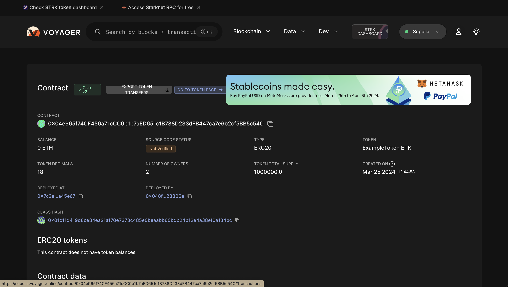
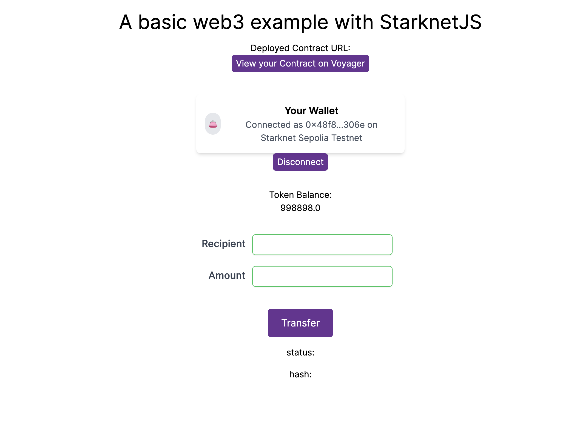

# ERC-20 UI with Apibara

In this section, we will be exploring how to build a web3 application with [Apibara](https://github.com/apibara/starknet-react) react library and deploying an ERC-20 smart contract written in the [Cairo](https://book.cairo-lang.org/title-page.html) language. This tutorial is similar to [ERC-20 UI](ch02-10-01-erc20-ui.md) tutorial but with the addition of utilizing Apibara and up to date versions of the tools and libraries.

## Prerequisites

These are the main tools we will be using in this section

- Scarb v2.5.3 with Cairo v2.5.3
- Starkli v0.1.20
- Openzeppelin library v0.9.0
- @starknet-react/chains v0.1.0
- @starknet-react/core v2.3.0
- get-starknet-core v3.2.0
- starknet v5.29.0
- NodeJS v18.17.1
- NextJS v14.0.5
- Visual Studio Code (or your favorite IDE!)

Before we start, this guide assumes the reader is knowledgeable in the following:

1. Cairo
2. ReactJS/NextJS
3. Deploying Starknet contracts
4. Usage of blockchain explorers like [Voyager](https://voyager.online/)
5. Usage of Starknet wallets like **Argent** or any blockchain wallets

We will first start with building the contract.

## Building/Deploying the Contract

*Before we start building the contract, make sure that you have your environment setup by clicking [here](https://docs.starknet.io/documentation/quick_start/environment_setup/)*

We will be using Openzeppelin's ERC20 contract
```rust
#[starknet::contract]
mod MyToken {
    use openzeppelin::token::erc20::ERC20Component;
    use starknet::ContractAddress;

    component!(path: ERC20Component, storage: erc20, event: ERC20Event);

    #[abi(embed_v0)]
    impl ERC20Impl = ERC20Component::ERC20Impl<ContractState>;
    #[abi(embed_v0)]
    impl ERC20CamelOnlyImpl = ERC20Component::ERC20CamelOnlyImpl<ContractState>;
    impl ERC20InternalImpl = ERC20Component::InternalImpl<ContractState>;

    #[storage]
    struct Storage {
        #[substorage(v0)]
        erc20: ERC20Component::Storage,
        // The decimals value is stored locally
        decimals: u8
    }

    #[event]
    #[derive(Drop, starknet::Event)]
    enum Event {
        #[flat]
        ERC20Event: ERC20Component::Event
    }

    #[constructor]
    fn constructor(
        ref self: ContractState,
        decimals: u8,
        initial_supply: u256,
        recipient: ContractAddress,
    ) {
        // Call the internal function that writes decimals to storage
        self._set_decimals(decimals);

        // Initialize ERC20
        let name = 'MyToken';
        let symbol = 'MTK';

        self.erc20.initializer(name, symbol);
        self.erc20._mint(recipient, initial_supply);
    }

    #[external(v0)]
    impl ERC20MetadataImpl of interface::IERC20Metadata<ContractState> {
        fn name(self: @ContractState) -> felt252 {
            self.erc20.name()
        }

        fn symbol(self: @ContractState) -> felt252 {
            self.erc20.symbol()
        }

        fn decimals(self: @ContractState) -> u8 {
            self.decimals.read()
        }
    }

    #[generate_trait]
    impl InternalImpl of InternalTrait {
        fn _set_decimals(ref self: ContractState, decimals: u8) {
            self.decimals.write(decimals);
        }
    }
}
```

Under the constructor attribute, define your own token name and symbol.

```rust
    #[constructor]
    fn constructor(
        ref self: ContractState,
        decimals: u8,
        initial_supply: u256,
        recipient: ContractAddress,
    ) {

        self._set_decimals(decimals);

        // Specify your token name and symbol
        let name = 'DynamicTokenFixed';
        let symbol = 'DTF';

        self.erc20.initializer(name, symbol);
        self.erc20._mint(recipient, initial_supply);
    }
```

Make sure to build your contract by typing `scarb build` to make sure that it compiles without any errors

After, we will be deploying the contract with the following layout specific to the contract that we are deploying:

```shell
starkli deploy --account $STARKNET_ACCCOUNT --keystore $STARKNET_KEYSTORE
CLASS HASH
constructor argument #1 constructor argument #2 constructor argument #3
--rpc YOUR_RPC_URL
```

*We will be deploying on the Goerli test network so we will be using a Goerli RPC. Make sure to replace the `YOUR_RPC_URL` with your own API key.*

ex.

```shell
starkli deploy --account $STARKNET_ACCOUNT --keystore $STARKNET_KEYSTORE
0x02215e5e48d8575a20910d8bb96636b1039d84d3cae02755d80cb4cefd3cdc
18 u256:1000000000000000000000000 0×02a851592719401F55CA52868dF08E3d3d977a83eC6bA604CC568Fa9080ee
--rpc https://starknet-goerli.g.alchemy.com/v2/YOUR_API_KEY
```

*(Goerli will be deprecated soon so make sure to use sepolia as needed) [Note](https://docs.starknet.io/documentation/starknet_versions/deprecated/)*

**[IMPORTANT]** Make sure that the recipient address is set to the wallet that you have accessed to in order to test the transfer function later on in the tutorial

If everything goes well, you will be able to search your contract on explorers like [Voyager](https://voyager.online/)

*Make sure you select goerli test network when searching your contract*



Next, we will be constructing our frontend so that users can interact with the contract that we just deployed

# Building the Frontend

For our frontend, we will be using NextJ and [Apibara](https://starknet-react.com/docs/getting-started) which includes various frontend starknet libraries.

Navigate to this [**repo**](https://github.com/FriendlyLifeguard/starknet_erc20_example/tree/new), clone it and follow the instruction on the README to setup the project.

## Configuring the repo for your contract

The following steps are mandatory to connect your deployed contract to the repo:

1. To utilize your deployed contract for Apibara library, you need to extract the **ABI** of your contract which can be found in the voyager explorer, [example](https://goerli.voyager.online/contract/0x03e4273bf47991e21d0c80b8c39f71da1274db22534fc74f7cc4c8c14928639a#code) and replace your **ABI** in `abi.ts` which is under `components/lib/`

2. Add your contract address in `src/app/page.tsx` on line 33

3. Add your `contractAddress` and `DECIMALS` in `components/readBalance.tsx` and `components/transfer.tsx` on lines 4-5 and 10-11 respectively

4. Make sure your wallet (example uses argent wallet) is properly configured and have at least two wallets to test the transfer functionality

## Gentle Introduction to the Repo

###

**starknet-provider.tsx**

```shell
"use client";
import { ReactNode } from "react";
import { useState } from "react";
import { devnet, goerli, mainnet } from "@starknet-react/chains";
import {
  StarknetConfig,
  argent,
  braavos,
  publicProvider,
  useInjectedConnectors,
  voyager,
  type ExplorerFactory
} from "@starknet-react/core";
import { alchemyProvider } from "@starknet-react/core"

export function StarknetProvider({ children }: { children: ReactNode }) {
  const { connectors } = useInjectedConnectors({
    // Show these connectors if the user has no connector installed.
    recommended: [argent(), braavos()],
    // Hide recommended connectors if the user has any connector installed.
    includeRecommended: "onlyIfNoConnectors",
    // Randomize the order of the connectors.
    order: "random",
  });

  return (
    <StarknetConfig
      chains={[goerli]}
      provider={publicProvider()}
      connectors={connectors}
      explorer={voyager}
    >
      {children}
    </StarknetConfig>
  );
}

```

This component enables wallet connection to our frontend. Currently, it supports argent and braavos wallets.

The chain is configured to goerli but in the near future, change it to sepolia as Goerli will be deprecated.

RPC provider is set to publicProvider by default provided by **Lava network** but you can use other providers shown on this [page](https://starknet-react.com/docs/providers)

Explorer is set to voyager by default but you can use other explorers shown on this [page](https://starknet-react.com/docs/explorers)

---

**connect-modal.tsx**

```shell
"use client";
import { useAccount, useConnect, useDisconnect } from "@starknet-react/core"
import { Button } from "./ui/Button"


export default function ConnectWallet() {
  const { connectors, connect } = useConnect();

  return (
    <div>
      <span>Choose a wallet: </span>
      {connectors.map((connector) => {
        return (
          <Button
            key={connector.id}
            onClick={() => connect({ connector })}
            className="gap-x-2 mr-2"
          >
            {connector.id}
          </Button>
        );
      })}
    </div>
  );

}

```

**disconnect-wallet.tsx**

```shell

"use client";
import { useAccount, useConnect, useDisconnect } from "@starknet-react/core";
import { useMemo } from "react";
import { Button } from "./ui/Button";


export default function WalletConnected() {
  const { address } = useAccount();
  const { disconnect } = useDisconnect();

  const shortenedAddress = useMemo(() => {
    if (!address) return "";
    return `${address.slice(0, 6)}...${address.slice(-4)}`;
  }, [address]);

  return (
    <div>
      <span>Connected: {shortenedAddress} </span>
      <Button onClick={() => disconnect()}>Disconnect</Button>
    </div>
  );
}

```

These components are responsible for managing the state of connecting and disconnecting the wallet.

The components are configured by the `starknet-provider.tsx` component such as RPC request and supported wallets.

---

**readBalance.tsx**

```shell
"use client"
import { useAccount, useContractRead, useContractWrite, useContract, useNetwork } from "@starknet-react/core";

const ContractAddress = "0x03E4273BF47991E21d0c80B8C39f71dA1274Db22534fc74F7cC4C8C14928639A";
const DECIMALS = 18;

// Credits to @PhilippeR26 for this function
function formatBalance(qty: bigint, decimals: number): string {
  const balance = String("0").repeat(decimals) + qty.toString();
  const rightCleaned = balance.slice(-decimals).replace(/(\d)0+$/gm, "$1");
  const leftCleaned = BigInt(balance.slice(0, balance.length - decimals)).toString();
  return leftCleaned + "." + rightCleaned;
}

export default function ReadBalance() {
  const { address } = useAccount();
  const { data, isError, isLoading, error } = useContractRead({
    abi: [
      {
        "type": "function",
        "name": "balanceOf",
        "inputs": [
          {
            "name": "account",
            "type": "core::starknet::contract_address::ContractAddress"
          }
        ],
        "outputs": [
          {
            "type": "core::integer::u256"
          }
        ],
        "state_mutability": "view"
      },
    ],
    functionName: "balanceOf",
    args: [address as string],
    address: ContractAddress,
    watch: true,
  });

  if (isLoading) return <div>Loading ...</div>;
  if (isError || !data) return <div>{error?.message}</div>;
  //@ts-ignore
  return <div>{formatBalance(data, DECIMALS)}</div>

}
```

In this component, we are utilizing the `useContractRead` hook to read the balance of the user's wallet. The hook is able to read the balance of the user's wallet by calling the `balanceOf` function from the contract through the provided **ABI**, **contract address**, and connected wallet address

The final data is formatted by `formatBalance` function

---

**transfer.tsx**

```shell
import { useState, useMemo } from "react"
import { contractABI } from "@/components/lib/abi"
import { useAccount, useContract, useContractWrite } from "@starknet-react/core"
import { Uint256, cairo } from "starknet"
import { Button } from "./ui/Button"


const ContractAddress = "0x03E4273BF47991E21d0c80B8C39f71dA1274Db22534fc74F7cC4C8C14928639A";
const DECIMALS = 18;

export default function Transfer() {

  const { address } = useAccount();
  const [ recipient, setRecipient ] = useState('');
  const [ amount, setAmount ] = useState('')

  const { contract } = useContract({
    abi: contractABI,
    address: ContractAddress
});

  const newAmount: Uint256 = cairo.uint256((amount as any) * (10 ** DECIMALS))

  const calls = useMemo(() => {
    if (!address || !contract || !recipient) return [];
    return contract.populateTransaction["transfer"]!(recipient, newAmount);
  }, [contract, address, recipient, newAmount])


  const {
    writeAsync,
    data,
    isPending,
  } = useContractWrite({
    calls,
  });

  return (
    <>
    <p>
        </p>
        <p>Recipient:
              <input
              type="text"
              value={recipient}
              onChange={e => setRecipient(e.target.value)}
              style={{ padding: '2px', border: '1px solid green', borderRadius: '5px' }}
              />
        </p>
        <p>Amount:
            <input
            type="number"
            value={amount}
            onChange={e => setAmount(e.target.value)}
            style={{ padding: '2px', border: '1px solid green', borderRadius: '5px' }}
            />
        </p>
        <Button onClick={() => writeAsync()}>Transfer</Button>
        <p>status: {isPending && <div>Submitting...</div>}</p>
			  <p>hash: {data?.transaction_hash}</p>
    </>
  );
}
```

This component deals with the transfer of tokens from one wallet to another. The user can input the recipient's wallet address and the amount of tokens to transfer. The `useContractWrite` hook is used to write the transaction to the contract.

We package the `call` const that includes the following: `contract`,`address`, `recipient`, `newAmount` and we pass it to the `useContractWrite` hook.

The `recipient` and `amount` variables are updated upon user input in each text box.

The `amount` is converted to `newAmount`, a`uint256` type adjusted to the number of decimals

## Interacting with the Frontend

### Read Balance

You first need to connect your wallet, it currently supports argent and braavos wallets.

If you have successfully deployed your contract and connected your wallet that received your tokens, it will display the
token balance of the token that you deployed.



### Transfer

Enter the recipient of your token and the amount.

Click the transfer button and you will be able to see the transaction hash and the status of the transaction.

In our example, we will be sending the token to the second wallet.


If the transaction has been submitted successfully, you will be able to see the transaction hash and the status of the transaction.

Since we sent one token to our second wallet, the result will be as follows:


As the picture shows, we have successfully sent one token from account 1 to account 2 on Starknet Goerli testnet!
