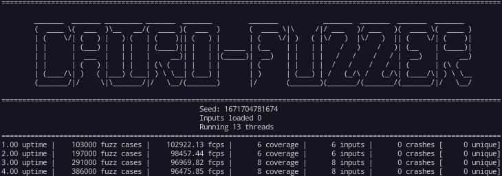

# Cairo-fuzzer

[Cairo-fuzzer](https://github.com/FuzzingLabs/cairo-fuzzer) is a tool designed for smart contract developers to test the security. It can be used as an independent tool or as a library.

## Features:



- Run Cairo contract
- Run Starknet contract
- Replayer of fuzzing corpus
- Minimizer of fuzzing corpus
- Load old corpus
- Handle multiple arguments
- Workspace architecture
- Import dictionnary
- Use Cairo-fuzzer as a library

## Usage:

```bash
cargo run --release -- --cores 3 --contract tests/fuzzinglabs.json --function "Fuzz_symbolic_execution"

For more usage information, follow our tutorial
CMDLINE (--help):

Usage: cairo-fuzzer [OPTIONS]

Options:
      --cores <CORES>              Set the number of threads to run [default: 1]
      --contract <CONTRACT>        Set the path of the JSON artifact to load [default: ]
      --function <FUNCTION>        Set the function to fuzz [default: ]
      --workspace <WORKSPACE>      Workspace of the fuzzer [default: fuzzer_workspace]
      --inputfolder <INPUTFOLDER>  Path to the inputs folder to load [default: ]
      --crashfolder <CRASHFOLDER>  Path to the crashes folder to load [default: ]
      --inputfile <INPUTFILE>      Path to the inputs file to load [default: ]
      --crashfile <CRASHFILE>      Path to the crashes file to load [default: ]
      --logs                       Enable fuzzer logs in file
      --seed <SEED>                Set a custom seed (only applicable for 1 core run)
      --run-time <RUN_TIME>        Number of seconds this fuzzing session will last
      --config <CONFIG>            Load config file
      --replay                     Replay the corpus folder
      --minimizer                  Minimize Corpora
  -h, --help                       Print help information
```
