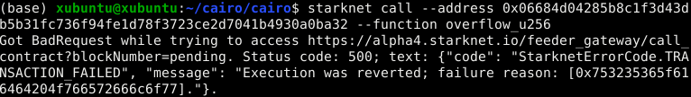
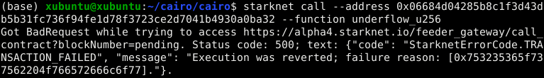
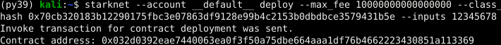

# Security Considerations

In blockchain programming, understanding and mitigating smart contract vulnerabilities is vital to maintain user trust. This is as true for Cairo as any other language.

We'll cover common security issues and Starknet-specific vulnerabilities in Cairo, along with strategies to safeguard your contracts.

Your insights can enhance this chapter. To contribute, submit a pull request to the [Book repo](https://github.com/starknet-edu/starknetbook).

> Note: Some code examples here are simplified pseudo-code, meant for concept explanation, not for production use.

## 1. Access Control

Access control vulnerabilities occur when a smart contract's functions are insufficiently protected, allowing unauthorized actions. This can result in unexpected behavior and data manipulation.

Take, for instance, a smart contract for token minting without proper access control:

```rust
#[starknet::contract]
mod Token {
    #[storage]
    struct Storage {
        total_supply: u256, // Stores the total supply of tokens.
    }

    #[external(v0)]
    impl ITokenImpl of IToken {
        fn mint_tokens(ref self: ContractState, amount: u256) {
            // The mint_tokens function updates the total supply.
            // Without access control, any user can call this function, posing a risk.
            self.total_supply.write(self.total_supply.read() + amount);
        }
    }
}
```

In this code, the `mint_tokens` function is vulnerable because any user can call it, leading to potential token supply exploitation. Implementing access controls would restrict this function to authorized users only.

### Recommendation

To prevent access control vulnerabilities, integrate authorization mechanisms like role-based access control (RBAC) or ownership checks. You can develop a custom solution or use templates from sources like [OpenZeppelin](https://docs.openzeppelin.com/contracts-cairo/access).

In our earlier example, we can enhance security by adding an owner variable, initializing the owner in the constructor, and including a verification in the `mint_tokens` function to allow only the owner to mint tokens.

```rust
#[starknet::contract]
mod Token {

    #[storage]
    struct Storage {
        owner: ContractAddress, // New variable to store the contract owner's address.
        total_supply: u256,
    }

    #[constructor]
    fn constructor(ref self: ContractState,) {
        let sender = get_caller_address(); // Get the address of the contract creator.
        self.owner.write(sender); // Set the creator as the owner.
    }

    #[external(v0)]
    impl ITokenImpl of IToken {
        fn mint_tokens(ref self: ContractState, amount: u256) {
            // Check if the caller is the owner before minting tokens.
            let sender = get_caller_address();
            assert(sender == self.owner.read()); // Assert ensures only the owner can mint.

            self.total_supply.write(self.total_supply.read() + amount);
        }
    }
}
```

By establishing robust access control, you ensure that only authorized entities execute your smart contract functions, significantly reducing the risk of unauthorized interference.

## 2. Reentrancy

Reentrancy vulnerabilities arise when a smart contract calls an external contract before updating its state. This allows the external contract to recursively call the original function, potentially leading to unintended behavior.

Consider a game contract where whitelisted addresses can mint an NFT sword and then execute an `on_receive_sword()` function before returning it. This NFT contract is at risk of a reentrancy attack, where an attacker can mint multiple swords.

```rust
#[storage]
struct Storage {
    available_swords: u256, // Stores available swords.
    sword: LegacyMap::<ContractAddress, u256>, // Maps swords to addresses.
    whitelisted: LegacyMap::<ContractAddress, u256>, // Tracks whitelisted addresses.
    ...
    ...
}

#[constructor]
fn constructor(ref self: ContractState,) {
    self.available_swords.write(100); // Initializes the sword count.
}

#[external(v0)]
impl IGameImpl of IGame {
    fn mint_one_sword(ref self: ContractState) {
        let sender = get_caller_address();
        if self.whitelisted.read(sender) {
            // Update the sword count before minting.
            let sword_count = self.available_swords.read();
            self.available_swords.write(sword_count - 1);
            // Mint a sword.
            self.sword.write(sender, 1);
            // Callback to sender's contract.
            let callback = ICallerDispatcher { contract_address: sender }.on_receive_sword();
            // Remove sender from whitelist after callback to prevent reentrancy.
            self.whitelisted.write(sender, false);
        }
}
```

An attacker's contract can implement the `on_receive_sword` function to exploit the reentry vulnerability and mint multiple swords by calling `mint_one_sword` again before removing the sender from the `whitelist`:

```rust
fn on_receive_sword(ref self: ContractState) {
    let nft_sword_contract = get_caller_address();
    let call_number: felt252 = self.total_calls.read();
    self.total_calls.write(call_number + 1);
    if call_number < 10 {
        // Attempt to mint a sword again.
        let call = ISwordDispatcher { contract_address: nft_sword_contract }.mint_one_sword();
    }
}
```

Reentrancy protections are critical in many ERC standards with `safeTransfer` functions (like ERC721, ERC777, ERC1155, ERC223) and in flash loans, where borrower contracts need to safely use and return funds.

### Recommendation:

To prevent reentrancy attacks, use the check-effects-interactions pattern. This means updating your contract's internal state before interacting with external contracts. In the previous example, remove the sender from the whitelist before making the external call.

```rust
if self.whitelisted.read(sender) {
    // Update the sword count first.
    let sword_count = self.available_swords.read();
    self.available_swords.write(sword_count - 1);
    // Mint a sword to the caller.
    self.sword.write(sender, 1);
    // Crucially, remove the sender from the whitelist before the external call.
    self.whitelisted.write(sender, false);
    // Only then, make the callback to the sender.
    let callback = ICallerDispatcher { contract_address: sender }.on_receive_sword();
}
```

Adhering to this pattern enhances the security of your smart contract by minimizing the risk of reentrancy attacks and preserving the integrity of its internal state.

## 3. Tx.Origin Authentication

In Solidity, `tx.origin` is a global variable that stores the address of the transaction initiator, while `msg.sender` stores the address of the transaction caller. In Cairo, we have the `account_contract_address` global variable and `get_caller_address` function, which serve the same purpose.

Using `account_contract_address` (the equivalent of `tx.origin`) for authentication in your smart contract functions can lead to phishing attacks. Attackers can create custom smart contracts and trick users into placing them as intermediaries in a transaction call, effectively impersonating the contract owner.

For example, consider a Cairo smart contract that allows transferring funds to the owner and uses `account_contract_address` for authentication:

```rust
use starknet::get_caller_address;
use box::BoxTrait;

struct Storage {
    owner: ContractAddress, // Stores the owner's address.
}

#[constructor]
fn constructor(){
    // Initialize the owner as the contract deployer.
    let contract_deployer = get_caller_address();
    self.owner.write(contract_deployer)
}

#[external(v0)]
impl ITokenImpl of IToken {
    fn transferTo(ref self: ContractState, to: ContractAddress, amount: u256) {
        let tx_info = starknet::get_tx_info().unbox();
        let authorizer: ContractAddress = tx_info.account_contract_address;
        // Verifies the transaction initiator as the owner.
        assert(authorizer == self.owner.read());
        // Processes the fund transfer.
        self.balance.write(to + amount);
    }
}
```

An attacker can trick the owner into using a malicious contract, allowing the attacker to call the `transferTo` function and impersonate the contract owner:

```rust
#[starknet::contract]
mod MaliciousContract {
...
...
#[external(v0)]
impl IMaliciousContractImpl of IMaliciousContract {
    fn transferTo(ref self: ContractState, to: ContractAddress, amount: u256) {
        // Malicious callback to transfer funds.
        let callback = ICallerDispatcher { contract_address: sender }.transferTo(ATTACKER_ACCOUNT, amount);
    }
}
```

### Recommendation:

To guard against phishing attacks, replace `account_contract_address` (origin) authentication with `get_caller_address` (sender) in the `transferTo` function:

```rust
use starknet::get_caller_address;

struct Storage {
    owner: ContractAddress, // Stores the owner's address.
}

#[constructor]
fn constructor(){
    // Initialize the owner as the contract deployer.
    let contract_deployer = get_caller_address();
    self.owner.write(contract_deployer)
}

#[external(v0)]
impl ITokenImpl of IToken {
    fn transferTo(ref self: ContractState, to: ContractAddress, amount: u256) {
        let authorizer = get_caller_address();
        // Verify that the caller is the owner.
        assert(authorizer == self.owner.read());
        // Execute the fund transfer.
        self.balance.write(to + amount);
    }
}
```

This change ensures secure authentication, preventing unauthorized users from executing critical functions and safeguarding against phishing attempts.

## 4. Handling Overflow and Underflow in Smart Contracts

Overflow and underflow vulnerabilities arise from assigning values too large (overflow) or too small (underflow) for a specific data type.

Consider the `felt252` data type: adding or subtracting values beyond its range can yield incorrect results:

```rust
    fn overflow_felt252() -> felt252 {
        // Assigns the maximum felt252 value: 2^251 + 17 * 2^192
        let max: felt252 = 3618502788666131106986593281521497120414687020801267626233049500247285301248 + 17 * 6277101735386680763835789423207666416102355444464034512896;
        // Attempting to add beyond the maximum value.
        max + 3
    }

    fn underflow_felt252() -> felt252 {
        let min: felt252 = 0;
        // Same maximum value as in overflow.
        let subtract = (3618502788666131106986593281521497120414687020801267626233049500247285301248 + 17 * 6277101735386680763835789423207666416102355444464034512896);
        // Subtracting more than the minimum, leading to underflow.
        min - subtract
    }
```

Executing these functions will result in incorrect values due to overflow and underflow, as illustrated in the following image:


### Recommendation:

To prevent incorrect results, use protected data types like `u128` or `u256`, which are designed to manage overflows and underflows.

Here's how you can use the `u256` data type to handle these issues:

```rust
    fn overflow_u256() -> u256 {
        let max_u128: u128 = 0xffffffffffffffffffffffffffffffff_u128; // Maximum u128 value.
        let max: u256 = u256 { low: max_u128, high: max_u128 }; // Maximum u256 value.
        let three: u256 = u256 { low: 3_u128, high: 0_u128 }; // Value of 3.
        max + three // Attempting to add beyond max, will trigger overflow protection.
    }

    fn underflow_u256() -> u256 {
        let min: u256 = u256 { low: 0_u128, high: 0_u128 }; // Zero value for u256.
        let three: u256 = u256 { low: 3_u128, high: 0_u128 }; // Value of 3.
        min - three // Attempting to subtract from zero, will trigger underflow protection.
    }
```

When these functions encounter overflows or underflows, the transaction will revert, as shown in these images:




Failure reasons for `u256`:

- Overflow: `0x753235365f616464204f766572666c6f77=u256_add Overflow`
- Underflow: `0x753235365f737562204f766572666c6f77=u256_sub Overflow`

Similarly, the `u128` data type can be used to handle overflow and underflow:

```rust
    fn overflow_u128() -> u128 {
        let max: u128 = 0xffffffffffffffffffffffffffffffff_u128; // Maximum u128 value.
        max + 3_u128 // Adding to max, overflow protection triggers if necessary.
    }

    fn underflow_u128() -> u128 {
        let min: u128 = 0_u128; // Zero value for u128.
        min - 3_u128 // Subtracting from zero, underflow protection activates if needed.
    }
```

Overflow or underflow in u128 will similarly revert the transaction, with corresponding failure reasons:


Failure reasons for u128:

- Overflow: `0x753132385f616464204f766572666c6f77=u128_add Overflow`
- Underflow: `0x753132385f737562204f766572666c6f77=u128_sub Overflow`

Using these data types, you can ensure safer arithmetic operations in your smart contracts, avoiding unintended consequences of overflows and underflows.

## 5. Private Data On-Chain.

Storing secret values in smart contracts presents a challenge because all on-chain data is publicly accessible, even if the code isn't published. For example, consider a smart contract storing a password (12345678) using a constructor parameter:

```rust
#[starknet::contract]
mod StoreSecretPassword {
    struct Storage {
        password: felt252, // Field to store the password.
    }

    #[constructor]
    fn constructor(_password: felt252) {
        // Writing the password to the storage.
        self.password.write(_password);
    }
}
```



However, understanding Cairo's [storage layout](https://book.cairo-lang.org/ch13-01-contract-storage.html), we can create a script to read the stored variable:

```javascript
import { Provider, hash } from "starknet";

const provider = new Provider({
  sequencer: {
    network: "goerli-alpha",
  },
});

var passHash = hash.starknetKeccak("password");
console.log(
  "getStor=",
  await provider.getStorageAt(
    "0x032d0392eae7440063ea0f3f50a75dbe664aaa1df76b4662223430851a113369",
    passHash,
    812512,
  ),
);
```

Executing this script reveals the stored password value (hex value of 12345678):


Moreover, using a block explorer, we can view the deployed parameters in the transaction:


### Recommendation:

If your smart contract requires storing private data on-chain, consider off-chain encryption before sending data to the blockchain. Alternatively, explore options like hashes, merkle trees, or commit-reveal patterns to maintain data privacy.

## 6. Denial of Service.

Denial of Service (DoS), also called griefing attack, entails a situation where the atacker causes grief for other users of the protocol. A DoS attacker cripples the functionality of a Smart Contract even if they gain no economic value from doing so. A major attack vector when it comes to Denial of Service is the gas exhaustion attack. In this attack, a malicious user can call a function that needs an excessive amount of gas for execution. The consequent exhaustion of gas can cause the smart contract to stop, thus denying services to legitimate users.

```rust
    use starknet::ContractAddress;
    mod DoS {
        #[storage]
        struct Storage{
            // Stored variables
        }


        #[external(v0)]
        impl ITransactionImpl of ITransaction{
             fn transaction(ref self:ContractState, ) {

                   loop {
                    // very expensive computation
                   }
            }
        }
    }
```

The minimalist contract above shows a transaction that would need intensive computation. The occurrence could result from an attacker calling the `transaction` function many times, leading to gas exhaustion.

### Recommendation:

The smart contract has to be minimized as much as possible to reduce gas consumption. Gas limits could also be incorporated when designing functions. The developer should also try to estimate gas usage every step, to ensure that all aspects are carefully accounted for.

## Call for Contributions: Additional Vulnerabilities

We've discussed several common vulnerabilities in Cairo smart contracts, but many other security risks need attention. We invite community contributions to expand this chapter with more vulnerabilities:

- Storage Collision
- Flash Loan Attacks
- Oracle Manipulation
- Bad Randomness
- Untrusted Delegate Calls
- Public Burn

If you have expertise in these areas, please consider contributing your knowledge, including explanations and examples of these vulnerabilities. Your input will greatly benefit the Starknet and Cairo developer community, aiding in the development of more secure and resilient smart contracts.

We appreciate your support in enhancing the safety and security of the Starknet ecosystem for developers and users alike.
