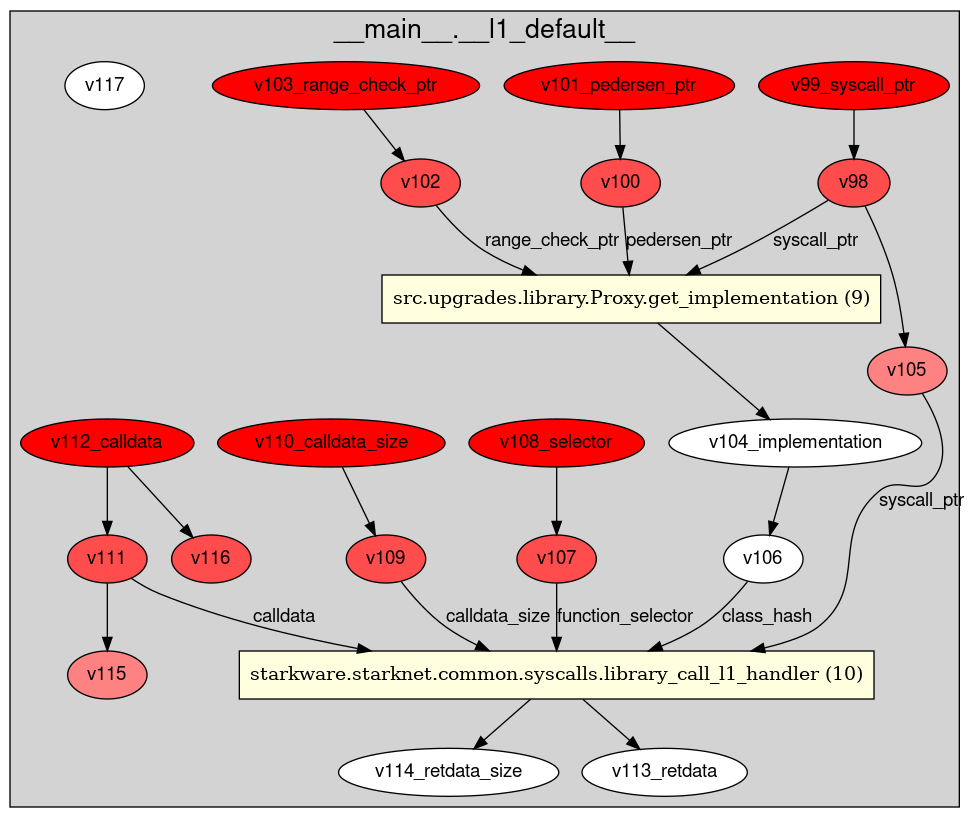

# Thoth

[Thoth](https://github.com/FuzzingLabs/thoth) (pronounced "taut" or "toss") is a security toolkit for Cairo/Starknet. Written in Python 3, it includes analyzers, disassemblers, and decompilers. Thoth is capable of generating call graphs, control-flow graphs (CFG), and data-flow graphs for Sierra files or Cairo/Starknet compilation artifacts. It also features tools like a symbolic execution engine and a symbolic bounded model checker.

## Features

- **Remote & Local Analysis**: Works with contracts on Mainnet/Goerli and local compilations.
- **Decompiler**: Transforms assembly into decompiled code using SSA (Static Single Assignment).
- **Call Flow Analysis**: Generates Call Flow Graphs.
- **Static Analysis**: Conducts various types of analyses (security/optimization/analytics) on contracts.
- **Symbolic Execution**: Finds variable values for specific paths in functions and generates test cases.
- **Data Flow Analysis**: Produces Data Flow Graphs (DFG) for each function.
- **Disassembler**: Converts bytecode to assembly.
- **Control Flow Analysis**: Creates Control Flow Graphs (CFG).
- **Cairo Fuzzer Inputs**: Generates inputs for Cairo fuzzer.
- **Sierra Files Analysis**: Analyzes Sierra files.
- **Sierra Files Symbolic Execution**: Performs symbolic execution on Sierra files.
- **Symbolic Bounded Model Checker**: Functions as a symbolic bounded model checker.

  

## Installation

Install Thoth using the following commands:

```bash
sudo apt install graphviz
git clone https://github.com/FuzzingLabs/thoth && cd thoth
pip install .
thoth -h
```
