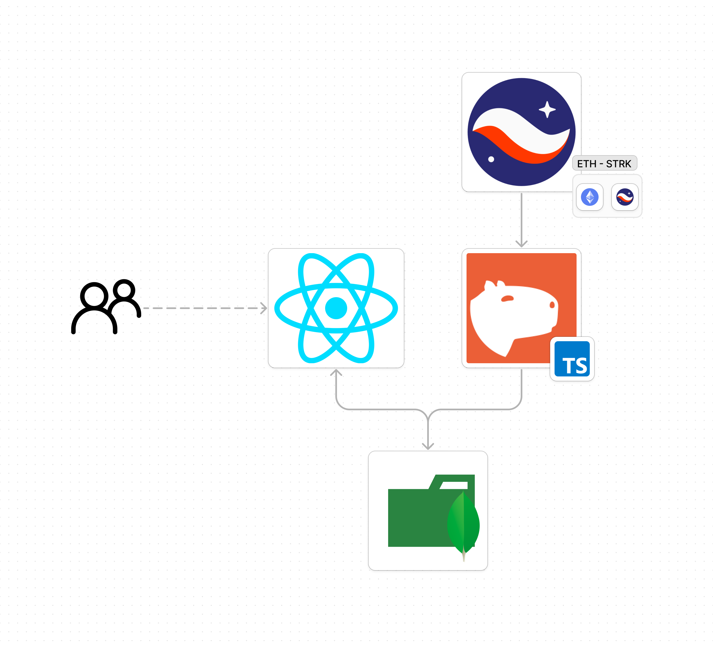

# Apibara

Apibara is the fastest platform to build production-grade indexers that connect onchain data to web2 services.
More [here](https://apibara.com/).

## What is an indexer?

An indexer is a service that listens to the blockchain and indexes the data you are interested in.
It makes it easy to query the blockchain data and build applications on top of it.

## What can you build with Apibara?

- Real-time NFT collections dashboard
- Real-time swaps dashboard

## Building an exmaple

In this example, we will build a small app similar to the concept [Starkscan](https://starkscan.io/) but that will solely listen to swaps happening on AVNU in real-time.
For the fronted we will use react.

Apibara offers his [direct access node](https://github.com/apibara/dna) that we will use to listen to the swaps.



## Get an Apibara API Key

Head to [Apibara](https://app.apibara.com/), sign up and create a new indexer.
You can choose between:

- DNA (Direct Node Access) Key. You can use Python SDK or Typescript SDK.
- Webhook

We will use the DNA key to listen to the swaps happening on AVNU.
You will get a key something like:

```
dna_ytgQur8CpufdaOQAEZ0w
```

Save it, we will use it later.

## Set the server

We will use Apibara's [TypeScript SDK](https://github.com/apibara/typescript-sdk/tree/main) to set a server script that will listen to the swaps happening on AVNU.

Apibara itself offers and example of usage [TypeScript Example](https://github.com/apibara/typescript-sdk/tree/main/examples/starknet-client).
First, ensure you have Node.js and npm installed on your machine. You can check by running `node -v` and `npm -v` in your terminal. If you don't have them installed, download and install from [Node.js official website](https://nodejs.org/).

Next, create a new directory for your project and navigate into it:

```bash
mkdir apibara-server
cd apibara-server
```

```bash
npm init -y
```

Install apibara's dependencies and some other dependencies we will use:

```bash
npm install @apibara/protocol @apibara/startknet starknet ethers dotenv
```

Create a file called `index.ts` and add the following code:

```typescript
import { StreamClient } from "@apibara/protocol";
import {
  Filter,
  StarkNetCursor,
  v1alpha2,
  FieldElement,
} from "@apibara/starknet";
import { RpcProvider, constants, provider, uint256 } from "starknet";
import { formatUnits } from "ethers";
import * as dotenv from "dotenv";
import { MongoDBService } from "./MongoDBService";
import { BlockNumber } from "starknet";
dotenv.config();

const tokensDecimals = [
  {
    //ETH
    ticker: "ETH",
    decimals: 18,
    address:
      "0x049d36570d4e46f48e99674bd3fcc84644ddd6b96f7c741b1562b82f9e004dc7",
  },
  {
    //USDT
    ticker: "USDT",
    decimals: 6,
    address:
      "0x068f5c6a61780768455de69077e07e89787839bf8166decfbf92b645209c0fb8",
  },
  {
    //USDC
    ticker: "USDC",
    decimals: 6,
    address:
      "0x053c91253bc9682c04929ca02ed00b3e423f6710d2ee7e0d5ebb06f3ecf368a8",
  },
  {
    //STRK
    ticker: "STRK",
    decimals: 18,
    address:
      "0x04718f5a0fc34cc1af16a1cdee98ffb20c31f5cd61d6ab07201858f4287c938d",
  },
];

async function main() {
  try {
    // Apibara streaming
    const client = new StreamClient({
      url: "mainnet.starknet.a5a.ch",
      token: process.env.APIBARA_TOKEN,
      async onReconnect(err, retryCount) {
        console.log("reconnect", err, retryCount);
        // Sleep for 1 second before retrying.
        await new Promise((resolve) => setTimeout(resolve, 1000));

        return { reconnect: true };
      },
    });

    const provider = new RpcProvider({
      nodeUrl: constants.NetworkName.SN_MAIN,
      chainId: constants.StarknetChainId.SN_MAIN,
    });
    const hashAndBlockNumber = await provider.getBlockLatestAccepted();
    const block_number = hashAndBlockNumber.block_number;
    // The address of the swap event
    const key = FieldElement.fromBigInt(
      BigInt(
        "0xe316f0d9d2a3affa97de1d99bb2aac0538e2666d0d8545545ead241ef0ccab",
      ),
    );
    // The contract that emits the event. The AVNU swap contract
    const address = FieldElement.fromBigInt(
      BigInt(
        "0x04270219d365d6b017231b52e92b3fb5d7c8378b05e9abc97724537a80e93b0f",
      ),
    );

    //Initialize the filter
    const filter_test = Filter.create()
      .withHeader({ weak: false })
      .addEvent((ev) => ev.withFromAddress(address).withKeys([key]))
      .encode();

    // Configure the apibara client
    client.configure({
      filter: filter_test,
      batchSize: 1,
      cursor: StarkNetCursor.createWithBlockNumber(block_number),
    });

    // Start listening to messages
    for await (const message of client) {
      switch (message.message) {
        case "data": {
          if (!message.data?.data) {
            continue;
          }
          for (const data of message.data.data) {
            const block = v1alpha2.Block.decode(data);
            const { header, events, transactions } = block;
            if (!header || !transactions) {
              continue;
            }
            console.log("Block " + header.blockNumber);
            console.log("Events", events.length);

            for (const event of events) {
              console.log(event);
              if (event.event && event.receipt) {
                handleEventAvnuSwap(header, event.event, event.receipt);
              }
            }
          }
          break;
        }
        case "invalidate": {
          break;
        }
        case "heartbeat": {
          console.log("Received heartbeat");
          break;
        }
      }
    }
  } catch (error) {
    console.error("Initialization failed", error);
    process.exit(1);
  }
}

main()
  .then(() => process.exit(0))
  .catch((error) => {
    console.error(error);
    process.exit(1);
  });

async function handleEventAvnuSwap(
  header: v1alpha2.IBlockHeader,
  event: v1alpha2.IEvent,
  receipt: v1alpha2.ITransactionReceipt,
) {
  console.log("STARTING TO HANDLE AVNUSWAP EVENT");
  if (!event.data) return null;

  const takerAddress = FieldElement.toHex(event.data[0]);
  const sellAddress = FieldElement.toHex(event.data[1]);

  const sellToken = tokensDecimals.find(
    (token) => token.address === sellAddress,
  );
  const sellAddressDecimals = sellToken?.decimals;
  if (!sellAddressDecimals) return null; // Skip if sell token is not supported

  const sellAmount = +formatUnits(
    uint256.uint256ToBN({
      low: FieldElement.toBigInt(event.data[2]),
      high: FieldElement.toBigInt(event.data[3]),
    }),
    sellAddressDecimals,
  );

  const buyAddress = FieldElement.toHex(event.data[4]);
  const buyToken = tokensDecimals.find((token) => token.address === buyAddress);
  const buyAddressDecimals = buyToken?.decimals;
  if (!buyAddressDecimals) return null; // Skip if buy token is not supported

  const buyAmount = +formatUnits(
    uint256.uint256ToBN({
      low: FieldElement.toBigInt(event.data[5]),
      high: FieldElement.toBigInt(event.data[6]),
    }),
    buyAddressDecimals,
  );

  const beneficiary = FieldElement.toHex(event.data[7]);

  if (header.blockNumber == null) {
    return null;
  }
  console.log("FINISHED HANDLING AVNUSWAP EVENT");
  const swapData = {
    exchange: "avnu-swap",
    sell_token: sellAddress,
    buy_token: buyAddress,
    pair: `${sellToken?.ticker}-${buyToken?.ticker}`,
    block_number: +header.blockNumber,
    block_time: header.timestamp?.seconds?.toString(),
    timestamp: new Date().toISOString(),
    transaction_hash: FieldElement.toHex(
      receipt.transactionHash ?? FieldElement.fromBigInt(BigInt(0)),
    ),
    taker_address: takerAddress,
    sell_amount: sellAmount,
    buy_amount: buyAmount,
    beneficiary_address: beneficiary,
  };
  try {
    await MongoDBService.insertSwapData("swaps", swapData);
    console.log("AvnuSwap data saved to MongoDB");
  } catch (error) {
    console.error("Failed to save AvnuSwap data to MongoDB", error);
  }
}
```

Now let's explain the core parts of the code:

1. Set the apibara streaming client. Here we create an apibara client with the url and the token we got from the apibara dashboard.

```typescript
async function main() {
  try {
    // Apibara streaming
    const client = new StreamClient({
      url: 'mainnet.starknet.a5a.ch',
      token: process.env.APIBARA_TOKEN,
      async onReconnect(err, retryCount) {
        console.log('reconnect', err, retryCount)
        // Sleep for 1 second before retrying.
        await new Promise((resolve) => setTimeout(resolve, 1000))

        return { reconnect: true }
      },
    })

```

Have in mind that the url is the mainnet url, but you can also use the testnet url.

```bash
https://goerli.starknet.a5a.ch
https://mainnet.starknet.a5a.ch
https://sepolia.starknet.a5a.ch
```

2. Get the latest block number. We will use the latest block number to set the cursor of the apibara client.

```typescript
const provider = new RpcProvider({
  nodeUrl: constants.NetworkName.SN_MAIN,
  chainId: constants.StarknetChainId.SN_MAIN,
});
const hashAndBlockNumber = await provider.getBlockLatestAccepted();
const block_number = hashAndBlockNumber.block_number;
```

3. Set the filter. This is the key part where we indicate to the apibara client what we want to listen to.
   In this case, we want to listen to the swaps events happening on the AVNU swap contract.

```typescript
const key = FieldElement.fromBigInt(
  BigInt("0xe316f0d9d2a3affa97de1d99bb2aac0538e2666d0d8545545ead241ef0ccab"),
);
const address = FieldElement.fromBigInt(
  BigInt("0x04270219d365d6b017231b52e92b3fb5d7c8378b05e9abc97724537a80e93b0f"),
);
const filter_test = Filter.create()
  .withHeader({ weak: false })
  .addEvent((ev) => ev.withFromAddress(address).withKeys([key]))
  .encode();
```

4. Configure the apibara client. Here we set the filter, the batch size, and the cursor.

```typescript
client.configure({
  filter: filter_test,
  batchSize: 1,
  cursor: StarkNetCursor.createWithBlockNumber(block_number),
});
```

5. Start listening to the messages. Here we listen to the messages and handle the events.

```typescript
for await (const message of client) {
  switch (message.message) {
    case "data": {
      if (!message.data?.data) {
        continue;
      }
      for (const data of message.data.data) {
        const block = v1alpha2.Block.decode(data);
        const { header, events, transactions } = block;
        if (!header || !transactions) {
          continue;
        }
        for (const event of events) {
          console.log(event);
          if (event.event && event.receipt) {
            handleEventAvnuSwap(header, event.event, event.receipt);
          }
        }
      }
      break;
    }
    case "invalidate": {
      break;
    }
    case "heartbeat": {
      console.log("Received heartbeat");
      break;
    }
  }
}
```

5. Handling the events. Here we handle the events and save the swaps data to a MongoDB.

```typescript
async function handleEventAvnuSwap(
  header: v1alpha2.IBlockHeader,
  event: v1alpha2.IEvent,
  receipt: v1alpha2.ITransactionReceipt,
) {
  console.log("STARTING TO HANDLE AVNUSWAP EVENT");
  if (!event.data) return null;

  const takerAddress = FieldElement.toHex(event.data[0]);
  const sellAddress = FieldElement.toHex(event.data[1]);

  //...
  //Parse the data
  //...

  console.log("FINISHED HANDLING AVNUSWAP EVENT");
  const swapData = {
    exchange: "avnu-swap",
    sell_token: sellAddress,
    buy_token: buyAddress,
    pair: `${sellToken?.ticker}-${buyToken?.ticker}`,
    block_number: +header.blockNumber,
    block_time: header.timestamp?.seconds?.toString(),
    timestamp: new Date().toISOString(),
    transaction_hash: FieldElement.toHex(
      receipt.transactionHash ?? FieldElement.fromBigInt(BigInt(0)),
    ),
    taker_address: takerAddress,
    sell_amount: sellAmount,
    buy_amount: buyAmount,
    beneficiary_address: beneficiary,
  };
  try {
    await MongoDBService.insertSwapData("swaps", swapData);
    console.log("AvnuSwap data saved to MongoDB");
  } catch (error) {
    console.error("Failed to save AvnuSwap data to MongoDB", error);
  }
}
```

If you want to get the full code, you can find it [here](https://github.com/starknet-edu/starknetbook/tree/0919a1974f2474c00690233a1c50d30386aca300/examples).

## Run the server

To run the server, you will need to have a MongoDB running. You can use a local MongoDB or a cloud MongoDB like [MongoDB Atlas](https://www.mongodb.com/cloud/atlas).
Remember to replace the `MONGODB_URI` with your MongoDB URI.

```bash
MONGODB_URI="mongodb:xxx"
```

To run the server, you can use the following command:

```bash
npm run start
```

## Lets see it in action

No that we have apibara streaming the swap objects into our MongoDB, we can build a frontend to display the swaps in real-time.
Please see the example in [here](https://github.com/starknet-edu/starknetbook/tree/0919a1974f2474c00690233a1c50d30386aca300/examples).

Since, this go out of the scope of this book, we will not cover the frontend part.

## Conclusion

This is a simple example of how to use apibara to listen to swaps happening on AVNU in real-time.
You can index your NFT collection, listen to swaps, or any other event you are interested in and build a frontend to display the data in real-time.

## Resources

- [Apibara Example Workshop](https://www.youtube.com/watch?v=XCxAvuutks4&t=428s&ab_channel=StarkWare)
