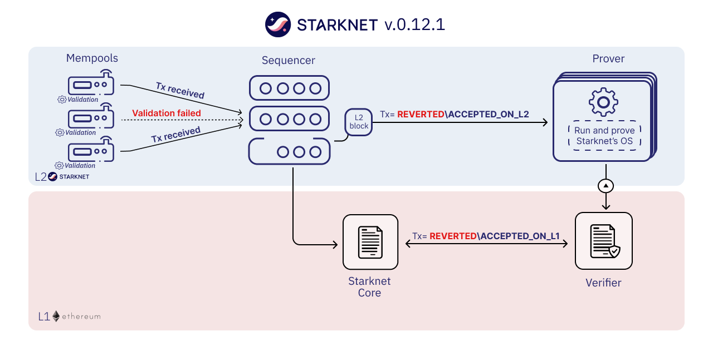
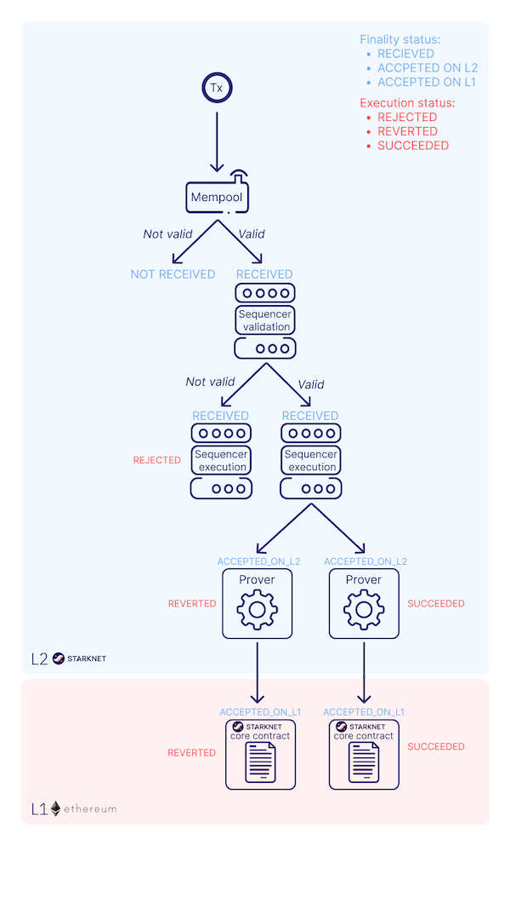

# Transactions Lifecycle

This chapter outlines the path of a Starknet transaction from its initiation to its finalization.

Starknet processes transactions in distinct steps:

- A transaction starts by being sent to a gateway, a node, which acts as the Mempool.
- The Sequencer, currently a single service, first validates and then executes the transactions in order.
  - If validated successfully, the status becomes RECEIVED.
  - If not, the status is REJECTED.
  - Successfully executed transactions are applied to the state and marked as ACCEPTED_ON_L2.
  - Failed transactions during this phase are REVERTED.
- In the Prover stage, the system operates on the new block, computes its proof, and sends it to L1.

The following image shows the transaction flow:



Before exploring each step in-depth, let's clarify the different transaction statuses.

Each transaction has two primary status types:

- **finality_status**: Reflects the transaction's finality. Possible values are:
  - RECEIVED: The transaction passed Mempool validation but hasn't been included in a block.
  - ACCEPTED_ON_L2 and ACCEPTED_ON_L1: The transaction was added to a block on L2 or L1, respectively.
- **execution_status**: Indicates the transaction's execution outcome. Values include:
  - REJECTED, REVERTED, or SUCCEEDED.

To obtain this information, query the transaction receipt returned by the Nodes. Refer to the Tooling chapter in the Starknet Book for methods like the `transaction_receipt` command in starkli or the `fetch_transaction_receipt` method in the starknet-py library. We will use these tools throughout this chapter.

## Nonces in Starknet

Initially, Starknet did not incorporate nonces. This omission meant that the same transaction could be sent multiple times with an identical nonce, leading to duplicate hashes—a problem. In Ethereum, nonces not only sequence transactions but also ensure each has a unique hash. Similarly, Starknet employs nonces to assign a distinct hash to every transaction.

Starknet's current stance on nonces mandates that they be sequential. In other words, when you transmit a transaction from your account, its nonce must precisely follow the previous transaction's nonce.

Although nonce abstraction would allow developers to manage this logic at the smart contract level, Starknet is reviewing this feature. However, its implementation is not deemed a priority.

## Transaction Creation

A transaction starts with its preparation. The sender:

1. Queries their account nonce, which acts as a unique identifier for the transaction.
2. Signs the transaction.
3. Sends it to their Node.

The Node, analogous to a post office, receives the transaction and broadcasts it on the Starknet network, primarily to the Sequencer. As the network evolves, the transaction will be broadcasted to multiple Sequencers.

Before broadcasting the transaction to the Sequencer, the gateways perform a validation step, such as checking that the max fee exceeds a minimum fee and the account's balance is greater than the max fee. The transaction will be saved in the storage if the validation function passes.

## The Sequencer's Role

On receiving the transaction, the Sequencer acknowledges its receipt but hasn't processed it yet—similar to Ethereum's mempool state.

Sequencer's Process:

1. Receive the transaction.
2. Validate it.
3. Execute it.
4. Update the state.

Remember, Starknet processes transactions sequentially. The nonce won't change until the Sequencer processes the transaction. This can complicate backend application development, potentially causing errors if sending multiple transactions consecutively.

## Acceptance on Layer-2 (L2)

Once the Sequencer validates and executes a transaction, it updates the state without waiting for block creation. The transaction finality status changes from 'RECEIVED' to 'ACCEPTED ON L2' at this stage and the execution status to 'SUCCEEDED'.

Following the state update, the transaction is included in a block. However, the block isn't emitted immediately. The Sequencer decides the opportune moment to emit the block, either when there are enough transactions to form a block or after a certain time has passed. When the block is emitted, the block becomes available for other Nodes to query.

The transaction will have the following status:

- Finality status: ACCEPTED_ON_L2
- Execution status: SUCCEEDED

If a transaction fails during execution, it will be included in the block with the status 'REVERTED'. In other words, REVERTED transactions

It's essential to remember that at this stage, no proof has been generated, and the transaction relies on L2 consensus for security against censorship. There remains a slim possibility of transaction reversal if all Sequencers collude. Therefore, these stages should be seen as different layers of transaction finality.

## Acceptance on Layer-1 (L1)

The final step in the transaction's lifecycle is its acceptance on Layer-1 (L1). A Prover receives the block containing the transaction, re-executes the block, generates a proof, and sends it to Ethereum. Specifically, the proof is sent to a smart contract on Ethereum called the Verifier smart contract, which checks the proof's validity. If valid, the transaction's status changes to 'accepted on L1', signifying the transaction's security by Ethereum consensus.

Transaction Status Transition:

1. Accepted on L2 -> Accepted on L1

## [Optional] Transaction Finality in Starknet

Transaction finality refers to the point at which a transaction is considered irreversible and is no longer susceptible to being reversed or undone. It's the assurance that once a transaction is committed, it can't be altered or rolled back, hence securing the integrity of the transaction and the system as a whole.

Let's dive into the transaction finality in both Starknet and Ethereum, and how they compare.

### Ethereum Transaction Finality

Ethereum operates on a Proof of Stake (PoS) consensus mechanism. A transaction has the finality status when it is part of a block that can't change without a significant amount of ETH getting burned. The number of blocks required to ensure that a transaction won't be rolled back is called 'blocks to finality', and the time to create those blocks is called 'time to finality'.

It is considered to be an average of 6 blocks to reach the finality status; given that a new block is validated each 12 seconds, the average time to finality for a transaction is 75 seconds.

### Starknet Transaction Finality

Starknet, a Layer-2 (L2) solution on Ethereum, has a two-step transaction finality process. The first step is when the transaction gets accepted on Layer-2 (Starknet), and the second step is when the transaction gets accepted on Layer-1 (Ethereum).

Accepted on L2: When a transaction is processed by the Sequencer and included in a block on Starknet, it reaches L2 finality. However, this finality relies on the L2 consensus and comes with a slight risk of collusion among Sequencers leading to transaction reversal.
Accepted on L1: The absolute finality comes when the block containing the transaction gets a proof generated, the proof is validated by the Verifier contract on Ethereum, and the state is updated on Ethereum. At this point, the transaction is as secure as the Ethereum's PoS consensus can provide, meaning it becomes computationally infeasible to alter or reverse.

### Comparison

The main difference between Ethereum and Starknet's transaction finality lies in the stages of finality and their reliance on consensus mechanisms.

Ethereum's transaction finality becomes increasingly unlikely to be reversed as more blocks are added.
Starknet's finality process is two-fold. The initial finality (L2) is quicker but relies on L2 consensus and carries a small risk of collusion. The ultimate finality (L1) is slower, as it involves generation and validation of proofs and updates on Ethereum. However, once reached, it provides the same level of security as an Ethereum transaction.

## REJECTED Transactions

When a transaction passes validation in the Mempool but fails during the sequencer's **validate** phase, it receives the REJECTED status. Such transactions are not included in any block and maintain the `finality_status` as RECEIVED. This rejection can occur for reasons including:

- Check max_fee is higher than the minimal tx cost
- Check Account balance is at least max_fee
- Check nonce. A mismatched nonce, where the transaction's nonce doesn't align with the account's expected next nonce.
- Execute **validate** (here a repeated contract declaration will fail and the transaction will be rejected)
- Limit #txs per account in the Gateway

Such transaction will have the following status:

- Finality status: RECEIVED
- Execution status: REJECTED

To demonstrate a transaction with an invalid nonce, consider the Python code below (`get_transaction_receipt.py`). Using the `starknet-py` library, it fetches a rejected transaction:

```python
import asyncio
from starknet_py.net.gateway_client import GatewayClient

async def fetch_transaction_receipt(transaction_id: str, network: str = "testnet"):
    client = GatewayClient(network)
    call_result = await client.get_transaction_receipt(transaction_id)
    return call_result

receipt = asyncio.run(fetch_transaction_receipt("0x6d6e6575b85913ee8dfb170fe0db418f58f9422a0c6115350a79f9b38a1f5b8"))
print(receipt)
```

Execute the code with:

```bash
python3 get_transaction_receipt.py
```

The resulting transaction receipt will include:

```bash
execution_status=<TransactionExecutionStatus.REJECTED: 'REJECTED'>, finality_status=<TransactionFinalityStatus.RECEIVED: 'RECEIVED'>,
block_number=None,
actual_fee=0
```

It's important to note that the user isn't charged a fee because the transaction didn't execute in the Sequencer.

## Handling of Reverted Transactions

A transaction can be reverted due to failed execution, the transaction will still be included in a block, and the account will be charged for the resources consumed.

This adds a trust assumption for the Sequencer to be honest and non-censoring. In later versions, there will be an OS change that will enable the Sequencer to prove that a transaction failed and charge the correct amount of gas for it, thus making it censorship-resistant with provably failed transactions.

Transaction Status Transition

1. Received -> Reverted

## Transaction Lifecycle Summary

The following outlines the various steps in a transaction's lifecycle:



## Conclusion

The lifecycle of a Starknet transaction is a carefully curated journey, ensuring efficient, secure, and transparent transaction processing. It incorporates everything from transaction creation, Sequencer processing, Layer-2 and Layer-1 validation, to handling rejected and reverted transactions. By comprehending this lifecycle, developers and users can better navigate the Starknet ecosystem and leverage its capabilities to the fullest.
