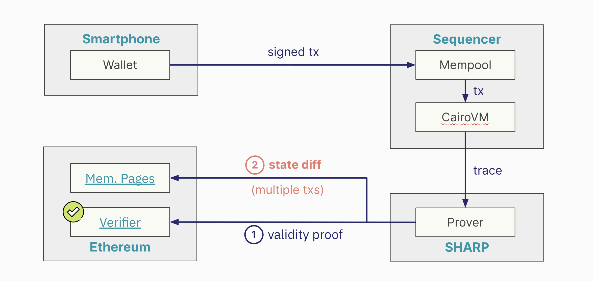
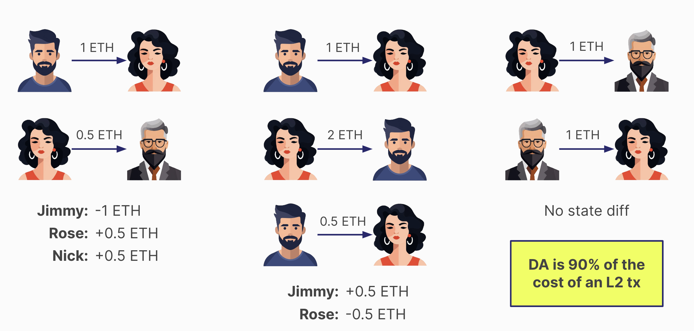
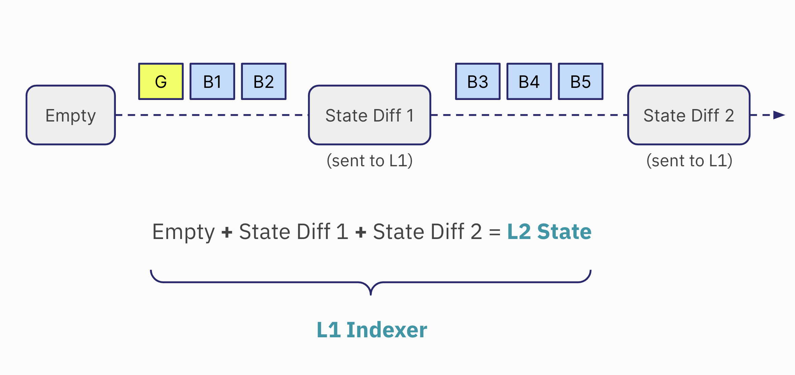
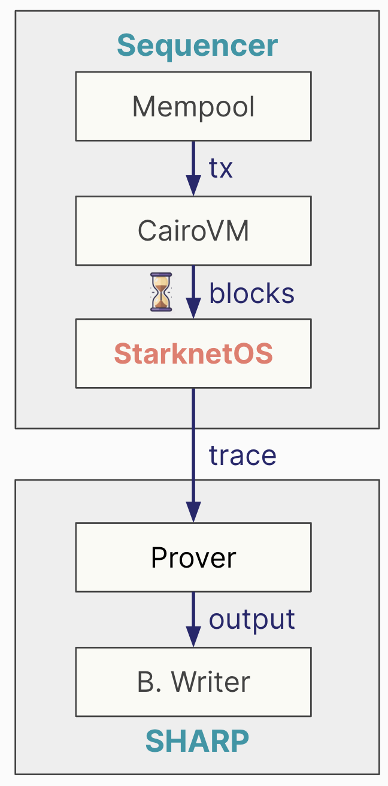
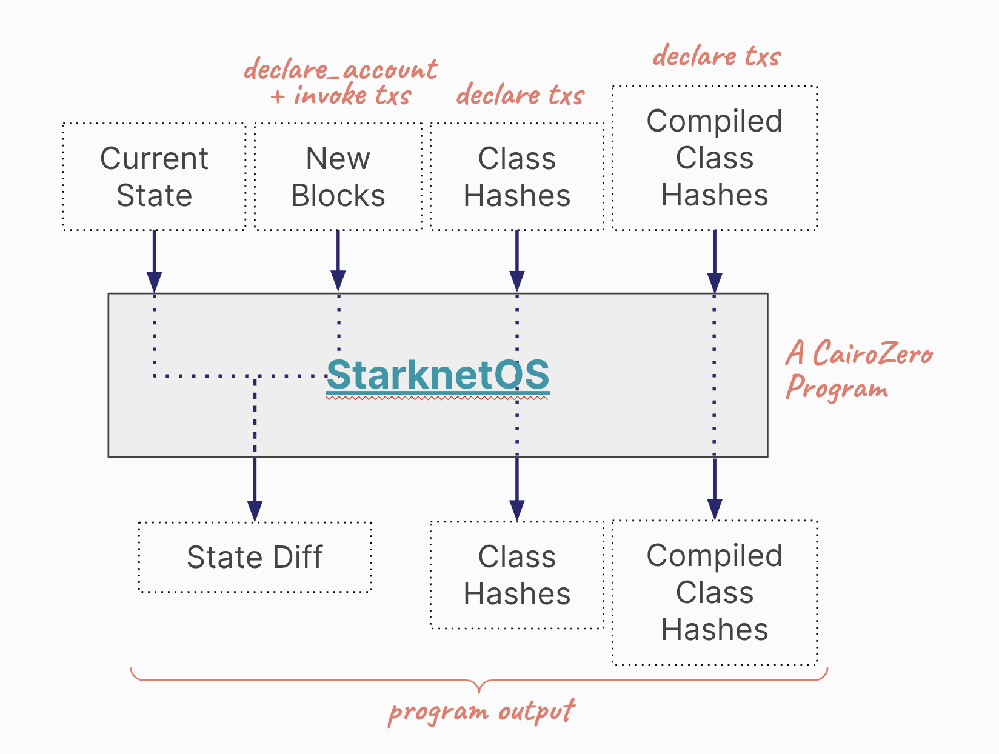
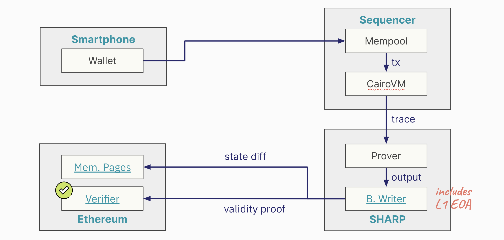

# Data Availability

Data availability is key in blockchain networks, especially in Layer 2 solutions like Starknet.

Rollups, acting as a bridge between the Ethereum blockchain and off-chain computation, enable transactions off-chain while maintaining Ethereum's security and asset system. The focus often lies on scaling computation and execution, but it's just part of the challenge. Both computation and data aspects are vital for effective blockchain scaling.

The growing use of rollups, which facilitate more off-chain execution, intensifies the need for efficient data availability solutions. This demand arises from the necessity to store, access, and verify data from off-chain transactions. Robust data availability solutions are critical for rollup success. Without effective data handling, the scalability and performance advantages of rollups could be significantly undermined.

Base layer blockchains such as Ethereum are evolving towards becoming Data Availability (DA) layers (more [here](https://www.youtube.com/watch?v=PNPryqrJg3s)). A prime example of this evolution is Celestia. They have spearheaded this movement by developing a Layer 1 blockchain with a DA-centric approach.

In parallel, Ethereum is undergoing a significant transition. Historically an execution-focused blockchain, Ethereum is now incorporating new Ethereum Improvement Proposals (EIPs) to shift its focus towards DA.

## Data Availability in Starknet

1. **State Transition Process**: In Starknet, as in most blockchain networks, the system transitions from a state $n$ to state $(n+1)$ by executing a series of transactions within a block. In Starknet's case, this is done through the Cairo language.

2. **Accessing Current State Information**: To know the current state $n$ of the network, there are two primary sources:
   - **The Sequencer**: It holds comprehensive details about the network's current state.
   - **Layer 2 Full Nodes**: In Starknet, there are multiple full nodes, such as Juno, Papyrus, and Pathfinder, which users can run on their computers.

The liveness problem arises from a concern: what happens if both the sequencer and all the full nodes become unresponsive? This could be due to a variety of reasons, such as technical failures or external attacks.

If for some reason, both the sequencer and the Layer 2 full nodes stop responding, there would be no way to ascertain the current state $n$ of the network. In such a scenario, while transactions could still be received, the network would be unable to transition to state $(n+1)$ due to the lack of information about state $n$. Consequently, the network would essentially become stuck.

Although this situation is highly unlikely, its potential impact is significant. It would halt the progress of the network, preventing any state transitions and effectively freezing operations.

## State Diffs

Starknet addresses the liveness problem through the transmission of validity proofs and state differences to Layer 1. This process is critical for ensuring that the network remains operational and its state can be verified independently of the sequencer and Layer 2 full nodes.

1. **Validity Proof to Layer 1**: After computing the validity proof, Starknet sends it to Layer 1, specifically to the Verifier.

2. **State Diff as Cold Data**: Along with the validity proof, Starknet also sends what's known as the 'state diff.' The state diff represents the changes in the Layer 2 state since the last validity proof was sent. This includes updates and modifications made to the network's state.

The state diff involves a substantial amount of data. To manage this, the data is sent as 'cold data' to Layer 1. It implies that the data isn't directly stored but is made available in a way that requires significant transactional capacity to transfer to Layer 1.

## Data Availability and State Changes in Transactions

**Transmitting Changes, Not Balances**: What Starknet sends to Layer 1 for data availability are the changes in state, not the new balances. This involves capturing how each transaction within a validity proof alters the state.

1. **Example 1**: Consider a simple scenario with three participants: Jimmy, Rose, and Nick.

   - **Transaction Sequence**: Jimmy sends one ETH to Rose, then Rose sends half an ETH to Nick.
   - **State Changes Sent to Layer 1**: The data sent to Layer 1 would reflect that Jimmy has one ETH less, Rose has half an ETH more, and Nick also gains half an ETH.

2. **Example 2**: The net changes are what matter. For instance, if Jimmy and Rose send ETH back and forth, but the end result is Jimmy having half an ETH more and Rose half an ETH less, only these net changes are sent to Layer 1.

This approach means that even with multiple transactions, the actual data sent for availability can be less if the net state changes are minimal.

In cases where transactions between parties nullify each other (e.g., Rose sends one ETH to Nick, and then Nick sends it back), no change in the state occurs. Consequently, nothing is sent to Layer 1 for data availability, making it the cheapest form of transaction.

Since the cost of sending data to Ethereum as cold data constitutes about 90% of a Layer 2 transaction's cost, reducing the amount of data sent can significantly impact overall transaction costs. Projects on Starknet often use strategies to minimize state changes in their transactions, thereby reducing the data sent to Layer 1 and lowering transaction costs.

## Reducing Data Availability Costs in Starknet

Two main mechanisms to reduce data availability costs are currently under consideration: the implementation of EIP 4844 and the concept of Volition. Both aim to optimize how data is stored and reduce the associated costs.

### EIP 4844: Blob Data and Cost Reduction

EIP 4844 proposes a change in how data availability information is sent to Layer 1. Instead of using call data, the information would be sent as blobs. This mechanism is expected to be cheaper than the current method used by Starknet for posting data to Ethereum. Consequently, it would make Layer 2 transactions more affordable. A notable downside of this approach is the limited lifespan of blob data. Once posted to Ethereum, this data will only be available for one month before being pruned by Layer 1 nodes.

Starknet's adoption of this feature depends on its implementation on the Ethereum mainnet. It's anticipated to be incorporated into Starknet by mid-2024, following its activation on Ethereum.

### Volition: Flexible Data Storage Options

Volition introduces the concept of choosing where to store data for transaction liveness. Users can opt to post data either to Ethereum or off-chain alternatives such as a data availability committee, systems like Celestia, or EigenDA. The cost of using Volition varies based on the chosen storage option. Off-chain options are expected to be cheaper than using EIP 4844.

The timeline for enabling Volition on Starknet is not yet determined, but it's certain to follow the support of EIP 4844.

While EIP 4844's blob data approach will be beneficial for multiple rollups, Volition offers a unique advantage for Starknet by providing more flexibility in data storage and potentially lowering costs further. The implementation of Volition requires having a virtual machine that is not limited by the adherence to emulate the EVM, so a custom virtual machine like Cairo is required.

## Recreating Starknet's State

This process is a contingency plan for extreme scenarios where the sequencer and Layer 2 full nodes become unavailable.

1. Starknet, like any blockchain network, started with an empty state and a genesis block. Over time, it has processed multiple blocks, leading to changes in its state.

2. Periodically, Starknet sends a validity proof to Layer 1. This proof attests to the computations of all the blocks processed since the last proof was sent.

3. Along with the validity proof, Starknet sends the state difference. This state difference details the changes from the empty state to the current state, as a result of executing transactions in all these blocks. The state difference is transmitted to Layer 1.

4. As Starknet continues to produce more blocks on Layer 2, the process repeats. At some point, a new validity proof, along with a new set of transactions for data availability and the new state difference, is sent to Layer 1.

5. By applying the state differences in order, as they are sent to Layer 1, it's possible to reconstruct the Layer 2 state. This means that the entire history and current state of Starknet can be pieced together from the data available on Layer 1. This is the role of the Layer 1 indexer.

This process ensures that the network's state is never lost and can always be recovered from Layer 1 data.

## The StarknetOS

The StarknetOS, the last step inside the Sequencer, plays a crucial role in determining why the state diff is the output of the SHARP and how it interacts with the network's state. The StarknetOS is based on Cairo Zero, an older version of the Cairo programming language.

The StarknetOS receives four main inputs:

- The current state of the network.
- New blocks created since the last validity proof was sent to Layer 1. These include declare_account and invoke transactions.
- Class hashes resulting from declared transactions.
- Compiled class hashes resulting from declared transactions.

The StarknetOS takes the current state and processes the new transactions and blocks. It evaluates what changes occur in the state as a result of these transactions. The output from this process includes:

- The state diff: Changes in the state.
- Class hashes of newly declared smart contracts.
- Compiled class hashes of newly declared smart contracts.

The sequencer executes numerous transactions and creates blocks. When enough blocks accumulate, they trigger the creation of a validity proof. These blocks are passed to the StarknetOS to calculate the state diff, class hashes, and compiled class hashes. This is the information that the Prover is tasked with proving. The output from the [Blockchain Writer](https://etherscan.io/address/0x16d5783a96ab20c9157d7933ac236646b29589a4), therefore, includes these three elements: state diff, class hashes, and compiled class hashes. This output is what gets sent to the memory pages smart contract on Ethereum.

## The Blockchain Writer Module

Contrary to a direct interaction between the Prover and the Ethereum Verifier, there's an intermediary process involving SHARP. The Prover in Starknet (currently [the Stone Prover](https://github.com/starkware-libs/stone-prover)) is focused solely on proving the execution of a Cairo program. Its role is confined to generating proofs without concerning itself with Ethereum directly. The primary concern of the Prover is to accurately prove the execution of Cairo programs.

Internally, SHARP utilizes an Externally Owned Account (EOA) specifically for interacting with Ethereum. This account is responsible for conducting transactions on the Ethereum network.

1. **Handling Validity Proofs and State Diff**: The actual module within SHARP that sends the validity proof and state diff to the memory pages on Ethereum is known as the [Blockchain Writer](https://etherscan.io/address/0x16d5783a96ab20c9157d7933ac236646b29589a4). This module bridges the gap between the internal workings of Starknet and the Ethereum blockchain.

2. **Direct Interaction with Ethereum**: The output from the Prover is directed to the Blockchain Writer. It is this Blockchain Writer that interacts with Ethereum, sending data to the appropriate location on the Layer 1.

3. **Final Step in Data Transmission**: The Blockchain Writer represents the final step in the process where the proven data from Starknet's internal operations is transmitted to Ethereum for storage and verification.

This is Ethereum address of the Blockchain Writer, which is by itself an EOA holding resources: [0x16d5783a96ab20c9157d7933ac236646b29589a4](https://etherscan.io/address/0x16d5783a96ab20c9157d7933ac236646b29589a4).

The cost for data availability in Starknet, as handled by SHARP, is a direct expense. There isn't any form of subsidy for these costs. SHARP bears the full financial responsibility for the block space required on Ethereum. The lack of subsidy in DA costs directly influences the fees users pay for transactions on Starknet.

A closer look at the transactions emanating from the [Blockchain Writer](https://etherscan.io/address/0x16d5783a96ab20c9157d7933ac236646b29589a4), which are responsible for DA, reveals substantial costs. SHARP incurs millions of dollars in expenses for block space on Ethereum each month.

## Data Availability Modes

Currently, there are three primary modes, with two already in use and a third on the horizon. These modes are Rollup, Validium, and Volition.

### 1. Rollup Mode

- **Definition and Characteristics**: The data for DA is posted directly on Ethereum. This approach is what classifies a Layer 2 solution as a Rollup.
- **Advantages**: The primary benefit of Rollup mode is enhanced liveness due to the reliability and track record of Ethereum. It provides robust guarantees about data availability.
- **Cost Implications**: This mode tends to be more expensive due to the cost associated with posting data on Ethereum. However, future implementations like EIP 4844 may reduce these costs.
- **Example**: Starknet, which sends data to the memory pages smart contract, is an example of a Rollup.

### 2. Validium Mode

- **Definition and Characteristics**: Characterized by Layer 2 networks not utilizing Ethereum for DA. Instead, data is stored off-chain.
- **Advantages**: The primary advantage of Validium is cost efficiency. Transactions in Validiums are typically much cheaper than in Rollups.
- **Liveness Guarantees**: The trade-off for reduced cost is weaker liveness guarantees compared to Ethereum-based DA.
- **Example**: StarkEx is an example of Validium, known for its significantly lower transaction costs compared to Rollups.

### 3. Volition Mode (Upcoming)

- **Definition and Characteristics**: Volition mode is a hybrid DA mode that combines aspects of both Rollup and Validium. It offers users the choice of where to store data, either on-chain (Ethereum) or off-chain.
- **User Choice**: The key feature of Volition mode is the flexibility it provides users in deciding their data storage preferences, balancing between cost and liveness guarantees.
- **Implementation Timeline**: Volition mode is expected to be introduced to networks like Starknet in the near future, potentially within a year or so.

The following table summarizes the key characteristics of each mode:

| Mode     | Definition                                    | Advantages                                  | Cost         | Example  |
| -------- | --------------------------------------------- | ------------------------------------------- | ------------ | -------- |
| Rollup   | Data posted on Ethereum; a Layer 2 solution.  | Reliable, robust data availability.         | Higher cost. | Starknet |
| Validium | Data stored off-chain, not on Ethereum.       | Lower transaction costs.                    | Lower cost.  | StarkEx  |
| Volition | Hybrid mode, choice of on-chain or off-chain. | Balance between cost and data availability. | -            | -        |
