# Madara 🚧

Madara is a Starknet sequencer that operates on the Substrate framework, executing Cairo programs and Starknet smart contracts with the Cairo VM. Madara enables the launch and control of Starknet Appchains or L3s.

## Get Started with Madara

<!-- Visit the [GitHub repository](https://github.com/keep-starknet-strange/madara) for detailed instructions on installing and configuring Madara, including practical examples.


# Building on Madara -->

<br></br>In this section, we will guide you through the building process so you can start hacking on the Madara stack.
We will go from running your chain locally to changing the consensus algorithm and interacting with smart contracts on your own chain!

## Let's start

<Steps>

### Install dependencies

<a id="dependencies"></a>
We first need to make sure you have everything needed to complete this tutorial.

| Dependency | Version              | Installation                                                                                                  |
| ---------- | -------------------- | ------------------------------------------------------------------------------------------------------------- |
| Rust       | rustc 1.69.0-nightly | `curl --proto '=https' --tlsv1.2 -sSf https://sh.rustup.rs \| sh` <br></br>`rustup toolchain install nightly` |
| nvm        | latest               | `curl -o- https://raw.githubusercontent.com/nvm-sh/nvm/v0.39.3/install.sh \| bash`                            |
| Cairo      | 1.0                  | `curl -L https://github.com/franalgaba/cairo-installer/raw/main/bin/cairo-installer \| bash`                  |

for macos ensure you have protobuf to avoid build time errors

```
brew install protobuf
```

### Build the chain

We will spin up a CairoVM Rollup from the Madara Stack source code.
You could use docker images, but this way we keep the option to modify component behavior if you need to do so.
The Madara stack source code is a monorepo which can be found [here](https://github.com/keep-starknet-strange/madara)

```bash
cd ~
git clone https://github.com/keep-starknet-strange/madara.git
```

Then let's build the chain in `release` mode

```bash
cd madara
cargo build --release
```

<br></br>

**Single-Node Development Chain**

This command will start the single-node development chain with non-persistent

run madara setup configuration:

```bash
./target/release/madara setup --chain dev --from-local ./configs
```

run madara node:

```bash
./target/release/madara --dev
```

Purge the development chain's state (only if you you want to keep the persist state of the node ):

```bash
./target/release/madara purge-chain --dev
```

Start the development chain with detailed logging:

```bash
RUST_BACKTRACE=1 ./target/release/madara -ldebug --dev
```

### Node example

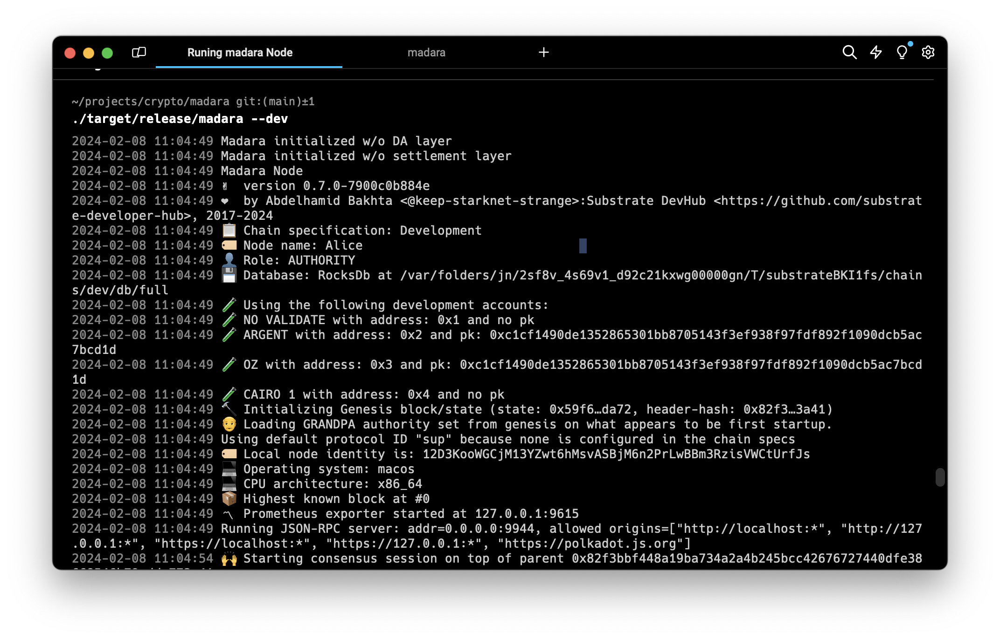
If everything works correctly, we can go to the next step and create our own genesis state!

By default, the chain will run with the following config :

- [GRANDPA & AURA](https://docs.substrate.io/learn/consensus/#default-consensus-models)
- An `admin` account contract at address `0x0000000000000000000000000000000000000000000000000000000000000001`
- A test contract at address `0x0000000000000000000000000000000000000000000000000000000000001111`
- A fee token (ETH) at address `0x040e59c2c182a58fb0a74349bfa4769cbbcba32547591dd3fb1def8623997d00`
- The `admin` account address has a `MAX` balance of fee token
- An ERC20 contract at address `0x040e59c2c182a58fb0a74349bfa4769cbbcba32547591dd3fb1def8623997d00`

This chain specification can be thought of as the main source of information that will be used when connecting to the chain.

### _(Not available yet) Deploy your settlement smart contracts_

### Connect with Polkadot-JS Apps Front-end

Once the node template is running locally, you can connect it with **Polkadot-JS
Apps** front-end to interact with your chain. use
[polkadat frontend](https://polkadot.js.org/apps/#/explorer?rpc=ws://localhost:9944) or [madara zone frontend](https://explorer.madara.zone/?rpc=ws%3A%2F%2F127.0.0.1%3A9944#/accounts)
connecting the Apps to your local node template.

### ui connection

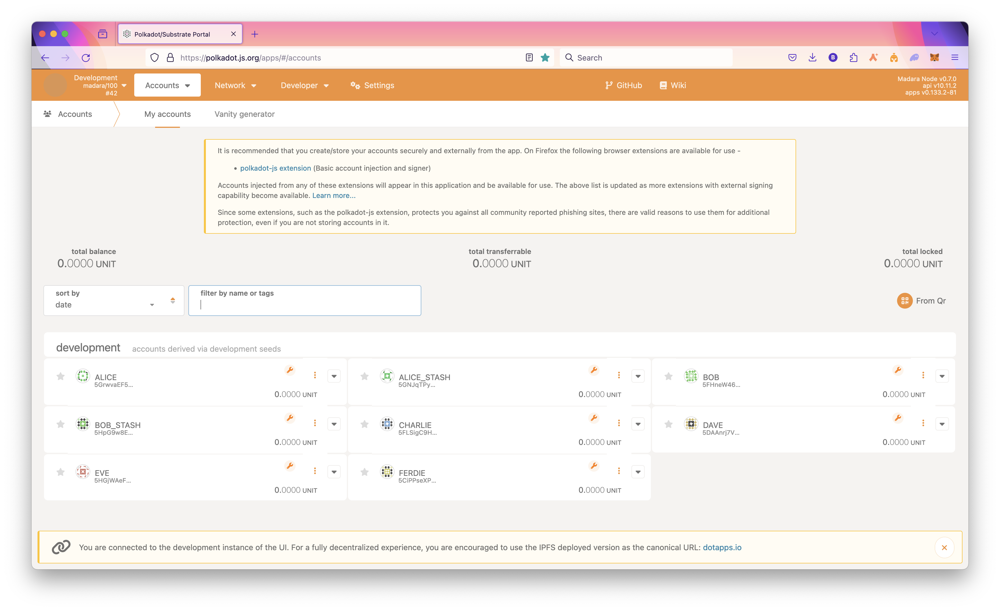

### Start your chain

Now that we are all setup, we can finally run the chain!

There are a lot of ways you can run the chain depending on which role you want to take :

- **Full node**<br></br>
  Synchronizes with the chain to store the most recent block state and block headers for older blocks.
  When developing your chain, you can simply run it in developer mode :

```bash
./target/release/madara --dev --execution=native
```

- **Archive node**<br></br>
  Maintains all blocks starting from the genesis block with complete state available for every block.
  <br></br>
  If you want to keep the whole state of the chain in a `/tmp/ folder :

```bash
./target/release/madara --base-path /tmp/
```

In this case, note that you can purge the chain's state whenever you like by running :

```bash
./target/release/madara purge-chain --base-path /tmp
```

- **RPC node**<br></br>
  Exposes an RPC interface over HTTP or WebSocket ports for the chain so that users can read the blockchain state and submit transactions.
  There are often multiple RPC nodes behind a load balancer.
  If you only care about exposing the RPC you can run the following :

```bash
./target/release/madara setup --chain dev --from-local ./configs
```

run Madara app rpc :

```bash
./target/release/madara --dev --unsafe-rpc-external --rpc-methods Safe   --rpc-max-connections 5000
```

you can now interact with madara rpc  
Eg you can get the chain using the rpc

```bash
curl -X POST http://localhost:9944 \
     -H 'Content-Type: application/json' \
     -d '{
       "jsonrpc": "2.0",
       "method": "starknet_chainId",
       "params": [],
       "id": 1
     }'
```

Madara rpc [examples](https://github.com/keep-starknet-strange/madara/tree/main/examples/rpc/starknet)

#### output example

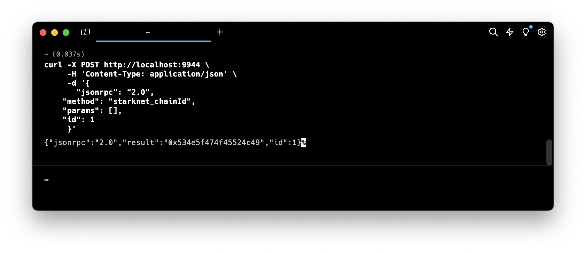

- **Validator node**<br></br>
  Secures the chain by staking some chosen asset and votes on consensus along with other validators.

### Deploy an account on your chain

Ooook, now your chain is finally running. It's time to deploy your own account!

Example of curl commad

```bash
curl -X POST http://localhost:9944 \
     -H 'Content-Type: application/json' \
     -d '{
    "jsonrpc": "2.0",
    "method": "starknet_addDeployAccountTransaction",
    "params": {
        "deploy_account_transaction": {
            "type": "DEPLOY_ACCOUNT",
            "max_fee": "0x0",
            "version": "0x1",
            "signature": [
                "0xd96bc7affb5648b601ddb49e9fd23f6ebfe59375e2ce5dd06b7db638d21b71",
                "0x6582c1512c8515254a52deb5fef1320d4f5dd0cb8352b260a4e7a90c61510ba",
                "0x5dec330eebf36c8672b60db4a718d44762d3ae6d1333e553197acb47ee5a062",
                "0x0",
                "0x0",
                "0x0",
                "0x0",
                "0x0",
                "0x0",
                "0x0"
            ],
            "nonce": "0x0",
            "contract_address_salt": "0x61fcdc5594c726dc437ddc763265853d4dce51a57e25ff1d97b3e31401c7f4c",
            "constructor_calldata": [
                "0x5aa23d5bb71ddaa783da7ea79d405315bafa7cf0387a74f4593578c3e9e6570",
                "0x2dd76e7ad84dbed81c314ffe5e7a7cacfb8f4836f01af4e913f275f89a3de1a",
                "0x1",
                "0x61fcdc5594c726dc437ddc763265853d4dce51a57e25ff1d97b3e31401c7f4c"
            ],
            "class_hash": "0x3131fa018d520a037686ce3efddeab8f28895662f019ca3ca18a626650f7d1e"
        }
    },
    "id": 1
}'
```

expected json result
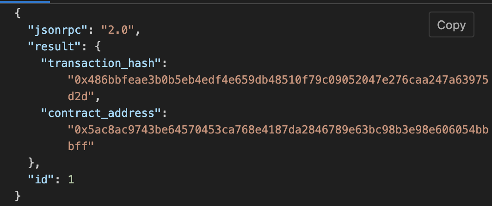

### Make some transactions

<br></br>

# building Madara App Chain Your Using madara appchain Template

clone the Madara appchain Template

```
git clone https://github.com/keep-starknet-strange/madara-app-chain-template.git
```

## Getting Started

Ensure you have[ Required dependancies ](#dependencies)To run madara AppChain
<br></br>
Depending on your operating system and Rust version, there might be additional packages required to compile this template.
Check the [Install](https://docs.substrate.io/install/) instructions for your platform for the most common dependencies.
Alternatively, you can use one of the [alternative installation](#alternatives-installations) options.

### Build

Use the following command to build the node without launching it:

```sh
cargo build --release
```

### Embedded Docs

After you build the project, you can use the following command to explore its parameters and subcommands:

```sh
./target/release/app-chain-node -h
```

You can generate and view the [Rust Docs](https://doc.rust-lang.org/cargo/commands/cargo-doc.html) for this template with this command:

```sh
cargo +nightly doc --open
```

### Single-Node Development Chain

Set up the chain with the genesis config. More about defining the genesis state is mentioned below.

```sh
./target/release/app-chain-node setup --chain dev --from-local ./configs
```

The following command starts a single-node development chain.

```sh
./target/release/app-chain-node --dev
```

You can specify the folder where you want to store the genesis state as follows

```sh
./target/release/app-chain-node setup --chain dev --from-local ./configs --base-path=<path>
```

If you used a custom folder to store the genesis state, you need to specify it when running

```sh
./target/release/app-chain-node --base-path=<path>
```

Please note, Madara overrides the default `dev` flag in substrate to meet its requirements. The following flags are automatically enabled with the `--dev` argument:

`--chain=dev`, `--force-authoring`, `--alice`, `--tmp`, `--rpc-external`, `--rpc-methods=unsafe`

To store the chain state in the same folder as the genesis state, run the following command. You cannot combine the `base-path` command
with `--dev` as `--dev` enforces `--tmp` which will store the db at a temporary folder. You can, however, manually specify all flags that
the dev flag adds automatically. Keep in mind, the path must be the same as the one you used in the setup command.

```sh
./target/release/app-chain-node --base-path <path>
```

To start the development chain with detailed logging, run the following command:

```sh
RUST_BACKTRACE=1 ./target/release/app-chain-node -ldebug --dev
```

### Connect with Polkadot-JS Apps Front-End

After you start the app chain locally, you can interact with it using the hosted version of the [Polkadot/Substrate Portal](https://polkadot.js.org/apps/#/explorer?rpc=ws://localhost:9944) front-end by connecting to the local node endpoint.
A hosted version is also available on [IPFS (redirect) here](https://dotapps.io/) or [IPNS (direct) here](ipns://dotapps.io/?rpc=ws%3A%2F%2F127.0.0.1%3A9944#/explorer).
You can also find the source code and instructions for hosting your own instance on the [polkadot-js/apps](https://github.com/polkadot-js/apps) repository.

### Multi-Node Local Testnet

If you want to see the multi-node consensus algorithm in action, see [Simulate a network](https://docs.substrate.io/tutorials/get-started/simulate-network/).

## Template Structure

The app chain template gives you complete flexibility to modify exiting features of Madara and add new features as well.

# Configuring appChain ID

## Fetching your Chain ID:

The default chain ID on Madara is `SN_GOERLI`, to verify your chain ID, a POST call can be made to the RPC endpoint.<br></br>

### Initiate RPC Request:

- Execute the following POST request via curl to query the chain ID from your Madara node.
- Endpoint: http://localhost:9944 (replace with the appropriate remote URL).

```bash
    curl --location 'http://localhost:9944' \
    --header 'Content-Type: application/json' \
    --data '{
        "id": 0,
        "jsonrpc": "2.0",
        "method": "starknet_chainId",
        "params": {}
    }'
```

### Parse Response:

Extract the chain ID in hex format from the "result" field within the JSON response.

```bash
    {
        "jsonrpc": "2.0",
        "result": "0x534e5f474f45524c49",
        "id": 0
    }
```

### Translate Hex:

Use a hex converter tool (e.g., https://stark-utils.vercel.app/converter) to obtain the readable string representation of the chain ID.

## Setting a custom Chain ID:

The Chain ID for your Madara app chain is configured in `crates/runtime/src/pallets.rs`.
In Madara your chain ID is represented as the montgomery representation for a string.
To update this follow the below steps;

### Define your Chain ID:

Choose a string to represent your app chain.

### Convert Chain ID to felt

Navigate to `https://stark-utils.vercel.app/converter` and input your chosen string. The generated felt value is your hexadecimal representation for the string.
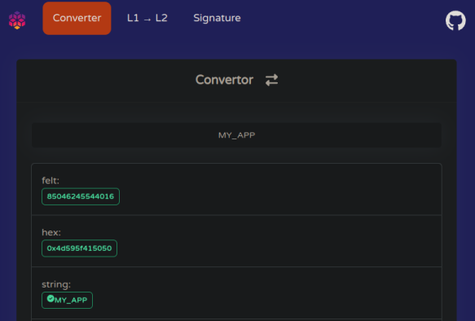

### Generate montgomery representation:

Use Starkli to convert the felt value to a montgomery representation compatible with Madara.

```bash
starkli mont 85046245544016
[
    18444022593852143105,
    18446744073709551615,
    18446744073709551615,
    530195594727478800,
]
```

### Update the Chain ID:

Open crates/primitives/chain-id/src/lib.rs and add your Chain ID alongside existing definitions:

```rust
pub const MY_APP_CHAIN_ID: Felt252Wrapper = Felt252Wrapper(starknet_ff::FieldElement::from_mont([
    18444025906882525153,
    18446744073709551615,
    18446744073709551615,
    530251916243973616,
]));
```

### Update `pallets.rs`:

- Modify the import statement in `crates/runtime/src/pallets.rs` to include your new Chain ID definition (refer to https://github.com/keep-starknet-strange/madara/blob/main/crates/runtime/src/pallets.rs#L13 for reference).
- Update the usage of the Chain ID within the code itself (refer to https://github.com/keep-starknet-strange/madara/blob/main/crates/runtime/src/pallets.rs#L164 for reference).

Rebuild your Madara app chain with the updated pallets.rs file. Your app chain will now operate with your custom Chain ID.

### appchain tooling

Madara is made to be **100%** Starknet compatible out of the box.
This means that you can leverage all existing Starknet tools (detailed list [here](https://www.starknet.io/en/developers/tools-and-resources)).
In these docs, we cover some famous tools for you

# Argent X Overview

[Argent X](https://www.argent.xyz/argent-x/) is an open-source Starknet wallet.

## Installing Argent X

Follow the official Argent X installation [instructions](https://www.argent.xyz/learn/how-to-create-an-argent-x-wallet/`).

## Use Argent X with Madara

Argent X includes the Mainnet, Sepolia, and Goerli networks by default, but connecting with your local Madara chain requires manual configuration. This involves adding a custom network within Argent X's settings.

### Configuring Argent X for Madara appchain

### Open the Argent X wallet and navigate to Settings.

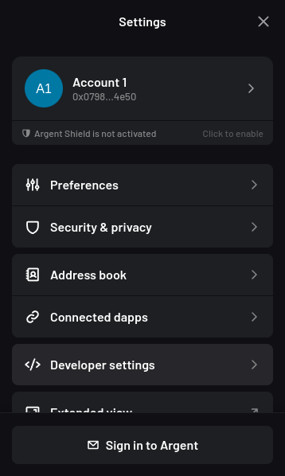

### Select "Developer settings" and then "Manage networks".

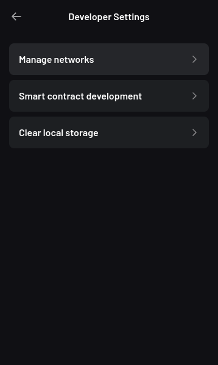

### Click the plus button on the top right to add a network.

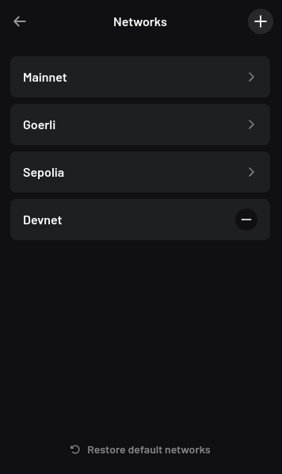 #

## Fill in the following fields:

1. **Network Name**: A friendly name for the Madara network.

2. **Chain ID**: The default chain ID on Madara is `SN_GOERLI`, to retrieve your chain ID or to set
   a custom chain ID, refer to the [Chain ID](../tools/chain-id.mdx) section of Madara
   documentation.

3. RPC URL: `http://localhost:9944`

4. Sequencer URL: `http://localhost:9944`

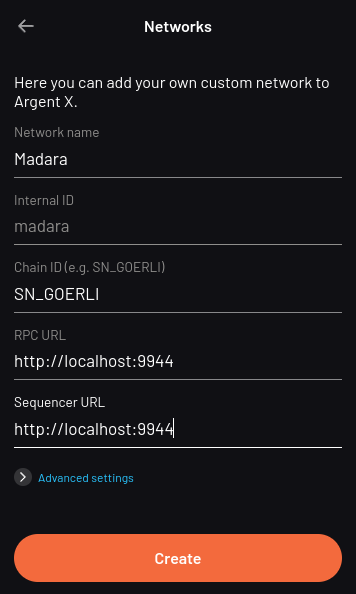

### Save the new network configuration.

Once you have added Madara as a network, you can now connect to it.

### Deploying your Starknet wallet

Upon creation, an Argent X wallet generates a Starknet address. However, this address exists in an "undeployed" state until you initiate your first transaction.

Argent X manages the activation process under the hood; your first outgoing transaction acts as the trigger.
This transaction initiates the deployment of your smart contract on the Madara chain. This deployment incurs a one-time fee.

## Resources

- [Website](https://www.argent.xyz/argent-x/)
- [FAQ](https://www.argent.xyz/faq/)
- [Twitter](https://twitter.com/argentHQ)

# Braavos Overview

[Braavos](https://www.braavos.app) is a Starknet wallet.

## Installing Braavos

Follow the official Braavos installation [instructions](https://braavos.app/faq/setting-up-your-braavos-wallet-easy-starknet-guide/`).

## Use Braavos with Madara appchain

Braavos includes the Mainnet, Sepolia, and Goerli networks by default, but connecting with your local Madara chain requires manual configuration. This involves adding a custom network within Braavos's settings.

### Configuring Braavos for Madara

### Access Network Tab

Open the Braavos wallet and navigate to the "Network" tab.

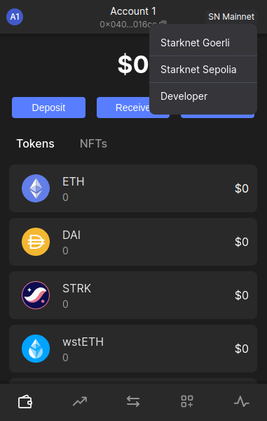

### Enable Developer Mode

Locate the "Developer" option and select it. If prompted, choose "Add Account" to proceed.


### Access General Configuration:

Click on the account icon, on the top left side<br></br>
Navigate to the "General" tab
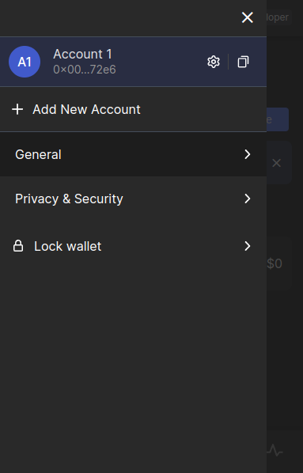

### Switch to the Developer Tab

Within the "General" section, switch to the "Developer" tab.
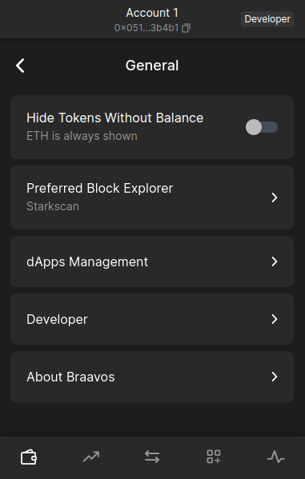

### Configure RPC Connection

1. Enable the "Use RPC provider" checkbox.
2. Set the "Node host" field to localhost.
3. Set the "Node port" field to 9944, assuming you're using the default Madara port.

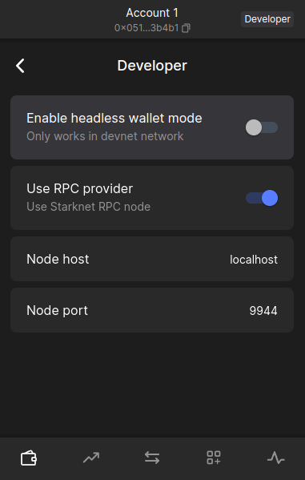

Once you have added Madara as a network, you can now connect to it.

# Starkli Overview

Starkli is a command-line interface (CLI) tool designed to streamline interaction with your Madara chain. It simplifies managing accounts, deploying and interacting with smart contracts, and accessing network data.

## Installing Starkli

<Steps>
### Installing starkliup
Install Starkliup, the installer for the Starkli environment
```bash
curl https://get.starkli.sh | sh
```
Starkliup should now be installed.
Restart the terminal

### Install starkli v0.1.20

Madara currently is only compatible with starkli v0.1.20. Active development is underway to ensure the latest version is supported.
Run starkliup to install starkli v0.1.20

```bash
starkliup -v 0.1.20
```

Starkli should now be installed.
Restart the terminal

### Verify Starkli installation

```bash
starkli --version
```

The output should display

```bash
0.1.20 (e4d2307)
```

</Steps>

Starkli allows you to perform all operations on your chain without leaving the command line.

## Use Starkli in Madara

Before starting with configuring Starkli, add your Madara RPC URL to the env. By default, this would be `http://localhost:9944`

```bash
export STARKNET_RPC="http://localhost:9944/"
```

### Configuring Starkli for Madara

The Starkli tutorial [here](https://book.starkli.rs/tutorials/starkli-101) should work with Madara. If you face issues
when deploying your smart contract, ensure you're Scarb `0.6.1`. You can use asdf for the same as explained [here](https://docs.swmansion.com/scarb/download.html#install-via-asdf).

Also, make sure you've added the following lines in your Scarb.toml

```bash
[dependencies]
starknet = ">=2.1.0"

[[target.starknet-contract]]
```

## Resources

- [Docs](https://book.starkli.rs/)

### Deploying your Starknet wallet

Upon creation, a Braavos wallet generates a Starknet address. However, this address exists in an "undeployed" state until you initiate your first transaction.

Braavos manages the activation process under the hood; your first outgoing transaction acts as the trigger.
This transaction initiates the creation and deployment of your personal smart contract on the Madara chain. This deployment incurs a one-time fee.

## Resources

- [Website](https://braavos.app/)
- [FAQ](https://braavos.app/faq/)
- [Twitter](https://twitter.com/Braavos)

# Starknet.js Overview

[Starknet.js](https://www.starknetjs.com/) is a lightweight JavaScript/TypeScript library enabling interaction between your DApp and Starknet. Starknet.js allows you to interact with Starknet accounts, providers, and contracts.

## Installing Starknet.js

Follow the official Starknet.js installation instructions: https://www.starknetjs.com/docs/guides/intro

## Configuring Starknet.js for Madara

Connecting to your running Madara node requires you to point your provider to the Madara RPC URL.

```javascript
const provider = new starknet.RpcProvider({
  nodeUrl: "http://localhost:9944",
});
```

You can now use this provider to interact with the chain as explained in the Starknet.js [docs](https://www.starknetjs.com/docs/guides/intro).

[Karnot](https://karnot.xyz) has also developed ready-to-use scripts using Starknet.js to fund wallets, declare and deploy contracts and some other
useful tasks. You can refer to them [here](https://github.com/karnotxyz/madara-get-started).

## Resources

- [Website](hhttps://www.starknetjs.com)
- [Docs](https://www.starknetjs.com/docs/API/)

Moreover, Madara is built upon Substrate so you can actually _also_ leverage some popular substrate tooling like [polkadot.js](https://polkadot.js.org/apps/),
[telemetry](https://telemetry.polkadot.io/), [polkadot-api](https://www.npmjs.com/package/@polkadot/api) and others.

### Existing Pallets

Madara comes with only one pallet - `pallet_starknet`. This pallet allows app chains to execute Cairo contracts and have 100% RPC compatabiltiy with Starknet mainnet. This means all Cairo tooling should work out of the box with the app chain. At the same time, the pallet also allows the app chain to fine tune specific parameters to meet their own needs.

- `DisableTransactionFee`: If true, calculate and store the Starknet state commitments
- `DisableNonceValidation`: If true, check and increment nonce after a transaction
- `InvokeTxMaxNSteps`: Maximum number of Cairo steps for an invoke transaction
- `ValidateMaxNSteps`: Maximum number of Cairo steps when validating a transaction
- `MaxRecursionDepth`: Maximum recursion depth for transactions
- `ChainId`: The chain id of the app chain

All these options can be configured inside `crates/runtime/src/pallets.rs`

### How to add New Pallets

<!-- Adding a new pallet is the same as adding a pallet in any substrate based chain. An an example, `pallet-template` has been added on this madara appchain template.
Add the Nicks pallet dependencies -->

Before you can use a new pallet, you must add some information about it to the configuration file that the compiler uses to build the runtime binary.

For Rust programs, you use the Cargo.toml file to define the configuration settings and dependencies that determine what gets compiled in the resulting binary. Because the Substrate runtime compiles to both a native platform binary that includes standard library Rust functions and a WebAssembly (Wasm) binary that does not include the standard Rust library, the Cargo.toml file controls two important pieces of information:

- The pallets to be imported as dependencies for the runtime, including the location and version of the pallets to import.
- The features in each pallet that should be enabled when compiling the native Rust binary. By enabling the standard (std) feature set from each pallet, you can compile the runtime to include functions, types, and primitives that would otherwise be missing when you build the WebAssembly binary.

For information about adding dependencies in Cargo.toml files, see Dependencies in the Cargo documentation. For information about enabling and managing features from dependent packages, see Features in the Cargo documentation.

To add the dependencies for the Nicks pallet to the runtime:

- Open a terminal shell and change to the root directory for the Madara Appchain template.
- Open the runtime/Cargo.toml configuration file in a text editor.
- Locate the [dependencies] section and note how other pallets are imported.

- Copy an existing pallet dependency description and replace the pallet name with pallet-nicks to make the pallet available to the node template runtime.
  For example, add a line similar to the following:

```
    pallet-nicks = { version = "4.0.0-dev", default-features = false, git = "https://github.com/paritytech/polkadot-sdk.git", branch = "polkadot-v1.0.0" }
```

This line imports the pallet-nicks crate as a dependency and specifies the following:

- Version to identify which version of the crate you want to import.
- The default behavior for including pallet features when compiling the runtime with the standard Rust libraries.
- Repository location for retrieving the pallet-nicks crate.
- Branch to use for retrieving the crate. Be sure to use the same version and branch information for the Nicks pallet as you see used for the other pallets included in the runtime.

These details should be the same for every pallet in any given version of the node template.

Add the pallet-nicks/std features to the list of features to enable when compiling the runtime.

```
[features]
default = ["std"]
std = [
  ...
  "pallet-aura/std",
  "pallet-balances/std",
  "pallet-nicks/std",
  ...
]
```

If you forget to update the features section in the Cargo.toml file, you might see cannot find function errors when you compile the runtime binary.

You can read more about it [here](https://docs.substrate.io/tutorials/build-application-logic/add-a-pallet/).

### Runtime configuration

Similar to new pallets, runtime configurations can be just like they're done in Substrate. You can edit all the available parameters inside `crates/runtime/src/config.rs`.

For example, to change the block time, you can edit the `MILLISECS_PER_BLOCK` variable.

## Alternatives Installations

Instead of installing dependencies and building this source directly, consider the following alternatives.

### Nix

Install [nix](https://nixos.org/), and optionally [direnv](https://github.com/direnv/direnv) and [lorri](https://github.com/nix-community/lorri) for a fully plug-and-play experience for setting up the development environment.
To get all the correct dependencies, activate direnv `direnv allow` and lorri `lorri shell`.

### Docker

##### building madara in docker

First, install [Docker](https://docs.docker.com/get-docker/) and
[Docker Compose](https://docs.docker.com/compose/install/).

pulling predeployed madara docker image

```bash
docker pull ghcr.io/keep-starknet-strange/madara:main
```

runining docker container

```bash
docker run --rm main --dev
```

Please use the [Madara Dockerfile](https://github.com/keep-starknet-strange/madara/blob/main/Dockerfile) as a reference to build the Docker container with your App Chain node as a binary.
