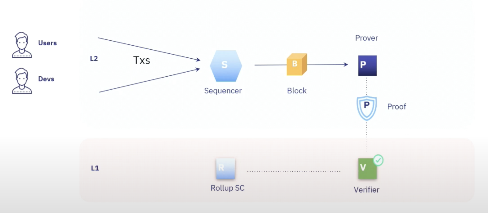

# Sequencers

Before diving in, make sure to check out the ["Understanding Starknet:
Sequencers, Provers, and
Nodes"](https://book.starknet.io/chapter_3/topology.html) chapter for a
quick exploration of Starknet’s architecture.

Three main layers exist in blockchain: data availability, ordering, and
execution. Sequencers have evolved within this evolving modular
landscape of blockchain technology. Most L1 blockchains, like Ethereum,
handle all these tasks. Initially, blockchains served as distributed
virtual machines focused on organizing and executing transactions. Even
roll-ups running on Ethereum today often centralize sequencing
(ordering) and execution while relying on Ethereum for data
availability. This is the current state of Starknet, which uses Ethereum
for data availability and a centralized Sequencer for ordering and
execution. However, it is possible to decentralize sequencing and
execution, as Starknet is doing.

Each of these layers plays a crucial role in achieving consensus. First,
the data must be available. Second, it needs to be put in a specific
order. That’s the main job of a Sequencer, whether run by a single
computer or a decentralized protocol. Lastly, you execute transactions
in the order they’ve been sequenced. This final step, done by the
Sequencer too, determines the system’s current state and keeps all
connected clients on the same page.

## Introduction to Sequencers

The advent of Layer Two (L2) solutions like Roll-Ups has altered the
blockchain landscape, improving scalability and efficiency. But what
about transaction order? Is it still managed by the base layer (L1), or
is an external system involved? Enter Sequencers. They ensure
transactions are in the correct order, regardless of whether they’re
managed by L1 or another system.

In essence, sequencing has two core tasks: sequencing (ordering) and
executing (validation). First, it orders transactions, determining the
canonical sequence of blocks for a given chain fork. It then appends new
blocks to this sequence. Second, it executes these transactions,
updating the system’s state based on a given function.

To clarify, we see sequencing as the act of taking a group of unordered
transactions and producing an ordered block. Sequencers also confirm the
resulting state of the machine. However, the approach explained here
separates these tasks. While some systems handle both ordering and state
validation simultaneously, we advocate for treating them as distinct
steps.

Sequencer role in the Starknet network

## Sequencers in Starknet

Let’s delve into Sequencers by focusing on
[Madara](https://github.com/keep-starknet-strange/madara) and
[Kraken](https://github.com/lambdaclass/starknet_stack/tree/main/sequencer),
two high-performance Starknet Sequencers. A Sequencer must, at least, do
two things: order and execute transactions.

- **Ordering**: Madara handles the sequencing process, supporting
  methods from simple FCFS and PGA to complex ones like Narwhall &
  Bullshark. It also manages the mempool, a critical data structure
  that holds unconfirmed transactions. Developers can choose the
  consensus protocol through Madara’s use of Substrate, which offers
  multiple built-in options.

- **Execution**: Madara lets you choose between two execution crates:
  [Blockifier](https://github.com/starkware-libs/blockifier/tree/main)
  and
  [Starknet_in_Rust](https://github.com/lambdaclass/starknet_in_rust).
  Both use the [Cairo VM](https://github.com/lambdaclass/cairo-vm) for
  their framework.

## Madara

Madara is a standard, customizable, and blazing fast Starknet sequencer. It is built on the robust Substrate framework and uses the Cairo VM to execute Cairo programs and Starknet smart contracts. Madara is designed to make it easy to launch your own Starknet appchain or L3, and to give you complete control over your custom appchain, tailored to your specific requirements.

### [madara explorer](https://madaraexplorer.com/)

Madara offers a number of benefits, including:

- High performance and scalability: Madara is built on Substrate and Rust, which makes it extremely fast and scalable. It can handle thousands of transactions per second and can scale to meet the needs of even the most demanding applications.
- Customizability: Madara is highly customizable, allowing you to create an appchain that meets your specific needs. You can choose the features you want to include, the level of security you require, and the performance you need.
- Security: Madara inherits the security of Starknet, which is one of the most secure Layer 2 
- scaling solutions available. All transactions on Madara are verified by Stark proofs, which are mathematically proven to be correct.

Madara is still under development, but it is already being used by a number of projects to build innovative applications on Starknet. Some of the projects using Madara include:

- Starkgate: A decentralized exchange that allows users to trade assets between Ethereum and Starknet without having to pay gas fees.
- Immutable: A gaming platform that offers instant transactions and zero gas fees.
- Aztec Network: A privacy-preserving Layer 2 solution that allows users to make private transactions on Ethereum.

There are a number of examples of how Madara is being used to launch and operate Starknet appchains on GitHub. Here are a few examples:

- keep-starknet-strange/madara-app-chain-template: This repository provides a template for creating a Starknet appchain using Madara.
- keep-starknet-strange/madara-app: This repository contains a simple app to interact with Starknet Appchains.

Getting started with Madara

If you are interested in getting started with Madara, you can visit the project's GitHub repository for more information. The repository contains documentation on how to install and configure Madara, as well as examples of how to use it to launch and operate a Starknet appchain.
Conclusion

Madara is a powerful and versatile Starknet sequencer that offers a number of advantages over other sequencers, including high performance, scalability, flexibility, and security. Madara is still under development, but it is already being used to launch and operate successful Starknet appchains.

We also have the Kraken Sequencer as another option.

- **Ordering**: It employs Narwhall & Bullshark for mempool
  management. You can choose from multiple consensus methods, like
  Bullshark, Tendermint, or Hotstuff.

- **Execution**: Runs on Starknet_in_Rust. Execution can be deferred
  to either [Cairo
  Native](https://github.com/lambdaclass/cairo_native) or [Cairo
  VM](https://github.com/lambdaclass/cairo-vm).

<table style="width:100%;">
<colgroup>
<col style="width: 42%" />
<col style="width: 28%" />
<col style="width: 28%" />
</colgroup>
<thead>
<tr class="header">
<th style="text-align: left;">Feature</th>
<th style="text-align: left;"><a
href="https://github.com/keep-starknet-strange/madara">Madara</a></th>
<th style="text-align: left;"><a
href="https://github.com/lambdaclass/starknet_stack/tree/main/sequencer">Kraken</a></th>
</tr>
</thead>
<tbody>
<tr class="odd">
<td style="text-align: left;">
<strong>Ordering
Method</strong>
</td>
<td style="text-align: left;">
FCFS, PGA, Narwhall &amp;
Bullshark
</td>
<td style="text-align: left;">
Narwhall &amp; Bullshark
</td>
</tr>
<tr class="even">
<td style="text-align: left;">
<strong>Mempool
Management</strong>
</td>
<td style="text-align: left;">
Managed by Madara
</td>
<td style="text-align: left;">
Managed using Narwhall &amp;
Bullshark
</td>
</tr>
<tr class="odd">
<td style="text-align: left;">
<strong>Consensus
Options</strong>
</td>
<td style="text-align: left;">
Developer’s choice through
Substrate
</td>
<td style="text-align: left;">
Bullshark, Tendermint or
Hotstuff
</td>
</tr>
<tr class="even">
<td style="text-align: left;">
<strong>Execution
Crates</strong>
</td>
<td style="text-align: left;">
<a
href="https://github.com/starkware-libs/blockifier/tree/main">Blockifier</a>,
Starknet_in_rust
</td>
<td style="text-align: left;">
Starknet_in_rust
</td>
</tr>
<tr class="odd">
<td style="text-align: left;">
<strong>Execution
Framework</strong>
</td>
<td style="text-align: left;">
<a
href="https://github.com/lambdaclass/cairo-vm">Cairo VM</a>
</td>
<td style="text-align: left;">
<a
href="https://github.com/lambdaclass/cairo_native">Cairo Native</a> or
<a href="https://github.com/lambdaclass/cairo-vm">Cairo VM</a>
</td>
</tr>
</tbody>
</table>

### Understanding the Execution Layer

- [Blockifier](https://github.com/starkware-libs/blockifier/tree/main),
  a Rust component in Starknet Sequencers, generates state diffs and
  blocks. It uses [Cairo VM](https://github.com/lambdaclass/cairo-vm).
  Its goal is to become a full Starknet Sequencer.

- Starknet_in_Rust is another Rust component for Starknet that also
  generates state diffs and blocks. It uses [Cairo
  VM](https://github.com/lambdaclass/cairo-vm).

- [Cairo Native](https://github.com/lambdaclass/cairo_native) stands
  out by converting Cairo’s Sierra code to MLIR. See an example
  [here](https://github.com/lambdaclass/cairo_native/blob/main/examples/erc20.rs).

## The Need for Decentralized Sequencers

For more details on the Decentralization of Starknet, refer to the
dedicated subchapter in this Chapter.

Proving transactions doesn’t require to be decentralized (although in
the near future Starknet will operate with decentralized provers). Once
the order is set, anyone can submit a proof; it’s either correct or not.
However, the process that determines this order should be decentralized
to maintain a blockchain’s original qualities.

In the context of Ethereum’s Layer 1 (L1), Sequencers can be likened to
Ethereum validators. They are responsible for creating and broadcasting
blocks. This role is divided under the concept of "Proposer-Builder
Separation" (PBS) ([Hasu,
2023](https://www.youtube.com/watch?v=6xS0xMzh9Tc)). Block builders form
blocks (order the transactions), while block proposers, unaware of the
block’s content, choose the most profitable one. This separation
prevents transaction censorship at the protocol level. Currently, most
Layer 2 (L2) Sequencers, including Starknet, perform both roles, which
can create issues.

The drive toward centralized Sequencers mainly stems from performance
issues like high costs and poor user experience on Ethereum for both
data storage and transaction ordering. The challenge is scalability: how
to expand without sacrificing decentralization. Opting for
centralization risks turning the blockchain monopolistic, negating its
unique advantages like network-effect services without monopoly.

With centralization, blockchain loses its core principles: credible
neutrality and resistance to monopolization. What’s wrong with a
centralized system? It raises the risks of censorship (via transaction
reordering).

A centralized validity roll-up looks like this:

- User Interaction & Selection: Users send transactions to a
  centralized Sequencer, which selects and orders them.

- Block Formation: The Sequencer packages these ordered transactions
  into a block.

- Proof & Verification: The block is sent to a proving service, which
  generates a proof and posts it to Layer 1 (L1) for verification.

- Verification: Once verified on L1, the transactions are considered
  finalized and integrated into the L1 blockchain.

Centralized rollup

While centralized roll-ups can provide L1 security, they come with a
significant downside: the risk of censorship. Hence, the push for
decentralization in roll-ups.

## Conclusion

This chapter has dissected the role of Sequencers in the complex
ecosystem of blockchain technology, focusing on Starknet’s current state
and future directions. Sequencers essentially serve two main functions:
ordering transactions and executing them. While these tasks may seem
straightforward, they are pivotal in achieving network consensus and
ensuring security.

Given the evolving modular architecture of blockchain—with distinct
layers for data availability, transaction ordering, and
execution—Sequencers provide a crucial link. Their role gains more
significance in the context of Layer 2 solutions, where achieving
scalability without sacrificing decentralization is a pressing concern.

In Starknet, Sequencers like Madara and Kraken demonstrate the potential
of high-performance, customizable solutions. These Sequencers allow for
a range of ordering methods and execution frameworks, proving that
there’s room for innovation even within seemingly rigid structures.

The discussion on "Proposer-Builder Separation" (PBS) highlights the
need for role specialization to maintain a system’s integrity and thwart
transaction censorship. This becomes especially crucial when we
recognize that the current model of many L2 Sequencers, Starknet
included, performs both proposing and building, potentially exposing the
network to vulnerabilities.

To reiterate, Sequencers aren’t just a mechanism for transaction
ordering and execution; they are a linchpin in blockchain’s
decentralized ethos. Whether centralized or decentralized, Sequencers
must strike a delicate balance between scalability, efficiency, and the
overarching principle of decentralization.

As blockchain technology continues to mature, it’s worth keeping an eye
on how the role of Sequencers evolves. They hold the potential to either
strengthen or weaken the unique advantages that make blockchain
technology so revolutionary.
