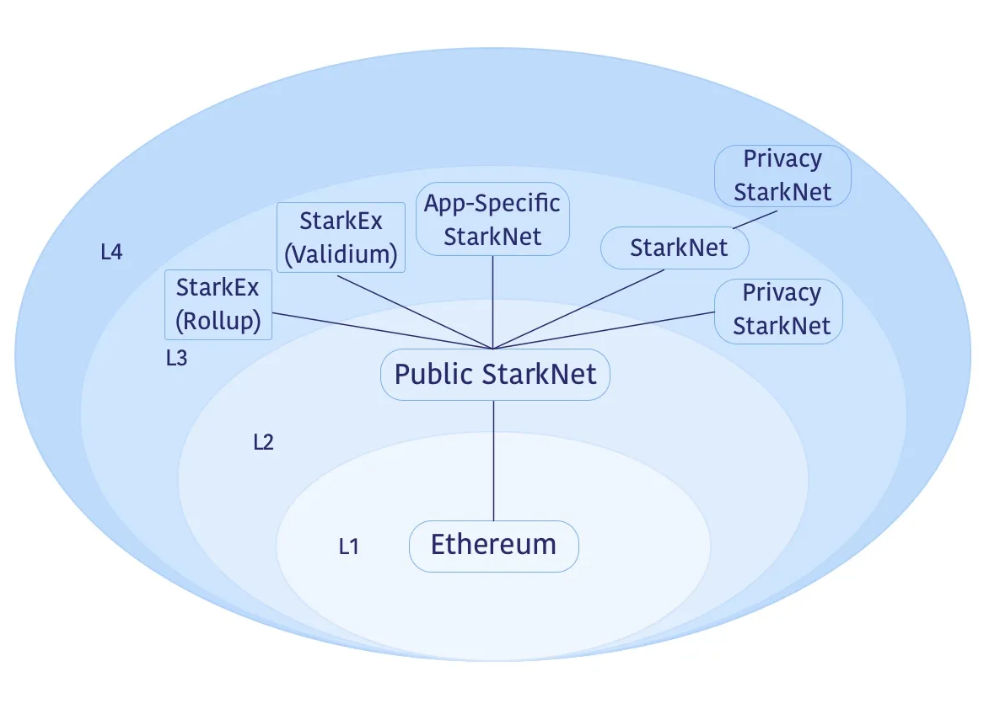

# Layer 3 (App Chains)

App chains let you create a blockchain designed precisely for your
application’s needs. These specialized blockchains allow customization
in various aspects, such as hash functions and consensus algorithms.
Moreover, they inherit the security features of the Layer 1 or Layer 2
blockchains they are built upon.

Example:

Layer 3 blockchains can exist on top of Layer 2 blockchains. You can
even build additional layers (Layer 4 and so on) on top of Layer 3 for
more complex solutions. A sample layout is shown in the following
diagram.

Example of an environment with a Layers 3 and 4

In this example ecosystem, Layer 3 options include:

- The Public Starknet (L2), which is a general-purpose blockchain for
  decentralized applications.

- A L3 Starknet optimized for cost-sensitive applications.

- Customized L3 Starknet systems designed for enhanced performance,
  using specific storage structures or data compression techniques.

- StarkEx systems used by platforms like dYdX and Sorare, offering
  proven scalability through data availability solutions like Validium
  or Rollup.

- Privacy-focused Starknet instances, which could also function as a
  Layer 4, for conducting transactions without including them in
  public Starknets.

## Benefits of Layer 3

Layer 3 app chains (with
[Madara](https://github.com/keep-starknet-strange/madara) as an apt
sequencer or other option), offer a variety of advantages due to its
modularity and flexibility. Here’s an overview of the key benefits:

- **Quick Iteration**: App chains enable rapid protocol changes,
  freeing you from the constraints of the public Layer 2 roadmap. For
  example, you could rapidly deploy new DeFi algorithms tailored to
  your user base.

- **Governance Independence**: You maintain complete control over
  feature development and improvements, avoiding the need for
  decentralized governance consensus. This enables, for example, quick
  implementation of user-suggested features.

- **Cost Efficiency**: Layer 3 offers substantial cost reductions,
  potentially up to 1 million times compared to Layer 1, making it
  economically feasible to run more complex applications.

- **Security**: While there may be some trade-offs, such as reduced
  censorship resistance, the core security mechanisms remain strong.

- **Congestion Avoidance**: App chains are shielded from network
  congestion, providing a more stable transaction environment, crucial
  for real-time applications like gaming.

- **Privacy Enhancements**: Layer 3 can serve as a testing ground for
  privacy-centric features, which could include anonymous transactions
  or encrypted messaging services.

- **Innovation Platform**: App chains act as experimental fields where
  novel features can be developed and tested. For instance, they could
  serve as a testbed for new consensus algorithms before these are
  considered for Layer 2.

In summary, Layer 3 provides the flexibility, cost-efficiency, and
environment conducive for innovation, without significant compromise on
security.

## Madara as a Framework for Layer 3 App Chains

[Madara](https://github.com/keep-starknet-strange/madara) is a framework that simplifies the development of modular app chains on Starknet. With Madara, you can leverage the Starknet stack’s scalability and security advantages while tailoring your chain to the specific requirements of your dApp.

Key benefits of developing with Madara:
Comprehensive Control: With Madara, you can customise essential components, such as your prover and compiler version. Madara's flexibility allows integration of experimental features, ensuring your chain precisely meets your dApp's demands.

Reduced Congestion: Your app chain serves your dApp exclusively, guaranteeing predictable performance and a smooth user experience.

Chain Sovereignty: Maintaining full decision-making power over the canonical chain is crucial, especially during potential security incidents or disagreements, ensuring you retain control. It's important to acknowledge, however, that this approach can have its drawbacks, warranting careful consideration.

Fee Collection: Manage your app chain's fee structure and retain all of the revenue generated by your application.

## Karnot: Rollup-as-a-Service for Madara App Chains

[Karnot](https://www.karnot.xyz/), a leading Rollup-as-a-Service provider, simplifies Madara app chain deployment. Leveraging their extensive experience in building scalable infra and their role as core contributors to the Madara framework, Karnot delivers powerful, expertly crafted solutions for your app chain development experience.

Highly scalable infrastructure: Intelligent auto-scaling nodes guarantee your app chain's availability, even during unexpected traffic surges.

Secure bridges: Karnot manages your bridges, mirroring Starknet contracts for efficient integration.

Protected faucets: Robust faucets powered by spam and bot protection for smooth testing environments.

Top-tier security: Rigorous measures safeguard your keys without compromising autonomy.

Comprehensive monitoring: Real-time dashboards offer a centralized view of your app chain activity, empowering data-driven decision-making.
