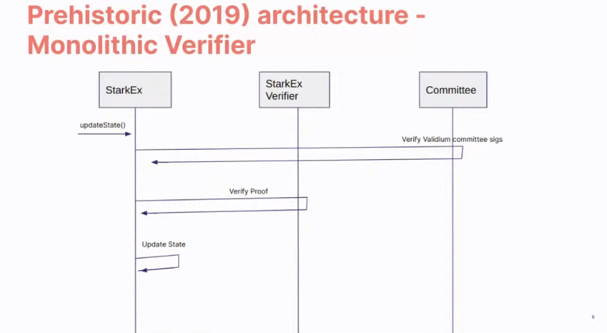
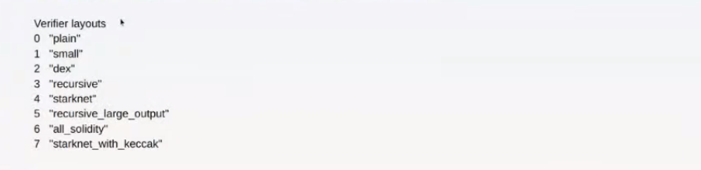
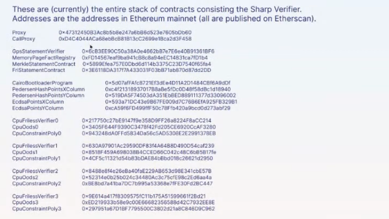
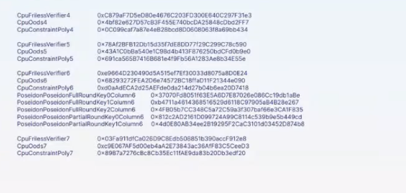
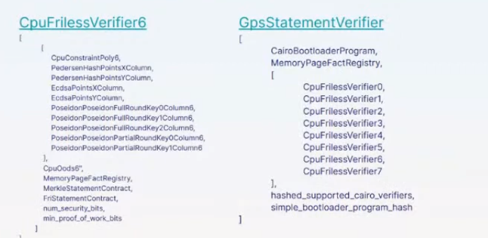

# Solidity Verifier

Before exploring this chapter, review the Starknet Architecture chapter for foundational knowledge. Familiarity with concepts such as Sequencers, Provers, SHARP, and Sharp Jobs is assumed.

Starknet's Solidity Verifier plays a pivotal role in the rollup landscape, ensuring the truth of transactions and smart contracts.

## Quick Overview: SHARP and Sharp Jobs

> **NOTE:** For a more detailed explanation of SHARP and Sharp Jobs, refer to the Provers subchapter in the Starknet Architecture chapter. This is a brief review.

SHARP, or Shared Prover, in Starknet, aggregates various Cairo programs from distinct users. These programs, each with unique logic, run together, producing a common proof for all, optimizing cost and efficiency.

Sharp Workflow

Furthermore, SHARP supports combining multiple proofs into one, enhancing its efficiency by allowing parallel proof processing and verification.

SHARP verifies numerous Starknet transactions, like transfers, trades, and state updates. It also confirms smart contract executions.

To illustrate SHARP: Think of commuting by bus. The bus driver, the prover, transports passengers, the Cairo programs. The driver checks only the tickets of passengers alighting at the upcoming stop, much like SHARP. The prover forms a single proof for all Cairo programs in a batch, but verifies only the proofs of programs executing in the succeeding block.

**Sharp Jobs**. Known as Shared Prover Jobs, Sharp Jobs let multiple users present their Cairo programs for combined execution, distributing the proof generation cost. This shared approach makes Starknet more economical for users, enabling them to join ongoing jobs and leverage economies of scale.

## Solidity Verifiers

A Solidity verifier is an L1 smart contract, crafted in Solidity, designed to validate STARK proofs from SHARP (Shared Prover).

### Previous Architecture: Monolithic Verifier

Historically, the Solidity Verifier was a monolithic contract, both initiated and executed by the same contract. For illustration, the operator would invoke the `update state` function on the main contract, providing the state to be modified and confirming its validity. Subsequently, the main contract would present the proof to both the verifier and the validium committee. Once they validated the proof, the state would be updated in the main contract.

Previous Architecture

However, this architecture faced several constraints:

- Batching transactions frequently surpassed the original geth32kb transaction size limit (later adjusted to 128kb) due to accumulating excessive transactions.
- The gas required often outstripped the block size (e.g., 8 Mgas), as the block couldn't accommodate a complete batch of proof.
- A prospective constraint was that the verifier wouldn't support proof bundling, which is fundamental for SHARP.

### Current Architecture: Multiple Smart Contracts

The current verifier utilizes multiple smart contracts rather than being a singular, monolithic structure.

Here are some key smart contracts associated with the verifier:

- [`GpsStatementVerifier`](https://etherscan.io/address/0x47312450b3ac8b5b8e247a6bb6d523e7605bdb60): This is the primary contract of the Sharp verifier. It verifies a proof and then registers the related facts using `verifyProofAndRegister`. It acts as an umbrella for various layouts, each named `CpuFrilessVerifier`. Every layout has a unique combination of built-in resources.

The system routes each proof to its relevant layout.

- [`MemoryPageFactRegistry`](https://etherscan.io/address/0xfd14567eaf9ba941cb8c8a94eec14831ca7fd1b4): This registry maintains facts for memory pages, primarily used to register outputs for data availability in rollup mode. The Fact Registry is a separate smart contract ensuring the verification and validity of attestations or facts. The verifier function is separated from the main contract to ensure each segment works optimally within its limits. The main proof segment relies on other parts, but these parts operate independently.

- [`MerkleStatementContract`](https://etherscan.io/address/0x5899efea757e0dbd6d114b3375c23d7540f65fa4): This contract verifies merkle paths.

- [`FriStatementContract`](https://etherscan.io/address/0x3e6118da317f7a433031f03bb71ab870d87dd2dd): It focuses on verifying the FRI layers.

### Sharp Verifier Contract Map

The Sharp Verifier Contract Map contains roughly 40 contracts, detailing various components of the Solidity verifier. The images below display the contracts and their Ethereum Mainnet addresses.

Sharp Verifier Contract Map

Sharp Verifier Contract Map (Continued)

These contracts function as follows:

- **Proxy**: This contract facilitates upgradability. It interacts with the `GpsStatementVerifier` contract using the `delegate_call` method. Notably, the state resides in the `GpsStatementVerifier` contract, not in the proxy.
- **CallProxy**: Positioned between the `Proxy` and the `GpsStatementVerifier` contracts, it functions like a typical proxy. However, it avoids the `delegate_call` method and calls the function in the implementation contract directly.
- **CairoBootloaderProgram**: Comprising numerical Cairo programs, it validates the Cairo program of a statement. The bootloader manages the logic executing Cairo programs to generate proof and program hash.
- **PedersenHashPoints (X & Y Column)**: These lookup tables store vast amounts of data. Validation functions consult them to compute the Pedersen hash.
- **EcdsaPoints (X & Y Column)**: Similar to the Pedersen hash, these tables assist in calculating the elliptic curve.
- **CpuFrilessVerifier/CpuOods/CpuConstantPoly (0 - 7)**: These verifier contracts vary in layout as shown in the `GpsStatementVerifier` layout image. Each layout encompasses resources, built-ins, constraints, and more, designed for a specific task. Each has unique parameters for its constructor.
- **PoseidonPoseidon**: These contracts back the new Poseidon built-in and contain Poseidon-specific lookup tables.

### Constructor Parameters of Key Contracts

When constructing the primary verifier contracts, specific parameters are employed to facilitate functionality. These parameters reference other auxiliary contracts, decentralizing the logic and ensuring the main contract remains under the 24kb deployment limit.

Below is a visual representation of these parameters in relation to key contracts `CpuFrilessVerifiers` and `GpsStatementVerifier`:

Constructor Parameters

#### CpuFrilessVerifier Constructor Parameters

`CpuFrilessVerifiers` is designed to handle a diverse range of tasks. Its parameters encompass:

- **Auxiliary Polynomial Contracts:** These include `CpuConstraintPoly`, `PedersenHashPointsxColumn`, `PedersenHashPointsYColumn`, `EcdsaPointsXColumn`, and `EcdsaPointsYColumn`.
- **Poseidon-Related Contracts:** Several `PoseidonPoseidonFullRoundKey` and `PoseidonPoseidonPartialRoundKey` contracts.
- **Sampling and Memory:** The contract uses `CpuOods` for out-of-domain sampling and `MemoryPageFactRegistry` for memory-related tasks.
- **Verification:** It integrates with `MerkleStatementContract` for merkle verification and `FriStatementContract` for Fri-related tasks.
- **Security:** The `num_security_bits` and `min_proof_of_work_bits` contracts ensure secure operation.

**NOTE:** For instances like `CpuFrilessVerifier0`, specific contracts (e.g., `CpuConstraintPoly0`, `PoseidonPoseidonFullRoundKeyColumn0`, `CpuOods0`) become particularly relevant.

#### GpsStatementVerifier Constructor Parameters

The `GpsStatementVerifier` functions as the hub of verifier operations, necessitating various parameters for effective functioning:

- **Bootloader:** It references the `CairoBootloaderProgram` to initiate the system.
- **Memory Operations:** This is facilitated by the `MemoryPageFactRegistry` contract.
- **Sub-Verifiers:** It integrates a series of sub-verifiers (`CpuFrilessVerifier0` through `CpuFrilessVerifier7`) to decentralize tasks.
- **Verification:** The hashes, `hashed_supported_cairo_verifiers` and `simple_bootloader_program_hash`, are essential for validation processes.

### Interconnection of Contracts

The `GpsStatementVerifier` serves as the primary verifier contract, optimized for minimal logic to fit within deployment size constraints. To function effectively:

- It relies on smaller verifier contracts, which are already deployed and contain varied verification logic.
- These smaller contracts, in turn, depend on other contracts, established during their construction.

In essence, while the diverse functionalities reside in separate contracts for clarity and size efficiency, they are all interlinked within the `GpsStatementVerifier`.

For future enhancements or adjustments, the proxy and callproxy contracts facilitate upgradability, allowing seamless updates to the `GpsStatementVerifier` without compromising its foundational logic.

### Sharp Verification Flow

Sharp Verification Flow

1. The Sharp dispatcher transmits all essential transactions for verification, including:
   a. `MemoryPages` (usually many).
   b. `MerkleStatements` (typically between 3 and 5).
   c. `FriStatements` (generally ranging from 5 to 15).

2. The Sharp dispatcher then forwards the proof using `verifyProofAndRegister`.

3. Applications, such as the Starknet monitor, validate the status. Once verification completes, they send an `updateState` transaction.

## Conclusion

Starknet transformed the Solidity Verifier from a single unit to a flexible, multi-contract system, highlighting its focus on scalability and efficiency. Using SHARP and refining verification steps, Starknet makes sure the Solidity Verifier stays a strong cornerstone in its setup.
