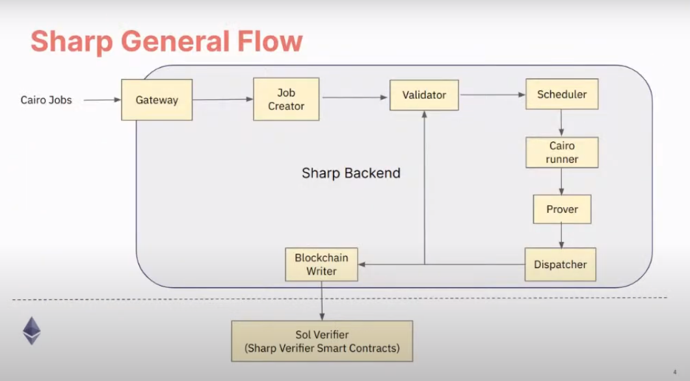
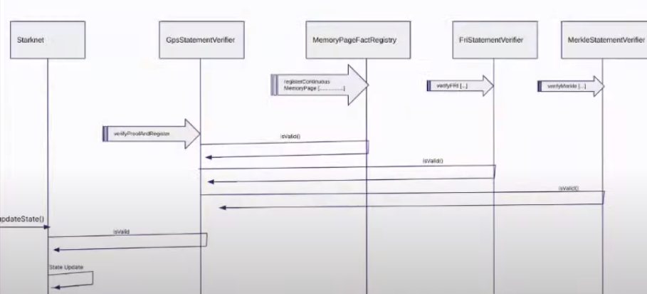

# Solidity Verifier

Before diving into this chapter, refer to the Starknet Architecture chapter to understand the foundational architecture flow. We assume that you have a basic understanding of the following concepts: Sequencers, Provers, SHARP, and Sharp Jobs.

In the world of rollups, verifiers are key to ensuring trust and transparency. This is the role of Starknet's Solidity Verifier, checking the truth of transactions and smart contracts.

## SHARP and Sharp Jobs Review

NOTE: For a more detailed explanation of SHARP and Sharp Jobs, refer to the Provers subchapter in the Starknet Architecture chapter. This is a brief review.

SHARP, or Shared Prover, in Starknet, aggregates various Cairo programs from distinct users. These programs, each with unique logic, run together, producing a common proof for all, optimizing cost and efficiency.

Sharp Workflow

Furthermore, SHARP supports combining multiple proofs into one, enhancing its efficiency by allowing parallel proof processing and verification.

SHARP verifies numerous Starknet transactions, like transfers, trades, and state updates. It also confirms smart contract executions.

To illustrate SHARP: Think of commuting by bus. The bus driver, the prover, transports passengers, the Cairo programs. The driver checks only the tickets of passengers alighting at the upcoming stop, much like SHARP. The prover forms a single proof for all Cairo programs in a batch, but verifies only the proofs of programs executing in the succeeding block.

**Sharp Jobs**. Known as Shared Prover Jobs, Sharp Jobs let multiple users present their Cairo programs for combined execution, distributing the proof generation cost. This shared approach makes Starknet more economical for users, enabling them to join ongoing jobs and leverage economies of scale.

## Solidity Verifiers

A Solidity verifier is an L1 smart contract, crafted in Solidity, designed to validate STARK proofs from SHARP (Shared Prover).

### Previous Architecture: Monolothic Verifier

Historically, the Solidity Verifier was a monolithic contract, both initiated and executed by the same contract. For illustration, the operator would invoke the `update state` function on the main contract, providing the state to be modified and confirming its validity. Subsequently, the main contract would present the proof to both the verifier and the validium committee. Once they validated the proof, the state would be updated in the main contract.

Previous Architecture

However, this architecture faced several constraints:

- Batching transactions frequently surpassed the original geth32kb transaction size limit (later adjusted to 128kb) due to accumulating excessive transactions.
- The gas required often outstripped the block size (e.g., 8 Mgas), as the block couldn't accommodate a complete batch of proof.
- A prospective constraint was that the verifier wouldn't support proof bundling, which is fundamental for SHARP.

### Current Architecture: Multiple Smart Contracts

The current verifier utilizes multiple smart contracts rather than being a singular, monolithic structure.

Here are some key smart contracts associated with the verifier:

- [`GpsStatementVerifier`](https://etherscan.io/address/0x47312450b3ac8b5b8e247a6bb6d523e7605bdb60): This is the primary contract of the Sharp verifier. It verifies a proof and then registers the related facts using `verifyProofAndRegister`. It acts as an umbrella for various layouts, each named `CpuFrilessVerifier`. Every layout has a unique combination of built-in resources.

The system routes each proof to its relevant layout.

- [`MemoryPageFactRegistry`](https://etherscan.io/address/0xfd14567eaf9ba941cb8c8a94eec14831ca7fd1b4): This registry maintains facts for memory pages, primarily used to register outputs for data availability in rollup mode. The Fact Registry is a separate smart contract ensuring the verification and validity of attestations or facts. The verifier function is separated from the main contract to ensure each segment works optimally within its limits. The main proof segment relies on other parts, but these parts operate independently.

- [`MerkleStatementContract`](https://etherscan.io/address/0x5899efea757e0dbd6d114b3375c23d7540f65fa4): This contract verifies merkle paths.

- [`FriStatementContract`](https://etherscan.io/address/0x3e6118da317f7a433031f03bb71ab870d87dd2dd): It focuses on verifying the FRI layers.

### Sharp Verifier Contract Map

The Sharp Verifier Contract Map comprises of all the contracts deployed, about 40(forty) contracts that houses and holds the several aspects of the Solidity verifier. The images below shows the various contracts and their addresses on the Ethereum Mainnet.

Sharp Verifier Contract Map 

Sharp Verifier Contract Map *cont'd*

Let's discuss these contracts in-depth.
 - Proxy: The proxy contract is the general purpose upgradability contract, that remains the permanent access address, it uses the `delegate_call` method to interact with the implementation contract which is the `GpsStatementVerifier` contract. In the context of SHARP the state is found in the  `GpsStatementVerifier` contract and not in the proxy contract.
 - CallProxy: The `callProxy` is an additional contract that was introduced between the `Proxy` contract and the `GpsStatementVerifier` contract, it works exactly as a proxy contract should except it doesn't use the `delegate_call` method but simply calls the function in the implementation contract directly.
 - CairoBootloaderProgram: These are cairo programs consisting of a bunch of numbers, that is used to validate the cairo program of an actual statement. The bootloader holds the logic that executes the cairo programs to generate the proof and the hash of the program.
 - PedersenHashPoints (X & Y Column): These are lookup tables holding an almost infinite amount of data that is queried by the validation functions throughout the code, to calculate it's pedersen hash
 - EcdsaPoints (X & Y Column): Similar to the pedersen hash, but this time it queries the validation functions to calculate the elliptic curve.
 - CpuFrilessVerifier/CpuOods/CpuConstantPoly (0 - 7): These are verifier contracts with different layouts as seen in the `GpsStatementVerifier` layout image. The layouts consists of resources, builtins, constraints e.t.c., to run a specific task. Each layout has it's set of parameters that are been used in it's constructor.
 - PoseidonPoseidon: These are contracts that supports the new poseidon builtin and consists of poseidon related lookup tables.

### Constructor Parameters of Key Contracts

The constructor parameters consists of various sub contracts already deployed. They are used to split up the size of the verifier contract and hold diverse aspects of the logic for the verifier contract, which in turn reduces the size of the verifier contract so it doesn't surpass the 24kb maximum deployment size.

The key contracts are namely the `CpuFrilessVerifiers` and `GpsStatementVerifier` which accepts the  constructor parameters as shown in the image below.

Constructor Parameters

#### CpuFrilessVerifier Constructor Parameters
The `CpuFrilessVerifiers` takes in as parameters an array of auxilliary polynomal contracts ( consisting of the `CpuConstraintPoly`, `PedersenHashPointsxColumn`, `PedersenHashPointsYColumn`, `EcdsaPointsXColumn`, `EcdsaPointsYColumn`, `PoseidonPoseidonFullRoundKey0`,
`PoseidonPoseidonFullRoundKey1`,
`PoseidonPoseidonFullRoundKey2`,
`PoseidonPoseidonPartialRoundKey0`,
`PoseidonPoseidonPartialRoundKey1` ), out of domain sampling and evaluating contracts (`CpuOods`), memory contracts (`MemoryPageFactRegistry`), merkle verification contracts 
(`MerkleStatementContract`), Fri-contracts 
(`FriStatementContract`), security bits contracts 
(`num_security_bits`), and the minimum proof of work contracts 
(`min_proof_of_work_bits`).

**NOTE:** When deploying the `CpuFrilessVerifier0`, the following contracts with diverse variants will be passed in the constructor `CpuConstraintPoly0`,  `PoseidonPoseidonFullRoundKey0Column0`,
`PoseidonPoseidonFullRoundKey1Column0`,
`PoseidonPoseidonFullRoundKey2Column0`,
`PoseidonPoseidonPartialRoundKey0Column0`,
`PoseidonPoseidonPartialRoundKey1Column0`, `CpuOods0` and so on.

#### GpsStatementVerifier Constructor Parameters
The `GpsStatementVerifier` takes in as parameters the bootloader (`CairoBootloaderProgram`), memory contracts (`MemoryPageFactRegistry`), an array of all sub verifiers for the different layouts 
(`CpuFrilessVerifier0`,
`CpuFrilessVerifier1`,
`CpuFrilessVerifier2`,
`CpuFrilessVerifier3`,
`CpuFrilessVerifier4`,
`CpuFrilessVerifier5`,
`CpuFrilessVerifier6`,
`CpuFrilessVerifier7`), the cairo program verifier hash 
(`hashed_supported_cairo_verifiers`), and the hash of the bootloader 
(`simple_bootloader_program_hash`), the hash is needed to validate the fact of the verification with the program that produced the verification.

### Interconnection of Contracts
A High level overview of how these various contracts are connected is as follows:
The `GpsStatementVerifier` contract is the main sharp verifier contract with minimal logic to contain it's deployment size, for it to be deployed it needs the smaller deployed verifier contracts holding diverse aspects of the verifier logics as constructor parameters as it is dependent on these contracts. The contracts passed in the constructor parameters as arguments are already deployed contracts which held other contracts they are dependent on as constructor parameters. So at the end, all of these diverse contracts are embedded in the `GpsStatementVerifier` contract but splitted into multiple contracts for clarity, smaller deployment size and separation of concerns. The proxy and callproxy contracts are used for upgradability purposes, when the sharp verifier needs a logic upgrade or change these contracts are used to effect the change and update the new state in the `GpsStatementVerifier` contract.

### Sharp Verification Flow

Sharp Verification Flow

1. The Sharp dispatcher transmits all essential transactions for verification, including:
   a. `MemoryPages` (usually many).
   b. `MerkleStatements` (typically between 3 and 5).
   c. `FriStatements` (generally ranging from 5 to 15).

2. The Sharp dispatcher then forwards the proof using `verifyProofAndRegister`.

3. Applications, such as the Starknet monitor, validate the status. Once verification completes, they send an `updateState` transaction.

## Conclusion

Starknet transformed the Solidity Verifier from a single unit to a flexible, multi-contract system, highlighting its focus on scalability and efficiency. Using SHARP and refining verification steps, Starknet makes sure the Solidity Verifier stays a strong cornerstone in its setup.
