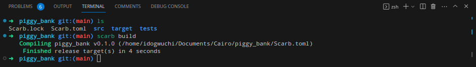
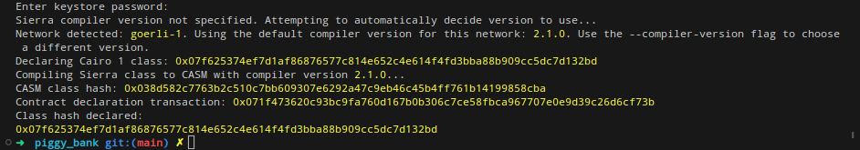
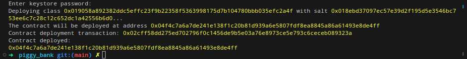
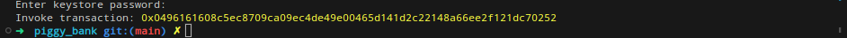
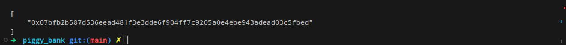
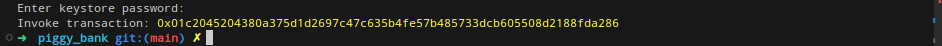
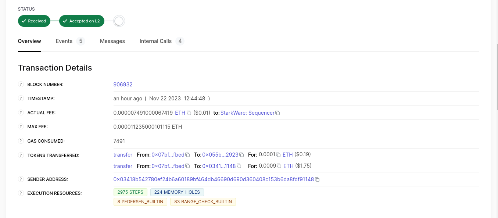

# Deploying and Interacting With a Smart Contract

In this section we will be focussing on declaring, deploying and interacting with the piggy bank contract we wrote in the previous section.

## Requirements:

To declare and deploy the piggy bank contract, it’s required that you have the following available; don't worry, we’ll point you to resources or links to get them sorted out.

1. Starkli: Starkli is a CLI tool that connects us to the Starknet blockchain. Installation steps can be found [here](./ch02-02-starkli-scarb-katana.md).

2. Starknet testnet RPC: You need your personalized gateway to access the starknet network. Starkli utilizes this API gateway to communicate with the starknet network: you can get one from Blast [here](https://blastapi.io/public-api/starknet).

3. Deployer Account: To interact with the starknet network via Starkli, you need a cli account/ wallet. You can easily set that up by going through [this page](./ch04-02-hello-account.html).

4. Sufficient gas fees to cover the declaration and deployment steps: you can get starknet Sepolia Eth either by bridging your Sepolia Eth on Ethereum to Starknet [here](https://www.yetanotherswap.com/bridge).

Once you’ve been able to sort all that out, let's proceed with declaring and deploying the piggy bank contract.

## Contract Declaration:

The first step in deploying a starknet smart contract is to build the contract. To do this, we cd into the root directory of the piggy bank project, and then in our terminal, we run the'scarb build` command. This command creates a new folder in our root directory folder, then generates two json files for each contract; the first is the compiled_contract_class.json file, while the second is the contract_clas.json file.



The next step is to declare the contract. A contract declaration in Starknet is a transaction that returns a class hash, which would be used to deploy a new instance of a contract. Being a transaction, declaration requires that the account being used for the declaration have sufficient gas fees to cover the cost of that transaction.

Also, it is important to understand that since we are deploying a factory contract, it's required that we declare the child contract as well as the factory contract, then deploy just the factory contract after which pass in the child contract class hash as a constructor argument to the factory contract, and from this instance of the clash hash, new child contracts would be deployed.

```shell
starkli declare target/dev/piggy_bank_piggyBank.contract_class.json --rpc https://starknet-sepolia.public.blastapi.io/rpc/v0_6 --account ~/.starkli-wallets/deployer/account0_account.json --keystore ~/.starkli-wallets/deployer/account0_keystore.json
```

To declare the piggy bank child contract, we use the above command (remember to replace the account keystore and account file name and path as its found on your own system). Next, we’re prompted to input the password set while preparing our CLI wallet, after which the contract is compiled, and we get a similar message below:



From the above snippet, our class hash is: `0x05f58aecd2781660741534140776b6a12bcc6d46ebda92ac851c1bad55d74006`. With this class hash, other contracts would be deployed. Next would be to declare our factory contract.

```shell
starkli declare target/dev/piggy_bank_piggyFactory.contract_class.json --rpc https://starknet-sepolia.public.blastapi.io/rpc/v0_6 --account ~/.starkli-wallets/deployer/account0_account.json --keystore ~/.starkli-wallets/deployer/account0_keystore.json
```

This time, we get a response similar to the previous declaration containing a class hash: `0x026323e14ce298448d12e2504cb872f7ec6049a389230c2c0b3d9d99507e303d`
These two class hashes could be found on any explorer. By pasting the clash hash on the search bar, we get details regarding the contract declaration.

## Contract Deployment:

Since we’ve deployed the two contracts and also now have the class hash for the two contracts, our next step would be to deploy our factory contract and also pass in the class hash of the child contract to it so it can customize and create new instances of the class hash for users. To deploy the factory contract, we use a sample command as shown below:

```shell
starkli deploy 0x026323e14ce298448d12e2504cb872f7ec6049a389230c2c0b3d9d99507e303d 0x05f58aecd2781660741534140776b6a12bcc6d46ebda92ac851c1bad55d74006 0x049D36570D4e46f48e99674bd3fcc84644DdD6b96F7C741B1562B82f9e004dC7 0x076957612bA0927c9C3F6156Ffaa1A52Bc330256869d85A8A0D0999B3e4c6387 --rpc https://starknet-sepolia.public.blastapi.io/rpc/v0_6 --account ~/.starkli-wallets/deployer/argent_sepolia_account.json --keystore ~/.starkli-wallets/deployer/argent_sepolia_keystore.json
```

I understand this might look confusing, so let's use a simpler command structure to describe it:

```shell
starkli deploy <FACTORY CLASS HASH> <CHILD CONTRACT CLASS HASH> <ETH CONTRACT ADDRESS> <ADMIN CONTRACT ADDRESS> --rpc <RPC FROM BLAST> --account ~/.starkli-wallets/deployer/account0_account.json --keystore ~/.starkli-wallets/deployer/account0_keystore.json
```

From the above snippet, we first state the method we intend to use (deploy), then we pass in the class hash to be deployed (`<FACTORY CLASS HASH>`). Finally, we pass in the constructor argument in order of their appearance in our contract (`<CHILD CONTRACT CLASS HASH>` `<ETH CONTRACT ADDRESS>` `<ADMIN CONTRACT ADDRESS>`)



From the above snippet, our newly deployed contract address is `0x0137a70c3cda7037631f43e3c6a76ea30cf6ba53dbabaebb164b427dab8a8d16`

## Creating a Personalized Piggy Bank

To create a personal piggy bank, we interact with the factory contract. We'll be calling the `createPiggyBank` function and passing in the following arguments; a savings target type; we pass in 1 if we want to save towards a target amount; or we pass in 0 if we’ll be saving towards a target time. Finally, we pass in a target amount or a target time (epoch time). In this demo, we’ll be saving towards a target amount, so we’ll be passing in 1 and a target amount (0.0001 eth).
To interact with our piggy factory onchan, we use an invoke method as shown in the below command;

```shell
starkli invoke 0x0137a70c3cda7037631f43e3c6a76ea30cf6ba53dbabaebb164b427dab8a8d16 createPiggyBank 1 100000000000000000 --rpc https://starknet-sepolia.public.blastapi.io/rpc/v0_6 --account ~/.starkli-wallets/deployer/account0_account.json --keystore ~/.starkli-wallets/deployer/account0_keystore.json
```

After sending the above command, a transaction hash is returned to us. This hash, when scanned on an explorer, contains all the details of our invoke transaction and the status of the transaction, whether or not it has been accepted on L1.



Our transaction hash is `0x077a2d9f64f19da764957e88440bc4cca50f792c62bccd163ee114b8b9e59a67`. Next, we need to get the contract address of our personalized piggy bank, so we make another call to our factory contract to get our piggy bank’s address. We use the below code to achieve this, we call the `getPiggyBankAddr` function, then pass in our contract address as an argument to that function.

```shell
starkli call 0x04f4c7a6a7de241e138f1c20b81d939a6e5807fdf8ea8845a86a61493e8de4ff getPiggyBankAddr 0x076957612bA0927c9C3F6156Ffaa1A52Bc330256869d85A8A0D0999B3e4c6387 --rpc https://starknet-sepolia.public.blastapi.io/rpc/v0_6
```

After calling this function using the command above, we get a response on our terminal containing the address of the child piggy bank personalized to the address we passed in as an argument, the first argument is the address of the factory contract while the second is the function name while the third is the address of the user which we intend to fetch his piggy bank address.



## Interacting With Our Personalized Pigy Bank:

At this point, we have been able to create a piggy bank contract customized specifically to our savings target, and we have the address for that contract. We are now left with interacting with our contract by depositing Eth into it and also withdrawing from it.

But before we jump into depositing Eth into our contract, its important to note that Ether on starknet is actually a regular ERC20 token, so we’ll need to grant approval to our Piggy contract to be able to spend our Eth. We can achieve this by using the below command to call the approve function on the Eth contract address.

```shell
starkli invoke 0x049D36570D4e46f48e99674bd3fcc84644DdD6b96F7C741B1562B82f9e004dC7 approve 0x044a5cc1518cd4f4dc4b40c5d2e72de2a82c5c7c7e2c0f840182b79aacb9773b u256:100000000000000000 --rpc https://starknet-sepolia.public.blastapi.io/rpc/v0_6 --account ~/.starkli-wallets/deployer/account0_account.json --keystore ~/.starkli-wallets/deployer/account0_keystore.json
```

The first address is the address of the erc20 token then the second is the address of our personalized piggybank address.
After running the above code, we get a transaction hash containing details about our approval transaction:



The next step would be to deposit into our piggy bank contract using this command;

```shell
starkli invoke 0x044a5cc1518cd4f4dc4b40c5d2e72de2a82c5c7c7e2c0f840182b79aacb9773b deposit 1000000000000000 --rpc https://starknet-sepolia.public.blastapi.io/rpc/v0_6 --account ~/.starkli-wallets/deployer/account0_account.json --keystore ~/.starkli-wallets/deployer/account0_keystore.json
```

As with other invoke function calls we’ve made, we also get a transaction hash for this transaction. Finally, after repeated calls to deposit ether into our contract, once we have saved up an amount of our choice, we can call the withdraw function to withdraw from our account.

```shell
starkli invoke 0x044a5cc1518cd4f4dc4b40c5d2e72de2a82c5c7c7e2c0f840182b79aacb9773b withdraw 1000000000000000 --rpc https://starknet-sepolia.public.blastapi.io/rpc/v0_6 --account ~/.starkli-wallets/deployer/account0_account.json --keystore ~/.starkli-wallets/deployer/account0_keystore.json
```

Finally, we get a transaction hash containing details regarding our withdrawal `0x0781103066cf3bfa07ce59c1082c802db8a46caa276a293d9fcbe8610b85c1a8`.



Scanning the above transaction hash on Voyager gives us the details contained in the image above; among other things, it contains a breakdown of how our withdrawal was distributed. Since we didn't deposit up to our target amount before withdrawing, 10% of our withdrawal amount was sent to the factory contract, while the remaining 90% was sent to our address.
