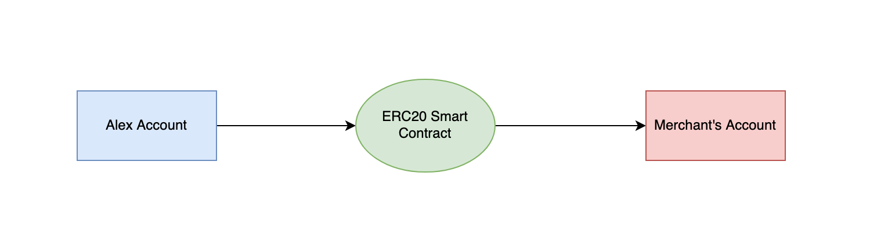

# Auto-Payments 🚧

As blockchain adoption increases, there will be a greater need for products with a superior user experience and core functionality that support real use cases. In a few simple steps, we can set up automatic recurring payments today directly on our mobile banking applications. In fact, online bill pay is growing rapidly, and customers especially younger ones have come to expect the ability to set up recurring payments and take advantage of other conveniences associated with using auto-payments. About 3 in 10 surveyed users have changed the way they pay their bills in the past two years and finding a more convenient way to pay was the most frequently cited reason. However, this is not a trivial task on a blockchain like Ethereum, the largest blockchain network by on-chain payment volumes. For certain types of digital wallets, such as a self-custodial wallet where the user has sole control over the wallet and private keys, automated programmable payments that can pull payments automatically from a user’s account at recurring intervals requires engineering work.

The concept and one of the leading Ethereum developer proposals known as Account Abstraction to explore how smart contracts can be implemented to enable automated programmable payments. We propose a new solution towards a real-world application of auto payments to demonstrate how to write a smart contract for a self-custodial wallet that can pull funds automatically, instead of requiring the user's active participation each time to instruct and push payments on a blockchain.

Consider a hypothetical scenario: today is the 25th of February. Alex is going away on vacation to the Alps, and she will be returning on March 10th. She must pay her mortgage, TV subscription and utility bills by the 5th of every month. She does not have enough money to pay before she goes on vacation, but she will have enough money when she gets her paycheck on the 1st of March. How is Alex going to enjoy her vacation without missing her payments?

All Alex needs to do is set up recurring payments to automatically pay for her recurring bills. However, this is not as straightforward to execute on a blockchain. To see why this is the case, let us consider the Ethereum network. We will begin by setting up some terminology that will help us better understand the issue at hand.

## Accounts on Ethereum

Ethereum has two types of accounts:
Externally Owned Accounts (EOA) and Contract Accounts. EOAs have a private and public key pairing which helps them initiate transactions. On the other hand, Contract Accounts are smart contracts that rely on predefined codes to trigger particular transactions.
In that view, accounts abstraction refers to the process of unifying both contracts under a single merged type that makes it easier for users to interact with blockchain-based applications. This mechanism would enable user accounts to behave like smart contracts, unlocking many new use cases. For instance, users could set up delegate accounts that process automatic periodic payments on users' behalf. Account abstraction can also unlock a broader range of innovative features that simplify the Web 3 experience for average users, including gasless transactions or changing the account signer at every particular interval to increase security.

## Auto Payments on Ethereum

Let us revisit Alex’s situation. Suppose Alex owns a user account which is where her paychecks are deposited and from where she would like to pay her mortgage, TV subscription and utility bills. Today, to pay her bills, Alex has to initiate a transaction that transfers tokens from her EOA to a user account belonging to the recipient, that is, to whomever she is paying her bills. In more detail, Alex’s EOA has an associated secret or private key known only to Alex. This private key is used by Alex in the generation of an Elliptic Curve Digital Signature Algorithm (ECDSA) signature that is crucial for the creation of a valid transaction. And this already brings us to the problem at hand. If Alex is away on holiday, who will generate this signature to create the transaction that will make her payment?

One solution is for Alex to use what is known as a custodial wallet. With a custodial wallet, another party controls Alex’s private key. In other words, Alex trusts a third party to secure her funds and return them if she wanted to trade or send them somewhere else. The upside here is that Alex can set up an auto payment connected to her custodial wallet. Since the custodian, who is the party that manages her wallet, has access to her private key, they will be able to generate the signature needed to create the transactions for her scheduled auto payments. And this can happen while Alex is away on holiday. The downside is that while a custodial wallet lessens Alex’s personal responsibility, it requires Alex’s trust in the custodian who holds her funds.

With a self-custodial wallet, one where the user has total control over her wallet, Alex has sole control of her private key. While there is no need to trust a third party when using a self-custodial wallet, this also means that Alex will not be able to set up an auto payment as she must be the one using her key to generate the signature needed for the payment transaction.

Another way to understand this is through the terminology of pull and push payments. A pull payment is a payment transaction that is triggered by the payee, while a push payment on the other hand is a payment transaction that is triggered by the payer. Ethereum supports push payments but doesn’t natively support pull payments – auto payments are an example of pull payments.



## Account Abstraction

Account abstraction (AA) is a proposal that attempts to combine user accounts and smart contracts into just one Ethereum account type by making user accounts function like smart contracts. As we will see ahead, AA allows us to design a neat solution for auto payments. But more generally, the motivating rationale behind AA is quite simple but fundamental: Ethereum transactions today have several rigid requirements hardcoded into the Ethereum protocol. For instance, transactions on the Ethereum blockchain today are valid only if they have a valid ECDSA signature, a valid nonce and sufficient account balance to cover the cost of computation.

AA proposes having more flexibility in the process for validating a transaction on the blockchain:

- It enables multi-owner accounts via multisig signature verification.
- It enables the use of post-quantum signatures for the verification of transactions.
- It also allows for a so-called public account from which anyone could make a transaction, by removing signature verification entirely.

Essentially, AA allows for programmable validity to verify and validate any blockchain transaction. This means that instead of hard coding validity conditions into the Ethereum protocol that will apply to all transactions in a generalized way, validity conditions can instead be programmed in a customizable way into a smart contract on a per-account basis. With AA, a user deploys an account contract with any of the features described above, among others.

And, most importantly for us in the use case described, AA enables auto payments as we can set up validity rules that no longer include signature verification. We will elaborate on this next.

## Delegable Accounts – Account Abstraction Enables Auto Payments

Our solution for auto payments is to leverage AA and create a new type of account contract – a delegable account. Our main idea is to extend programmable validity rules for transactions to include a pre-approved allow list. In essence, AA allows us to delegate the ability to instruct the user’s account to initiate a push payment to a pre-approved auto payment smart contract.

First, a merchant deploys an auto payment smart contract. When a user with a delegable account visits the merchant’s website, they will see a request to approve auto payments – similar to Visa acceptance for billers today. Here, the user can see the actions that the auto payment contract will do in the user’s name. For example, it can only charge the user once per month, or it cannot charge more than a maximum amount. Crucially, because this is a smart contract, a user can be confident that the auto payment contract cannot execute in a way other than how it is written.

If the user agrees to approve auto payments, the wallet will add the auto payment contract’s address to the list of allowed contracts on the user’s delegable account.

## Implementing Auto-payment on Starknet

For a smart contract to be considered an account contract it must at least implement the interface defined by SNIP-6. Additional methods might be required for advanced account functionality.

```
// Cheat sheet
struct Call {
    to: ContractAddress,
    selector: felt252,
    calldata: Array<felt252>
}
trait ISRC6 {
    fn __execute__(calls: Array<Call>) -> Array<Span<felt252>>;
    fn __validate__(calls: Array<Call>) -> felt252;
    fn is_valid_signature(hash: felt252, signature: Array<felt252>) -> felt252;
}
trait ISRC5 {
    fn supports_interface(interface_id: felt252) -> bool;
}
trait IAccountAddon {
    fn __validate_declare__(class_hash: felt252) -> felt252;
    fn __validate_deploy__(class_hash: felt252, salt: felt252, public_key: felt252) -> felt252;
    fn public_key() -> felt252;
}
```

Much has been said about the need to improve the user experience (UX) of web3 if we want to increase adoption. Account Abstraction (AA) is one of the most powerful tools on Starknet to improve UX as it enables users to sign transactions with FaceID or TouchID, to execute multiple operations in a single transaction and to allow for third party services to perform operations on behalf of the user with fine grain control. No wonder why Visa has been so interested in exploring Starknet for auto payments.

With Account Abstraction, and in contrast to Externally Owned Accounts (EOA), the signer is decoupled from the account. The signer is the piece of code that signs transactions using a private key and elliptic curve cryptography to uniquely identify a user. The account is a smart contract on Starknet that defines how signature verification is performed, executes the transactions signed by the user and ultimately owns the user’s assets (aka tokens) on L2.

Note: Using an Elliptic Curve Digital Signature Algorithtm (ECDSA) is not the only way to authenticate a signer, other mechanisms are possible but they come with tradeoffs of performance, cost and ecosystem support. ECDSA remains the most widely used algorithm on Starknet and different curves are supported.

The contract will be create account, declared and deploy it to testnet using Starkli and then use it to interact with Starknet.

## SNIP-6

For a smart contract to be considered an account (aka account contract) it must adhere to a specific public interface defined by the Starknet Improvement Proposal number 6 (SNIP-6).

```
/// @title Represents a call to a target contract
/// @param to The target contract address
/// @param selector The target function selector
/// @param calldata The serialized function parameters
struct Call {
    to: ContractAddress,
    selector: felt252,
    calldata: Array<felt252>
}
/// @title SRC-6 Standard Account
trait ISRC6 {
    /// @notice Execute a transaction through the account
    /// @param calls The list of calls to execute
    /// @return The list of each call's serialized return value
    fn __execute__(calls: Array<Call>) -> Array<Span<felt252>>;
    /// @notice Assert whether the transaction is valid to be executed
    /// @param calls The list of calls to execute
    /// @return The string 'VALID' represented as felt when is valid
    fn __validate__(calls: Array<Call>) -> felt252;
    /// @notice Assert whether a given signature for a given hash is valid
    /// @param hash The hash of the data
    /// @param signature The signature to validate
    /// @return The string 'VALID' represented as felt when the signature is valid
    fn is_valid_signature(hash: felt252, signature: Array<felt252>) -> felt252;
}
/// @title SRC-5 Standard Interface Detection
trait ISRC5 {
    /// @notice Query if a contract implements an interface
    /// @param interface_id The interface identifier, as specified in SRC-5
    /// @return `true` if the contract implements `interface_id`, `false` otherwise
    fn supports_interface(interface_id: felt252) -> bool;
}
```

As you can see in the proposal, an account contract must implement at least the methods **execute**, **validate** and is_valid_signature.

The methods **execute** and **validate** are meant to be called by the Starknet protocol during different stages of the lifecycle of a transaction. This doesn’t mean that only the Starknet protocol can use those methods, as a matter of fact, anyone can call those methods even if the contract account doesn’t belong to them. Something to keep an eye on when securing our account.

When a user sends an invoke transaction, the first thing that the protocol does is to call the **validate** method to check the signature of the transaction. In other words, to authenticate the signer associated with the account. There are restrictions on what you can do inside the **validate** method to protect the Sequencer against Denial of Service (DoS) attacks [3].

Notice that if the signature verification is successful, the **validate** method should return the short string VALID as opposed to a boolean. In Cairo, a short string is simply the ASCII representation of a single felt and not a real string. This is why the return type of the method is felt252. If the signature verification fails, you can stop execution with an assert or return literally any other felt that is not the aforementioned short string.

If the protocol is able to authenticate the signer, it will then call the function **execute** passing as an argument an array of all the operations or “calls” the user wants to perform as a multicall. Each one of these calls define a target smart contract, a method to call (the “selector”) and the arguments expected by the method.

The execution of each Call might result in a value being returned from the target smart contract. This value could be a simple scalar like a felt252 or a boolean, or a complex data structure like a struct or an array. In any case, the Starknet protocol serializes the response using a Span of felt252 elements. Remember that Span represents a snapshot of an Array [4]. This is why the return type of the **execute** method is an Array of Spans which represents a serialized response from each call in the multicall.

The method is_valid_signature is not defined or used by the Starknet protocol. It was instead an agreement between builders in the Starknet community as a way to allow web3 apps to perform user authentication. Think of a user trying to authenticate to an NFT marketplace using their wallet. The web app will ask the user to sign a message and then it will call the function is_valid_signature to verify that the connected wallet address belongs to the user.

To allow other smart contracts to know if your account contract adheres to the SNIP-6 interface, you should implement the method supports_interface from the SRC5 introspection standard. The interface_id for the SNIP-6 interface is the combined hash of the trait’s selectors as defined by Ethereum’s ERC165 [5]. You can calculate the id yourself by using the src5-rs utility [6] or you can take my word for it that the id is 1270010605630597976495846281167968799381097569185364931397797212080166453709.
Additional Interface

Although the interface defined by the SNIP-6 is enough to guarantee that a smart contract is in fact an account contract, it is the minimum requirement and not the whole story. For an account to be able to declare other smart contracts and pay for the associated gas fees it will need to also implement the method **validate_declare**. If we also want to be able to deploy our account contract using the counterfactual deployment method then it also needs to implement the **validate_deploy** method.

Counterfactual deployment is a mechanism to deploy an account contract without relying on another account contract to pay for the related gas fees. This is important if we don’t want to associate a new account contract with its deployer address and instead have a “pristine” beginning.

This deployment process starts by calculating locally the would-be-address of our account contract without actually deploying it yet. This is possible to do with tools like Starkli [7]. Once we know the address, we then send enough ETH to that address to cover the costs of deploying our account contract. Once the address is funded we can finally send a deploy_account transaction to Starknet with the compiled code of our account contract. The Sequencer will deploy the account contract to the precalculated address and pay itself gas fees with the ETH we sent there. There’s no need to declare an account contract before deploying it.

To allow tools like Starkli to easily integrate with our smart contract in the future, it is recommended to expose the public_key of the signer as a view function as part of the public interface. With all this in mind, the extended interface of an account contract is shown below.

```
/// @title IAccount Additional account contract interface
trait IAccountAddon {
    /// @notice Assert whether a declare transaction is valid to be executed
    /// @param class_hash The class hash of the smart contract to be declared
    /// @return The string 'VALID' represented as felt when is valid
    fn __validate_declare__(class_hash: felt252) -> felt252;
    /// @notice Assert whether counterfactual deployment is valid to be executed
    /// @param class_hash The class hash of the account contract to be deployed
    /// @param salt Account address randomizer
    /// @param public_key The public key of the account signer
    /// @return The string 'VALID' represented as felt when is valid
    fn __validate_deploy__(class_hash: felt252, salt: felt252, public_key: felt252) -> felt252;
    /// @notice Exposes the signer's public key
    /// @return The public key
    fn public_key() -> felt252;
}
```

In summary, a fully fledged account contract should implement the SNIP-5, SNIP-6 and the Addon interface.

## References

[1] Auto Payments for Self-Custodial Wallets

[2] SNIP-6 Standard Account Interface

[3] Starknet Docs: Limitations on the validate function

[4] Cairo Book: The Span data type

[5] ERC-165: Standard Interface Detection

[6] Github: src5-rs

[7] Github: starkli
