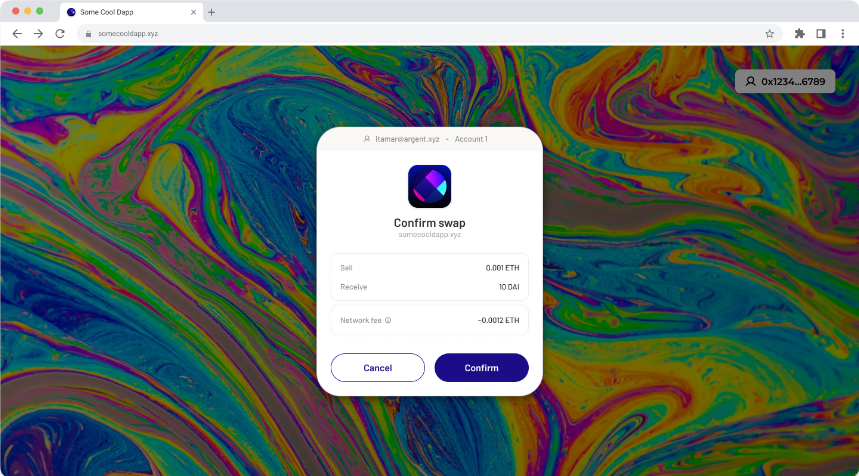

# Argent's Web Wallet

Web wallet is a self-custodial wallet in your browser. It takes advantage of account abstraction to bring you the best experience from both web2 and web3. You create a wallet with an email address and password, eliminating the friction that come with traditional blockchain wallets.

Web wallet provides users with features such as:
- **Abstraction of seed phrases:** With the advent of web wallet, you no longer need to fear losing your assets, as you can now access your wallet using just an email and a password, which is easily recoverable if lost!

- **Access without downloads:** You no longer need to download an application or extension to access Starknet. All you need is an email address introducing the best parts of the web2 experience we all love.

- **Multi-device access:** Just like any web2 application, you can access your web wallet across multiple devices with no friction.

## Setup guide for dApps
To get started with integrating the web wallet SDK in your dApp, you will need to install the `starknetkit` package and its peer dependencies:
```bash
yarn add starknetkit
```

### imports
After installation, we get access to different methods, such as `connect`, `disconnect`, etc which we should import for use in our application:
```js
import { connect, disconnect } from 'starknetkit'
```

### Establishing a connection
To establish a wallet connection, we need to call the connect method which was imported earlier like this:
```js
const connection = await connect({ webWalletUrl: "https://web.argent.xyz" });
```

Below is an example function that establishes a connection, then sets the connection, provider, and address states:
```js
const connectWallet = async() => {
  const connection = await connect({webWalletUrl: "https://web.argent.xyz"});

  if(connection && connection.isConnected) {
    setConnection(connection)
    setProvider(connection.account)
    setAddress(connection.selectedAddress)
  }
 }
```

**PS:** It's important to note that web wallet is only available for users on mainnet. If as a dApp for integration and testing purposes, you need access to an internal testnet environment, please contact the Argent team privately.

## Signing transactions
Signing transactions in web wallet is similar to how it's done using the Argent X browser extension.
```js
const tx = await connection.account.execute({
   //let's assume this is an erc20 contract
   contractAddress: "0x...",
   selector: "transfer",
   calldata: [
	"0x...",
	// ...
   ]
})
```

It will show up like this to the user:



If the user's wallet is already funded it will ask the user to confirm the transaction. The dapp will get feedback if the user has confirmed or rejected the transaction request. If confirmed, the dapp will get a transaction hash.

### Users wallet is not funded
In a case where the user has no funds, the user is guided through the “Add funds” screens where they can go to on-ramps and more. We tried to make the funding process of new wallets as easy as possible with regards KYC. Once this process is completed, the user's wallet will be funded and now ready to be deployed.


### Users wallet is not deployed
After a user has funded their wallet, they are ready for their first transaction. The wallet deployment will be done along the first transaction and is almost invisible to the user. Just note that a connected wallet may not be deployed yet.